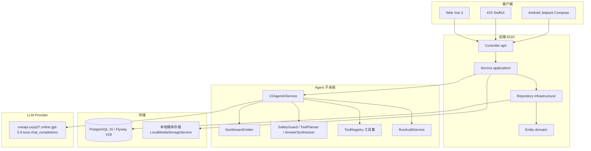
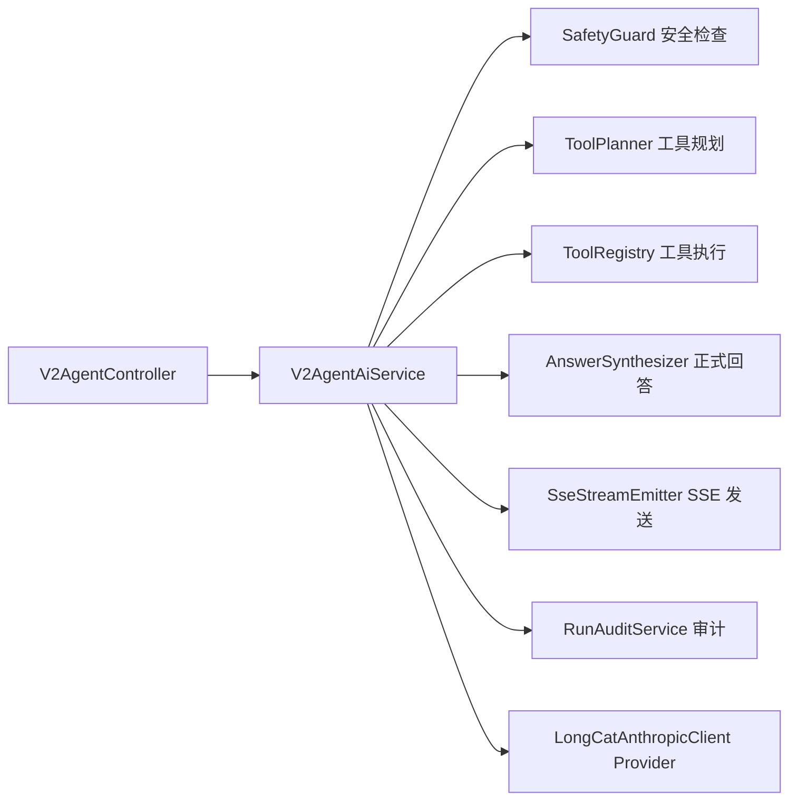

# 系统总体架构

## 文档信息

| 字段 | 内容 |
|---|---|
| 文档类型 | 系统设计 |
| 当前状态 | 已完成 |
| 适用端 | 多端 |
| 依据源码 | `Code/backend/`、`Code/frontend/` |
| 依据测试 | `testing/README.md` |
| 依据证据 | `testing/.artifacts/2026-08-18-8220-current-baseline/current-8220-baseline.md` |
| 最后核对 | 2026-08-20 |

## 一、系统总体架构图

图表目的：展示系统总体架构——三端客户端、后端分层、Agent 子系统、存储与 LLM Provider。

图中输入：客户端请求、用户消息。
图中处理：Controller 接收 → Service 业务逻辑 → Repository 数据访问；Agent 子系统完成对话编排。
图中输出：REST/SSE 响应、数据库落库、审计记录。

对应源码：`Code/backend/src/main/java/com/zhihuiji/backend/`、`Code/frontend/`。
对应接口：`/v2/*`。
对应测试：`testing/README.md`、`testing/*/TEST_PLAN.md`。
当前状态：已完成（架构与源码对应）。

## 二、后端分层（DCL 层次）

| 层 | 位置 | 职责 |
|---|---|---|
| api | `api/controller/`、`api/dto/`、`api/common/` | 接口入口、DTO、统一响应与异常 |
| application | `application/service/` | 业务用例、事务边界 |
| domain | `domain/entity/` | JPA 实体 |
| infrastructure | `infrastructure/repository/`、`infrastructure/security/`、`infrastructure/ai/`、`infrastructure/config/`、`infrastructure/storage/` | 数据访问、安全、Provider、配置、存储 |

Controller → DTO → Service → Repository → Entity 的依赖方向由 Spring 容器管理，Agent 编排服务（`V2AgentAiService`）位于 application 层。

## 三、Agent 子系统架构

图表目的：展示 Agent 子系统各组件协作关系（与真实源码组件一一对应）。

图中输入：用户消息。
图中处理：安全检查 → 工具规划/执行 → 回答生成 → SSE 发送 → 审计。
图中输出：SSE 事件、回答、审计。

对应源码：`application/service/v2/V2AgentAiService.java`、`application/service/v2/agent/component/`、`application/service/v2/agent/tool/`。
对应接口：`/v2/agent/*`。
对应测试：`testing/Agent/功能测试/TEST_PLAN.md`。
当前状态：已完成。

## 四、运行环境（8220）

- 容器：`sxyq27-zhj-api`，镜像 `sxyq27-zhj-api:20260818`，回滚镜像 `rollback-20260818`。
- 应用端口映射：`127.0.0.1:18080`。
- 公共入口：`https://zhj-api.sxyq27.online/`（未鉴权 403）。
- 数据库：PostgreSQL 15，Flyway V29。
- Provider：`gpt-5.6-luna` / `https://oneapi.sxyq27.online/v1` / `chat_completions`。

详见 `03_系统设计/部署架构/当前8220运行架构.md`。

## 对应实现

- 后端代码：`Code/backend/src/main/java/com/zhihuiji/backend/`
- Android 代码：`Code/frontend/android/`
- iOS 代码：`Code/frontend/ios/ZhihuijiIOS/`
- Web 代码：`Code/frontend/web/src/`
- Agent 代码：`application/service/v2/agent/`

## 对应接口

- 接口路径：`/v2/*`
- 请求模型：`api/dto/v2/`
- 响应模型：`api/dto/v2/`
- SSE 事件：`SseStreamEmitter.java`

## 对应测试

- 单元测试：`Code/backend/src/test/`
- 功能测试：`testing/*/功能测试/TEST_PLAN.md`
- 性能测试：`testing/*/性能测试/TEST_PLAN.md`

## 当前限制

- 未完成内容：iOS / Web Agent 主流程测试
- Blocked 内容：8220 生产 Agent 业务链路；Android 真机
- Deferred 内容：多模态、图片链路
- historical-only 内容：154 环境架构与运行状态
