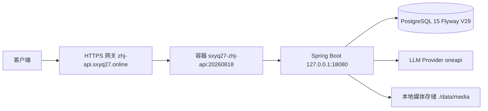

# 当前 8220 运行架构

## 文档信息

| 字段 | 内容 |
|---|---|
| 文档类型 | 系统设计 |
| 当前状态 | 已完成 |
| 适用端 | 后端 |
| 依据源码 | `deploy/`（部署模板）、`Code/backend/Dockerfile`、`application-prod.yml` |
| 依据测试 | `testing/README.md` |
| 依据证据 | `testing/.artifacts/2026-08-18-8220-current-baseline/current-8220-baseline.md` |
| 最后核对 | 2026-08-20 |

## 一、运行 provenance（8220 基线）

| 项 | 值 |
|---|---|
| 目标服务器 | `8.220.206.9` |
| 容器 | `sxyq27-zhj-api` |
| 镜像 | `sxyq27-zhj-api:20260818` |
| 回滚镜像 | `sxyq27-zhj-api:rollback-20260818` |
| 应用端口映射 | `127.0.0.1:18080` |
| 公共入口 | `https://zhj-api.sxyq27.online/`（未鉴权 403） |
| 部署前运行 JAR SHA-256 | `6484b6d822a63dbad8704e3d005f846ec89caab5944c23b55f8e5a8dc134d2c7` |
| 当前运行 JAR SHA-256 | `4289b73346780986647ed1140fa92552656e7cc2ba53a54826e8eaa01832edd2` |
| 对应部署产物 | `tmp/build/gradle-output/backend/libs/zhihuiji-backend-0.1.0.jar`（哈希一致） |
| Flyway | V29，PostgreSQL 15，29 个迁移校验通过 |

## 二、运行架构图

图表目的：展示 8220 运行架构。

图中输入：客户端请求。
图中处理：网关 → 容器 → 应用 → 存储/Provider。
图中输出：响应。

对应源码：`application-prod.yml`、`Code/backend/Dockerfile`。
对应测试：`testing/README.md`。
当前状态：已完成（基线确认）。

## 三、部署注意事项

- 8220 没有源码 Git 仓库，provenance 以本地构建产物 + 上传哈希 + 容器重建 + 启动日志为准。
- 普通工作区产物 `build/libs/zhihuiji-backend-0.1.0.jar` 哈希与运行 JAR 不同，不与运行 JAR 混用。
- 主机系统时间与本地任务日期相差一天（8220 报告 2026-08-19 vs 本地 2026-08-18），证据以本地捕获时间与服务日志时间为准。

## 对应实现

- 后端代码：`application-prod.yml`、`Code/backend/Dockerfile`
- Android 代码：不适用
- iOS 代码：不适用
- Web 代码：不适用
- Agent 代码：不适用

## 对应接口

- 接口路径：`https://zhj-api.sxyq27.online/`（公共入口）
- 请求模型：无
- 响应模型：无
- SSE 事件：无

## 对应测试

- 基线证据：`testing/.artifacts/2026-08-18-8220-current-baseline/current-8220-baseline.md`
- 台账：`testing/current-8220-wave-ledger.csv`

## 当前限制

- 未完成内容：无
- Blocked 内容：8220 无业务数据，业务链路 Blocked
- Deferred 内容：多模态
- historical-only 内容：154 环境运行状态
