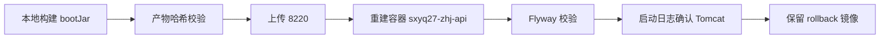

# 构建与发布架构

## 文档信息

| 字段 | 内容 |
|---|---|
| 文档类型 | 系统设计 |
| 当前状态 | 已完成 |
| 适用端 | 后端 / Android |
| 依据源码 | `Code/backend/build.gradle.kts`、`Code/frontend/android/build.gradle.kts`、`Code/backend/Dockerfile`、`tmp/build/` |
| 依据测试 | 8220 基线（`./gradlew test bootJar`、`assembleDebug` 通过） |
| 依据证据 | `testing/.artifacts/2026-08-18-8220-current-baseline/current-8220-baseline.md` |
| 最后核对 | 2026-08-20 |

## 一、构建命令

| 端 | 命令 | 产物 |
|---|---|---|
| 后端 | `./Code/backend/gradlew -p Code/backend test bootJar` | `Code/backend/build/libs/zhihuiji-backend-0.1.0.jar`；部署产物 `tmp/build/gradle-output/backend/libs/zhihuiji-backend-0.1.0.jar` |
| Android | `./Code/frontend/android/gradlew -p Code/frontend/android assembleDebug` | Debug APK（8220 基线 SHA-256 `b549d84e...`） |
| Web | `npm run build`（`Code/frontend/web/`，待验证） | `dist/`（本轮未验证） |
| iOS | Xcode 构建（`ZhihuijiIOS.xcodeproj`，待验证） | `.app`（本轮未验证） |

## 二、发布流程（8220）

图表目的：展示当前发布流程。

图中输入：构建产物。
图中处理：哈希校验 → 上传 → 容器重建 → 迁移校验。
图中输出：运行容器。

对应源码：`Code/backend/Dockerfile`、`tmp/build/`。
对应测试：8220 基线（BE-ENV-8220）。
当前状态：已完成。

## 三、产物哈希（8220 基线）

- 当前运行 JAR SHA-256：`4289b73346780986647ed1140fa92552656e7cc2ba53a54826e8eaa01832edd2`。
- 部署产物（tmp/build）：哈希一致。
- 普通工作区产物：`058059458e...`（不与运行 JAR 混用）。
- Debug APK：`b549d84ec5d46722ebdcfd1a86d7ce0f6c669f39cdfc78cd2482b3a3aa5b1643`。

## 对应实现

- 后端代码：`Code/backend/build.gradle.kts`、`Dockerfile`
- Android 代码：`Code/frontend/android/build.gradle.kts`
- iOS 代码：`ZhihuijiIOS.xcodeproj`
- Web 代码：`Code/frontend/web/`（package.json）
- Agent 代码：不适用

## 对应接口

- 接口路径：无
- 请求模型：无
- 响应模型：无
- SSE 事件：无

## 对应测试

- 后端：`./gradlew test bootJar`
- Android：`assembleDebug` + Agent 单元测试
- Web/iOS：本轮未验证

## 当前限制

- 未完成内容：Web / iOS 构建验证
- Blocked 内容：Android 真机安装验证
- Deferred 内容：无
- historical-only 内容：154 构建产物与部署流程
