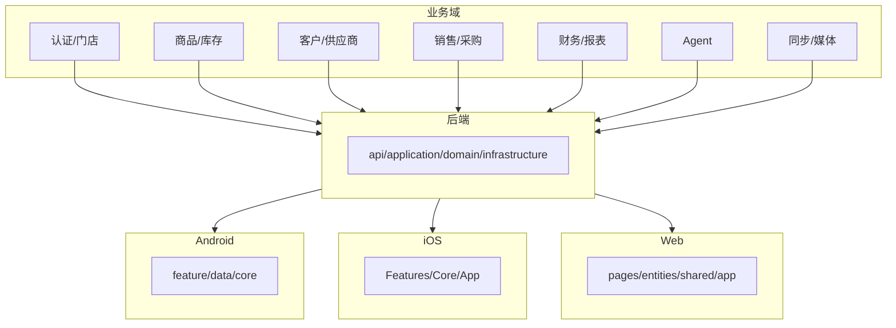

# 代码目录与业务映射

## 文档信息

| 字段 | 内容 |
|---|---|
| 文档类型 | 实现说明 |
| 当前状态 | 已完成 |
| 适用端 | 多端 |
| 依据源码 | `Code/`（后端 + 前端） |
| 依据测试 | `testing/README.md` |
| 依据证据 | `testing/.artifacts/2026-08-18-8220-current-baseline/current-8220-baseline.md` |
| 最后核对 | 2026-08-20 |

## 一、业务域到多端实现映射图

图表目的：展示业务域到各端代码目录的映射。

图中输入：业务域。
图中处理：各端分层目录承载。
图中输出：实现位置。

对应源码：`Code/`。
对应测试：`testing/README.md`。
当前状态：已完成。

## 二、业务域映射表

| 业务域 | 后端 | Android | iOS | Web |
|---|---|---|---|---|
| 认证/门店 | `V2AuthController`、`V2StoreController`、`CurrentOwnerService` | `feature/auth/`、`feature/settings/` | `Features/Auth/` | `pages/auth/`、`entities/auth/roles.ts` |
| 商品/库存 | `V2ProductController`、`V2InventoryController`、`V2InventoryService` | `feature/products/` | `Features/Products/`、`Features/Inventory/` | `pages/archives/product/`、`pages/inventory/` |
| 客户/供应商 | `V2CustomerController`、`V2SupplierController` | `feature/customers/`、`feature/suppliers/` | `Features/Archives/` | `pages/archives/partner/` |
| 销售/采购 | `V2SaleOrderController`、`V2PurchaseOrderController` 等 | `feature/sales/`、`feature/purchases/` | `Features/Sales/`、`Features/Purchases/` | `pages/documents/sales/`、`pages/documents/purchase/` |
| 财务/报表 | `V2AccountController`、`V2ReportController`、`ReportService` | `feature/finance/`、`feature/reports/`、`feature/dashboard/` | `Features/Finance/`、`Features/Reports/`、`Features/Dashboard/` | `pages/finance/`、`pages/reports/`、`pages/dashboard/` |
| Agent | `V2AgentController`、`V2AgentAiService`、`application/service/v2/agent/` | `feature/agent/`、`data/agent/`、`core/network/AgentSseClient.kt` | `Features/Agent/` | `pages/agent/AgentPage.vue`、`shared/api/agent-stream.ts` |
| 同步/媒体 | `V2SyncController`、`V2MediaController`、`V2ImportJobController` | `data/sync/`、`data/agent/media/` | `Core/Models/SyncModels.swift`、`Features/Settings/MediaAssetsView.swift` | `entities/sync/`、`entities/media/` |

## 三、测试代码分类

| 类型 | 位置 |
|---|---|
| 测试源码 | `Code/backend/src/test/`、Android 各模块 `src/test/`、`ZhihuijiIOSTests/` |
| 测试计划与台账 | `testing/*/`（单元测试/功能测试/性能测试/审计/破坏性逆向安全测试） |
| 运行证据 | `testing/.artifacts/<run-id>/` |

## 对应实现

- 后端代码：`Code/backend/`
- Android 代码：`Code/frontend/android/`
- iOS 代码：`Code/frontend/ios/ZhihuijiIOS/`
- Web 代码：`Code/frontend/web/src/`
- Agent 代码：各端 agent 目录（见映射表）

## 对应接口

- 接口路径：`/v2/*`
- 请求模型：`api/dto/v2/`
- 响应模型：`api/dto/v2/`
- SSE 事件：`SseStreamEmitter`

## 对应测试

- 测试源码：各工程 test 目录
- 测试计划：`testing/*/`
- 运行证据：`testing/.artifacts/`

## 当前限制

- 未完成内容：无
- Blocked 内容：8220 业务数据为空
- Deferred 内容：多模态
- historical-only 内容：154 相关内容
