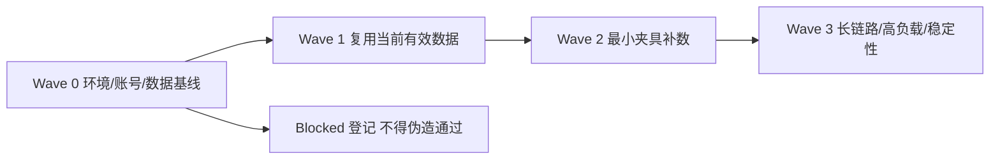

# 测试体系总览

## 文档信息

| 字段 | 内容 |
|---|---|
| 文档类型 | 测试验收 |
| 当前状态 | 已完成 |
| 适用端 | 多端 |
| 依据源码 | `testing/README.md` |
| 依据测试 | `testing/*/TEST_PLAN.md` |
| 依据证据 | `testing/.artifacts/2026-08-18-8220-current-baseline/current-8220-baseline.md`、`testing/current-8220-wave-ledger.csv` |
| 最后核对 | 2026-08-20 |

## 一、测试主体

| 主体 | 位置 |
|---|---|
| 后端 | `testing/后端/` |
| Agent | `testing/Agent/` |
| 安卓 | `testing/安卓/` |
| ios | `testing/ios/` |
| web | `testing/web/` |

## 二、测试类型

常规测试 lane：

- `单元测试`（unit_function_coverage.csv）
- `功能测试`（functional_feature_matrix.csv）
- `性能测试`（performance_scope_matrix.csv）
- `审计`（audit_function_ledger.csv）

独立 lane：

- `破坏性逆向安全测试`（reverse_attack_matrix.csv）——与常规测试分账。

## 三、测试 Wave 流程图

图表目的：展示测试 Wave 执行顺序。

图中输入：测试范围。
图中处理：按 Wave 顺序执行。
图中输出：测试结果（Passed / Failed / Blocked / Deferred）。

对应源码：`testing/README.md`（Execution Waves）。
对应测试：各端 TEST_PLAN.md。
当前状态：已完成（口径定义）。

## 四、统一执行规则

1. 每个场景必须带 `category_id`。
2. 每个函数级或场景级记录必须能回查到分类总台账。
3. 所有测试状态统一落在台账，不在聊天里代替登记。
4. 常规测试与逆向安全测试不得混账。

## 五、证据模板

| 字段 | 说明 |
|---|---|
| test_id | 测试编号 |
| category_id | 分类编号 |
| wave_id | Wave 编号 |
| env | 环境 |
| account/store | 账号/门店 |
| pre_state | 前置状态 |
| actions | 动作 |
| expected | 预期 |
| actual | 实际 |
| artifacts | 证据路径 |
| cleanup | 清理 |
| result | 结果 |

## 六、Stop Rules / Blocker Handling

以下情况统一记为 `Blocked`：

- 环境未起、权限未通、数据前置缺失、目标接口未启用、大模型 provider 未配置、生图 provider 未配置、真机不可复现。

禁止写成：`Passed with note`、`基本通过`、`大致可用`。

## 七、当前 8220 基线状态

| 范围 | Passed | Failed | Blocked | Deferred |
|---|---|---|---|---|
| 8220 环境、Provider、本地构建 | 1 | 0 | 0 | 0 |
| 8220 生产 Agent 业务链路 | 0 | 0 | 1 | 0 |
| Android 真机 | 0 | 0 | 1 | 0 |
| Android 多模态 | 0 | 0 | 0 | 1 |

当前摘要不把历史 154 台账与 8220 结果合并；Blocked 和 Deferred 均不计入 Passed。

## 对应实现

- 后端代码：`Code/backend/src/test/`
- Android 代码：各模块 `src/test/`、`benchmark/`
- iOS 代码：`ZhihuijiIOSTests/`
- Web 代码：`testing/web/`（计划与台账）

## 对应接口

- 接口路径：`/v2/*`
- 请求模型：无
- 响应模型：无
- SSE 事件：`SseStreamEmitter`

## 对应测试

- 测试计划：`testing/*/TEST_PLAN.md`
- 台账：`testing/*/测试分类总台账.csv`、`testing/current-8220-wave-ledger.csv`
- 证据：`testing/.artifacts/`

## 当前限制

- 未完成内容：Web / iOS 主流程测试
- Blocked 内容：8220 生产 Agent 链路、Android 真机、Wave 2/3
- Deferred 内容：多模态
- historical-only 内容：154 历史台账
