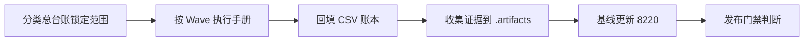

# 测试生命周期

## 文档信息

| 字段 | 内容 |
|---|---|
| 文档类型 | 测试验收 |
| 当前状态 | 已完成 |
| 适用端 | 多端 |
| 依据源码 | `testing/README.md` |
| 依据测试 | `testing/*/TEST_PLAN.md` |
| 依据证据 | `testing/current-8220-wave-ledger.csv`、`testing/.artifacts/` |
| 最后核对 | 2026-08-20 |

## 一、测试生命周期

图表目的：展示测试从计划到门禁的生命周期。

图中输入：测试分类总台账。
图中处理：Wave 执行 → 台账回填 → 证据归档 → 基线更新。
图中输出：发布门禁结论。

对应源码：`testing/README.md`。
对应测试：各端 TEST_PLAN.md。
当前状态：已完成（生命周期定义）。

## 二、执行顺序

1. 先执行 `Wave 0`（环境、账号、数据基线确认）。
2. 再执行所有 `Wave 1`（复用当前 8220 有效数据）。
3. 再进入 `Wave 2`（最小夹具补数）。
4. 最后执行 `Wave 3`（长链路、高负载、稳定性）。

## 三、证据归档

- 运行证据：`testing/.artifacts/<run-id>/`（JSON、SSE、截图、XML、logcat、性能输出）。
- 验收证据：`docs/05_测试与验收/验收证据/`（ai-agent、b11、performance）。
- 基线：`testing/.artifacts/2026-08-18-8220-current-baseline/current-8220-baseline.md`。

## 四、基线更新流程

1. 更新 `testing/README.md`（Current 8220 Baseline 节）。
2. 回填 `testing/current-8220-wave-ledger.csv`。
3. 更新 `testing/.artifacts/2026-08-18-8220-current-baseline/current-8220-baseline.md`。
4. 同步受影响文档的状态字段。

## 对应实现

- 后端代码：`Code/backend/src/test/`
- Android 代码：各模块 `src/test/`
- iOS 代码：`ZhihuijiIOSTests/`
- Web 代码：`testing/web/`

## 对应接口

- 接口路径：`/v2/*`
- 请求模型：无
- 响应模型：无
- SSE 事件：无

## 对应测试

- 计划：`testing/*/TEST_PLAN.md`
- 台账：`testing/*/测试分类总台账.csv`
- 证据：`testing/.artifacts/`

## 当前限制

- 未完成内容：Web / iOS 主流程
- Blocked 内容：8220 业务链路、Android 真机
- Deferred 内容：多模态
- historical-only 内容：154 历史测试记录
