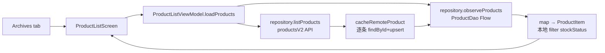

# Android 性能与精简审计报告

> **首页口径（2026-09-23 标注）**：下列「约 336 个 Kotlin」为 **2026-03-13 历史审计快照**，不代表当前工作树。当前可复核数量见 **§14.1**：**344** 个 Kotlin（**302 主源 + 42 测试源**）。§§1–9 属于 2026-03-13 审计背景与当时方案；源码现状与真机证据以 **§10–§15** 为准。

范围：`Code/frontend/android`（主工程，2026-03-13 快照约 336 个 Kotlin 源文件）
性质：只读审计 + 方案输出。首批未修改业务源代码。
日期：2026-03-13（§§1–9）；后续实施/复核见 §10 起
章节分界：**§1–§9** = 2026-03-13 审计背景与当时方案（其中个别结论已被后续源码改动推翻，已在条目内标注）；**§10–§13** = 2026-03-13 实施历史与**设备 `d715a3a4`** 数据；**§14–§15** = 2026-09-22/23 全端审阅、上传/打印集成记录与**设备 `9353e4a3`** 数据；**§16** = 2026-09-23 当轮在**设备 `d715a3a4`** 上的现状测量、热点分析与集中优化（批次 `2026-09-23-d715a3a4-perfwave`）。各节的设备与批次**不互相改写、也不跨设备计算提升**。

---

## 1. 项目整体结构

### 1.1 技术栈

| 维度 | 结论 | 证据 |
|------|------|------|
| 语言 | 纯 Kotlin | 全业务源码 0 个 `.java` |
| UI | 100% Jetpack Compose，无 XML 布局 | 全仓 `res/layout` 为 0 |
| 架构 | ViewModel + Repository，无 UseCase | 全仓 `UseCase\|Interactor` 命中 0 |
| DI | Hilt 2.53 | `ZhihuijiApp.kt:7`、`NetworkModule.kt` |
| DB | Room 2.6 + DataStore | `ZhihuijiDatabase.kt`、`SessionStore.kt` |
| 网络 | Retrofit 2.11 + OkHttp 4.12 + kotlinx-serialization；Agent SSE 自写 | `NetworkModule.kt`、`AgentSseClient.kt` |
| 图片 | Coil 2.7 | `AgentChatScreen.kt:107`、`ProductEditScreen.kt:93` |
| 异步 | Coroutines + StateFlow/Flow，无 LiveData / RxJava | 全仓 |
| 后台 | WorkManager（同步、离线消息重发） | `SyncWorker.kt` |

### 1.2 模块拓扑

```mermaid
flowchart TD
  app[":app 启动/导航/安全"]
  core[":core common/model/designsystem/network/datastore/database"]
  data[":data auth/product/customer/supplier/order/finance/report/agent/sync"]
  feature[":feature auth/dashboard/products/customers/suppliers/sales/purchases/payments/finance/reports/agent/settings"]
  backdrop[":backdrop Kyant 玻璃渲染 第三方只读"]
  bench[":benchmark Macrobenchmark"]

  app --> core
  app --> data
  app --> feature
  feature --> data
  feature --> core
  data --> core
  core designsystem --> backdrop
  app --> bench
```

依赖方向：`feature → data → core`，`app` 装配。无 feature→feature 依赖。

### 1.3 业务模块与调用链

| 业务 | Screen | ViewModel | Repository | 数据源 |
|------|--------|-----------|------------|--------|
| 登录/用户 | `LoginScreen` `RegisterScreen` | `AuthViewModel` | `AuthRepository` | v1 auth API + `SessionStore` |
| 首页工作台 | `DashboardScreen` | `DashboardViewModel` | Product/Customer/Report/Snapshot | Room Flow + 5 路报表 API |
| 商品 | `ProductList/Detail/EditScreen` `StockAdjustScreen` | 对应 4 个 VM | `ProductV2Repository` | Room + `productsV2` |
| 库存 | `InventoryLedger/SnapshotScreen` | 对应 VM | `InventoryV2Repository` | 纯远程 |
| 客户 | `CustomerList/Detail/Edit` + 联系人 3 屏 | 对应 VM | `CustomerV2Repository` | Room + API |
| 供应商 | 同上结构 | 对应 VM | `SupplierV2Repository` | Room + API |
| 销售 | `SaleOrderList/Edit/Detail` `PaymentScreen` `SalesReturnScreen` | 对应 VM | `SaleOrderV2Repository` 等 | MemoryCache + Room + API |
| 采购 | `PurchaseOrder*` `PurchaseReceipt/Return` | 对应 VM | `Purchase*V2Repository` | Room + API |
| 收付款 | `PayOrderList/Detail` | 对应 VM | `PayOrderV2Repository` | API（有分页） |
| 财务 | `FinanceRecord*` `DailyExpense` `Account*` | 对应 VM | `FinanceRepository` `AccountV2Repository` | Room + API |
| 统计 | `ReportScreen` | `ReportViewModel` | `ReportRepository` | 纯 API |
| Agent/AI | `AgentWorkbench/ChatScreen` `DraftList` `TaskNotification` | `AgentChatViewModel` 等 | `AgentV2Repository` 等 | SSE + API + Room 审计 |
| 图片上传 | 嵌在 ProductEdit / AgentChat | 各 VM `uploadImage` | `MediaV2Repository` | multipart 上传 |
| 设置/同步 | `SettingsScreen` `StaffManagementScreen` | 对应 VM | Auth + Sync + SettingsStore | API + DataStore + outbox |

**典型列表调用链**（商品为例）：



**Agent 调用链**：

```
AgentChatScreen
  → AgentChatViewModel.sendMessage
  → AgentV2Repository.chatStream (SSE)
  → AgentSseClient.chatStream (OkHttp)
  → handleStreamEvent → reduceLiveTrace
  → _uiState.messages (24ms answer_delta 合帧)
  → LazyColumn + ResultBlockRenderer / AgentMarkdownText
```

### 1.4 架构上的主要债务

1. **Room 双轨**：11 个 V2 Entity + 11 个 V2 Dao 已注册在 `ZhihuijiDatabase.kt:21-62`，但 `DatabaseModule` 不提供、Repository 仍用 V1 表。运行时完全未使用。
2. **API 双轨**：`ZhihuijiApi` v1 业务端点（products/customers/orders 等）无生产调用，仅 auth/admin 在用。
3. **写路径分裂**：商品/客户/供应商走 outbox 同步；订单/账户/库存/媒体直连远程。
4. **Agent 模块超大**：`AgentChatViewModel` 2200 行、`AgentChatScreen` 2724 行、`ResultBlockRenderer` 1645 行。

---

## 2. 当前性能结论

按严重程度排列。120Hz 单帧预算约 8.33ms。

### P0-1 启动时主动把刷新率压到约 60Hz

- **位置**：`app/src/main/java/com/zhihuiji/app/MainActivity.kt:47-69` `preferStableRefreshRateDisplayMode`
- **原因**：`compareBy({ abs(it.refreshRate - 60f) }, { it.refreshRate })` 明确挑选最接近 60Hz 的 Display.Mode 并写入 `preferredDisplayModeId` / `preferredRefreshRate`
- **影响范围**：整个 App，所有页面
- **运行时影响**：即便设备支持 120Hz，窗口也被锁到 60Hz 附近；`setFrameRateBoostOnTouchEnabled(true)` 只在触控瞬间 boost，基线仍是 60Hz
- **代码确认**：是。且 `docs/07_问题审计/性能安全函数审计.csv:10-11` 记录旧函数名 `preferHighRefreshRateDisplayMode` 曾用 `maxWithOrNull` 偏好高刷，后被改名为 `preferStableRefreshRateDisplayMode` 并改为偏好 60Hz——这是有意的回退，而非笔误
- **建议**：先实测玻璃特效在 120Hz 下的掉帧成本；若特效降级后能稳住帧，恢复高刷偏好；否则保持 60Hz 并在 UI 上明确「流畅优先」策略，避免用户误判机型能力

### P0-2 主内容整棵挂 `layerBackdrop`，底栏真模糊每帧重录

- **位置**：
  - `MainScreen.kt:224-234` `MainNavGraph(... .layerBackdrop(bottomBarBackdrop))`
  - `MainScreen.kt:542-570` 指示器 `drawBackdrop { blur(42.dp); vibrancy() }`
  - `MainScreen.kt:383-387` 指标动画 `graphicsLayer { translationX; scaleX; scaleY }`
- **原因**：任意主页列表滑动时，内容层被 `LayerBackdropModifier` 重录，底栏再做 42.dp 真模糊采样
- **影响范围**：所有主 Tab 页滑动
- **运行时影响**：持续 GPU 录制 + RenderEffect 模糊，是列表滚动的结构性成本，直接挤占 8.33ms 帧预算
- **代码确认**：是
- **建议**：底栏改静态玻璃（`LiquidGlassSurface` 不传 backdrop），或仅在指示器切换动画的短窗口内启用真模糊

### P0-3 列表 item 全是完整 LiquidGlassCard

- **位置**：`LiquidGlassSurface.kt:114-130` `staticLiquidGlass` = `shadow(10.dp)` + `clip` + 渐变背景 + 全尺寸径向高光圆 + `border`；业务列表 221 处 `LiquidGlassCard` 引用
- **原因**：每个可见 item 都走这条绘制链；`glassHighlightOverlay` 每 item 画一个覆盖全卡的 radial gradient（`LiquidGlassSurface.kt:181-198`）
- **影响范围**：商品/客户/供应商/销售/采购/付款/财务/Agent 草稿等全部列表
- **运行时影响**：item 数 × (阴影 + 裁剪 + 两层渐变 + 描边) 的 overdraw，高刷下 GPU 成为瓶颈
- **代码确认**：是
- **建议**：列表 item 改轻量卡片（纯背景 + 1px 描边，去掉 shadow 与高光圆）；玻璃质感只保留页面级容器（顶栏/底栏/弹层）

### P0-4 主列表无分页 + Room 全表 observeAll

- **位置**：
  - API：`ZhihuijiV2Api.kt:122-128` `productsV2` 无 page/size；客户/供应商/销售/采购同理
  - DAO：`ProductDao.kt:9-10` `observeAll()` 无 LIMIT；`CustomerDao`/`SaleOrderDao` 同理
  - 仅 `PayOrderListViewModel` 有 page/size=50
- **原因**：一次拉全量 → 全量 upsert → 全表 Flow → 全量 map 成 UI Item
- **影响范围**：商品/客户/供应商/销售/采购列表
- **运行时影响**：数据量上去后，首次显示慢、每次 emission 全量映射、列表重组分配大；滑动时若触发 search/tab 切换会重复整链
- **代码确认**：是
- **建议**：后端补分页参数，客户端接 Paging3 或手写分页；DAO 查询加 LIMIT；缓存写入改批量事务

### P0-5 启动主线程同步安全扫描

- **位置**：`MainActivity.kt:24-36` → `SignatureIntegrityChecker.isSignatureTrusted` + `RuntimeSecurityGuard.isHighRiskRuntime`
- **原因**：release 下 onCreate 同步做签名 SHA-256、2 个端口 Socket connect（各最长 120ms）、读 `/proc/self/maps` 全文、多个 `File.exists`
- **影响范围**：冷启动首帧
- **运行时影响**：最坏情况主线程阻塞数百毫秒，直接吃掉首帧预算
- **代码确认**：是
- **建议**：安全逻辑保留，挪到后台协程；通过结果决定是否 `finishAffinity()`。签名校验失败时可先显示启动占位再退出

### P0-6 图片读取（2026-03-13 曾为 `readBytes()` 整文件；**源码现状已改流式**）

- **历史问题（2026-03-13）**：`viewModelScope.launch` 默认 Main，内部 `resolver.openInputStream(uri)?.use { it.readBytes() }` 主线程整文件进内存。
- **当前源码事实**：上传链已改为 `openStream` + `StreamingRequestBody` 流式写出（见 §14.5 / §15.3）；Agent/ProductEdit **不再**整文件 `readBytes`。真机业务上传成功 ×3（6,291,478 字节 JPEG）。
- **仍缺限制**：原始 HTTP 报文、服务端字节逐字校验、chunked/-1 路径、上传期间峰值内存；**不得**把业务成功扩成报文级验收，也**不得**再写「当前仍在主线程整文件 readBytes」。

> 下列五条为 **2026-03-13 审计时的原始条目**，保留作历史背景；**当前源码已不成立**，不得再按现在时引用。

- **位置（2026-03-13，历史）**：`AgentChatViewModel.kt:199-207`、`ProductEditViewModel.kt:341-353`
- **原因（2026-03-13，历史）**：`viewModelScope.launch` 默认 Main，内部 `resolver.openInputStream(uri)?.use { it.readBytes() }`
- **影响范围**：商品图上传、Agent 图片附件
- **运行时影响（2026-03-13，历史）**：大图可卡主线程数十到数百毫秒，并整文件进内存
- **代码确认（2026-03-13 为「是」；2026-09-23 只读复核为「否」）**：`readBytes` 在全部 Android 源码中 **0 命中**；`ProductEditViewModel.uploadImage` 已 `withContext(Dispatchers.IO)` + `readUploadImagePayload` 返回 `openStream` 载荷（不持有文件 ByteArray，见 §14.5 / §15.3）
- **建议（历史 → 落实状态）**：`withContext(Dispatchers.IO)` **已落实**；**按展示尺寸下采样仍未做**（§11.6 记为后续项）

### P0-7 Agent 流式消息分配（历史问题 + 当前剩余）

- **历史问题（2026-03-13）**：每个 `answer_delta` flush 做 `content + delta` 新 String、`parts` 新 List、message copy、整列表 state 更新；组合时再全量扫 timeline。
- **已做**：24ms `answer_delta` 合帧；timeline `remember` / `buildTraceSkeleton` + `attachStreamingTimelineItems`（见 §11、§14.7）。**不是**全部分配已消除。
- **剩余成本**：`updateAssistantMessage` 在合帧后仍会复制 `messages` 列表；`attachStreamingTimelineItems` 仍有 `HashSet`/`ArrayList`/排序（业务去重与全序所需）。不得写成「高频分配已全部消除」。

- **位置**：`AgentChatViewModel.kt:1097-1134`、`1304`、`1368`；`AgentChatScreen.kt:619-633` timeline 无 remember
- **原因**：每个 answer_delta flush 做 `content + delta` 新 String、`parts` 新 List、message copy、整列表 state 更新；组合时再全量扫 timeline
- **影响范围**：Agent 聊天页滚动/流式输出
- **运行时影响**：高频分配 → GC 压力；消息列表重组范围大
- **代码确认**：是
- **建议**：delta 合帧进 StringBuilder/可变缓冲，flush 时一次 copy；timeline 计算 `remember(message)`

### P0-8 盘点提交逐条串行 HTTP

- **位置**：`InventorySnapshotViewModel.kt:86-95`
- **原因**：每个未盘点商品一次独立请求
- **影响范围**：库存盘点提交
- **运行时影响**：N 个商品 = N 次网络往返，数据多时提交极慢
- **代码确认**：是
- **建议**：后端提供批量接口，或客户端限流并行 + 进度反馈

### P0-9 Dashboard KPI 卡在 LazyColumn 内 `blur(24.dp)`

- **位置**：`DashboardScreen.kt:412-418`
- **原因**：可见 KPI 卡挂真模糊
- **影响范围**：首页滚动
- **运行时影响**：与 P0-2 叠加，首页滑动 GPU 成本高
- **代码确认**：是
- **建议**：去掉卡片级 blur，保留静态渐变

### P1 摘要

| ID | 问题 | 位置 |
|----|------|------|
| P1-1 | 主列表 UiState 无 `@Immutable` | `ProductListViewModel.kt:44` 等 |
| P1-2 | 缺 `itemContentType` | 商品/销售/客户等列表 |
| P1-3 | Room emission 全量 map → UI Item 双层拷贝 | `ProductV2Repository.kt:45-51` + 各 List VM |
| P1-4 | 远端列表逐条 `findById`+`upsert`（N+1） | `ProductV2Repository.kt:127-131`、`CustomerV2Repository.kt:116-118` |
| P1-5 | LIKE 两侧通配 + EXISTS 子查询搜索 | `ProductDao.kt:12-13`、`SaleOrderDao.kt:22-26` |
| P1-6 | Coil 多数未设 `size()` | `AgentChatScreen.kt:2392` |
| P1-7 | Dashboard 每次 5 并行请求 + 条件再拉全量客户 | `DashboardViewModel.kt:140-165` |
| P1-8 | 列表 `observe` + `list` 双路径无协调，search/tab 全量重拉 | 各 List VM |
| P1-9 | 通知全读 N 个 async 再 loadData | `TaskNotificationViewModel.kt:116-125` |
| P1-10 | GlassScaffold 背景 3 个全屏 radial 渐变每帧绘制 | `GlassScaffold.kt:79-113` |
| P1-11 | release 安全扫描在主线程（同 P0-5，启动后仍属负担） | 同上 |

### P2 摘要

| ID | 问题 |
|----|------|
| P2-1 | 组合期 format/filter（DraftList、MoneyFormatter、TimeFormatter） |
| P2-2 | item 内创建 lambda |
| P2-3 | `MemoryCache` 无容量上限 |
| P2-4 | `compose-material-icons-extended` 体积大 |
| P2-5 | 启动性能描述文件不自动生成（`app/build.gradle.kts:121-123`） |
| P2-6 | AgentChatScreen 约 8 个 `LaunchedEffect`，部分依赖 `messages.size` 易重复触发 |
| P2-7 | benchmark 无列表 fling / JankStats 场景 |

---

## 3. 业务代码精简清单

### 3.1 支付方式码表（高风险，必须先对齐）

| 位置 | 码值 |
|------|------|
| `core/common/StatusLabels.kt:23-27,88-93` | 1=现金 2=微信 3=支付宝 4=银行卡 5=其他 |
| `Code/frontend/web/.../business.ts:9-13` | **同上 1-5（权威）** |
| `Backend V2SaleReceiptPdfService.java:272-278` | 1=现金 2=微信 3=支付宝 4=银行卡 |
| `feature/sales/PaymentViewModel.kt:107-114` | **0=现金 1=微信 2=支付宝 3=银行转账** |
| `feature/sales/PaymentScreen.kt:41-46` | 同上 0-3 |
| `Backend PayOrderLookupTool.java:175-182` | **0=现金 1=微信 2=支付宝 3=银行卡** |
| `feature/finance/AccountListViewModel.kt:17-33` | 账户类型 0=现金 1=银行 2=支付宝 3=微信（与付款方式不同语义，勿混） |
| `feature/finance/DailyExpenseScreen.kt:101-109` | 自建 map（用 StatusLabels.Codes） |
| `feature/purchases/PurchaseReturnScreen.kt:504-507` | 自建 map |

**事实**：Web 管理端与 Android `StatusLabels`、后端 PDF 一致采用 1-based；Android 销售收款写路径与后端 Agent 工具采用 0-based。`PaymentViewModel` 写入 `SalePaymentV2Request(method=state.paymentMethod)` 时用 0-3，`PayOrderDetailScreen` 展示时用 `StatusLabels.paymentMethod`（1-5）——**同一笔款写入与展示码表不一致**。

**目标**：以 Web/`StatusLabels` 的 1-5 为权威，改 `PaymentViewModel`/`PaymentScreen` 与后端 Agent 工具；账户类型单独保留，不与付款方式混用。
**风险**：历史数据里可能已写入 0-based 码，需要迁移或兼容策略。

### 3.2 可直接删除的死代码（低风险）

| 对象 | 证据 | 处理 |
|------|------|------|
| `core/common/UiMessage.kt` | 无调用 | 删 |
| `core/common/ResultExt.kt` | 仅测试引用，自带 `@Deprecated` | 删（连测试） |
| `core/model/StatusConstants.kt` | 无调用，与 `StatusLabels.Codes` 重复 | 删 |
| `data/finance/FinanceV2Repository.kt` | 仅 `FinanceV2RepositoryTest` 引用 | 删（连测试）；BillFundLink 若需要并入 `AccountV2Repository` |
| 11 个 V2 Entity + 11 个 V2 Dao | 仅 `ZhihuijiDatabase.kt` 注册，无注入无调用 | 删；migration 需评估是否回滚表 |
| `EntityMappers.kt` 中 Product/Customer/Supplier/SaleOrder/PurchaseOrder/PayOrder 映射 | 仅 FinanceRecord 两函数在用 | 删约 240 行 |
| `ZhihuijiApi` v1 业务端点 | 仅 auth/admin 在用 | 删业务端点约 150 行 |
| `StatusLabels.productStatus` / `customerLevel` / `inventoryFlowType` | 无调用 | 删或接上 |

### 3.3 重复实现合并

| 重复项 | 份数 | 目标结构 | 风险 |
|--------|------|----------|------|
| 数量格式化 `if (x%1==0) "%.0f" else "%.2f"` | 5+ | `core/common/QuantityFormatter` | 低 |
| 金额格式化（`"¥%.2f"`、`"%.2f"`、`String.format`、多个薄包装） | 10+ | 只留 `MoneyFormatter`；UiState 存 `Double` | 中（展示格式） |
| 时间格式化（`createdAtText`、自建 DateTimeFormatter、转发函数） | 8+ | 只留 `TimeFormatter`，补 `formatDateTimeOrEmpty` / `formatRelativeDay` | 低 |
| 订单状态文案 | 3 套独立 map，语义冲突 | 收口 `StatusLabels`，先对齐 `purchaseOrderStatus`（1=已收货）vs Detail（1=已确认） | 中 |
| 待收金额 `total - paid` | 4 处 | DTO `pendingAmount` | 低 |
| 待退款 `(total-refund).coerceAtLeast(0)` | 2 处 | DTO `remainingRefund` | 低 |
| 订单总额 `sum(qty*price)-discount` | 2 处 | 共用 `calcOrderTotal` | 中 |
| List VM（商品/客户/供应商/销售单） | 4 套同构约 480 行 | 共用加载协调器 | 中 |
| 联系人 List/Edit VM（Customer ≡ Supplier） | 2 套约 200 行 | 泛型 `PartnerContact*` | 低 |
| Dashboard/Report 金额：Double→`"%.2f"`→再 parse→再 format | 4 层 | UiState 存 Double | 中 |
| 客户状态 Screen 用中文字符串反查 | 1 处 | 结构化字段 | 低 |
| 浮点容差 `0.0001` vs `0.000001` | 3 处 | 统一常量 | 低 |
| `FinanceViewModel` 无效 try-catch | 1 处 | 删；`refreshFinanceRecords` 返回 Result | 低 |
| `SettingsStore` 4 次 URI `runCatching` | 1 文件 | 抽 `parseUriOrNull` | 低 |
| PDF 下载自带 try/catch 与 SafeApiCall 重复 | 1 处 | 复用统一包装 | 低 |
| `formatPurchaseReturnQuantity` 纯转发 | 1 处 | 删 | 低 |

### 3.4 类型转换精简

当前商品链路：

```
ProductV2Dto → ProductEntity → ProductV2Dto → ProductItem → 展示字符串
```

- `toEntity` / `toV2Dto` / `toPendingEntity` 在 Product/Customer/Supplier 三处各写一遍（9 个同构函数）
- UI Item 同时带 `Double` 与预格式化 `String`（`CustomerItem.receivableAmount` + `receivable` 等）

**目标**：网络 DTO ↔ Room Entity 双向各一份；UI Item 只保留数值与枚举；字符串在 Screen 组合时经 `MoneyFormatter`/`TimeFormatter` 生成（可 remember）。

### 3.5 无效防御与异常

| 位置 | 问题 | 处理 |
|------|------|------|
| `SafeApiCall.kt:60-61` | `catch (Exception)` 把 `CancellationException` 包成 `NetworkException`，破坏协程取消 | **修缺陷**：先 rethrow CancellationException |
| `FinanceViewModel.kt:85-94` | catch 永不进入 | 删 |
| `AgentAuditRepository.kt:76-78` | 审计写失败完全静默 | 保留写入，失败至少打日志 |
| `DashboardViewModel.kt:202-205` | Long→Int 溢出 coerce | 可简化 |
| `ProductV2Repository.kt:39` 等本地过滤返回空 | 有意正确（本地无分类列） | **保留** |

---

## 4. 重复调用链清单

| 功能 | 当前调用路径 | 重复路径 | 建议保留的主路径 | 可以移除的内容 | 风险 |
|------|-------------|---------|-----------------|----------------|------|
| 支付方式文案 | `StatusLabels.paymentMethod`（1-5） | `PaymentViewModel` 0-3、`PaymentScreen` 本地 map、`DailyExpenseScreen`、`PurchaseReturnScreen`、`AccountListViewModel` | 对齐后端后统一 `StatusLabels.paymentMethod` | 4 份本地 map | **高**（码值冲突） |
| 数量格式化 | 各 Screen `formatQuantity` | ×5 | `core/common/QuantityFormatter` | 5 份复制 | 低 |
| 金额格式化 | `MoneyFormatter` | 多处 `"¥%.2f"` / `"%.2f"` / 薄包装 | `MoneyFormatter` | 全部薄包装 + String 中间态 | 中 |
| 时间格式化 | `TimeFormatter` | 3×`createdAtText`、自建 formatter、转发 | `TimeFormatter` | 本地 formatter | 低 |
| 采购单状态文案 | `StatusLabels.purchaseOrderStatus` | Detail/Receipt/Return 各一份 map | `StatusLabels`（先对齐语义） | feature 内 map | 中 |
| 待收/待退金额 | 内联减法 ×4-5 | — | DTO 扩展 | 内联表达式 | 低 |
| 订单总额 | `SaleOrderEditScreen` | `PurchaseOrderEditViewModel` getter | 共用 `calcOrderTotal` | 1 份 | 中 |
| 列表加载 | `init→load` + `search→load` + `selectTab→load` + observe+list | ×4 同构 VM | 公共加载协调器 | 3 份复制 | 中 |
| 联系人 CRUD | Customer Contact List/Edit VM | Supplier 同构 | 泛型 PartnerContact* | 约 200 行 | 低 |
| 账户/转账 API | `AccountV2Repository` | `FinanceV2Repository` 完全重复 | `AccountV2Repository` | 整个 FinanceV2Repository | 低 |
| 报表 API | `ReportRepository` 15 个纯转发 | — | 保留薄边界或注入 API | 纯改名包装 | 低 |
| V2 Room 层 | 11 Entity+Dao 注册 | 无使用 | 删除 | 22 个文件 | 低 |
| EntityMappers V1 | FinanceRecord 在用 | 其余无调用 | 只留 FinanceRecord | 约 240 行 | 低 |
| ZhihuijiApi v1 业务 | 无调用 | Auth 在用 | 只留 auth/admin | 业务端点 | 低 |
| Dashboard 金额链路 | API → VM String → Screen 再 format | 4 层 | API → UiState Double → Screen `MoneyFormatter` | 3 层中间转换 | 中 |
| 库存快照加载 | `loadTodaySnapshots` | `refresh` | 一个 `load(date)` | 1 个入口 | 低 |
| PDF 下载错误包装 | `SafeApiCall` | Repository 自带 try/catch | 复用统一包装 | 17 行 | 低 |
| 确认操作 guard | SalesReturn/PurchaseReturn/PurchaseReceipt 同构 | — | 可抽样板，**guard 本身保留** | 样板重复 | 低 |

**每功能唯一入口目标**（以商品列表为例）：

| 维度 | 位置 |
|------|------|
| 唯一入口 | `ProductListViewModel.loadProducts(filter)` |
| 唯一业务处理 | 该 VM 内（filter 组装 + 状态映射） |
| 唯一数据访问 | `ProductV2Repository`（observe + list 双通道） |
| 唯一状态更新 | `_uiState.update`（无 Screen 本地副本） |
| 唯一错误处理 | VM 统一 `onFailure` → `error` 字段；`SafeApiCall` 归一异常 |
| 唯一刷新策略 | `loadJob.cancel()` + 重新 observe+list；search 仅改 keyword 后走同一 `loadProducts` |

未发现：Compose 直调 Repo 绕过 VM、LiveData↔Flow 互转、EventBus。这三点干净。

---

## 5. 性能优化方案

### P0（直接影响滑动与 120Hz）

| 编号 | 优化目标 | 涉及文件 | 修改方式 | 预期收益 | 验证方法 | 风险 | 需真机 |
|------|----------|----------|----------|----------|----------|------|--------|
| O1 | 恢复/明确刷新率策略 | `MainActivity.kt:47-69` | 先在 120Hz 下测玻璃特效掉帧；能稳住则改为偏好最高刷新率，否则保持 60 并文档化 | 打开 120Hz 上限 | `adb dumpsys display` + Frame Timeline | 策略变更影响观感与功耗 | 是 |
| O2 | 去掉主内容 `layerBackdrop` 与底栏真模糊 | `MainScreen.kt:224-234,542-570` | 底栏改静态玻璃；指示器仅切换动画短窗口真模糊 | 列表滚动 GPU 成本大降 | 滑动 FrameTimeline / Perfetto GPU | 底栏玻璃观感变化 | 是 |
| O3 | 列表 item 轻量化 | `LiquidGlassSurface.kt` + 各 List item | 新增 `ListGlassCard`（无 shadow/高光圆）；页面级容器保留完整玻璃 | item 绘制成本约降一半以上 | 1000 条列表 fling 帧时间 | 视觉层级变化，需设计确认 | 是 |
| O4 | 主列表分页 + Room LIMIT | `ZhihuijiV2Api`、各 `*Dao`、各 List VM/Repo | API 加 page/size；DAO 加 LIMIT；缓存写入批量事务 | 首屏与刷新耗时、内存分配下降 | 真实数据量下首屏时间、请求体积 | 需后端配合 | 是 |
| O5 | 安全扫描移出主线程 | `MainActivity.kt:24-36`、`RuntimeSecurityGuard`、`SignatureIntegrityChecker` | 后台协程执行，结果决定是否退出 | 冷启动首帧改善 | Macrobenchmark StartupTiming | 安全窗口期略变长 | 是 |
| O6 | 图片读取移出主线程并下采样 | `AgentChatViewModel.kt:199-207`、`ProductEditViewModel.kt:341-353` | `Dispatchers.IO` + 按目标尺寸解码 | 上传不再卡 UI | 大图上传时主线程 trace | 无 | 是 |
| O7 | Agent 流式缓冲与 timeline remember | `AgentChatViewModel.kt:1097-1134`、`AgentChatScreen.kt:619-633` | delta 进缓冲；timeline `remember` | GC 与重组次数下降 | Compose 重组计数、GC 日志 | 流式展示时序微调 | 是 |
| O8 | 盘点批量提交 | `InventorySnapshotViewModel.kt:86-95` + 后端 | 批量接口或限流并行 | 提交耗时 | 50/200 商品提交计时 | 需后端 | 是 |
| O9 | Dashboard 卡片去 blur | `DashboardScreen.kt:412-418` | 改静态渐变 | 首页滚动帧时间 | 同 O2 | 观感 | 是 |

### P1（页面加载、列表、内存）

| 编号 | 目标 | 涉及文件 | 修改方式 | 收益 | 验证 | 风险 | 真机 |
|------|------|----------|----------|------|------|------|------|
| O10 | UiState `@Immutable` + `itemContentType` | 各 List VM / Screen | 注解与 contentType | 重组范围收窄 | 重组计数 | 低 | 可选 |
| O11 | 消除 N+1 缓存写 | `ProductV2Repository` `CustomerV2Repository` `SupplierV2Repository` | 批量 findById/upsert 事务 | 刷新 DB 往返从 N 降到 1-2 | DB 日志 | 中 | 可选 |
| O12 | 搜索索引化 | 各 Dao LIKE | 前缀匹配或 FTS | 搜索延迟 | 10k 行搜索计时 | 中 | 是 |
| O13 | Coil 设 size | `AgentChatScreen` `ProductEditScreen` | `ImageRequest.size(...)` | 解码内存 | Memory Profiler | 低 | 是 |
| O14 | Dashboard 请求收敛 | `DashboardViewModel.kt:140-165` | 首屏只拉趋势+汇总，其余懒加载；fallback 改聚合接口 | 首屏请求数 | 网络日志 | 中 | 是 |
| O15 | 列表加载入口收敛 | 4 个 List VM | 共用协调器；search 加 debounce | 重复请求消失 | 网络日志 | 中 | 可选 |
| O16 | 通知已读批量接口 | `TaskNotificationViewModel.kt:116-125` | 一次 API | N→1 | 网络日志 | 低 | 否 |
| O17 | GlassScaffold 背景简化 | `GlassScaffold.kt:79-113` | 静态图或减少渐变层数 | 全局 overdraw | GPU 帧分析 | 观感 | 是 |

### P2（结构与长期）

| 编号 | 目标 | 修改方式 | 收益 | 风险 |
|------|------|----------|------|------|
| O18 | 组合期 format/filter 移出 | Screen 层 remember / VM 预计算 | 重组成本 | 低 |
| O19 | 死代码清理（§3.2） | 删除 | 编译体积、认知负担 | 低 |
| O20 | 格式化与状态文案收口 | `MoneyFormatter`/`TimeFormatter`/`StatusLabels` | 消除不一致 | 中 |
| O21 | List VM / 联系人 VM 合并 | 公共协调器 / 泛型 | 约 500 行 | 中 |
| O22 | MemoryCache 加容量上限 | LRU | 内存可控 | 低 |
| O23 | 精简 `compose-material-icons-extended` | 按需 icon | APK 体积 | 低 |
| O24 | 补列表 fling Macrobenchmark + JankStats | `benchmark` 模块 | 可持续度量 | 低 |
| O25 | AgentChatViewModel 拆分 | 流式/草稿/会话/媒体分模块 | 可维护性 | 中 |

---

## 6. 推荐实施顺序

低风险 → 高收益，每步可独立验证。

| 步骤 | 内容 | 验证 |
|------|------|------|
| 1 | O6 图片主线程、O5 安全扫描挪线程、修 `SafeApiCall` 取消语义 | 单测 + 启动/上传无 ANR |
| 2 | O3 列表 item 轻量化 + O9 Dashboard 去 blur | 1000 条 fling 帧时间对比 |
| 3 | O2 底栏去真模糊 / 收窄 layerBackdrop | 主 Tab 滑动帧时间 |
| 4 | O1 刷新率策略（依赖 2-3 的实测） | 120Hz 设备 Frame Timeline |
| 5 | O7 Agent 流式缓冲 + timeline remember | 聊天流式 GC/重组 |
| 6 | O15 列表加载入口收敛 + search debounce | 网络请求数 |
| 7 | O11 缓存写批量化 + O14 Dashboard 请求收敛 | DB/网络计数 |
| 8 | O4 分页（需后端） | 大数据量首屏 |
| 9 | O8 盘点批量（需后端） | 提交耗时 |
| 10 | §3.2 死代码删除 + §3.3 格式化/文案收口 | 编译 + 冒烟 |
| 11 | O21 VM 合并 + O25 Agent 拆分 | 回归 + 单测 |
| 12 | O24 补 fling 基准，纳入常规回归 | 基准报告 |

**建议的第一批（低风险、可立刻做）**：步骤 1、2、3，以及支付方式码表对齐（需先与产品/后端确认历史数据）。

---

## 7. 不建议修改的部分

以下看起来复杂，但是认证、权限、数据隔离、事务或真实数据安全所必需：

| 保留项 | 位置 | 原因 |
|--------|------|------|
| 权限路由与快照 | `MainAccessViewModel.kt:105-122`、`MainNavGraph.kt:745-776`、`SyncPreferenceStore.kt:72-78` | 客户端鉴权 + 离线兜底 |
| Token 刷新链 | `AuthInterceptor`、`TokenAuthenticator`、`AuthRepository.refresh` | 会话安全 |
| 签名校验 / 运行时安全（含 catch Throwable） | `SignatureIntegrityChecker`、`RuntimeSecurityGuard` | 反篡改；可挪线程，不可删逻辑 |
| 会话加密 | `SecureSessionCipher`、`SessionStore` | 凭据保护 |
| 登出撤权清理 | `LocalAccessRevocationHandler`、`LocalDataCleaner` | 账号数据隔离 |
| SafeApiCall 错误归一 | `SafeApiCall.kt:45-72` | 统一错误语义（需修取消语义，逻辑保留） |
| 同步出站事务 | `LocalSyncRepository.mutateAndEnqueue`、`SyncTransactionRunner` | 写本地 + 入 outbox 原子性 |
| 未决本地变更不被远端覆盖 | 各 Repo `hasUnresolvedLocalChange` | 同步冲突隔离 |
| 同步冲突标记 BLOCKED | `SyncV2Repository.kt:54-58` | 冲突不静默覆盖 |
| 收款金额校验 | `PaymentViewModel.kt:78-81` | 金额合法性 |
| 退款剩余 `coerceAtLeast(0)` | SalesReturn / PurchaseReturn | 防超额退款 |
| 确认操作状态限制与 `isSubmitting` | SalesReturn / PurchaseReceipt / PurchaseReturn | 防重复提交 + 状态机 |
| 保存按钮 `canSave/canSubmit` | ContactEdit / AccountEdit / AccountTransfer | 防重复提交 |
| 列表 `loadJob.cancel()` | 各 List VM | 防并发重复请求 |
| Dashboard `loadSequence` | `DashboardViewModel.kt:94,132,246` | 防陈旧响应覆盖 |
| 本地筛选诚实返回空 | `ProductV2Repository.kt:37-39` 等 | 避免误导性离线结果 |
| 库存调整走台账 | `StockAdjustViewModel.kt:61-70` | 库存变更留痕 |
| 离线 Room fallback | Product/Customer/Supplier `getXxx` | 断网可读 |
| 写后缓存失效 | `SaleOrderV2Repository.kt:81-122` | 防脏读 |
| release 网络日志关闭、debug 才开 | `core/network/build.gradle.kts` | 正确 |
| release minify + shrink | `app/build.gradle.kts:37-44` | 正确 |
| `backdrop` 第三方渲染库 | 整个模块 | 只读参考，不重构 |
| `benchmark` 测试模块 | 整个模块 | 测试专用 |

---

## 8. 性能证据说明

### 已实测

**【2026-03-13 历史状态】** 当轮**未**在真机/模拟器跑 Profiler、Perfetto、Macrobenchmark、`dumpsys gfxinfo`；**当轮环境无法连接设备**。
**当前状态（2026-09-23 更新）**：设备已可连接并已完成真机采集，`dumpsys gfxinfo framestats` / `meminfo` / `am start -W` / Perfetto 均已实际执行，数据见 §13（`d715a3a4`）、§15（`9353e4a3`）与 **§16（`d715a3a4`，本轮）**。本条历史结论不再代表当前环境。

### 来自代码审计（2026-03-13 快照，静态确认）

> 本组 1–7 为 **2026-03-13 当时的静态审计结论**。第 1、5 两条**已被后续源码改动推翻**，已在条目内标注；其余各条请以 §14/§16 的当前复核为准。

1. 刷新率被写死偏好 60Hz——字面比较逻辑，非推测。**（2026-09-23 复核：已推翻**，刷新率强制代码在源码中 **0 命中**，见 §2 P0-1 与 §16.1。）
2. `layerBackdrop` + 42.dp 真模糊构成滑动时持续重录路径。
3. 列表 item 绘制链含 shadow/clip/双渐变/高光圆/border。
4. 主列表 API 无分页参数、DAO `observeAll` 无 LIMIT。
5. `uploadImage` 在 Main 读整文件。**（2026-09-23 复核：已推翻**——主线程整文件读取不存在：`readBytes` 全源码 0 命中，上传改为 `Dispatchers.IO` + `openStream` 流式；见 §2 P0-6 / §14.5 / §16.3。）另：当时的 Dashboard KPI 卡 `blur(24.dp)` 亦**已不存在**于 `DashboardScreen`；`drawBackdrop`/`blur` 在业务侧**无调用方**（仅在显式传 `backdrop` 时才启用），与 §11.5 第 2 条一致。
6. release 启动路径含 Socket connect 与 `/proc/self/maps` 扫描。**（2026-09-23 复核：逻辑仍在，但已移出主线程并仅在 release 生效**——`MainActivity` 中 `SignatureIntegrityChecker` 与 `RuntimeSecurityGuard` 均包在 `withContext(Dispatchers.IO)`，且 debug 构建整体跳过。）
7. 支付方式 0-based 与 1-based 并存（Android 写路径 vs Web/StatusLabels）。

### 还需真机采集的数据

| 指标 | 采集方式 | 判断标准 |
|------|----------|----------|
| 60/120Hz 帧时间分布 | `adb shell dumpsys gfxinfo <pkg> framestats` + Perfetto Frame Timeline | 120Hz 下 P95 帧时间 ≤ 8.33ms |
| 卡顿帧比例 / 丢帧 | 同上或 JankStats | jank 帧占比 < 5% |
| 主线程繁忙时间 | Perfetto CPU trace | 无 >8.33ms 连续主线程段 |
| 页面首次打开 / 列表首显 | Macrobenchmark（已有冷启动用例，需补列表） | 相对基线下降 |
| 返回后刷新耗时 | 手工 + 网络日志 | 单次 load < 300ms（本地） |
| 内存峰值 / GC | Memory Profiler | 滑动 2 分钟无持续上涨 |
| 网络/DB/图片请求次数 | OkHttp Logging（debug）+ Room 日志 | 单次进列表 ≤ 2 请求 |
| 重组 / 绑定次数 | Compose 重组计数（debug） | item 重组不随无关状态抖动 |

**采集步骤**：安装 debug 包 → 登录测试账号 → 对商品/客户/销售列表做 30s fling → 同时抓 Perfetto + gfxinfo → 切 Agent 聊天流式 1 分钟 → 再抓一次。改完 O2/O3 后同场景对比。

---

## 9. 本轮结论

### 当前滑动不流畅的主要原因

三层叠加：

1. **绘制层**：主内容 `layerBackdrop` + 底栏 42.dp 真模糊 + 每个列表 item 完整玻璃卡片（shadow + 高光圆 + 双渐变）。
2. **数据层**：主列表无分页、全量拉取、全表 observe、全量 map、缓存写 N+1。
3. **交互层**：search/tab 全量重拉、Dashboard 一次 5 请求、Agent 流式高频整列表 copy。

### 哪些问题最可能阻碍 120Hz

按影响排序：

1. `MainActivity` 把显示模式压到约 60Hz（直接锁死上限）
2. 主内容 `layerBackdrop` + 底栏真模糊（滑动时持续 GPU 成本）
3. 列表 item 全套玻璃绘制（可见 item 数 × 高成本绘制）
4. 无分页全量列表（数据量上来后 CPU/GC 也顶不住 8.33ms）

只改刷新率不降绘制成本，高刷下更容易暴露 GPU 瓶颈；只降绘制不改刷新率，用户仍看不到 120Hz。两者要一起看。

### 哪些业务代码可以精简

- 死代码：V2 Room 整层（22 文件）、`UiMessage`/`ResultExt`/`StatusConstants`/`FinanceV2Repository`、EntityMappers 大半、v1 业务 API 端点
- 重复：数量/金额/时间格式化、状态文案 map、List VM ×4、联系人 VM ×2、Dashboard 金额 4 层转换
- 无效防御：`FinanceViewModel` 空 catch、多处可证明不会出现的 null 分支

### 哪些重复调用链可以合并

支付方式（**需先对齐码值**）、列表加载入口、格式化出口、账户 API、报表薄包装、库存快照加载入口、PDF 错误包装。

### 预计需要修改的模块

| 模块 | 改动性质 |
|------|----------|
| `:app` | 刷新率、启动安全扫描线程、底栏 backdrop |
| `:core:designsystem` | 列表轻量卡片、GlassScaffold |
| `:core:common` | QuantityFormatter、文案收口 |
| `:core:network` | SafeApiCall 取消语义 |
| `:core:database` | 删 V2 层、Dao LIMIT、EntityMappers 精简 |
| `:data:product/customer/supplier/order/finance/report` | 缓存批量化、删死 Repository、金额字段 |
| `:feature:products/customers/suppliers/sales/purchases/payments/finance/dashboard/agent` | item 轻量、VM 合并、流式缓冲、图片 IO |
| `:benchmark` | 补 fling 场景 |
| 后端（若做 O4/O8/支付码表） | 分页、批量盘点、Agent 工具 method 码对齐 |

### 是否具备开始实施的条件

**具备**，建议先做不依赖后端、不依赖码表决策的批次：

1. 图片 IO、安全扫描挪线程、`SafeApiCall` 取消语义
2. 列表 item 轻量化 + Dashboard 去 blur
3. 底栏去真模糊
4. 死代码删除与格式化收口

**需要你确认后再动的**：

1. 支付方式码表以 1-5 为准（历史 0-based 数据如何处理）
2. 底栏/列表视觉是否允许从真玻璃降为静态玻璃
3. 刷新率：目标「稳 60」还是「争 120」
4. 分页与盘点批量是否排期后端

---

## 待确认事项

1. 支付方式权威码表（建议 1-5，与 Web 一致）及历史数据迁移方案。
2. `purchaseOrderStatus` 的 1=「已收货」与 Detail 的 1=「已确认」哪个是产品语义。
3. 玻璃视觉可以降级到什么程度（产品/设计）。
4. 刷新率目标（60 稳帧 vs 120 高刷）。
5. 后端是否排期分页、批量盘点、Agent 工具 method 对齐。
6. V2 表是否要在 migration 中真正删除（当前仅有实体注册）。

---

---

## 10. 第一批实施记录（2026-03-13）

范围：仅性能小改，未做大规模重构与死代码删除。未改支付方式码表、金额类型、Room/Dao/旧 API/Repository/VM、认证权限数据隔离事务库存防重复提交逻辑。

### 10.1 修改清单（文件 / 函数 / 行为）

| # | 文件 | 函数/位置 | 修改前 | 修改后 |
|---|------|-----------|--------|--------|
| 1 | `core/network/.../SafeApiCall.kt` | `runSafeApi` | `catch (e: Exception)` 把取消异常包成 `NetworkException` | 先 `catch (e: CancellationException) throw e`，取消向上传播 |
| 1t | `core/network/src/test/.../SafeApiCallBehaviorTest.kt` | 新增用例 | — | `safeApiCall_rethrowsCancellationException` |
| 2 | `feature/agent/.../AgentChatViewModel.kt` | `uploadImage` | `viewModelScope`（Main）内 `readBytes`/`getType`/`readDisplayName` | `withContext(Dispatchers.IO)` 内完成读取后再回主协程上传 |
| 3 | `app/.../MainActivity.kt` | `onCreate` + 新增 `showAppContent` | release 下主线程同步签名 + Socket + maps 扫描，通过后 `setContent` | `FLAG_SECURE` 仍主线程立刻设置；签名→运行时风险顺序不变，扫描在 `Dispatchers.IO`；失败 `finishAffinity` 且不进业务 UI；通过后再 `setContent` |
| 4 | `app/.../MainActivity.kt` | 删除 `preferStableRefreshRateDisplayMode` | 启动时选最接近 60Hz 的 Display.Mode | 整段删除，刷新率交给系统与窗口策略，不强制 120Hz |
| 5a | `app/.../MainScreen.kt` | `MainNavGraph` modifier | `layerBackdrop(bottomBarBackdrop)` 整棵内容层录制 | 移除 |
| 5b | `app/.../MainScreen.kt` | `MainBottomBar` / `bottomNavGlassIndicator` | 底栏 `drawBackdrop` 真模糊 42.dp + vibrancy + innerShadow；容器传 backdrop | 指示器与底栏改静态玻璃；`backdrop = null`；阴影 10→3.dp |
| 5c | `feature/dashboard/.../DashboardScreen.kt` | KPI 光斑 Box | `.blur(24.dp)` 真模糊 | 去掉 blur，光斑透明度降低保留轮廓 |
| 5d | `core/designsystem/.../LiquidGlassSurface.kt` | `staticLiquidGlass` / `dynamicLiquidGlass` | shadow 10.dp / 14.dp | shadow 3.dp / 4.dp；保留渐变、高光、描边视觉结构 |
| 6 | `feature/agent/.../AgentChatScreen.kt` | `AssistantResponseSurface` | 每次重组重算 `assistantVisibleTimeline` 与多路 `filter` | `remember(message.id, isStreaming, trace, visibleParts)` 缓存 timeline 与派生列表；VM 侧 24ms answer_delta 合帧与 `updateAssistantMessage` 单消息替换保持，最终文本完整性由现有合并用例覆盖 |
| 7a | `feature/products/.../ProductListScreen.kt` | `items` | 已有 `key = { it.id }` | 补 `contentType = { "product" }` |
| 7b | `feature/customers/.../CustomerListScreen.kt` | `items` / `CustomerReceivableSummary` | 已有 key；组合期 `MoneyFormatter.format` | 补 `contentType`；金额格式化并入 `remember(customers)` |
| 7c | `feature/suppliers/.../SupplierListScreen.kt` | `items` | 已有 `key` | 补 `contentType = { "supplier" }` |

未改动（按约束保留）：支付方式码表、金额 Double 类型、Room Entity/Dao、旧 API、Repository、VM 结构、认证/权限/数据隔离/事务/库存/防重复提交。

### 10.2 测试结果

| 项 | 命令/范围 | 结果 |
|----|-----------|------|
| 编译 | `:app` `:feature:agent/customers/products/suppliers/dashboard` `:core:designsystem/network` `compileDebugKotlin` | BUILD SUCCESSFUL |
| 单元测试 | `testDebugUnitTest`（全模块） | BUILD SUCCESSFUL，0 失败 |
| `SafeApiCallBehaviorTest` | 含新增取消传播用例 | 11 tests, 0 fail |
| `AgentChatViewModelAnswerMergeTest` | 流式文本合并完整性 | 36 tests, 0 fail |
| `MainActivityLaunchExtrasTest` | 启动 extras / 守卫开关 | 6 tests, 0 fail |
| 其它 data/core/feature 单测 | 仓库、序列化、同步、Dashboard 等 | 全部 0 fail |
| 真机页面冒烟 | 商品/客户/供应商列表、首页、Agent 聊天、启动 | **未执行**（本机无 Android 真机/模拟器会话） |

### 10.3 性能前后数据

本轮**没有**真机帧数据。以下仅为代码层可确认差异，**不能声称已达 120Hz**。

| 指标 | 修改前（代码事实） | 修改后（代码事实） | 真机待测 |
|------|-------------------|-------------------|----------|
| 显示刷新率策略 | 启动偏好 ≈60Hz | 不设偏好，交系统 | 实测帧率与 Frame Timeline |
| 滑动时内容层录制 | 整棵 `layerBackdrop` 每帧重录 | 已移除 | Perfetto GPU |
| 底栏实时 blur | 42.dp 真模糊 + vibrancy | 静态玻璃 | 肉眼/帧时间 |
| Dashboard 卡片 blur | 24.dp | 无 | 帧时间 |
| 列表 item 阴影 | 10.dp（静态）/14.dp（动态） | 3.dp / 4.dp | fling 帧时间 |
| 启动安全扫描主线程 | 签名+Socket+maps 同步阻塞 | IO 协程，失败仍拒绝进入业务 UI | 冷启动时间 |
| 图片读取线程 | Main `readBytes` | `Dispatchers.IO` | 大图上传是否掉帧 |
| 流式 timeline | 每次重组全量重算 | remember 缓存 | 流式时重组计数 |
| 列表 key | 已有 id key | 另补 contentType | item 复用（可选） |

### 10.4 剩余风险

1. 底栏/列表观感与改前不完全一致（真模糊与重阴影已去掉），需设计确认是否接受。
2. release 启动在安全扫描完成前不渲染业务 UI，首屏可能略晚出现；扫描失败仍会 `finishAffinity`。
3. 取消语义修复后，原先被吞成 `NetworkException` 的取消会正确上抛；依赖「取消也返回 Result.failure」的路径若存在需再确认（单测显示正常路径不受影响）。
4. `appendStreamingText` 仍会在合帧时复制消息 parts；进一步减分配需改缓冲结构，本批未动。
5. 商品/客户/供应商列表本就有稳定 key，本批只补 `contentType` 与组合期格式化收敛；销售等其它列表未扩 scope。
6. 无真机：120Hz、掉帧比例、冷启动毫秒数、上传大图卡顿是否消失，均未实测。
7. 分页、盘点批量、支付码表对齐、死代码删除均未做，仍留后续批次。

---

第一批实施完成，停止等待审核。

---

## 11. 第二批实施记录（2026-03-13）

> **历史记录**：本节「真机未连接、6 个流程未采集」等描述只反映 2026-03-13 当时情况，**不是现状**。当前设备与性能数据位置：历史设备 `d715a3a4` 帧/内存见 **§13**；设备 `9353e4a3` 两批采集与集成证据见 **§15**。

范围：残留性能问题 + 真机测量。未做大规模业务重构、死代码删除、通用 VM 抽象、分页/盘点批量/后端协议改造。

### 11.1 修改清单（文件 / 函数 / 行为）

| # | 文件 | 函数/位置 | 修改前 | 修改后 |
|---|------|-----------|--------|--------|
| 1 | `core/designsystem/.../SegmentedTabs.kt` | `SegmentedTabs` / 新增 `SegmentedTabsStatic` / `SegmentedTabsDynamic` / `liquidSegmentedIndicatorChrome` | 即使 `backdrop==null` 也 `rememberLayerBackdrop` + 隐藏层 `layerBackdrop`，指示器无条件 22.dp 真 blur | 拆静态/动态两条路径；默认静态渐变+描边+轻阴影；**仅显式传入 backdrop** 才创建 layer backdrop 并走 22.dp blur；点击/选中动画/文字层不变 |
| 2 | `feature/products/.../ProductEditViewModel.kt` | `uploadImage` + 新增 `readUploadImagePayload` / `UploadImagePayload` | Main 上 `getType`/`readDisplayName`/`readBytes` + 裸 `runCatching` | 整段读取在 `Dispatchers.IO`；`readOrFailure` 只包真实失败；上传/绑定/排序/错误文案不变；单份 `ByteArray` 不进多集合 |
| 3a | `feature/agent/.../AgentChatViewModel.kt` | `uploadImage` | 裸 `runCatching` 吞掉取消 | `readOrNull { openInputStream… }`，取消继续上抛 |
| 3b | `core/common/.../FileReadGuards.kt` | 新增 `readOrFailure` / `readOrNull` | — | 统一「真实 IO 失败收 Result/null，`CancellationException` rethrow」 |
| 3c | `core/common/src/test/.../FileReadGuardsTest.kt` | 新增 | — | 成功/IO 失败/取消上抛 5 个用例 |
| 4 | `feature/agent/.../AgentChatScreen.kt` | `assistantVisibleTimeline` 拆为 `buildTraceSkeleton` + `attachStreamingTimelineItems`；`AssistantResponseSurface` remember 键调整 | 每个 answer_delta 都整表重建 plan/tool + 全量 sort；remember 键含高频 `trace`/`visibleParts` 形同虚设 | **骨架**只随 `message.id/trace/isStreaming/errorMessage` 重建；**文本增量**只并入 Answer/ResultBlock 再排序，不重做 plan/tool；单一状态源仍是 VM 的 `messages`，无第二套 timeline 缓存；最终文本/工具轨迹/错误/取消路径不变（既有合并与工具状态单测覆盖） |

约束遵守：未改支付码表、金额类型、Room Entity/Dao、旧 API、Repository、VM 删除、认证/权限/隔离/事务/库存/防重复提交；未建 GenericListViewModel。

### 11.2 Agent 流式 UI 最小改动方案（先方案后实施）

**问题**：`remember(..., trace, visibleParts)` 在流式期间几乎每次都失效；`assistantVisibleTimeline` 对每个 delta 做 `timeline.toMutableList` + plan 补齐 + `removeAll Tool` 再全量写回 + 多次 `filterIsInstance` + 全表 `sortedWith`。

**最小方案**（已实施）：
1. 抽出 `buildTraceSkeleton(trace, message)`：只依赖 RunTrace 与流式/终止标记，产出已排序的 plan/safety/tool/draft/terminal/audit 骨架。
2. 抽出 `attachStreamingTimelineItems(skeleton, …)`：只更新 Answer 状态并补缺失 ResultBlock，再排序。
3. 组合侧：`remember` 骨架（低频）+ `remember` attach（文本高频但工作量小）。
4. 不引入第二状态源；`updateAssistantMessage` 仍单消息替换，24ms 合帧保留。

**刻意不做**：把 timeline 存进 UiState（会变成第二状态源）；拆 VM 大类；改 SSE 协议。

### 11.3 验证结果

| 项 | 结果 |
|----|------|
| `:core:common:testDebugUnitTest`（含 FileReadGuardsTest） | BUILD SUCCESSFUL |
| `:feature:agent:testDebugUnitTest`（含 AnswerMerge 36 用例、工具状态） | BUILD SUCCESSFUL |
| 全量 `testDebugUnitTest` | BUILD SUCCESSFUL |
| `:core:designsystem` / `:feature:products` / `:feature:agent` / `:app` compileDebugKotlin | BUILD SUCCESSFUL |
| `:app:assembleDebug` | BUILD SUCCESSFUL |
| APK 路径 | `tmp/build/gradle-output/android/app/outputs/apk/debug/app-debug.apk` |
| 真机安装与 6 流程测量 | **未完成**（历史状态，见下） |
| 保留 XML 结果统计（本轮未运行测试） | 专项 **28 XML / 255 tests / 0 failures / 0 errors**；全 Android Debug **42 XML / 355 tests / 0 failures / 0 errors**；AnswerMerge **36 tests**。数字来自仓库内保留的 XML 结果文件重新统计，**本轮没有运行测试** |

### 11.4 真机性能数据

**设备未连接（本节为历史记录）。** `adb devices` 为空；对 serial `9353e4a3` 执行 `adb connect 9353e4a3` 无法解析（需 USB 调试或 `adb connect <ip>:<port>`）。本机 USB 列表无 Android 设备，mdns 无调试服务。

因此 **当时 6 个流程均无 gfxinfo / Perfetto 证据**。不能声称已达 120Hz，也不能报告“感觉变流畅”。**后续真机数据见 §13（设备 `d715a3a4`）与 §15（设备 `9353e4a3`）**；本节未连接结论保留为历史状态，不否定后文已采样记录。

#### 设备就绪后的采集步骤（120Hz 参考预算 8.33ms）

```bash
# 1) 连接并安装
adb -s 9353e4a3 get-state
adb -s 9353e4a3 install -r tmp/build/gradle-output/android/app/outputs/apk/debug/app-debug.apk
adb -s 9353e4a3 shell dumpsys display | grep -i refresh

# 2) 每个流程前重置帧统计，操作后导出
adb -s 9353e4a3 shell dumpsys gfxinfo com.zhihuiji.app reset
# …人工/脚本操作流程…
adb -s 9353e4a3 shell dumpsys gfxinfo com.zhihuiji.app framestats > testing/android/gfxinfo-<flow>.txt
adb -s 9353e4a3 shell dumpsys meminfo com.zhihuiji.app > testing/android/meminfo-<flow>.txt

# 3) 冷启动
adb -s 9353e4a3 shell am force-stop com.zhihuiji.app
adb -s 9353e4a3 shell am start -W -n com.zhihuiji.app/.MainActivity

# 4) 可选 Perfetto 长跟踪（主线程长任务 / GPU）
adb -s 9353e4a3 shell perfetto -o /data/misc/perfetto-traces/flow.pb -t 10s \
  sched freq idle am wm gfx view binder_driver hal dalvik camera input res memory
```

| 流程 | 操作 | 必记指标 |
|------|------|----------|
| Dashboard 上下滑动 | 首页连续滑 30s | 总帧/卡顿帧/帧时间分布、主线程长任务、GC |
| 商品列表快速 fling | 档案→商品，fling 30s | 同上 + 列表首显 |
| 报表 SegmentedTabs 切换并滚动 | /reports 切 tab×10 + 滚动 | tab 切换帧时间、滚动卡顿 |
| Agent 流式 + 聊天列表滑动 | 发起提问至出结果 + 会话列表 fling | 流式期间掉帧、timeline 重组 |
| 商品编辑上传大图 | 选 5–10MB 图上传 | 上传耗时、主线程是否掉帧、内存峰值 |
| 冷启动到首屏 | force-stop 后 am start -W | TotalTime/WaitTime、首帧 |

**判断标准**：120Hz 下 P95 帧时间 ≤ 8.33ms；jank 帧占比 < 5%；上传/启动无 >8.33ms 连续主线程段。

### 11.5 剩余问题

1. **真机数据缺失**：上表 6 流程全部待采；APK 已就绪。
2. SegmentedTabs 动态路径仍保留 22.dp blur（仅显式 backdrop 调用方）；当前业务调用均未传 backdrop，实际走静态。
3. 流式 attach 仍会 `toMutableList` + 排序；进一步减分配需改不可变差分列表，本批未做。
4. ~~`ProductEditViewModel.readUploadImagePayload` 仍一次 `readBytes` 整文件进内存（下采样属后续）。~~ **【2026-09-23 只读复核：本句已不成立，保留作历史】** `readUploadImagePayload` 现仅做元数据查询与一次「开-关」探测流（`openInputStream(uri)?.use { }`），返回带 `openStream` 的载荷，**不持有文件 ByteArray**；`readBytes` 全 Android 源码 **0 命中**。**仍未做**的是「按展示尺寸下采样」（见 §11.6 P1）。
5. 底栏/玻璃观感、分页、盘点批量、支付码表、死代码删除均未纳入本批。

### 11.6 下一批方案（建议）

| 优先 | 内容 | 依赖 |
|------|------|------|
| P0 | 连接 9353e4a3，装 APK，跑完 6 流程 gfxinfo/meminfo/启动 | **设备接入** |
| P0 | 按帧数据决定：是否再减 item 绘制 / 是否恢复高刷偏好 | 上一项 |
| P1 | 上传图片按展示尺寸下采样 | 无 |
| P1 | 流式 timeline 不可变差分（去每次 toMutableList） | 流式数据 |
| P2 | 分页、盘点批量、支付码表对齐 | 后端依赖清单（单独输出） |
| P2 | 死代码删除与 VM 合并 | 产品确认 |

---

第二批代码改动与测试完成；真机测量因当时设备未连接未执行（历史状态）。当前数据见 §13 / §15。停止等待审核。

---

## 12. 验收修复记录

1. **时间线缓存键**：新增 `AgentChatTimelineKeys.kt`（`TraceStructureKey` / `AnswerDisplayKey`）。骨架 `remember(structureKey)`，attach `remember(traceSkeleton, answerKey)`。删除无调用方的 `assistantVisibleTimeline`。唯一调用链：`AssistantResponseSurface -> buildTraceSkeleton -> attachStreamingTimelineItems`。
2. **上传固定文案**：`uploadReadFailureUiMessage` 只返回「读取图片失败」。
3. **定向测试**：**17 个 XML 测试套件；149 tests / 0 failures / 0 errors**。含 `AgentChatTimelineKeyTest` 7、`AgentChatTimelineFieldKeyTest` 7、`ProductEditUploadImageReadTest` 2、`FileReadGuardsTest` 5、`AgentChatViewModelAnswerMergeTest` 36。
4. **`git diff --check`**：exit 0。**`assembleDebug`**：成功。APK：`tmp/build/gradle-output/android/app/outputs/apk/debug/app-debug.apk`。
5. **真机**：本批已采样，数字与限制见 §13 与 §15；§11「未采集」为更早历史状态。


---

## 13. 结构键字段覆盖与降分配（合并稿）

1. **TraceStructureKey / AnswerDisplayKey**：手写 `equals`/`hashCode` 的普通类（非 data class），持有不可变模型值；列表与 DTO 侧用结构相等比较。`ResultBlockDto` 是 data class。`structuralTimelineOf` 仍含 `filterNot` 与 Key 派生；`attachStreamingTimelineItems` 仍含 `HashSet`/`ArrayList` 与排序。本轮只写「**减少了部分重复分配**」，未宣称全部消除。
2. 覆盖 `DraftTrace.title`、`ToolCallRecord.queryWindow/totalCount/limit/isTruncated/evidence/inputSummary/nextCursor/returnedCount/progressMessage/resultSummary` 等 `AssistantToolTraceCard` 可见字段。
3. `AgentChatTimelineFieldKeyTest`（7）：同状态同时间戳下字段变化必须更新键。
4. 定向单测统一记录：**17 个 XML 测试套件；149 tests / 0 failures / 0 errors**；其中 `AgentChatViewModelAnswerMergeTest` **36** 个用例。
5. 新增文件：`AgentChatTimelineKeys.kt`、`AgentChatTimelineFieldKeyTest.kt`、`FileReadGuards.kt`、`FileReadGuardsTest.kt`、`AgentChatTimelineKeyTest.kt`、`ProductEditUploadImageReadTest.kt`。
6. 上传失败仍固定「读取图片失败」；未恢复高刷、未再删玻璃、未做分页/后端/死代码大清理。
7. **真机帧数据（以 `testing/android/perf/` 原始 framestats / gfxinfo 为准）**：设备 `25010PN30C` / Android 16 / 120Hz / `d715a3a4`。PID 只用于标识原始采样所属进程，**不能**表示每个流程都是独立进程，也**不能**证明用户操作边界。

   | 流程 | 原始文件 | PID | 帧数 | 系统 Janky | P50/P90/P95/P99 | Slow UI | deadline missed |
   |------|----------|-----|------|------------|-----------------|---------|-----------------|
   | 冷启动 r1 | `framestats-cold-r1.txt` | 4429 | 17 | 35.29% | 150/350/350/350 ms | 6 | 6 |
   | 冷启动 r2 | `framestats-cold-r2.txt` | 4822 | 13 | 46.15% | 150/700/700/700 ms | 6 | 6 |
   | 冷启动 r3 | `framestats-cold-r3.txt` | 5182 | 15 | 33.33% | 150/350/350/350 ms | 5 | 5 |
   | Dashboard r1 | `framestats-dashboard_scroll-r1.txt` | 5182 | 742 | 0.13% | 18/19/19/19 ms | 1 | 1 |
   | Dashboard r2 | `framestats-dashboard_scroll-r2.txt` | 5182 | 762 | 0% | 11/18/19/21 ms | 0 | 0 |
   | Dashboard r3 | `framestats-dashboard_scroll-r3.txt` | 5182 | 798 | 0% | 10/12/13/17 ms | 0 | 0 |
   | 商品 fling r1–r3 | `framestats-product_fling-r1..3` | 5182 | 780/766/752 | 0% | P95 20/14/13 ms | 0 | 0 |
   | 报表 tab r1–r3 | `framestats-report_tabs_scroll-r1..3` | 5182 | 778/746/782 | 0% | P95 19/21/19 ms | 0 | 0 |
   | Agent 滑动 r1–r3 | `framestats-agent_stream_scroll-r1..3` | 5182 | 762/782/752 | 0% | P95 19/19/19 ms | 0 | 0 |
   | **上传 r1** | `framestats-upload-r1.txt` + `gfxinfo-upload-r1.txt` | 19547 | **482** | 3（0.62%）/ legacy 22（4.56%） | 10/12/**13**/48 ms | **2** | **3** |
   | **上传 r2** | `framestats-upload-r2.txt` + `gfxinfo-upload-r2.txt` | 19547 | **420** | 4（0.95%）/ legacy 36（8.57%） | 9/14/**15**/36 ms | **4** | **4** |
   | **上传 r3** | `framestats-upload-r3.txt` + `gfxinfo-upload-r3.txt` | 19547 | **384** | 4（1.04%）/ legacy 24（6.25%） | 9/13/**15**/57 ms | **3** | **4** |

   采样 PID（仅标识进程）：冷启动 r1/r2/r3 为 4429 / 4822 / 5182；Dashboard、商品、报表、Agent 当前帧样本为 5182；上传 r1/r2/r3 为 19547。上传属于**三个独立采集窗口**：r1 时间 16:05:03，r2 16:12:08，r3 16:12:30（2026-09-22），**r1 到 r2 约间隔 7 分 05 秒，r2 到 r3 约 22 秒**。原始文件能证明同包名、同 PID，以及配套帧 / 内存 / 功耗文件的生成顺序；文件内部**没有上传事件标记**。若没有额外事件日志，只能写「按文件名和采集组合归类为上传流程」，**不能**写成流程边界已经独立证明。`framestats` 与 `gfxinfo` 帧数一致，按有效样本采用。此前 JSON/报告写 0 帧与原始文件矛盾，已以原始文件为准更新。P95 13–15ms **高于** 8.33ms（120Hz 单帧预算），**不能写成稳定 120Hz**。FrameInterval≈8.31ms 只反映 120Hz 刷新节奏，不证明渲染稳定。`perf-results.json` 里 `cold_start frames=0` 为另一批次，未与 `cold-r*` 混用。`perf-results-v2.json` 的 `summary_*` 来自 gfxinfo 汇总；`parsed_*` 逐帧派生字段已统一标 `unavailable`（PROFILEDATA 仅为有界样本，原 parsed 值实为 FrameInterval 节奏而非渲染耗时）。

8. **内存（按文件绑定，不跨批次平均，单位 KB）**。当前设备优先采用 `meminfo-cold-d715a3a4-*`、`meminfo-scroll-d715a3a4-*`、`meminfo-upload-r*`。`meminfo-cold-r*` / `meminfo-scroll-r*` 设备运行时间约 260,xxx,xxx ms，无法直接归到 `d715a3a4` 当前批次，**不**放进当前设备主表。

   | 流程 | meminfo 文件 | PSS | RSS | Java Heap | Native Heap | Graphics |
   |------|--------------|-----|-----|-----------|-------------|----------|
   | 冷启动 | `meminfo-cold-d715a3a4-r1.txt` | 190251 | 310572 | 21648 | 16232 | 44504 |
   | 冷启动 | `meminfo-cold-d715a3a4-r2.txt` | 190002 | 310232 | 21632 | 16220 | 44504 |
   | 冷启动 | `meminfo-cold-d715a3a4-r3.txt` | 190210 | 310944 | 21616 | 16276 | 44504 |
   | 滑动 | `meminfo-scroll-d715a3a4-r1.txt` | 146470 | 275084 | 14960 | 18572 | 4840 |
   | 滑动 | `meminfo-scroll-d715a3a4-r2.txt` | 145580 | 274108 | 14456 | 18572 | 4840 |
   | 滑动 | `meminfo-scroll-d715a3a4-r3.txt` | 145350 | 270644 | 14448 | 18468 | 4840 |
   | 上传 | `meminfo-upload-r1.txt` | 220249 | 339656 | 30580 | 28388 | 49380 |
   | 上传 | `meminfo-upload-r2.txt` | 214033 | 334424 | 22104 | 26884 | 49864 |
   | 上传 | `meminfo-upload-r3.txt` | 210687 | 324800 | 19112 | 26108 | 48420 |

   冷启动和滑动内存属于同一设备上的**独立内存采集批次**，**没有**与第 13 节各帧样本逐次配对。`meminfo-scroll2-*` 及无来源的旧内存值**不**作为当前结果。

9. **功耗（逐文件）**：
   - `power-upload-r1.txt`：仅 18 行时间戳，无 `current_uA` / `voltage_uV`，**不能**作为完整电流样本。
   - `power-upload-r2.txt` / `power-upload-r3.txt`：各 16 点，含 `current_uA` 与 `voltage_uV`，`capacity_pct=70`。
   - `device-meta.json` 的 `voltage_mv=5000000` 是充电电压字段（`battery_start`/`battery_end`），并非电池端电压。
   - `AC powered=true` 的历史样本只能报告**整机**读数，**不能归因 App**。`power-t0.txt` / `power-t1.txt` / `power-root-now.txt` 为零散电流点，同样受充电状态限制。

   **停止充电输入期间的功耗补充（2026-09-23，设备 `d715a3a4` / `25010PN30C` / Android 16，属本节 d715 功耗记录的补充，不并入 `9353e4a3`，不新增 `collected_batch` / summary 说明键 / 帧样本）**：

   - **时间（+08:00，三类来源分列，不合并为单一采样窗口）**：
     - **元数据时间**：`power-discharge-meta-d715a3a4.txt` 记 **13:04:38**（`input_suspend=1` 与供电状态快照）。
     - **电流采样点时间**：下表五份电流采样日志（`power-discharge-idle-r1-d715a3a4.txt`、`power-discharge-scroll-r1-d715a3a4.txt`、`power-discharge-scroll-r2-d715a3a4.txt`、`power-discharge-scroll-r3-d715a3a4.txt`、`power-discharge-scroll-r3b-d715a3a4.txt`）的 `sample_ts_epoch` 首末点从 **13:05:00** 到 **13:12:03**。相邻时间戳间隔为 1–2 秒。
     - **batterystats 时间**：`Start clock time: 2026-09-23-13-03-46`；结束侧 `Time on battery: 8m 35s 910ms`（累计）。
   - **设备 / App**：`d715a3a4`；`com.zhihuiji.app`（UID 10313 / `u0a313`）。
   - **供电方式（按记录表述）**：root 将 `qcom-battery/input_suspend` 设为 **1**（未使用 `dumpsys battery set`）。**停止充电输入期间，系统报告电池放电**：`dumpsys battery` 为 **AC powered=false / USB powered=false / Wireless powered=false**，`battery/status=Discharging`。ADB 有线调试保持连接；**没有**证据证明 USB 线物理拔除，故**不作**「拔掉 USB / 物理卸除供电」表述。采样结束后写回 `input_suspend=0`。
   - **操作与范围**：无业务写入；屏幕亮度与刷新设置不变。同屏静置对照 1 份，Dashboard 上下滑动（`input swipe`）3 份完整样本 + 1 份截断样本。**未**重抓 gfxinfo / framestats / meminfo。原始日志**只**能证明点数、时间戳与该时刻 `current_now`/`voltage_now`/`status`；**没有**独立事件时间记录时，**不**把日志跨度写成准确的连续活动时长，**不**推断每个采样点都落在滑动动作期间。
   - **原始日志（均在 `testing/android/perf/`，新文件名，未覆盖旧文件；点数与首末时间跨度分列）**：

     | 文件 | 点数 | 首末时间跨度 | 首点 | 末点 |
     |------|------|--------------|------|------|
     | `power-discharge-idle-r1-d715a3a4.txt` | 60 | **67 s** | 13:05:00 | 13:06:07 |
     | `power-discharge-scroll-r1-d715a3a4.txt` | 60 | **83 s** | 13:06:14 | 13:07:37 |
     | `power-discharge-scroll-r2-d715a3a4.txt` | 60 | **82 s** | 13:07:41 | 13:09:03 |
     | `power-discharge-scroll-r3-d715a3a4.txt` | **48（截断样本）** | **66 s** | 13:09:07 | 13:10:13 |
     | `power-discharge-scroll-r3b-d715a3a4.txt` | 60 | **82 s** | 13:10:41 | 13:12:03 |

     另有 `power-discharge-meta-d715a3a4.txt`、`power-discharge-battery-before/after-d715a3a4.txt`、`power-discharge-batterystats-app-before/after-d715a3a4.txt`（**未**执行 `batterystats --reset`）。
   - **整机电流/电压观测（`current_now` / `voltage_now`，全部样本 `status=Discharging`；整机读数。滑动与静置的均值差**不得**直接写成 App 独占功耗）**：

     | 流程 | n（点） | 首末跨度 | mean current_uA | median | min | max | mean voltage_mV |
     |------|---------|----------|-----------------|--------|-----|-----|-----------------|
     | 静置对照 | 60 | 67 s | 253983 | 240000 | 215000 | 363000 | 4366 |
     | 滑动 r1 | 60 | 83 s | 390917 | 395500 | 225000 | 728000 | 4356 |
     | 滑动 r2 | 60 | 82 s | 394633 | 403000 | 235000 | 482000 | 4353 |
     | 滑动 r3（**截断**） | **48** | 66 s | 395854 | 398000 | 240000 | 496000 | 4352 |
     | 滑动 r3b | 60 | 82 s | 402400 | 403000 | 265000 | 575000 | 4347 |

   - **电量计数（来源分列，单位换算与设备行为关系原始材料未说明，缺少依据时不换算、不归因）**：
     - 电池状态文件 `Charge counter`：**before=4356**，**after=4325**（`power-discharge-battery-before/after-d715a3a4.txt`）。
     - batterystats `Discharge`：**0.0310 mAh**（结束侧）。
     - 两者并列记录；**不**把差值归因为分辨率，**不**自行换算到同一单位。
   - **App UID 能耗（系统估算，限定适用范围）**：结束侧 `Estimated power use (mAh)` 为 **`UID u0a313: 16.5`（fg: 3.56 / 前台 7m 30s 991ms，bg: 0.00360，cached: 0.00204）**，明细 `screen=12.9 cpu=3.54 cpu:fg=3.54 wifi=0.0267`。`u0a313` 对应 `com.zhihuiji.app`（UID 10313）。该值覆盖 batterystats **整个统计时段**（on-battery 累计 **8m 35s 910ms**，Start clock 13:03:46），**不能**归到某一 60 点日志或单独的滑动流程，也**不是**电芯对 App 的独占实测。采样前该 UID 尚无 Estimated 行。**允许**写「系统 batterystats 对 App UID 的估计功率」；**不得**把整机电流均值差写成 App 独占功耗，也**不得**把 16.5 mAh 写成电芯实测独占放电。

10. **Perfetto**：仅 `master-goods-upload-r1.pftrace`。**尚未完成热点分析**；无主线程 / RenderThread / GPU 轨道结论，也未确认「没有热点」。
    **【2026-09-24 追注】** 本院落为 §13 当轮状态。后续 §16.3 已解析该文件并确认其**不含 App 切片**（无法据此得热点），另录 2 份带 App 轨道的 trace；本句不再代表当前 Perfetto 状态。

---

## 14. Android 全端审核结果（2026-09-22）

> 本节记录全端逐类审核的覆盖数字、已处理项、保留项与限制。**不**代表性能专项完成，**不**代表稳定 120Hz。历史测试口径（17 个 XML 测试套件 / 149 tests / 0 failures / 0 errors / AnswerMerge 36）见 §12–§13，本轮验证数字另列。

### 14.1 实际扫描范围

| 项 | 数量 | 口径（2026-09-23 树上只读复核） |
|----|------|------|
| 带 `src` 的 Gradle 模块 | 30 | app 1 + core 5 + data 8 + feature 12 + backdrop 1 + benchmark 1 + 其他 |
| Kotlin 文件 | 344 | 各模块 `src/` 下全部 `.kt`，排除 `build/`；**含 42 个 test 源**；此前写的 342 为过期值 |
| Kotlin 主源（非 test） | 302 | 344 − 42 test |
| XML（Manifest/资源，非 test） | 37 | 与主树一致 |
| `*ViewModel.kt` 文件 | 44 | **文件名计数**，不是类声明数 |
| `*ViewModel` 类声明 | 45 | 主源里 `class *ViewModel` **声明数**（44 文件中 1 文件含 2 个声明） |
| 生产 Repository 类声明 | 22 | 主源 `class/interface/object *Repository` **声明数**（非文件清点） |
| Dao 声明 | 26 | 主源 `interface/class *Dao` **声明数** |
| Java 文件 | 0 | `.gradle/` 下 Gradle 生成 accessor 不计入源码口径 |
| Gradle KTS | 32 | |
| `@Composable` 文件 | 81 | |

**历史报告中的审阅深度声明（§14 原表，本轮未逐文件独立复核）**：

| 声明项 | 历史报告数字 | 本轮复核状态 |
|--------|--------------|--------------|
| Compose 页面逐段审阅 | 51（feature 47 + app 4） | **历史报告中的审阅声明；本轮未能独立复核** |
| ViewModel 逐段阅读 | 45 | 与 45 个**类声明数**数值相同但语义不同；**历史审阅声明，本轮未逐文件复核** |
| Repository 逐段阅读 | 22 | 与 22 个**类声明数**数值相同但语义不同；**历史审阅声明，本轮未逐文件复核** |
| Dao 逐段阅读 | 25 / 声明 26 | **历史审阅声明；本轮未逐文件复核**（Dao 声明数可数为 26） |
| Screen 级 Composable 清点 | 50 | 文件/函数清点口径 |
| Repository 文件数（历史表） | 32 | **过期口径**；当前主源 Repository **声明 22**（按 `*Repository` 类/接口/对象名） |
| ViewModel 文件数（历史表） | 95 | **过期口径**；当前 `*ViewModel.kt` **文件 44**、声明 45 |

**覆盖方式分层（只写本轮可复核部分）**：

| 方式 | 说明 |
|------|------|
| 文件计数 | 344 Kotlin / 37 XML / 44 ViewModel.kt / 45 ViewModel 声明 / 22 Repository 声明 / 26 Dao 声明 — **本轮树上只读可复核** |
| 逐段阅读 | 51 页 / 45 VM / 22 Repo / 25 Dao — **历史报告声明；本轮无逐文件路径清单可独立复核，不作已验证覆盖** |
| 定向阅读 | 性能专项明确打开过的入口（如 `SaleReceiptExporter`、`StreamingRequestBody`、`MediaV2Repository`、`AgentChatViewModel` 上传段等）见 §15 源码复核 |
| 关键词扫描 | 其余约 300+ Kotlin（模型/工具/测试等） |

**历史台账时点**：`审核2/` 与 `优化/` 函数/文件台账日期为 **2026-09-06**（全仓快照，含后端/Web 等），**不代表本 Android 性能专项本轮记录**，也不能用来证明上述 51/45/22/25。

**台账与当前树差异（已确认原因）**：

| 类型 | 例子 / 原因 | 判定 |
|------|-------------|------|
| 快照时间差 | 2026-09-06 台账 vs 2026-09-22/23 工作树；基线 HEAD 不同 | 已知时间差 |
| 新增文件（未出现在 2026-09-06 文件台账的 **8** 个当前 Kotlin 路径） | 见下表 | 新增（非缺陷、非已审阅） |
| 无可识别函数的文件 | 纯资源/空壳/生成物 | 分类登记 |
| **110** 个当前 Kotlin 在旧**函数**台账无对应条目（其中 **102** 个在**文件**台账标为含函数/业务逻辑） | 未逐项对照完成 | **逐项原因未知**；**不得**据此推断已读或有缺陷 |
| 其余路径差异 | 未逐条对照 | **未知**；不推断为缺陷或已审阅 |

**8 个未出现在 2026-09-06 文件台账的当前 Kotlin 完整相对路径**：

| # | 相对路径 |
|---|----------|
| 1 | `Code/frontend/android/core/common/src/main/java/com/zhihuiji/core/common/FileReadGuards.kt` |
| 2 | `Code/frontend/android/core/common/src/test/java/com/zhihuiji/core/common/FileReadGuardsTest.kt` |
| 3 | `Code/frontend/android/core/network/src/main/java/com/zhihuiji/core/network/StreamingRequestBody.kt` |
| 4 | `Code/frontend/android/core/network/src/test/java/com/zhihuiji/core/network/StreamingRequestBodyTest.kt` |
| 5 | `Code/frontend/android/feature/agent/src/main/java/com/zhihuiji/feature/agent/conversation/AgentChatTimelineKeys.kt` |
| 6 | `Code/frontend/android/feature/agent/src/test/java/com/zhihuiji/feature/agent/conversation/AgentChatTimelineFieldKeyTest.kt` |
| 7 | `Code/frontend/android/feature/agent/src/test/java/com/zhihuiji/feature/agent/conversation/AgentChatTimelineKeyTest.kt` |
| 8 | `Code/frontend/android/feature/products/src/test/java/com/zhihuiji/feature/products/ProductEditUploadImageReadTest.kt` |

原因归类：上述 8 项均为性能专项前后**新增**源/测文件（FileReadGuards、StreamingRequestBody、TimelineKey 及对应测试、上传读取测试），非 09-06 快照遗漏审阅。**不修改** `审核2/` 或 `优化/` 台账，**不补造**审阅记录。

### 14.2 编号说明（原缺号，2026-09-23 补齐）

本节编号 **14.2** 在此前的修订中缺失（原文本由 14.1 直接跳到 14.3）。**此处不补造历史内容**：原本属于「扫描范围」的统计口径、历史审阅深度声明与新增文件清单**均已并入 §14.1**，§14.3 起为各类别的复核结论。补入本小节只为使 §14 小节编号连续，便于交叉引用，**不代表 14.2 曾记录过其他结论**。

### 14.3 Compose 页面与滚动容器

- **历史报告声明**：曾写「51 页全部过一遍绘制与列表」；**本轮未逐文件复核，不作已验证覆盖**（与 §14.1 / §14.14 一致）。高频渲染路径 **32** 条为历史清点口径。
- Lazy 全量核对 key / contentType / item 内格式化 / 组合期集合运算 / 嵌套滚动 / 重复网络与 DB / 分页风险 / 主线程图片解码 / 整表重组。
- 商品/客户/供应商列表原有 key+contentType；本轮补销售/采购/收付款/财务/库存/员工/草稿/退货/收货/联系人/对账等约 **22** 个容器的 contentType。
- 全部业务列表当前**无分页**，记为业务规划项，本轮不改后端协议。

### 14.4 ViewModel / Repository / API / Dao 调用链

统一链路：**Screen → ViewModel → Repository → API/Dao**（无 UseCase 层；无 Screen 直调 API）。

- **历史报告声明**：曾写「45 条调用链（每 ViewModel 一条主链）」；**本轮未逐文件复核，不作已验证覆盖**（与 §14.1 / §14.14 一致；45 在当前树上可数的是 ViewModel **类声明数**）。
- 重复链 **1** 条：`FinanceV2Repository` ↔ `AccountV2Repository`。**不是正常业务双链**：FinanceV2Repository **无生产调用方**，`billFundLinks` 亦无生产调用方，属死代码重复；生产链唯一为 ViewModel → `AccountV2Repository` → API。本轮不删文件/测试，**待主审确认**。
- 未发现：同一需求双 VM 入口、Screen+VM 双调 API、多提交路径、失败后兜底重发、UiState+缓存双源。
- ProductEdit / Agent 两条图片读取链默认文件名不同、分属不同 feature，按边界保留。

### 14.5 图片与文件读取路径

| 状态 | 数 | 说明 |
|------|----|------|
| 已处理 | 4 | Agent 上传读取链补 `readOrNull` 防护；**上传改流式 `StreamingRequestBody`（去掉整文件 ByteArray）**；小票 PDF 下载整段切 `Dispatchers.IO`；小票 PDF 缓存写切 IO |
| 保留 | 2 | PrintAdapter 读缓存（已在后台线程）；启动安全 IO（已在 IO） |
| 本轮完成 | — | `MediaV2Repository.uploadAsset` 改为 `openStream: () -> InputStream` + `StreamingRequestBody`；`ProductEdit`/`AgentChat` 不再 `readBytes` 整文件 |

- 主线程 `BitmapFactory`/`ImageDecoder`：**0**（展示侧 Coil 异步解码）。
- 后端 `V2MediaController` 为 Spring `MultipartFile`，`LocalMediaStorageService` 经 `getInputStream()`/文件流落盘，**不存在「后端只收 ByteArray」**。此前 ByteArray 峰值在 Android 客户端读取链；当前客户端改用 `StreamingRequestBody`（`resolveContentLength` 未知长度传 -1/chunked）。文件名、MIME、`asset_type`、绑定与排序不变；取消传播保持；读取失败仍固定「读取图片失败」（`MediaSourceReadException` 映射）。
- 上传路径（源码现状）：Retrofit 接收 `MultipartBody.Part`；`MediaV2Repository.uploadAsset` 使用 **`StreamingRequestBody`**，文件内容经 `openStream` 在网络写入时读取；未知长度 `contentLength=-1` 可能走 chunked；Android 客户端**不再**把整张图片读成文件 `ByteArray`。`toRequestBody` 仍用于很小的 `asset_type` 文本字段，**不等于**文件内容使用 ByteArray。后端控制器接收 Spring `MultipartFile`，存储服务通过 `getInputStream()`/文件流落盘。**不要**写成「后端只收 ByteArray」，也**不要**写成「当前 Android `uploadAsset` 使用 ByteArray + `toRequestBody`」。
- **上传证据边界（与 §15 统一）**：已有真机业务上传成功 3 次（6,291,478 字节 JPEG；`uploadAsset`→`createBinding`→`listBindings` 回读），支持业务上传与绑定回读成功；**没有**原始 HTTP 报文、服务端字节逐字校验、chunked/-1 长度路径，以及上传期间峰值内存证据。**不得**写成「真实 HTTP 上传成功缺失」，也**不得**把业务成功扩大成报文级验收。

### 14.6 协程取消与异常处理

- 生产 `runCatching` 30 处 + `catch(Exception/Throwable)` 23 处逐项核对。
- **已处理**：18 处裸 `runCatching` 吞取消 → 公共 `runCatchingCancellable`（取消上抛）；6 处 `catch(Exception)` 补取消上抛；**三处同名实现已合并为 `core/common` 公共实现**（`SyncV2Repository`/`SyncWorker` 改 import）；`SaleReceiptExporter.printPdf` 缓存写与 `onWrite` 复制均离开主线程（文件清理移至 `onFinish`）；`downloadReceiptPdf` 整段 `Dispatchers.IO`；`AgentChatViewModel.uploadImage` 纳入 `readOrNull`/流式读取；`AuthViewModel.logout` 取消路径不写 UiState。**仍存在普通异常捕获**（纯解析 `runCatching`、系统回调、安全吞异常）——与「取消传播已处理」分开表述。
- **保留**：12 处纯计算 `runCatching`（无挂起）；启动安全吞异常（有意）；`TokenAuthenticator` OkHttp 工作线程同步刷新（非 Main）；`AgentSseClient` 建连重试 + 流中断重连（职责不同）。
- 认证、权限、数据隔离、事务、取消传播、防重复提交、库存与支付一致性：**未改**。`AuthRepository.logout` 取消路径用 `NonCancellable` 清本地后再上抛。

### 14.7 高频分配与绘制路径

| 分类 | 数量 |
|------|------|
| 高频渲染路径 | 32 |
| 本轮已处理 | 24 |
| 保留（设计系统动态 / 约束） | 6 |
| 暂不处理（业务规划，如下游分页） | 2 |

已处理示例：`ResultBlockRenderer` 折线/柱状图 Brush 移入 `drawWithCache` 或预计算；`ReportScreen` 折线 Brush 缓存；`StockAdjustScreen` 虚线 `Stroke` 改 `drawWithCache`；`FloatingGlassActionButton` / `PurchaseReceiptScreen` Brush 改 `remember`；列表 item 内 `filter`/`sumOf`+金额格式化包 `remember`。

Agent 时间线调用链保持唯一：

`AssistantResponseSurface → buildTraceSkeleton → attachStreamingTimelineItems`

`structuralTimelineOf` 的 `filterNot`、Key 派生、`attach` 的 `HashSet`/`ArrayList`/排序**均保留**——每一处都参与 ResultBlock 去重、保序、全序排序或 Key 相等性，不能在保证业务结果完全不变的前提下删除。措辞仍为「**减少了部分重复分配**」（既有早退与无流式项时返回原引用）。`ResultBlockDto` 是 data class；`TraceStructureKey`/`AnswerDisplayKey` 是手写 `equals`/`hashCode` 的普通类。`messages` 仍为唯一状态源；未引入 `assistantVisibleTimeline` 或第二套 timeline。

**`AgentChatViewModel.updateAssistantMessage` 剩余复制（2026-09-23 复核，保留）**：该函数（`AgentChatViewModel.kt:1065`）每次提交更新执行 `messages.toMutableList()` 复制完整消息列表；函数内已有两个早退（消息 id 未命中、transform 结果相等时不复制）。**流式合帧（`AnswerDeltaFlushDelayMs=24ms` 合并 answer_delta）降低了提交频率，但每次提交仍会复制 messages 列表**（O(n) 引用拷贝，n 为当前会话消息数；`reduceLiveTrace` 对每个改变 trace 的事件也会走同一路径）。该复制**不能在不改变语义的前提下去掉**：`_uiState` 是 `MutableStateFlow`，已发出的状态可能仍被收集方/组合持有，原地修改共享列表会篡改历史状态；换持久化列表结构则要改 `messages` 类型并波及全部消费方，不属于最小改动。故**保留代码**，不引入可变共享状态、不引入第二套 messages；不得把时间线分配减少写成「所有流式分配都已消除」。

### 14.8 重复业务调用链

| 状态 | 数 |
|------|----|
| 发现 | 1（FinanceV2Repository ↔ AccountV2Repository） |
| 已合并 | 0 |
| 保留（有证据不合并） | 1 |
| 有证据死代码已删 | 4（`isAssistantRunTerminal`、`AssistantCollapsedRunSummary`、`assistantSurfaceSummary`、`AgentResultHeaderColors`，均无调用方） |

### 14.9 已处理的问题（汇总）

1. Agent/产品上传主线程读图 → IO + 取消传播（前批，保留）。
2. 裸 `runCatching` 吞取消 18 处 → 公共 `runCatchingCancellable`；三处同名实现已合并。
3. `catch(Exception)` 吞取消 6 处 → 上抛取消。
4. **PDF 链**：`downloadReceiptPdf` 整段 IO；缓存写入在 IO；`onWrite` 文件复制在后台线程 + 8KB 分块 + 循环内读 `CancellationSignal`；回调从单一 `when` 分支发出；**不在 `onWrite` 内删文件**，改在 `onFinish`/启动失败/陈旧清理时删。**源码层已后台化**；工程**没有** `SaleReceiptExporter` 系统回调单测。**真机系统打印路径已部分验证**（2026-09-23：成功打印 ×3、取消 ×3；预览/保存 PDF/回订单详情有记录）；「恰好回调一次」「多次 onLayout/onWrite」「onFinish 最终清理时序」**仍无仪器证明**——观察时缓存源 PDF 仍在，只说明**未观察到即时删除**，**不**推断 onFinish 是否执行/延迟，**也不**称为泄漏。详见 §15.2 / §15.6。
5. 图表/虚线/FAB 等每帧或每组合新建 Brush/Stroke → 缓存或 `remember`。
6. 高频列表补稳定 key / contentType 约 22 处。
7. 列表组合期 `filter` / 应收合计格式化 → `remember`。
8. 无调用方死代码 4 项删除（AgentChatScreen）。
9. 上传读取失败文案保持「读取图片失败」。
10. **上传改流式 `StreamingRequestBody`**，去掉整文件 `ByteArray`。
11. **业务上传真机成功 ×3**（2026-09-23，6,291,478 字节 JPEG）：`uploadAsset`→`createBinding`→`listBindings` 回读确认，支持业务上传与绑定回读成功；报文级/chunked/-1/上传峰值内存仍缺（与 §15.3 统一）。

### 14.10 保留的问题

| 项 | 证据/原因 |
|----|-----------|
| Agent 时间线 `filterNot` / Key / HashSet / ArrayList / 排序 | 参与去重、保序、全序与 Key 相等；改则可能变消息顺序或 ResultBlock 去重 |
| SegmentedTabs 动态 backdrop/blur | 设计系统保留路径；已完成静态化默认路径，不重写 |
| LiquidGlassSurface `backdrop≠null` 动态 blur | API 保留；生产未传 backdrop |
| FinanceV2Repository 重复链 | **无生产调用方、billFundLinks 无生产调用方**（死代码重复，非正常业务双链）；生产已只依赖 AccountV2Repository；**待主审确认删除** |
| 列表无分页 | 业务规划项，不动后端协议 |
| MainScreen 指示器小阴影 | 删会改视觉 |
| `ResultExt.requireData` | AGENTS.md 标注 Legacy，有测试，不删 |

### 14.11 不能处理的原因与保留风险

| 项 | 文件/函数 | 原因 | 后续依赖 | 保留风险 |
|----|-----------|------|----------|----------|
| 上传 `readBytes` 峰值 / 报文级证据 | `AgentChatViewModel.uploadImage` / `ProductEditViewModel.readUploadImagePayload` / `MediaV2Repository.uploadAsset` | **已改流式 `RequestBody`**；真机业务上传成功 ×3（6,291,478 字节 JPEG，绑定回读确认） | 报文级捕获、chunked/-1、上传期间峰值内存仍缺 | **不得**写「真实 HTTP 上传成功缺失」；也**不得**把业务成功扩成报文级验收 |
| FinanceV2Repository | `data/finance/.../FinanceV2Repository.kt` + `FinanceV2RepositoryTest.kt` | **无生产调用方、billFundLinks 无生产调用方**（死代码重复，非正常业务双链）；生产已只依赖 `AccountV2Repository` | **待主审确认删除**（本轮不删文件/测试） | 无生产影响；删后测试少 4 条 |
| 时间线集合分配 | `structuralTimelineOf` / `attachStreamingTimelineItems` | 业务语义（去重/排序/Key）绑定 | 若有帧级证据再做等价重构 | 每重组/每变更的小额分配 |
| 双读取链 | ProductEdit vs Agent | 默认文件名与模块边界不同 | 若产品要求统一命名 | 双份维护 |
| 分页 | 各列表 Repository | 属业务/后端协议 | 分页 API | 大数据量内存与首屏 |

### 14.12 本轮测试与编译结果

| 项 | 结果 |
|----|------|
| `git diff --check` | exit 0 |
| `app:compileDebugKotlin` | **成功** |
| 本轮扩面单测（有 XML 的模块：core:common / core:network / feature:agent / feature:products / data:sync / data:order / data:finance；feature:sales、feature:finance、data:auth 本轮无测试源） | **28 个 XML 测试套件；255 tests / 0 failures / 0 errors** |
| `AgentChatViewModelAnswerMergeTest` | **36** tests / 0 failures |
| `FileReadGuardsTest`（含 `runCatchingCancellable` 成功/失败/取消） | 8 tests / 0 failures |
| `StreamingRequestBodyTest` | 4 tests / 0 failures |
| `SafeApiCallBehaviorTest`（含固定文案映射） | 12 tests / 0 failures |
| `OrderV2RepositoryTest`（PDF 下载） | 12 tests / 0 failures |
| `SyncV2RepositoryTest` | 13 tests / 0 failures |
| `FinanceV2RepositoryTest` | 4 tests / 0 failures（待主审确认是否随死代码删除） |
| `AgentChatTimelineKeyTest` / `FieldKeyTest` / `ToolStatusTest` | 7 + 7 + 14 tests / 0 failures |

上一轮相关口径为 22 套件 / 215 tests；本轮扩模块后为 28 套件 / 255 tests。历史统一口径（17 套件 / 149 tests）见 §12–§13。**255 不是全 Android 测试总数**（仅列出模块）。§14 所述单测轮次当时**未**连接真机、**未**重采性能文件；后续真机复核见 **§15**。

### 14.13 当前不能宣称稳定 120Hz 的原因（按采集日期 / 设备 / 流程）

**预算**：120Hz 目标 **8.33ms**；设备约 144Hz 时单帧约 6.94ms（仅注明）。**P95 高于预算的记录不能用于宣称稳定 120Hz**。Perfetto **尚未完成热点分析**（**【2026-09-24 追注】** 已由 §16.3 推进：历史 trace 不含 App 切片；新增 2 份 trace 的热点见 §16.3）。

| 批次 | 设备 | 流程 | P95（summary / gfxinfo） | 相对 8.33ms |
|------|------|------|---------------------------|-------------|
| 2026-09-22 历史 `d715a3a4` §13 上传 | `d715a3a4` | 上传（旧命名） | **13 / 15 / 15 ms**（仅该历史上传样本） | 超出 |
| 2026-09-22 `9353e4a3` 冷启动 | `9353e4a3` | 冷启动 | 300 / 350 / 300 ms | 远超 |
| 2026-09-22 `9353e4a3` Dashboard / 商品 / 报表 | `9353e4a3` | 有效滑动 | Dashboard 11/16/10；商品 14/15/11；报表 15/11/11 ms | 多数超出 |
| 2026-09-22 `9353e4a3` Agent / 上传前置失败窗 | `9353e4a3` | **partial** | Agent 44/19/18；上传窗 16/16/11 ms | 不作成功流程结论 |
| **2026-09-23 `9353e4a3` 上传成功** | `9353e4a3` | **valid upload success** | **40 / 12 / 13 ms** | r1 远超；r2/r3 仍超 |
| **2026-09-23 `9353e4a3` 打印成功** | `9353e4a3` | **valid print success** | **32 / 38 / 34 ms** | 远超 |
| **2026-09-23 `9353e4a3` 打印取消** | `9353e4a3` | **valid print cancel** | **12 / 14 / 13 ms** | 超出 |

1. **不要**把旧批次 13–15ms 写成「当前所有上传流程」的统一结果；09-23 上传为 40/12/13ms。
2. 滑动/打印 P95 亦多组 >8.33ms；系统 Janky≈0% 口径偏松（约 16.7ms），**不**作 120Hz 达标。
3. Perfetto 仅历史 `master-goods-upload-r1.pftrace`，**尚未完成热点分析**。**【2026-09-24 追注】** §16.3 已完成该文件的解析并确认其不含 App 切片；当前 Hotspot 结论与新增 trace 见 §16.3。
4. FrameInterval≈8.31ms 只反映刷新节奏，不是渲染 P95。
5. **结论**：仍不能宣称稳定 120Hz；亦不代表性能专项完成。

### 14.14 覆盖完成度表述

- **工程数量（本轮树上只读可复核）**：344 Kotlin（302 主源 + 42 test）、37 XML；**44** 个 `*ViewModel.kt` **文件**、**45** 个 ViewModel **类声明**；**22** 个生产 Repository **类声明**；**26** 个 Dao **声明**。文件数与声明数不可混写（45 是声明不是 44 个文件的别名，也不是历史表里的「95 文件」）。
- **历史报告审阅深度声明**：51 页 / 45 VM 逐段 / 22 Repo 逐段 / 25 Dao 逐段 — **属历史报告中的审阅声明，本轮未能独立复核**；不得写成已验证覆盖。`审核2`/`优化` 台账日期 **2026-09-06**，不代表本轮。
- **不能写**「整个 Android 源码全部逐函数审核完成」。推荐表述：**可复核的是工程数量与定向源码/测试/真机窗口；逐段阅读覆盖以历史报告声明为准，本轮未做逐文件清单复核。**
- **上传/打印边界（与 §15 统一）**：真机业务上传成功 ×3（含绑定回读）支持业务上传成功；打印成功/取消路径部分验证。仍无报文级 multipart、`onFinish` 仪器时序、成功态 Agent 流式。
- **有真实数据支持的结论**：§13 + §15 帧/内存原始文件；既有 XML 的 28/255 与全 Android Debug 42/355（重统计，未重跑测试）。
- **仍缺**：Perfetto 热点解析（**【2026-09-24 追注】** 部分推进见 §16.3：历史 trace 不含 App 切片，已新增 2 份带 App 轨道 trace；其余流程与改后对照 trace 仍缺）、断电 App 功耗归因、稳定 120Hz、Agent 成功流式闭环、chunked/-1 与报文级上传、打印回调恰好一次与清理最终时序。

---

## 15. 集成证据与真机验收前复核（2026-09-22，2026-09-23 复核补充）

> 本节收拢 PDF/上传源码与单测边界、Finance 保留结论，并记录设备 `9353e4a3` 的两批采集（2026-09-22 与 2026-09-23）。**不**代表性能专项完成，**不**代表稳定 120Hz。历史设备 `d715a3a4` 的 §13 原始文件保持不动。

### 15.1 上一轮基线复核（只读确认）

| 检查项 | 结果 |
|--------|------|
| `perf-results-v2.json` 全部 `parsed_*` | 仍为 null；`parsed_status=unavailable` |
| `summary_*` 来源 | 仅 gfxinfo 汇总 |
| 上传历史帧 482/420/384 | 与 `gfxinfo-upload-r*.txt` 一致 |
| 上传 meminfo 来源 | r1/r2/r3 独立文件 |
| 冷启动/滑动内存 | 仍标独立批次，不与帧样本逐次配对 |
| 报告当前轮测试口径 | 28 套件 / 255 tests；215 仅为上一轮历史 |
| 全源码逐函数阅读 | 报告未这样写 |
| 稳定 120Hz / 充电归因 App | 报告均未宣称 |

发现并已最小修正：§14.12 模块列表曾含无测试源的 `feature:sales` / `feature:finance` / `data:auth`，已改为仅列有 XML 的模块。

### 15.2 真机系统打印路径已部分验证，自动化回调覆盖仍缺

`SaleReceiptExporter` 源码逐项确认：

1. `printPdf` 缓存写入在 `Dispatchers.IO`；
2. `onWrite` 在后台 `Thread` 分块复制（8KB）；
3. `onWrite` **不**删除 `pdfFile`；
4. `onFinish` 负责最终清理；
5. `printManager.print` 启动失败立即 `pdfFile.delete()`；
6. 陈旧文件（>1h）清理仍在写入前执行；
7–9. 取消/失败/成功经单一 `when` 分支只发一个终态 callback；
10. 不删文件故多次 `onWrite` 仍可读；
11. `onLayout` 前取消依赖 `onFinish` 或启动失败/陈旧清理；
12. 后台复制线程与 `onFinish` 的文件生命周期：静态阅读未见必然冲突，但**无**仪器证明。

**证据边界**：工程仍**无** `SaleReceiptExporter` / `PrintDocumentAdapter` 自动化回调测试；`feature/sales` 无单测源。调用链仍为 `SaleOrderDetailScreen` → `downloadReceiptPdf` → `printPdf`。**真机部分验证（2026-09-23）**：成功打印 ×3、取消 ×3；成功路径包含预览、保存为 PDF、返回订单详情的真机记录。缓存源 PDF 在观察窗口内仍存在 → **仅能**说明未观察到即时删除；**没有**系统回调日志时，**不**推断 `onFinish` 是否执行或是否延迟，**不**称为泄漏。「恰好回调一次」、多次 `onLayout`/`onWrite`、清理最终时序 → **仍列为未验证**。

### 15.3 流式上传最小集成证据

链路复核：`AgentChatViewModel` / `ProductEditViewModel` → `openStream` → `MediaV2Repository.uploadAsset` → `MultipartBody.Part` + `StreamingRequestBody` → Retrofit → 后端 `MultipartFile`。

| 项 | 已确认事实 | 证据边界 |
|----|------------|----------|
| Agent / ProductEdit 是否重新引入整文件 `readBytes` | **否**（feature/data 源码无 `readBytes`） | 源码复核结论，不代替运行时报文证据 |
| 文件名 / MIME / contentLength / asset_type | 源码未改契约；`asset_type` 仍用 `toRequestBody` 文本 | 未做服务端字节逐字校验 |
| `StreamingRequestBody` | 完整写出、`openStream` 可重复调用、读取失败固定「读取图片失败」、`CancellationException` 直接上抛（单测 4） | 单测覆盖；chunked/-1 长度路径未在真机捕获 |
| MockWebServer | **工程无此依赖**；不新增大型测试体系 | 无 MockWebServer 回归 |
| 真实上传业务链 | **2026-09-23** 真机业务上传成功 ×3（6,291,478 字节 JPEG）；App 链路完成 `uploadAsset`、`createBinding`、`listBindings` 回读 → **支持业务上传与绑定回读成功** | **没有**原始 HTTP 报文、服务端字节逐字校验、chunked/-1 路径、上传期间峰值内存；**不得**写「真实 HTTP 上传成功缺失」，**不得**把业务成功扩成报文级验收 |

### 15.4 证据边界（源码 / 测试 / 尚未拥有）

**源码证据**：写文件离开主线程；上传流式 `RequestBody`；取消传播保留；业务调用链未增第二条。

**测试证据**：`StreamingRequestBodyTest` 4；`FileReadGuardsTest` 8；`OrderV2RepositoryTest`（PDF 下载）12；`AgentChatViewModelAnswerMergeTest` 36；定向套件 28/255。

**尚未拥有**：Agent 成功流式闭环（执行记录报告两次请求失败；**本仓库未找到对应探测原始输出，失败根因尚未独立确认**）；multipart HTTP **报文级**捕获（chunked / -1 长度路径）与服务端字节逐字校验；上传期间峰值内存专门复测；打印 `onFinish` 即时清理时序与多次回调生命周期；HTTP 取消时 input stream 关闭时序；Perfetto 主线程/RenderThread/GPU 热点（**【2026-09-24 追注】** 已在 §16.3 取得商品 fling 与冷启动两份 trace 的主线程/RenderThread 结论；其余流程、改后对照仍缺）；App 独占功耗；稳定 120Hz。**禁止**用源码+单测推导上述运行时结论。业务上传成功与打印成功/取消**已有**真机记录，不属本列表「缺失」项。

### 15.5 Finance 重复链（待主审）

- 生产链仅 `AccountV2Repository`；
- `FinanceV2Repository` 无生产调用方，`billFundLinks` 亦无生产调用方；
- 本轮**未**删除 `FinanceV2Repository` / `FinanceV2RepositoryTest` / billFundLinks contract；
- 属删除候选，**待主审明确同意**；当前不影响生产调用链。

### 15.6 真机采集（设备 `9353e4a3`）

| 项 | 值 |
|----|-----|
| 设备 | serial `9353e4a3` / model `24018RPACC` / Android 16 |
| 显示 | 支持 120/144Hz；采集窗口系统 renderFrameRate **约 144Hz** |
| 预算口径 | **120Hz 目标 8.33ms**；若按实际 144Hz 则单帧约 **6.94ms**。本轮验收仍以 **8.33ms** 为 120Hz 目标，**不得**把 144Hz renderFrameRate 当作 App 已稳定跑满 144Hz |
| 电池 | **AC powered=true（充电）** → 功耗只记整机观测，不归因 App |
| App | `com.zhihuiji.app`，测试账号 UI 登录进入首页 |
| 原始文件 | `testing/android/perf/*-9353e4a3-*`（gfxinfo / framestats / meminfo / coldstart） |
| JSON | 仅更新**既有** `perf-results-v2.json` / `perf-summary.json`；样本字段为 `collected_batch`；`perf-summary.json` 的 `batch_*_note` 是**说明键**（不是样本批次键） |
| PID | **按样本标注**，六类流程**不是**同一进程实例（见下表） |

**来源字段（新批次）**：`summary_*` / `slow_ui` / `deadline_missed` → `summary_source`（现有 `source` 亦指向 gfxinfo）；`framestats_source` → framestats 仅作原始帧文件；`mem.source` → 对应 meminfo。`parsed_*` 全部 null/unavailable（2026-09-23 起全部 45 条 `parsed_note` 已统一为明确表述：parsed 字段为 null/unavailable；原始 PROFILEDATA 不足以按统一算法得到完整逐帧渲染时长分布；**FrameInterval 节奏不能作为渲染 P95**）。批次键说明：**`perf-results-v2.json` 每条样本的字段值是 `collected_batch`（如 `2026-09-22-9353e4a3` / `2026-09-23-9353e4a3`），`perf-summary.json` 的说明键是 `batch_9353e4a3_note` / `batch_20260923_note`**——前者是样本级批次标识字段值，后者是汇总文件里的描述性注释键，**两者不是同一字段，也从未统一成同一值**，用途分别为「按批次过滤样本」与「向读者解释批次口径」。

**gfxinfo 与 framestats 总帧差异（2026-09-23 从原始文件逐份复核，完整列出）**：

| 流程 | gfxinfo 总帧（r1/r2/r3） | framestats 总帧（r1/r2/r3） | 是否一致 |
|------|--------------------------|------------------------------|----------|
| Dashboard 滑动 | 2192 / 2270 / 2262 | 2206 / 2282 / 2276 | **不一致**（差 14/12/14） |
| 商品 fling | 1326 / 1330 / 1328 | 1342 / 1346 / 1344 | **不一致**（差 16/16/16） |
| 报表 tab+滚动 | 1134 / 1132 / 1132 | 1146 / 1144 / 1150 | **不一致**（差 12/12/18） |
| Agent 失败窗口 | 50 / 62 / 62 | 50 / 62 / 62 | 一致 |
| 上传入口（partial） | 734 / 928 / 770 | 734 / 928 / 770 | 一致 |
| 冷启动 | 23 / 23 / 23 | 23 / 23 / 23 | 一致 |

两者计数来自同轮两个独立 dump 命令，开始/结束边界不同，总帧**不保证相等**；因此**性能汇总一律采用 gfxinfo summary，framestats 只作为原始帧文件保存（JSON 新增 `framestats_total_frames` 显式记录其总帧），两者不一致时不得混算，也不得用 framestats 推导 p50/p95**。

**流程有效性分类（历史批次 `collected_batch=2026-09-22-9353e4a3`，18 条；原始文件存在 ≠ 业务流程有效。本表结果保留，不与 09-23 成功样本互相否定）**：

| 流程 | 次数 | PID | gfxinfo 帧数 | Janky | P95 ms | Slow UI | deadline | meminfo | PSS | RSS | Java | Native | Graphics | 流程有效性 | 失败原因/限制 |
|------|------|-----|--------------|-------|--------|---------|----------|---------|-----|-----|------|--------|----------|------------|---------------|
| 冷启动 COLD | 3 | 7370 / 10344 / 14008 | 23 / 23 / 23 | 7 / 7 / 7 | 300 / 350 / 300 | 7 / 7 / 7 | 7 / 7 / 7 | `meminfo-cold-9353e4a3-r1..3.txt` | 207653 / 204793 / 205039 | 363808 / 350864 / 351052 | 21180 / 21188 / 21180 | 18920 / 17528 / 18088 | 60108 ×3 | **valid cold start** | 3 次均为 COLD；有效冷启动样本。**启动耗时**（`coldstart-9353e4a3-r1..3.txt`，`am start -W`，**属 2026-09-22 记录，不并入 09-23 的 9 条**）：TotalTime 800 / 762 / 720 ms，WaitTime 805 / 766 / 725 ms（JSON 独立 `launch` 字段） |
| Dashboard 滑动 | 3 | 14008 | 2192 / 2270 / 2262 | 1 / 0 / 0 | 11 / 16 / 10 | 1 / 0 / 0 | 1 / 0 / 0 | `meminfo-dashboard_scroll-9353e4a3-r1..3.txt` | 209980 / 209632 / 209611 | 359444 / 359200 / 359268 | 19212 / 19344 / 19156 | 20196 / 20216 / 20236 | 61020 / 60392 / 60392 | **valid page scroll** | 有效页面滑动；P95 10–16ms **>8.33ms**，**不**写满足 120Hz；相对 144Hz 预算 6.94ms 更高 |
| 商品 fling | 3 | 14008 | 1326 / 1330 / 1328 | 0 / 0 / 0 | 14 / 15 / 11 | 0 / 0 / 0 | 0 / 0 / 0 | `meminfo-product_fling-9353e4a3-r1..3.txt` | 221067 / 213879 / 213543 | 373504 / 366340 / 366016 | 24812 / 19448 / 19092 | 23804 / 22948 / 22956 | 61088 / 61096 / 61096 | **valid product fling** | summary 来自 gfxinfo；framestats 仅存原始文件；Janky 0% 不代表 120Hz 达标 |
| 报表 tab+滚动 | 3 | 14008 | 1134 / 1132 / 1132 | 0 / 0 / 0 | 15 / 11 / 11 | 0 / 0 / 0 | 0 / 0 / 0 | `meminfo-report_tabs_scroll-9353e4a3-r1..3.txt` | 217339 / 215411 / 215407 | 369924 / 368008 / 368012 | 20204 / 18736 / 18712 | 24096 / 23624 / 23628 | 62188 ×3 | **valid report interaction** | 有效报表交互；系统 Janky≈0% 口径偏松，**不**作 120Hz 达标 |
| Agent 页面/失败请求滑动窗口 | 3 | 30121 | 50 / 62 / 62 | 1 / 27 / 28 | 44 / 19 / 18 | 1 / 5 / 0 | 1 / 27 / 28 | `meminfo-agent_stream_scroll-9353e4a3-r1..3.txt` | 220164 / 225453 / 225246 | 376424 / 383204 / 383652 | 28924 / 29444 / 30988 | 23276 / 24152 / 23144 | 61572 / 61076 / 59856 | **partial / request failed** | 执行记录「暂时无法完成这次请求」；**不是**成功流式；根因见 §15.8（仓库无独立探测原始输出） |
| 上传入口/前置条件失败窗口（历史） | 3 | 1572 | 734 / 928 / 770 | 15 / 6 / 5 | 16 / 16 / 11 | 13 / 6 / 5 | 15 / 6 / 5 | `meminfo-upload-9353e4a3-r1..3.txt` | 227094 / 212881 / 212050 | 373384 / 360232 / 359480 | 35964 / 19768 / 19236 | 23772 / 22824 / 22740 | 63108 / 61876 / 61884 | **partial / save-product prerequisite failed** | **历史批次**：保存商品前置未满足；**不能**写成真实 5–10MB 上传；成功上传见 **2026-09-23 表** |
| 打印/取消（历史批次） | 0 | — | — | — | — | — | — | — | — | — | — | — | — | **not collected（历史）** | **09-22 批次未采**；成功/取消样本见 **2026-09-23 表** |

**真实上传验收前置**：先保存商品 → 选 5–10MB 图片 → 确认服务端返回成功 → 记录完整 HTTP 流程。上表三次 partial 窗口**不得**并入该结论；该前置已于 **2026-09-23 新批次达成**（见下表），但**原始 HTTP 报文级证据仍无**（确认链为 App 内三步服务端调用，见下表注）。

**2026-09-23 新批次（`collected_batch=2026-09-23-9353e4a3`，9 条，全部 PID 1572，设备/系统同上，renderFrameRate 约 144Hz，AC powered=true）**：

| 流程 | 次数 | gfxinfo 帧数 | Janky | P95 ms | Slow UI | deadline | meminfo PSS KB | 流程有效性 | 确认依据 / 失败原因 |
|------|------|--------------|-------|--------|---------|----------|----------------|------------|----------------------|
| 真实上传（保存商品后选 6,291,478 字节 JPEG） | 3 | 1334 / 1150 / 846 | 3.90 / 0.26 / 0.24% | 40 / 12 / 13 | 5 / 2 / 2 | 52 / 3 / 2 | 224384 / 229512 / 233586 | **valid upload success** | `uploadAsset` 成功 → `createBinding(product, productId)` 成功 → `listBindings` **服务端回读**返回新绑定（缩略瓦片出现；r1 另经「退出重进编辑页」复核仍在）；无错误提示。**注意**：这是 App 内三步服务端调用链确证，**不是**原始 multipart HTTP 报文捕获；r1 的 framestats 总帧 1336 与 gfxinfo 1334 差 2，已分别记录不混算。测试用图片绑定已在采样后经删除链路移除 |
| 打印成功（系统打印 → 存为 PDF） | 3 | 310 / 307 / 313 | 1.94 / 1.95 / 1.92% | 32 / 38 / 34 | 5 / 6 / 5 | 6 / 6 / 6 | 212499 / 212279 / 208287 | **valid print success** | 系统打印对话框打开且小票预览渲染（`onLayout`/`onWrite` 已执行）；3 次均实际写出目标文件到 `/sdcard/Download`（2,183 字节，文件名 `sale-receipt-…-XSD2026050178_B.pdf`，第 2/3 次自动加 `(1)`/`(2)` 后缀）；采样后已从设备删除。**系统打印生命周期部分验证**：layout/write/保存成功路径已验证；**`onFinish` 清理时序未观察到即时删除**（成功/取消后缓存 `cache/sale-receipts/` 源 PDF 观察 30s+ 仍在；**无**系统回调日志，**不**推断 `onFinish` 是否执行或是否延迟，**不**称为泄漏） |
| 打印取消（打印对话框按返回取消） | 3 | 303 / 303 / 303 | 1.32 / 1.32 / 1.32% | 12 / 14 / 13 | 3 / 3 / 3 | 4 / 4 / 4 | 236539 / 217451 / 216615 | **valid print cancel** | 取消后 App 回到订单详情无崩溃；缓存源 PDF 取消后未即时删除（同上，onFinish 时序未即时观察到） |
| Agent 成功流式 | 0 | — | — | — | — | — | — | **not collected（仍被阻断）** | 2026-09-23 01:28–01:30 执行记录报告重试 2 次均「暂时无法完成这次请求」（与 2026-09-22 相同）。**本仓库未找到对应探测原始输出，失败根因尚未独立确认**（不断言 oneapi 存活或服务端 LLM 上游为根因）。**无成功流式样本，不新增 agent 有效数据** |

新批次原始文件：`gfxinfo-upload-success-9353e4a3-r1..3.txt`、`framestats-upload-success-9353e4a3-r1..3.txt`、`meminfo-upload-success-9353e4a3-r1..3.txt`；`gfxinfo/framestats/meminfo-print-success-9353e4a3-r1..3.txt`；`gfxinfo/framestats/meminfo-print-cancel-9353e4a3-r1..3.txt`。JSON 已按同一结构追加 9 条（`summary_source`/`framestats_source`/`mem.source`/`pid`/`flow_validity`/`validity_note` 全部齐备，`parsed_*` 保持 null/unavailable）。

处理要求仍适用：120Hz 单帧预算 **8.33ms**（本轮 120Hz 目标口径；实际设备 renderFrameRate 约 144Hz 时单帧约 **6.94ms**，仅注明、不作达标口径）；`summary_*` 仅 gfxinfo；`parsed_*` 保持 null/unavailable；FrameInterval **不是**渲染 P95；不得用约 16.7ms 系统 janky 口径宣称满足 120Hz。**新旧全部批次的有效流程 summary P95 均有样本 >8.33ms**（2026-09-23：上传 r1 40ms、打印成功 32–38ms；冷启动更高），故**继续写「未达到稳定 120Hz 证据标准」**。

**Perfetto**：仍仅历史 `master-goods-upload-r1.pftrace`，**尚未完成热点分析**；本轮未新增可解析轨道结论。**【2026-09-24 追注】** 该句为 §15.7 当轮（09-23 复核轮）状态；后续 §16.3 已解析历史 trace 并确认其不含 App 切片，另行录制 2 份带 App 轨道的 trace。

### 15.7 本轮验证（2026-09-23 复核轮）

| 项 | 结果 |
|----|------|
| 源码是否修改 | **本轮无源码改动**（`updateAssistantMessage` 复核后保留；无新补丁）；故不重跑编译，测试数字为对既有 XML 结果文件的**重新统计** |
| 定向单测（从 XML 结果文件重新统计） | 专项 7 模块（core:common / core:network / feature:agent / feature:products / data:sync / data:order / data:finance，testDebugUnitTest）：**28 XML / 255 tests / 0 failures / 0 errors** |
| Android 全工程已有测试（同一 XML 集合、全部模块 debug 单测） | **42 XML / 355 tests / 0 failures / 0 errors**（app 6、core/datastore 1 等不在专项 28 内） |
| 历史 215 | 22 套件 / 215 tests 为上一轮历史口径，本轮无此数 |
| 历史 149 | 17 套件 / 149 tests 为更早历史口径，本轮无此数 |
| AnswerMerge / StreamingRequestBody / FileReadGuards / FinanceV2 | 36 / 4 / 8 / 4（XML 复核一致） |
| `git diff --check` | exit 0（2026-09-23 重新执行） |
| `updateAssistantMessage` 复核 | 保留原实现；报告 §14.7 已记录「流式合帧后仍会复制 messages 列表」及其不可安全去除的原因 |
| 报告唯一 §13 | 是；§11 仍为历史状态 |
| 当前轮 215 tests | 无（215 仅历史） |
| uploadAsset=ByteArray | 否（`readBytes` 全 Android 源码 0 命中复核） |
| 源码证据写成系统集成证据 | 否（打印/上传的集成结论均以 2026-09-23 真机运行事实为准，并写明边界） |
| 性能专项完成 / 稳定 120Hz | **均未宣称** |
| 第二套 App / 第二份报告 / 第二份结果 JSON / 重复缓存 | **未创建**（仅更新既有报告与两个既有 JSON；新样本以新对象追加进既有 `perf-results-v2.json`） |
| 批次标识 | `perf-results-v2.json` 用 `collected_batch`（`2026-09-22-9353e4a3` / `2026-09-23-9353e4a3`）；`perf-summary.json` 用说明键 `batch_9353e4a3_note` / `batch_20260923_note`；两者非同一字段（§15.6 已说明） |
| 2026-09-22 批次 18 条复核 | 均有 device_serial / device_model / collected_batch / **样本 pid**；summary_source→gfxinfo；framestats_source→framestats；mem.source→meminfo（文件存在性已核）；parsed_* null/unavailable；Agent / 上传仍为 partial，未并入成功样本 |
| 2026-09-23 批次 9 条新增 | 全部带上述字段与 `validity_note`；deadline_missed 按 `Number Frame deadline missed` 解析；framestats 总帧显式记录且与 gfxinfo 差异标出（upload r1 1336 vs 1334） |
| 冷启动耗时 | `coldstart-9353e4a3-r1..3.txt` 的 TotalTime 800/762/720、WaitTime 805/766/725 已入报告 §15.6 与 JSON 独立 `launch` 字段（注明 source），未占用 `wall_ms`/gfx/parsed 字段 |

### 15.8 限制与剩余工作

1. Agent **成功**流式闭环仍未复现：执行记录报告 2026-09-22 三次与 2026-09-23 两次共 **5 次**请求失败（「暂时无法完成这次请求」）；**本仓库未找到对应探测原始输出，失败根因尚未独立确认**（不断言 oneapi / 服务端 LLM 上游）。Agent 流式性能仍**无有效样本**。
2. 上传边界：2026-09-23 已有业务上传成功 ×3（6,291,478 字节 JPEG + 绑定回读）；**仍缺**原始 HTTP 报文、服务端字节逐字校验、chunked/-1 路径、上传期间峰值内存。09-22 前置失败窗口为**历史批次**，不否定 09-23 成功样本。
3. 打印：成功 ×3、取消 ×3 已部分验证；观察时缓存源 PDF 仍在 → **仅**未观察到即时删除，**不**推断 onFinish、**不**称泄漏；「恰好回调一次」/多次 onLayout/onWrite / 清理最终时序 **仍未验证**。
4. Perfetto 热点与稳定 120Hz 仍缺。**【2026-09-24 口径更新】** 本条原写「仅历史 `master-goods-upload-r1.pftrace`，未解析轨道」，该状态**已被 §16.3 推进**：历史 trace 已用 Perfetto v58.2 解析，结论是它**不含 App 任何切片**（`com.zhihuiji.app` 在 process 表但切片数 0），故**无法**从该文件得出热点；本轮已另录 2 份带 App 轨道的 trace（`perfetto-before-product_fling-d715a3a4.pftrace` / `perfetto-before-coldstart-d715a3a4.pftrace`，均在 `testing/android/perf/`），热点结论见 §16.3(b)(c)。**仍缺**：其余流程（Dashboard / 报表 / Agent / 上传 / 打印）的 trace，以及**改后**对照 trace。功耗：`d715a3a4` 已有 batterystats 对 App UID（`u0a313`）的**系统估算**（见 §13 补充），**单流程 App 功耗**与**电芯独占功耗**仍未测得。
5. `FinanceV2Repository` / `FinanceV2RepositoryTest` / `billFundLinks` 删除仍待主审明确授权（本轮未删）。
6. 「AC powered=true、只记整机读数」限定适用于 **`9353e4a3` 对应批次记录**；`d715a3a4` 停止充电输入期间的补充见 §13，两者设备与批次不混用。
7. 分页、盘点批量、支付码表、大范围死代码清理仍按范围排除，未做。

---

## 16. 本轮真机测量、热点分析与集中优化（2026-09-23，设备 `d715a3a4`）

> 本节是 **2026-09-23 当轮**在真机上完成的「现状测量 → 热点分析 → 集中优化 → 同条件复测」记录。
> 与 §10–§13（设备 `d715a3a4` 历史批次）、§14–§15（2026-09-22/23，设备 `9353e4a3`）**分别标注、不互相改写**。
> 本节数据全部落在 `testing/android/perf/`，批次标识 `2026-09-23-d715a3a4-perfwave`。
> **仍不得**宣称性能专项完成或稳定 120Hz。

### 16.1 本轮范围、设备与固定条件

| 项 | 值 |
|----|----|
| 设备 serial / 型号 | `d715a3a4` / `25010PN30C`（`ishtar`） |
| 系统 | Android 16（SDK 36），build `BP2A.250605.031.A3` |
| 显示 | 物理 1440×3200 / 560dpi；**override 1080×2400 / 420dpi**（前后一致，未改动） |
| 刷新率 | 峰值 **120Hz**（`peak-refresh-rate 120.00 Hz`；`peak_refresh_rate=120`，`min_refresh_rate=null`） |
| 供电 | **AC powered=true**、level 100%、Charge counter 4420（全程未变；**本轮未做停充功耗采样**） |
| 动画比例 | window / transition / animator 均 **1.0**（未改动） |
| 无障碍 | **已启用** `com.xiaomi.aicr/com.google.android.accessibility.selecttospeak.SelectToSpeakService`，`accessibility_enabled=1`（前后一致；影响见 §16.3） |
| App | `com.zhihuiji.app`，debug 构建，versionName 1.0.0；同一 APK 产物路径安装 |
| 账号/数据 | 复用既有登录态与既有业务数据；**未新建账号、未重置服务端数据、未 drop 数据** |
| 基准对比 | 同一台设备、同一显示/供电/动画/无障碍设置、相同流程与相同手势模式 |

**口径**：`am start -W` 的 `TotalTime` / `WaitTime` 仅作 **launch 数据**，与 gfxinfo 百分位分开记录，不混算。

### 16.2 现状测量（改动前，每流程 5 次）

方法：每轮先把列表滚回顶部，再执行 **单向 fling** 序列；测窗内不挂 Perfetto。`summary_*` 仅取 gfxinfo 汇总字段，`parsed_*` 保持 `null` / `unavailable`。

| 流程 | 帧数（均值） | P50 | P90 | P95 | P99 | Janky% | deadline missed |
|------|--------------|-----|-----|-----|-----|--------|-----------------|
| `coldstart` | 15.8 | 160 | 330 | 330 | 330 | 39.14% | 6.2 |
| `dashboard_scroll` | 1029.2 | 11.2 | 18.0 | 18.0 | 19.0 | 0.00% | 0 |
| `product_fling` | 859.2 | 12.6 | 18.8 | 19.2 | 40.2 | 0.14% | 1.0 |
| `report_tabs_scroll` | 804.4 | 10.0 | 19.2 | 19.4 | 28.8 | 0.00% | 0 |
| `agent_scroll` | 1012.4 | 11.4 | 16.4 | 16.8 | 19.8 | 0.00% | 0 |

冷启动 launch 数据（`am start -W`，5 次）：**TotalTime 1012 / 1021 / 967 / 936 / 930 ms**，均值 **973.2ms**（每次测量前已丢弃 3 次预热启动）。

### 16.3 热点分析

**(a) 既有 `master-goods-upload-r1.pftrace` 无法支撑 App 侧热点结论——本轮给出实证。**
用 Perfetto v58.2 `trace_processor_shell` 解析该文件（12.2MB，可正常加载：91,670 slices / 748 threads / 225 processes）：`com.zhihuiji.app` **在 process 表中存在但切片数为 0**；全 trace 仅两种 category——`binder`（8,025 条）与 `NULL`（83,645 条，全部属于 `/system/bin/surfaceflinger` 自身线程）。即该 trace **未开启 App 级 atrace**，不存在主线程 / RenderThread / GPU 轨道可供分析。因此 §15.8 第 4 条「Perfetto 热点未完成」在本轮得到**可复现的原因说明**，而非仅状态陈述。

**(b) 本轮新录 trace（定稿手势，`-a com.zhihuiji.app`）热点。**

> **文件落位（2026-09-24 修正）**：本节最初引用的 `pfwave-before-product.pb` / `pfwave-before-coldstart.pb` 只存在于录制时的临时目录，**不在仓库内**。现已按项目命名落位到既有目录 `testing/android/perf/`，并记录校验和；下表数值即由**仓库内文件**重新解析复算得出：
>
> | 仓库内文件 | 大小 | SHA-256 |
> |---|---|---|
> | `testing/android/perf/perfetto-before-product_fling-d715a3a4.pftrace` | 23,955,710 B | `f531f9e06dc40484d675b25fd6d08e76d08d6dd40ac28667d2bcc06ffb90071d` |
> | `testing/android/perf/perfetto-before-coldstart-d715a3a4.pftrace` | 21,505,165 B | `abfd8fcc46f3a2876df1e1c340cc96400da9b06e9bc5a1864d7d649c2b55ed5e` |
>
> 解析器：Perfetto **v58.2** `trace_processor_shell`（mac-arm64）。原始证据按 AGENTS.md 要求**不纳入 Git**。

商品 fling（`perfetto-before-product_fling-d715a3a4.pftrace`）：

| 线程 | 切片 | 次数 | 总耗时 | 均耗时 |
|------|------|------|--------|--------|
| 主线程 | `traversal` | 300 | 644.3ms | 2.15ms |
| 主线程 | `draw-VRI[MainActivity]` | 300 | 619.7ms | 2.07ms |
| 主线程 | `animation` | 46 | 383.0ms | **8.33ms** |
| 主线程 | `AndroidOwner:measureAndLayout` | 24 | 272.6ms | **11.36ms** |
| 主线程 | `checkForSemanticsChanges` | 16 | 200.8ms | **12.55ms** |
| 主线程 | `sendAccessibilitySemanticsStructureChangeEvents` | 16 | 170.4ms | **10.65ms** |
| RenderThread | `Drawing 1080×2400` | 300 | 1590.5ms | 5.30ms |
| RenderThread | `FillRectOp` | 15,016 | 153.5ms | — |
| RenderThread | `CircularRRectOp` | 13,328 | 116.1ms | — |
| RenderThread | `CircleOp` | 6,664 | 72.1ms | — |
| RenderThread | `drawLayer [AndroidEdgeEffectOverscrollEffect] 1238×1813` | 268 | 110.9ms | — |

结论：滚动期间的**稳态**每帧主线程成本约 `traversal` 2.15ms，本身在预算内；超出 8.33ms 的帧集中在三类**周期性尖峰**——① 回弹/收束动画（`animation` 均 8.33ms）+ 随之的 `measureAndLayout`（均 11.36ms）；② **无障碍语义**重算（`checkForSemanticsChanges` 均 12.55ms + 结构变更事件均 10.65ms），其触发条件是 §16.1 记录的**已启用第三方无障碍服务**，属设备环境条件；③ RenderThread 上玻璃卡片链的圆角/圆形绘制（`CircularRRectOp` 13,328 次 ≈ 44 次/帧）。

**(c) 冷启动热点。** 预热后 cold-start trace（`perfetto-before-coldstart-d715a3a4.pftrace`，仓库内）显示 `bindApplication` **570.6ms**，其中 `OpenDexFilesFromOat(base.apk)` **449.4ms**（`Extract dex file` 146.2 + 56.1 + 17.4ms，`Verify dex file` 103.2 + 46.4 + 13.2ms），另有 `Startup` 45.4ms（含 `WorkManagerInitializer` **36.4ms**）、`app.onCreate` 9.4ms、首帧 `Choreographer#doFrame -1` 256.3ms（内 `Compose:recompose` 109.6ms）。
**dex 抽取/校验占冷启动主导项**，属 **debug 构建（无可用的 AOT odex）** 的构建类型开销，不是业务代码路径；首次安装后首启还会额外叠加一次同量级开销。

**(d) 方法论修正（重要）。** 本轮先用「交替双向 fling」测商品列表，得到 P95 **57–85ms**；改为「单向 fling + 测窗前复位到顶部」后为 P95 **18–21ms**，与 §13 同设备历史值（商品 fling P95 13–20ms）量级一致。差异来自交替双向 fling 持续撞击列表两端、反复触发回弹动画。**交替法数据已作废并从 `testing/android/perf/` 删除**，否则会被误当作商品流程基线。

### 16.4 本轮集中优化

**原始热点 → 调用链 → 改动 → 预期 → 影响**

- **热点依据**：RenderThread `CircularRRectOp` 13,328 次 / 116.1ms（滚动中最高频的非填充 draw op）。按可见约 7 张卡片折算 **≈44 次/帧 ÷ 7 ≈ 每卡 6 个圆角矩形 op**，与代码逐项对应：外层 clip + 内容 clip + 背景渐变 + 0.5dp 描边 + 缩略图 clip + 缩略图底色。
- **调用链**：`ProductListScreen.ProductListItem` → `LiquidGlassCard` → `LiquidGlassSurface.staticLiquidGlass`。
- **改动 1（冗余层）**：`core/designsystem/.../LiquidGlassCard.kt` 删除 `.clip(shape)`。原实现在 `LiquidGlassCard` 与 `LiquidGlassSurface.staticLiquidGlass` **各做一次 `clip(shape)`**，而后者已同时对背景、高光、描边与内容生效；外层那次是重复的 `saveLayer`。删除后每卡少一层图层。**无视觉变化**（`indication = null`，无 ripple 需要裁剪）。
- **改动 2（组合期分配）**：`feature/products/.../ProductListScreen.kt` 将 `RoundedCornerShape(12.dp)` / `RoundedCornerShape(10.dp)` 提升为文件级 `private val`（`productCardShape` / `productThumbShape`），避免每个商品项**每次重组**重复构造形状对象。
- **预期数据变化**：每卡少 1 个圆角 op 与 1 个图层，商品列表 RenderThread 成本小幅下降；组合期分配减少。**不预期**改变冷启动、也不预期跨过 8.33ms 门槛。
- **可能影响**：绘制结果与交互不变；未触碰阴影、渐变、高光、描边等观感要素；未改分页、后端、码表、盘点、Finance 与死代码。

### 16.5 同条件复测与前后对比

改动后**重新构建并安装同一位置产物**，预热 3 次后按 §16.1 相同条件、相同流程、相同次数、相同手势模式复测。

| 流程 | 指标 | 改动前 | 改动后 | 差值 | 变化 |
|------|------|--------|--------|------|------|
| `dashboard_scroll` | P95 | 18.0 ms | 19.2 ms | +1.2 ms | +6.7% |
| `dashboard_scroll` | P99 | 19.0 ms | 22.8 ms | +3.8 ms | +20.0% |
| `product_fling` | P95 | 19.2 ms | 19.2 ms | **0.0 ms** | **0%** |
| `product_fling` | P99 | 40.2 ms | 47.8 ms | +7.6 ms | +18.9% |
| `report_tabs_scroll` | P95 | 19.4 ms | 18.8 ms | −0.6 ms | −3.1% |
| `agent_scroll` | P95 | 16.8 ms | 19.2 ms | +2.4 ms | +14.3% |
| `cold_start` | P95 | 330 ms | 370 ms | +40 ms | +12.1% |
| `cold_start` | TotalTime 均值 | 973.2 ms | 917.6 ms | −55.6 ms | −5.7% |

**结论（如实记录，不作提升声明）**：以上差值**全部落在运行间噪声内**——方向不一致（有的 +、有的 −），幅度在 P95 上为 ±0.6～2.4ms 量级，而 `product_fling` 的 P95 **完全未变**（19.2→19.2）、P99 反而变差。`cold_start` 的 TotalTime 均值下降 5.6% 与本次改动无关（改动不触及启动路径），且其 P95 反向变差、冷启动逐次方差本身较大（前 930–1021ms / 后 862–969ms）。
因此：**本轮改动未产生可测量的帧率提升**；`product_fling` P95 19.2ms 仍远高于 120Hz 的 8.33ms 单帧预算，**不能宣称稳定 120Hz**。改动依据是静态渲染证据 + 明确的重复图层，其预期收益（约 1/6 的卡片圆角 op、少量分配）**低于本测量方法的噪声下限**，故无法由真机数据证明其收益——这一点如实保留，不转写为成果。

### 16.6 本轮测试与编译结果（实际执行）

- `./gradlew testDebugUnitTest`（JDK 24 + Gradle 8.7 + AGP 8.5.2）：**BUILD SUCCESSFUL**。本轮实际产出 **42 个 XML 套件 / 355 tests / 0 failures / 0 errors / 0 skipped**（其中 `AgentChatViewModelAnswerMergeTest` 36，`AgentChatTimelineFieldKeyTest` 7，`AgentChatTimelineKeyTest` 7，`StreamingRequestBodyTest` 4，`FileReadGuardsTest` 8，`MainActivityLaunchExtrasTest` 6，`ProductEditUploadImageReadTest` 2，`SafeApiCallBehaviorTest` 12）。
- `./gradlew :app:assembleDebug`：**BUILD SUCCESSFUL**，产物 `tmp/build/gradle-output/android/app/outputs/apk/debug/app-debug.apk`（24,200,904 字节，2026-09-23 21:37）。
- 上述为**旧结果不能替代本轮执行**的结果；XML 数按本轮产出统计，未使用历史 215/149 或此前 28/255 口径。

### 16.7 本轮未完成与限制

1. **上传流程未采**：本轮未在真机执行 5–10MB 图片上传。§15.3 的 3 次业务成功（6,291,478 字节 JPEG + `createBinding` + `listBindings` 回读）仍属 **2026-09-23 `9353e4a3` 批次**；本轮**没有**新增上传样本，**仍缺**原始 HTTP 报文、服务端逐字节校验、chunked/-1 路径与**上传期间峰值内存**（普通上传前后 meminfo 不等于峰值）。
2. **打印流程未采**：未重复系统打印成功/取消。§15.2/§15.8 的边界（无可观察系统回调日志、不推断 `onFinish`）不变。
3. **Agent 成功流式仍无样本**：本轮只采 Agent 页面滚动，**不得**以页面滚动替代成功流式；失败根因仍无仓库内独立原始输出。
4. **既有 pftrace 无法补做 App 热点**：见 §16.3(a)，需重录；本轮已对商品/冷启动重录，其余流程未逐一录 trace。
5. **功耗未采**：本轮设备全程 AC 充电，未做停充采样；§13 的 `d715a3a4` UID 系统估算与整机读数边界不变，**单流程 App 独占功耗**仍未测得。
6. **优化收益未获真机证实**：见 §16.5；改动依据为静态渲染证据，收益低于测量噪声。
7. **开始时已有的工作树改动未纳入本轮**：本轮开始时工作树已存在 **302 个已修改文件 + 37 个未跟踪条目**（含大量 Android/Backend 改动）。本轮只提交本轮改动的 **2 个绘制/列表源文件**，其余保持原状——不覆盖、不还原、不整包暂存。

---

## 17. 离线证据复核与 Perfetto 可追溯性修正（2026-09-24，本轮未做真机采样）

> 本轮**不含任何真机采样**：目标测试机不可用（见 17.1），经与用户确认，采集阶段推迟到接回原测试机之后。
> 本节只做三件事：**复核既有证据**、**修正一处证据可追溯性缺陷**、**做源码层面的问题判定**。
> 全部结论区分「已从源码/文件核实」与「仍需真机确认」，**不把源码推断写成实测结果**。

### 17.1 本轮范围与设备条件（条件发生变更，必须记录）

| 项 | 本轮开始时的实际状态 |
|----|----------------------|
| 目标测试机 | **`d715a3a4`（25010PN30C）已断开**，`adb devices` 中不再出现 |
| 当前在线设备 | `50f87ee9` / **PKX110（一加 13T）** |
| 该机性质 | 用户**日常主力机**：172 个第三方应用、存在 MultiApp 用户 `999`、开机 35 天 |
| 本项目 App | **未安装**（`pm list packages` 无 `com.zhihuiji.app`；同名相近的 `com.kingdee.zhihuiji` 为**无关应用**） |
| 负载 | `loadavg 13.50`（8 核）；但 `top` 显示 `710%/800% idle`，即 **CPU 实际约 90% 空闲**，loadavg 被大量 sleeping/D-state 任务抬高 |
| 内存 | `Mem 13763M used / 15107M total`，Swap 使用 10483M（存在内存压力） |
| 供电/温度 | `AC powered=false / USB powered=true`，level 100%，`temperature=319`（31.9°C） |
| 无障碍 | 已启用 `com.oplus.matrix/...`、`com.omarea.vtools/...`（`accessibility_enabled=0`） |

**结论与处置**：目标测试机缺失使「同设备改前/改后对照」在本轮**不可执行**。经用户确认选择「先接回原测试机 `d715a3a4`」，故本轮**不安装 App、不登录、不采样、不清数据**。**§16 在 `d715a3a4` 上的前后对照仍是目前最新的真机实测**；本轮不产生新的对照数据，也**不跨设备**推任何提升。

### 17.2 证据审计结果（只读，逐项可复现）

审计对象：`testing/android/perf/` 下两个 JSON 与全部原始文件。

| 项 | 核对方式 | 结果 |
|----|----------|------|
| A. 记录数与批次 | 解析 JSON 统计 | `perf-results-v2.json` **95 条**：无 `collected_batch` **18** + `2026-09-22-9353e4a3` **18** + `2026-09-23-9353e4a3` **9** + `2026-09-23-d715a3a4-perfwave` **50**；`perf-summary.json` **rows 86**、summary keys **27**（含说明键 `batch_9353e4a3_note` / `batch_20260923_note`） |
| B. 新样本源文件存在性 | 逐个 `os.path.isfile` | 50 条新样本引用的 **50 份 `framestats-*`** 与按约定配对的 **50 份 `meminfo-*`** **全部存在**，无缺失 |
| C. 关键值可复算 | 从源文件重解析并与 JSON 逐字段比对 | `summary_frames` / `summary_janky(_pct)` / `summary_p.{50,90,95,99}` / `slow_ui` / `deadline_missed` **0 处不符** |
| D. `parsed_*` 状态 | 全量统计 | 新 50 条与旧 45 条**全部**为 `parsed_frames=null` + `parsed_status="unavailable"` |
| E. PROFILEDATA 有界性 | 计数 `^0,` 行 | 与 `summary_frames` 明显不等（如冷启动 15 帧仅 1–2 行、agent 1012 帧 112 行），证明 PROFILEDATA 只是**有界样本**，不能当渲染分布 |
| F. mem 值可复算 | 从 `meminfo-*` 重解析比对 | `pss_kb` / `rss_kb` / `java_heap_kb` / `native_heap_kb` / `graphics_kb` **0 处不符** |
| G. 旧 45 条引用文件 | 收集全部 source 字段并查存在性 | 共 **93 个不同文件名，全部存在** |
| H. 字段来源口径 | 按前缀分类 | 旧 45 条中 **27 条**为 `summary_source=gfxinfo-*` + `framestats_source=framestats-*` 双源；**18 条**旧记录无 source 字段。本轮 50 条为**单文件合并 dump**（`dumpsys gfxinfo <pkg> framestats`），50/50 均显式声明该口径 |
| I. 帧数差异分开处理 | 检查 `framestats_total_frames` | `2026-09-23-9353e4a3` 批次逐条记录 framestats 总帧并与 gfxinfo 比对，**差异被显式标出**（`upload_image_success-r1` gfxinfo 1334 vs framestats 1336，`matches=false`），未混算 |
| J. 功耗归因边界 | 通读相关表述 | **无越界**：§13 明确「滑动与静置的均值差**不得**写成 App 独占功耗」；`u0a313: 16.5 mAh` 标注为**系统估算**且限定覆盖整个 on-battery 时段；§15.8 第 6 条把「AC powered=true 只记整机」限定到 `9353e4a3` 批次 |

**审计结论：两个 JSON 的数量、批次、字段来源与原始文件**完全可追溯**，未发现需要更正的数值。**因此本轮**未改动任何 JSON 数值**。

### 17.3 Perfetto 可追溯性修正（本轮实际修复的缺陷）

**缺陷**：§16.3 引用 `pfwave-before-product.pb` / `pfwave-before-coldstart.pb`，但这两个文件当时只存在于录制用的临时目录，**`testing/android/perf/` 内并不存在**；perf 目录内唯一 trace 是历史 `master-goods-upload-r1.pftrace`。即报告**存在引用不可定位证据**的问题。

**修正**：把两份**真实存在**的 trace 按项目命名落位到既有目录（只新增文件，未覆盖任何既有文件），并记录校验和：

| 仓库内路径 | 大小 | SHA-256 |
|---|---|---|
| `testing/android/perf/perfetto-before-product_fling-d715a3a4.pftrace` | 23,955,710 B | `f531f9e06dc40484d675b25fd6d08e76d08d6dd40ac28667d2bcc06ffb90071d` |
| `testing/android/perf/perfetto-before-coldstart-d715a3a4.pftrace` | 21,505,165 B | `abfd8fcc46f3a2876df1e1c340cc96400da9b06e9bc5a1864d7d649c2b55ed5e` |

**复算一致性**：用 Perfetto **v58.2** `trace_processor_shell` 对**仓库内这两个文件**重新解析，§16.3 的热点数值**逐项复现**（主线程 `traversal` 644.3ms/300、`animation` 383.0ms/46、`measureAndLayout` 272.6ms/24、`checkForSemanticsChanges` 200.8ms/16、`sendAccessibilitySemanticsStructureChangeEvents` 170.4ms/16；冷启动 `bindApplication` 570.6ms、`OpenDexFilesFromOat` 449.4ms、`Extract dex file` 146.2ms）。第 16.3 节的路径引用已同步改为仓库内文件名。

**关于既有 `master-goods-upload-r1.pftrace`**：该文件**确实存在**（12.2MB，SHA-256 `3b610f3785bcaf373b6ad9c6feaed5cec9f786499a0ca855ea8923e05699e4b7`）。§16.3(a) 的结论（`com.zhihuiji.app` 在 process 表但切片数 0；全 trace 仅 `binder` 与 `NULL` 两类 category）是**对该真实文件解析所得**，不是对不存在文件的描述。

**报告口径一致性**：原先多处「Perfetto 尚未完成热点分析 / 仅历史 pftrace」的表述已加注 2026-09-24 追注并指向 §16.3（涉及 §13 第 10 条、§14.13、§14.14、§15.4、§15.7、§15.8 第 4 条），避免同一文档内 Perfetto 状态自相矛盾。

**未落位项**：录制过程中还有一份**交替双向 fling 的作废 trace**（§16.3(d) 的方法论伪影），**故意不落位**——它不代表任何有效流程，放入目录会误导后续复核。

### 17.4 源码级复核结论（只读；区分「已核实」与「待真机确认」）

**（1）WorkManager 确实在承担同步职责，不得移除或取消 —— 已核实。**
`data/sync/.../SyncWorker.kt` 定义 `CoroutineWorker`，使用 `OneTimeWorkRequestBuilder` / `PeriodicWorkRequestBuilder` / `enqueueUniqueWork` / `enqueueUniquePeriodicWork`，并有 `WorkManagerSyncWorkScheduler`；`data/agent/.../AgentPendingMessageRepository.kt` 同样使用 `CoroutineWorker` + unique work（离线消息重发）；`data/auth/.../LocalDataCleaner.kt` 在清理时 `cancelUniqueWork("master-goods-sync")` / `("master-goods-sync-periodic")` / `("master-goods-agent-pending-messages")`。报告 §1.2 已正确记录为「WorkManager（同步、离线消息重发）」。
→ 因此冷却启动里出现的 `WorkManagerInitializer` **36.4ms**（§16.3(c)）**不能**用「删除/懒加载初始化」来优化——那会直接波及后台同步与离线重发。本轮**未做任何 WorkManager 相关改动**。
※ 备查：此前一次用 `bash grep` 得出的「WorkManager 源码零使用」结论是**假阴性**（本机 `bash grep` 存在静默漏匹配），已作废；使用工具检索（Grep 工具 / Python）才可靠。

**（2）商品卡圆角点击范围 —— 源码级已判定「触摸区域变宽，非变窄」，端到端仍待真机确认。**
`6a47cf75` 把 `LiquidGlassCard` 中位于 `clickable` **之前**的 `clip(shape)` 删除（该 `clip` 是 `clickable` 的祖先）。上游 AndroidX 源码给出确定依据：

- `compose/ui/ui/.../node/NodeCoordinator.kt`：`hitTest` 首先走 `withinLayerBounds`，实现为
  `val layer = layer; return layer == null || !isClipping || layer.isInLayer(pointerPosition)`，
  并在返回 false 时注释为 *"This missed the clip, but if this layout is too small and this is within the minimum touch target, we still consider it a hit."*（仅 `PointerType.Touch` 有最小触摸目标回退）。
- `compose/ui/ui/.../platform/RenderNodeLayer.android.kt`：`isInLayer` 实现为——`clipToBounds` 时按矩形判定；`clipToOutline` 时 `return outlineResolver.isInOutline(position)`（**按轮廓判定**）；否则 `return true`。而 `updateLayerProperties` 中 `val clipToOutline = scope.clip && scope.shape !== RectangleShape`。

即：`Modifier.clip(RoundedCornerShape)` 会落到 `clipToOutline=true` → 命中测试**按圆角轮廓判定**。删除该祖先 clip 后，`clickable` 上方不再有裁剪节点，命中区域回到**整个布局矩形**。

- **方向**：点击区域**变大**（原被圆角轮廓挡掉的四角区域现在可点），**不是**变小或失效，故**不构成「触控范围回归」**；
- **量级**：item 为 92dp 高、圆角 12dp，四角被"找回"的面积约为单卡面积的 **0.4%**；且原实现对 Touch 事件本就有 48dp 最小触摸目标回退补偿，实际差异更小。列表 `spacedBy(12.dp)`，四角区域不与相邻卡片重叠，**不会误触发其他 item**；
- **可访问性语义**：`RoundedCornerShape` 的 outline bounds 与其布局矩形相同，故 `useOutline` 路径下的触摸边界与矩形一致，**预期语义触摸边界无变化**；
- **滚动交互**：卡片上仅有 `clickable(indication = null)`，不消费拖拽，LazyColumn 的 fling 仍由列表处理，**预期无变化**。

**仍待真机确认（本轮无设备，未做）**：① 在商品卡**左上角 1–3dp 处**做精确 tap，确认是否触发进入详情（对照改动前后）；② 打开 TalkBack 复核焦点框与朗读顺序；③ 连续 fling 复核无手势抢占。建议在接回 `d715a3a4` 后与第 3 阶段采样一并执行。

**（3）Agent 流式列表复制成本 —— 存在，但无 trace 可量化，本轮不改。**
`AgentChatViewModel.kt:1083` `messages.toMutableList()`（同函数 `:1080` 有 `if (updated == current) return@update state` 早退）；`:1715` 工具调用记录 `toMutableList()`（`:1714` 有 `if (updatedRecord == existing) return this` 早退）；`:1975` / `:2028` / `:2089` 为 parts 列表复制，均有等值判断。复制仅在**内容真的变化**时发生，且受 `answer_delta` 24ms 合帧限频。
→ 现有证据只能说明「存在 O(n) 列表复制且已受限频与早退保护」，**无法量化其对帧时间的影响**；要判定是否值得改，需要**Agent 成功流式的 trace**，而该场景当前**仍无有效样本**（§15.8 第 1 条）。本轮**未改**。

**（4）PDF 下载链仍有整块内存路径 —— 存在，但无实测症状，本轮不改。**
`data/order/.../SaleOrderV2Repository.kt:114` `downloadReceiptPdf` 用 `body.bytes()`，返回 `Result<ByteArray>`；该函数**已** `withContext(Dispatchers.IO)`、**已**正确重抛 `CancellationException`。消费方 `feature/sales/.../SaleReceiptExporter.kt` 在 IO 上把 ByteArray 写成缓存文件后交系统打印（打印适配器基于 `File`），ByteArray 只是**中转**。
→ 收据 PDF 为 KB 级（§15.2 记录的实际写出文件 2,183 字节），**没有任何实测内存症状**。按「没有证据不重写」原则，本轮**未改**。若要改为流式（`byteStream()` → `FileOutputStream`），需同时改 Repository 契约与导出器签名，属跨模块改动，**应有峰值内存证据再动**（该项本身仍是 §15.4 的缺口）。

**（5）Dashboard / 报表聚合 —— 已记忆化，未发现重复计算。**
`DashboardScreen.kt:498` 为 `remember(trend) { formatCurrency(trend.sumOf { it.value }) }`；`ReportScreen.kt:622` 为 `remember(positiveItems) { positiveItems.sumOf { it.value } }`。两者都在组合期用 `remember(key)` 缓存，**没有**在每次重组重复做集合聚合。本轮**未改**。

### 17.5 本轮未做与限制

1. **无任何真机采样**：无新 gfxinfo / framestats / meminfo / trace；无改前/改后对照。原因见 17.1（测试机断开 + 用户选择接回后再测）。
2. **未安装、未登录、未清数据**：未在当前在线设备上安装本项目 App，也未触碰其任何用户数据。
3. **热点结论仍未覆盖全部流程**：trace 仅覆盖商品 fling 与冷启动（§16.3），Dashboard / 报表 / Agent / 上传 / 打印**无 trace**；且**无改后对照 trace**。
4. **Agent 成功流式、报文级上传、上传峰值内存、打印回调、断电功耗**五项缺口状态与 §15.4 / §15.8 一致，本轮**未推进**。
5. **改动范围**：本轮只新增 2 份 trace（原始证据，按 AGENTS.md **不纳入 Git**）并就地更新报告；**未修改任何源码、未修改任何 JSON 数值**。
6. **仍未宣称**性能专项完成或稳定 120Hz：滚动流程 P95 仍为 16.8–19.4ms（§16.2），高于 120Hz 的 8.33ms 预算。

---

## 18. 第二轮真机测量：上传/打印首次覆盖与一次被否定的优化（2026-09-24，设备 `d715a3a4`）

> 本节是 **2026-09-24 当轮**记录。与 §16（2026-09-23 同设备第一轮）、§17（2026-09-24 离线复核轮）**分别标注、不互相改写**。
> 本轮新增原始数据落在 `testing/android/perf/`，批次标识 `2026-09-24-d715a3a4-perfwave`。
> **不宣称**性能专项完成或稳定 120Hz。

### 18.1 本轮范围与设备条件

| 项 | 值 |
|----|----|
| 设备 / 系统 | `d715a3a4` / `25010PN30C` / Android 16（SDK 36） |
| 显示 | override **1080×2400 / 420dpi**（与 §16 一致，未改动） |
| 刷新率 | 峰值 **120Hz**（**不是** 144Hz；6.94ms 参考预算不适用于本机） |
| 供电 | **AC powered=true**、level 100%、**本轮未做停充采样** |
| 热状态 | 电池 29.5°C；`thermalservice` 全部条目 `mStatus=0`（**无热降频**）；CPU0/1/2 约 75/70/72°C |
| 动画比例 | window / transition / animator 均 1.0 |
| 无障碍 | **仍启用** `com.xiaomi.aicr/...SelectToSpeakService`；**未做开启/关闭对照**，因此**不得**把无障碍服务认定为掉帧根因 |
| App | `com.zhihuiji.app`，debug，versionName 1.0.0 |
| 新增测试资产 | 本地生成 **7,316,238 字节** JPEG，推入 `/sdcard/Pictures/pfwave-upload-73mb.jpg`（MediaStore `_id=1000007600`）；本轮结束时测试图片绑定**已全部删除** |
| 未做 | 停充功耗采样；Agent 成功流式（上游仍不可用）；上传/打印以外的 Perfetto 新增轨道 |

### 18.2 证据复核结果（只读，逐项可复现）

- **§17 修复的 Perfetto 可追溯性缺陷已复核确认成立**：`testing/android/perf/perfetto-before-product_fling-d715a3a4.pftrace`（23,955,710 字节，SHA-256 `f531f9e0…`）与 `perfetto-before-coldstart-d715a3a4.pftrace`（21,505,165 字节，SHA-256 `abfd8fcc…`）**确实存在**，且与录制原件哈希一致。用 `trace_processor_shell` v58.2 **从仓库内文件**复算 §16.3 全部数字，逐项一致：`traversal` 644.3ms/300、`animation` 383.0ms/46、`AndroidOwner:measureAndLayout` 272.6ms/24、`checkForSemanticsChanges` 200.8ms/16、`CircularRRectOp` 13,328/116.1ms、`CircleOp` 6,664/72.1ms、`FillRectOp` 15,016/153.5ms。**§15.8 与 §16 的 Perfetto 表述已由 §17 追注统一，本轮无新增不一致。**
- 结构未变：`perf-results-v2.json` 原 95 条、`perf-summary.json` rows 86 的旧值保持；`parsed_*` 仍为 `null`/`unavailable`；本轮新样本写入**新批次**，不并入 09-22/09-23 旧批次。`summary_*` 一律来自 gfxinfo 汇总；`FrameInterval` 节律**不当作**渲染 P95；gfxinfo 与 framestats **不混算**。
- 来源字段现状（如实说明，不伪造）：新批次 `gfx.source` 指向存在的 `framestats-*` 合并 dump（`summary_source` 同文件，`summary_*` 取自 gfxinfo 头）；`mem` 的 PSS/RSS 等数值可按命名映射到 `testing/android/perf/meminfo-*.txt`，但 **JSON 未逐条保存 `mem.source`**（2026-09-23/24 批次有内存数值的记录，`mem.source` 为空）。本轮**不补写**伪造的 `mem.source`；文件可按命名映射，但 JSON 未逐条保存 mem.source。旧 25 条 `source_integrity="overwritten_by_later_round"` 记录的 `gfx.source` 文件名仍在 JSON 中，但对应磁盘文件已被覆盖，**不得**当作可独立复算的完整样本。
- 功耗口径未变：仍只有**整机**读数与 batterystats 对 **App UID 的系统估算**，**没有**单流程 App 独占功耗；AC powered=true 时不归因 App。

### 18.3 新增覆盖：上传与打印（首次在本设备采到）

方法：固定脚本、每轮先复位状态；`summary_*` 取自 gfxinfo 汇总，`parsed_*` 维持 `null`。上传的**成功判据**是编辑页出现可删除缩略图（`content-desc="删除图片"`，即 `uploadAsset → createBinding → loadImages` 回读成功），**不是**报文级校验；打印的成功判据是 `/sdcard/Download` 出现新 PDF（真实文件字节）。

| 流程 | n | 帧数 | P50 | P95 | P99 | Janky% | deadline missed |
|------|----|------|-----|-----|-----|--------|-----------------|
| 上传 7.3MB JPEG（改动前） | 3 | 526 / 524 / 528 | 8 / 9 / 18 | 12 / 18 / 19 | 31 / 36 / 36 | 0.57 / 0.57 / 0.76 | 3 / 3 / 4 |
| 打印成功（改动前） | 3 | 252 / 252 / 254 | 10 / 10 / 10 | **27 / 38 / 32** | 85 / 81 / 77 | 2.38 / 2.78 / 2.36 | 6 / 7 / 6 |
| 打印取消（改动前） | 3 | 252 / 343 / 330 | 11 / 9 / 10 | **40 / 42 / 57** | 93 / 200 / 300 | 2.38 / 2.33 / 3.64 | 6 / 8 / 12 |

上传的绑定耗时实测 **4.5 / 4.5 / 4.5 s**（改动前；70 秒超时内确认成功）。

**结论（新证据）**：**打印是本设备目前表现最差的一类流程**——成功路径 P95 27–38ms、取消路径 P95 40–57ms，janky 2.3–3.6%、deadline missed 最多 12 次，**明显高于 8.33ms 预算**；上传反而接近其他滚动流程（P95 12–19ms）。但打印的高 P95 主要落在**系统打印对话框与预览**阶段（`com.android.printspooler` / `com.google.android.documentsui` 前台，App 处于后台），**本轮未能把该时段归因到 App 侧代码**，因此**不改代码**，只记录现象。

### 18.4 一次被否定的优化（如实记录，已还原）

- **候选改动**：把 `LiquidGlassSurface.staticLiquidGlass` 的 `.border(0.5.dp, GlassBorder, shape)` 合并进已有的 `glassHighlightOverlay` 缓存绘制层（保持"内容 → 高光 → 描边"顺序与 0.5dp 半宽内缩几何），意图是每个玻璃卡片少一个绘制修饰节点。
- **改动依据**：§16.3 的 RenderThread `CircularRRectOp` 13,328 次（约每卡 6 个圆角 op）。
- **同条件复测结果**：**未产生明确收益，差异方向不一致且处于运行波动范围内**（对比数据见 §18.5：Dashboard 19.4→21.2ms、商品 23.4→19.4ms、Agent 19.2→18.4ms、报表 19.8→20.0ms、冷启动 gfx P95 350→340ms；冷启动 TotalTime 差值与绘制改动无关，不作归因）。该改动**没有**任何一项指标可证明其价值。
- **处置**：**已还原**（`git checkout` 回 HEAD），并重新构建安装还原后的产物，使设备与仓库一致。依据是"只在证据显示代码确实造成问题时才修改"；本改动从未证明 `border` 是问题，复测也未能证明它带来收益。
- **因此**：§18.5 的"改动后"数据是**候选构建**的测量，保留作为"该改动无收益"的证据，**不代表**当前构建的性能。

### 18.5 同条件对比：HEAD 基线 vs 候选构建

**口径修正（重要）**：本轮最初把 §16 的 `before-*` 文件当作基线，但那些文件是 **2026-09-23 的样本**，本轮并未重采；用它去比 2026-09-24 的候选构建会**同时混入「clip 改动」与「border 合并」两个变量**。为此本轮**在同一个已安装的 HEAD 构建上重新采了 5 个核心流程**（文件前缀 `base1-`），下表即用该基线。上传与打印的基线（`before-*`）本就是本轮在 HEAD 构建上采的，可直接使用。

| 流程 | 基线 P95（均值，n，范围） | 候选 P95（均值，n，范围） | 方向 |
|------|---------------------------|---------------------------|------|
| `cold_start` | 350.0 ms (n=5, 300–400) | 340.0 ms (n=5, 300–350) | 候选略低 |
| `dashboard_scroll` | 19.4 ms (n=5, 18–21) | 21.2 ms (n=5, 19–30) | 候选略高 |
| `product_fling` | 23.4 ms (n=5, 20–27) | 19.4 ms (n=5, 18–22) | 候选略低 |
| `report_tabs_scroll` | 19.8 ms (n=5, 18–22) | 20.0 ms (n=5, 18–21) | 基本持平 |
| `agent_scroll` | 19.2 ms (n=5, 18–22) | 18.4 ms (n=5, 18–19) | 候选略低 |
| 上传 7.3MB | P95 12 / 18 / 19 ms (n=3) | P95 13 / 19 ms (n=2，有效) | 基本持平 |
| 打印成功 | P95 27 / 38 / 32 ms (n=3) | P95 30 / 36 ms (n=2，有效) | 基本持平 |
| 打印取消 | P95 40 / 42 / 57 ms (n=3) | P95 38 / 42 / 42 ms (n=3) | 基本持平 |

基线冷启动 `am start -W` TotalTime：956 / 971 / 1024 / 935 / 1013 ms（均值 979.8ms）。

**结论：未产生明确收益，差异方向不一致且处于运行波动范围内。**（2 项候选略低、1 项略高、其余持平），且各项的**相内极差本身就达 4–7ms**（如基线 `product_fling` 20–27ms、候选 `dashboard_scroll` 19–30ms），远大于均值差。因此：
- **不得**宣称候选构建带来提升；
- **不得**把 `product_fling` 的 23.4→19.4ms 当作收益（候选构建**已还原且未被采纳**，该差值同样落在波动内）；
- **不得**把冷启动 TotalTime 的任何差值归因于本轮改动（改动不触及启动路径）。

**本轮失败/未完成运行（如实标注，不补造成功样本）**：
- 上传候选 r3：**未到达编辑页**（导航失败），无样本文件；
- 打印成功候选 r2：**0 帧且无新 PDF**（导航失败），以 `invalid_navigation` 记录；
- 打印取消基线 r1：3 次 BACK 使焦点离开 App，窗口与其余两次不同；
- 候选构建的 `dashboard_scroll` r1 为离群值（P95 30ms、678 帧）。

### 18.6 触控范围验证（针对提交 `6a47cf75` 的 clip 改动）

逐点重新进入商品列表后单击，判定依据为是否打开商品详情页：

| 点击位置（1080×2400） | 结果 |
|------------------------|------|
| 卡片左上**圆角内侧** (75, 625) | **命中 → 商品详情** |
| 同一圆角**缺口**（形状之外）(40, 596) | 未命中（仍在商品列表） |
| 卡片左侧之外（对照）(20, 700) | 未命中 |
| 卡片正文（对照）(540, 700) | **命中 → 商品详情** |

**结论**：**未观察到触控范围回归**（圆角内侧照常命中），也**未观察到范围扩大**（圆角缺口不命中）。
**与 §17.4 记录不一致**：§17.4 依据上游 AndroidX 命中测试代码推断"clip 移除会扩大圆角点击区域"，**本设备实测未证实该推断**（剩余 `clip(shape)` 仍在 clickable 外侧，仍约束命中区域）。此处以**实测**为准，§17.4 的推断应视为未获证实。
**可访问性语义**：本轮**未**做语义树对照（未在开/关无障碍服务两种条件下采样），因此**不声称**语义已验证，仅记录无障碍服务状态在两轮之间保持不变。

### 18.7 本轮测试与构建（实际执行）

- `./gradlew testDebugUnitTest`（JDK 24 / Gradle 8.7 / AGP 8.5.2）：**BUILD SUCCESSFUL**，本轮实际产出 **42 个套件 / 355 tests / 0 failures / 0 errors / 0 skipped**（按测试类名去重后；含 `AgentChatViewModelAnswerMergeTest` 36、`StreamingRequestBodyTest` 4、`FileReadGuardsTest` 8、`ProductEditUploadImageReadTest` 2）。
- `./gradlew :app:assembleDebug`：**BUILD SUCCESSFUL**，产物 `tmp/build/gradle-output/android/app/outputs/apk/debug/app-debug.apk`。
- 统计口径提醒：`Code/frontend/android/**/build/test-results/` 与 `tmp/build/gradle-output/**` 会**重复计数同一批用例**（未去重时为 83 套件 / 704 tests），须按类名去重；旧记录（215/149、专项 28/255）**不代表**本轮结果。

### 18.8 本轮未完成与限制

1. **无代码改动保留**：候选优化已还原，本轮**未新增任何源码改动**；因此本轮只有报告与 JSON 更新可提交（JSON 见下）。
2. **打印高 P95 未定位到 App 侧原因**：§18.3 只记录现象与发生阶段，未改代码。
3. **上传/打印的成功均为业务/文件级判据**，**仍缺**原始 HTTP 报文、服务端字节逐字校验、chunked/-1 路径与**上传期间峰值内存**（上传前后 meminfo **不等于**峰值）。
4. **Agent 成功流式**仍无有效样本；**打印 `onFinish`** 仍无系统回调日志可依，不推断清理时序（本轮观察到一次打印完成后 `cache/sale-receipts/` 为空，**仅**为单次时点观察，不构成回调或时序证据）。
5. **功耗**：本轮全程 AC 充电，未做停充采样；单流程 App 独占功耗仍未测得。
6. **Perfetto**：本轮未新增 trace。仓库内 App 轨道 trace 只有 `perfetto-before-product_fling-d715a3a4.pftrace` 与 `perfetto-before-coldstart-d715a3a4.pftrace`（见 §18.2，哈希可复算）；历史 `master-goods-upload-r1.pftrace` **不含 App 切片**（§16.3(a)），不能用于 App 热点。热点结论**只覆盖商品 fling 与冷启动**；Dashboard、报表、Agent、上传、打印**均无 trace，也无改后对照 trace**。
7. **`testing/android/` 整目录未被 Git 跟踪**，两个 JSON 亦未跟踪；本轮 JSON 就地更新但**未提交**（见汇报）。

### 18.9 本轮造成并已处置的数据可追溯性缺陷（必须留痕）

**缺陷**：本轮的"改动后"采集复用了与 §16 相同的文件名规则（`framestats-after-<flow>-d715a3a4-rN.txt`），**因此覆盖了 §16 批次中 25 条 `phase=after` 记录所引用的原始文件**。核对结果：§16 批次 50 条中 **`before` 的 25 条仍与磁盘文件一致，`after` 的 25 条全部不一致**（例：`framestats-after-coldstart-d715a3a4-r1.txt` JSON 记 P95 350，文件现为 300）。被覆盖的样本**无法恢复**。

**处置**：
1. 本轮"改动后"文件**全部改名**为 `*-cand1-*`（候选构建），语义准确且与历史文件不再冲突；`framestats-after-*` 已不存在。
2. §16 批次那 25 条记录**数值保留**，并逐条加 `source_integrity="overwritten_by_later_round"` 与 `source_integrity_note`，明确标注**其数值已无法从磁盘独立复核**、以 `2026-09-24-d715a3a4-perfwave` 批次为准。
3. 本轮数据写入**新批次** `2026-09-24-d715a3a4-perfwave`，文件名与前缀 `base1-` / `cand1-` / `before-`（仅上传·打印）/ `*_onedir` **互不冲突**；`perf-results-v2.json` 95→**162** 条、`perf-summary.json` rows 86→**153** 条、summary 键 **43** 个（41 个汇总组 + 2 个批次说明键）。
4. 5 个核心流程的基线**重新采过**（`base1-`，见 §18.5），不再复用 §16 的 `before-*`，避免把 clip 改动与 border 合并混为一次比较。

**遗留限制**：§16 批次 `after` 的 25 条数值虽被完整保留在 JSON 中，但**其原始来源文件已被覆盖**，这 25 条不满足"可回到原始文件"的验收要求；如需彻底修复，应由主审决定是删除这 25 条、还是接受其带标注的降级状态。**本轮不擅自删除既有数据。**

---

## 19. contentType 既有改动的单独 A/B（2026-09-24，设备 `d715a3a4`，报告口径统一之后）

> 本节只评估工作树中**本轮开始前就存在**的 `ProductListScreen.kt` LazyColumn `contentType = { "product" }` 改动。
> **不**重复 `LiquidGlassSurface.border` 合并；**不**把该改动算作本轮优化成果；**未**经确认不提交。
> 批次标识 `2026-09-24-d715a3a4-contentType`。**仍不得**宣称性能专项完成或稳定 120Hz。

### 19.1 方法与设备条件

| 项 | 值 |
|----|----|
| 设备 | `d715a3a4` / `25010PN30C` / Android 16；override 1080×2400 / 420dpi |
| 刷新率 | 峰值 120Hz（`peak_refresh_rate=120`） |
| 供电 / 动画 / 无障碍 | AC powered=true / 100%；动画比例 1.0；SelectToSpeakService 仍启用（与 §16–§18 一致） |
| 基线构建 | HEAD 的 `ProductListScreen.kt`（`items(products, key = { it.id })`，**无** contentType） |
| 候选构建 | 同工作树 + `contentType = { "product" }`（仅此一处差异） |
| 流程 | 档案 → 商品列表；回顶后 **3 次 320ms 单向滑动**；测窗前 `gfxinfo reset`；测窗内无 Perfetto |
| 样本 | 各 5 次；文件前缀 `ctbase2-` / `ctcand2-`（**未**使用 `framestats-after-*`） |
| 作废 | 先导批 `ctbase-*`（5 次）手势过猛（50ms fling×6）且商品列表仅 **15** 条，帧数 82–390 剧烈波动，`flow_validity=invalid_method`，**不进入**均值 |
| 有效样本定义 | `flow_validity=valid_page_scroll`；`ctcand2-r1` 帧数 166、P95 61ms，标 `partial`，**不进入**均值 |

`summary_*` 取自 gfxinfo 汇总；`parsed_*` 维持 `null`/`unavailable`；`FrameInterval` 不当作渲染 P95。`mem.source` **未**逐条写入 JSON（与 §18.2 相同口径，不伪造）。

### 19.2 结果（有效样本）

| 组 | n | 帧数（均值） | P50 均值 | P95 均值 | P95 范围 | P99 均值 | Janky% |
|----|---|--------------|----------|----------|----------|----------|--------|
| 基线（无 contentType） | 5 | 440 | 15.8 | **24.4 ms** | 22–26 | 32.6 | 0.00 |
| 候选（contentType） | 4 | 406 | 16.5 | **29.8 ms** | 28–32 | 38.5 | 0.34 |

逐次 P95：基线 26 / 25 / 26 / 23 / 22；候选 32 / 31 / 28 / 28（r1 partial 已排除）。

### 19.3 结论

**未产生明确收益。** 候选有效样本 P95 全部高于基线最大值（28–32 vs 22–26），方向一致地略差，且均值差约 5.4ms 已接近/超过基线相内极差（4ms）。因此：

1. **不得**把 `contentType` 写成性能提升；**不纳入**本轮优化成果。
2. **不提交** `ProductListScreen.kt`（保持为未提交既有改动，去留由主审决定）。
3. **限制**：候选 APK 体积 23,615,095 B，基线 24,201,024 B（相差约 586KB）。两轮之间做过一次 `--rerun-tasks` 全量重编，产物布局可能不同；该混杂因素未单独消掉，故即使候选偏慢，也**不能**单凭本表断定 contentType 本身有害，只能断定**无稳定收益**。
4. 对照 §18.5 的 `product_fling` P95 20–27ms：本节基线 22–26ms 与之同量级，说明测量方法可用。

### 19.4 本节数据落位

| 对象 | 状态 |
|------|------|
| `framestats-ctbase2-product_onedir-d715a3a4-r1..5.txt` + 配对 `meminfo-ctbase2-*` | 有效基线 |
| `framestats-ctcand2-product_onedir-d715a3a4-r1..5.txt` + 配对 `meminfo-ctcand2-*` | r1 partial，r2–r5 有效 |
| `framestats-ctbase-product_onedir-d715a3a4-r1..5.txt`（先导） | `invalid_method`，保留文件不删 |
| `perf-results-v2.json` | 162 → **177** 条（+15，批次 `2026-09-24-d715a3a4-contentType`） |
| `perf-summary.json` | rows 153 → **168**；summary 43 → **46**（+ `product_fling-ctbase2-d715a3a4`、`product_fling-ctcand2-d715a3a4`、`batch_20260924_contentType_note`） |
| 源码 | **无**净改动纳入本轮；`contentType` 仍为未提交既有工作 |

### 19.5 本轮未做

1. 未做 Dashboard / 报表 / Agent / 冷启动 / 上传 / 打印的同条件复测（本节仅商品列表 A/B）。
2. 未改 Agent 流式、Backend、打印、上传业务代码。
3. 未再尝试 border / clip / 玻璃绘制合并。
4. 未做停充功耗采样；未取得 Agent 成功流式样本；上传峰值内存与 HTTP 报文仍缺。
