# master-goods vNext：二级功能用例需求

> 状态：当前产品基线  
> 上游文档：`docs/rewrite/产品角色与一级用例需求.md`  
> 用途：供 Agent 和后续系统设计阅读。  
> 本文描述三个账号角色的二级功能粒度，不定义数据库表和 API 字段。

# 1. 商户级供应商功能开关

供应商能力是商户可选模块。

OWNER 可以配置：

```text
供应商功能：开启 / 关闭
```

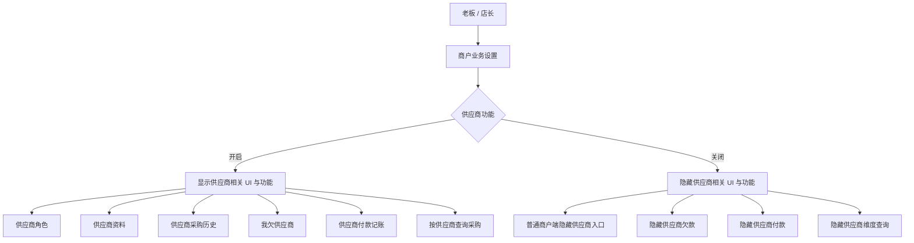

SYSTEM_ADMIN 即使在商户关闭供应商功能后，仍可查看历史供应商数据，用于排障、迁移、审计和恢复。

建议确认基线（对应待确认事项 P-19）：

1. 关闭后仍允许全额付款和无供应商的简单进货；
2. 关闭后不产生供应商应付，也不显示供应商付款、欠款和供应商维度查询；
3. 历史供应商数据不删除，普通商户 UI 隐藏；重新开启后恢复历史展示；
4. Legacy 导入始终保留供应商事实，关闭状态只影响商户侧展示和新命令入口；
5. 由 `SupplierFeaturePolicy` / Specification 同时约束 UI、Command 和查询范围，待确认后冻结。

---

# 2. OWNER：老板 / 店长

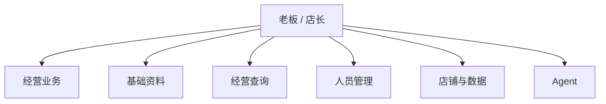

## 2.1 经营业务

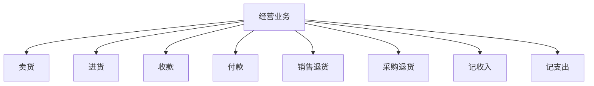

### 卖货

- 创建销售；
- 选择商品；
- 修改数量；
- 查看 / 修改成交价；
- 选择客户角色对象；
- 输入实收金额；
- 形成客户欠款；
- 选择记账收款账户；
- 备注；
- 完成；
- 查看结果；
- 更正 / 撤销。

### 进货

- 创建进货；
- 选择商品；
- 数量；
- 进价；
- 选择供应商（功能开启时）；
- 记录实付；
- 形成供应商欠款（功能开启时）；
- 选择记账付款账户；
- 备注；
- 完成；
- 更正 / 撤销。

### 客户收款

- 选择欠款客户；
- 查看当前欠款；
- 输入本次收款；
- 选择记账账户；
- 关联历史欠款；
- 确认；
- 更新剩余欠款；
- 撤销错误记录。

### 供应商付款

仅供应商功能开启时显示：

- 选择供应商；
- 查看当前欠款；
- 输入本次付款；
- 选择记账账户；
- 关联历史欠款；
- 确认；
- 更新剩余欠款；
- 撤销错误记录。

### 销售退货

- 从原销售发起；
- 选择商品和数量；
- 计算应退金额；
- 记录实际退款；
- 选择记账账户；
- 调整客户欠款；
- 商品回库；
- 确认；
- 查看结果。

### 采购退货

- 从原采购发起；
- 选择商品和数量；
- 计算应退金额；
- 记录实际退款；
- 调整供应商欠款；
- 减少库存；
- 确认；
- 查看结果。

### 记收入 / 支出

用于买卖之外的经营收支：

- 金额；
- 分类；
- 记账账户；
- 日期；
- 备注；
- 确认；
- 修改 / 撤销。

---

## 2.2 基础资料

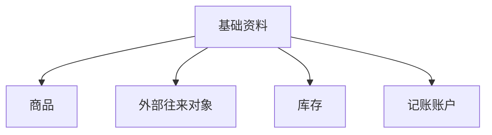

### 商品

- 查看 / 搜索；
- 新增 / 修改；
- 停用 / 恢复；
- 销售价；
- 参考进价；
- 单位；
- 分类；
- 条码 / 编码；
- 当前库存；
- 商品业务历史。

### 外部往来对象

- 查看 / 搜索；
- 新增 / 修改；
- CUSTOMER 角色；
- SUPPLIER 角色（功能开启时）；
- 同时具备两个角色；
- 欠款；
- 交易历史；
- 停用；
- 重复对象处理。

### 库存

- 当前库存；
- 搜索；
- 低库存；
- 手工增加 / 减少；
- 盘点；
- 盘盈 / 盘亏；
- 库存变化历史；
- 异常库存。

### 记账账户

- 查看；
- 新增 / 修改 / 停用；
- 账面余额；
- 默认收款账户；
- 默认付款账户；
- 账户间记账转账；
- 账户流水。

记账账户不代表系统真实控制银行卡、微信、支付宝资金。

---

## 2.3 经营查询

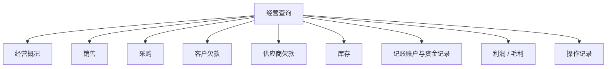

供应商功能关闭后，普通商户端隐藏供应商欠款和供应商维度查询。

---

## 2.4 人员管理

- 查看员工；
- 新增员工；
- 修改资料；
- 停用 / 恢复；
- 分配业务权限；
- 修改业务权限；
- 查看员工操作记录；
- 处理员工登录问题。

---

## 2.5 店铺与数据

- 店铺资料；
- 业务设置；
- 供应商功能开关；
- Legacy 数据导入；
- 数据导出；
- 备份 / 恢复；
- OWNER 账号安全。

---

## 2.6 Agent

- 业务问答；
- 经营查询；
- 创建业务草稿；
- 修改业务草稿；
- 确认执行；
- 取消；
- 结果解释；
- 历史会话。

Agent 必须使用 OWNER 当前商户配置和相同业务规则。

---

# 3. STAFF：员工 / 店员

STAFF 的产品模型：

```text
STAFF + OWNER 分配的权限
```

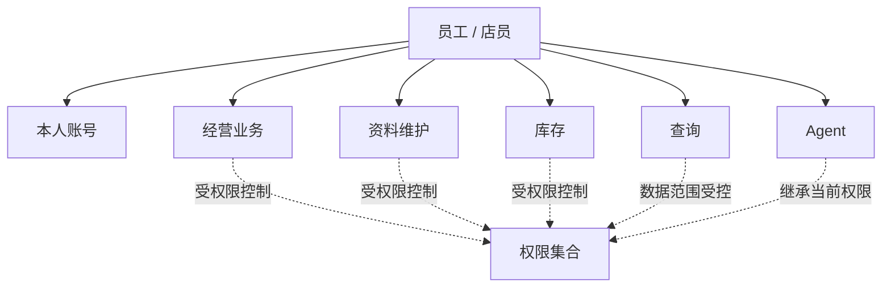

## 3.1 本人账号

- 登录 / 退出；
- 查看本人资料；
- 修改允许修改的本人资料；
- 修改密码；
- 查看本人操作记录。

STAFF 不能：

- 修改自己的角色；
- 给自己增加权限；
- 管理 OWNER；
- 开启 / 关闭商户供应商功能；
- 执行 Legacy 全量迁移；
- 修改系统级设置。

## 3.2 卖货

按授权可：

- 新建销售；
- 商品 / 数量；
- 默认售价；
- 修改成交价（可独立授权）；
- 客户；
- 实收；
- 记账账户；
- 确认；
- 查看结果；
- 撤销 / 更正（高风险权限）。

后续权限模型可视需要拆分：

```text
CREATE_SALE
CHANGE_SALE_PRICE
ALLOW_CREDIT_SALE
CHANGE_RECEIPT_ACCOUNT
VOID_SALE
```

具体权限码留到权限设计阶段确定。

## 3.3 进货

按授权可：

- 创建进货；
- 商品 / 数量 / 进价；
- 供应商（功能开启时）；
- 实付；
- 记账账户；
- 确认；
- 查看结果；
- 更正 / 撤销。

## 3.4 收款 / 付款

客户收款可单独区分：

- 查看客户欠款；
- 执行收款；
- 撤销收款。

供应商付款同时要求：

- 商户供应商功能开启；
- STAFF 拥有付款权限。

## 3.5 退货

- 销售退货；
- 采购退货；
- 查询原记录；
- 商品 / 数量；
- 退款记账；
- 欠款调整；
- 库存影响。

退货属于高风险业务，可考虑 STAFF 创建草稿、OWNER 批准高金额退货；是否启用此规则在三级业务流程阶段决定。

## 3.6 记收入 / 支出

可控制：

- 允许录入；
- 是否可查看本人记录；
- 是否可查看他人记录；
- 是否可查看全店汇总。

## 3.7 商品

权限应至少区分：

- 查看；
- 新增 / 维护；
- 修改销售价；
- 修改参考进价；
- 停用。

## 3.8 外部往来对象

- 搜索 / 查看；
- 新增 / 修改；
- CUSTOMER 角色；
- SUPPLIER 角色（功能开启时）；
- 客户欠款；
- 供应商欠款（功能开启时）；
- 交易历史。

## 3.9 库存

建议区分：

- 查看库存；
- 手工调整；
- 发起盘点；
- 确认盘盈 / 盘亏；
- 查看库存变化。

## 3.10 查询

默认建议：

| 数据 | STAFF 默认 |
|---|---|
| 本人业务记录 | 可见 |
| 商品 / 基础库存 | 可见或默认授权 |
| 全店销售汇总 | 按授权 |
| 全店采购汇总 | 按授权 |
| 客户欠款 | 按授权 |
| 供应商欠款 | 按授权 + 功能开关 |
| 记账账户余额 | 敏感，按授权 |
| 利润 | 高敏感，默认不可见 |

## 3.11 Agent

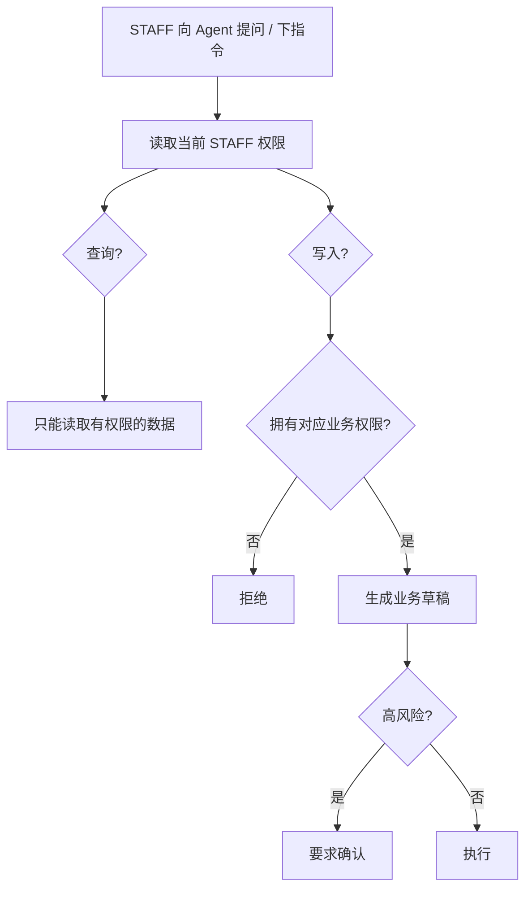

Agent 不能绕过 STAFF 权限，也不能绕过供应商功能开关。

---

# 4. SYSTEM_ADMIN：系统管理员

SYSTEM_ADMIN 的管理粒度：

> 全局 → 商户 → 账号 / 商品 / 往来对象 → 具体账单 / 库存记录 → 审计。

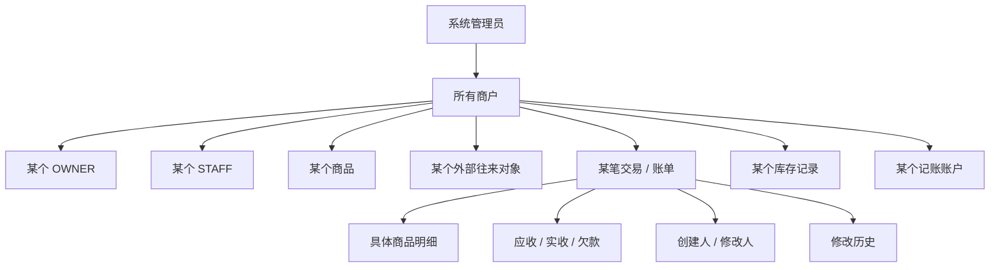

## 4.1 全局总览

- 商户数；
- OWNER 数；
- STAFF 数；
- 商品数；
- 交易 / 账单量；
- 销售量；
- 进货量；
- 退货量；
- 收支记录量；
- 异常记录；
- 最近活跃商户；
- 最近管理员操作。

总览必须可以下钻到具体记录。

## 4.2 商户管理

- 全部商户列表；
- 搜索 / 筛选；
- 某商户详情；
- OWNER；
- STAFF；
- 商品；
- 外部往来对象；
- 销售 / 采购 / 退货 / 收支；
- 库存；
- 功能开关；
- Agent 使用；
- 审计；
- 冻结 / 恢复 / 关闭商户。

## 4.3 OWNER 管理

系统管理员可以查看某个具体 OWNER：

- 账号资料；
- 所属商户；
- 状态；
- 登录历史；
- 创建 / 修改的业务记录；
- 商品维护；
- 员工管理；
- Agent 使用；
- 完整操作历史。

可执行：

- 启用 / 停用；
- 重置凭据；
- 强制退出；
- 修复异常账号关系；
- 查看其某笔具体业务记录。

## 4.4 STAFF 管理

可查看和管理：

- 账号资料；
- 所属商户；
- 权限；
- 状态；
- 登录历史；
- 销售；
- 进货；
- 收付款；
- 库存操作；
- 商品操作；
- Agent 操作；
- 审计。

## 4.5 商品管理

SYSTEM_ADMIN 可以：

```text
商户 → 某一个具体商品
```

并查看 / 管理：

- 商品资料；
- 售价 / 参考进价；
- 单位 / 分类 / 条码；
- 当前库存；
- 库存变化；
- 销售历史；
- 进货历史；
- 退货历史；
- 修改历史；
- 启用 / 停用；
- 有审计的资料纠正。

## 4.6 外部往来对象

- 跨商户搜索；
- 基础资料；
- CUSTOMER / SUPPLIER roles；
- 销售 / 采购历史；
- 客户欠款；
- 供应商欠款；
- 收款 / 付款记录；
- 修正资料 / role；
- 重复对象处理；
- 审计。

商户关闭供应商功能时，SYSTEM_ADMIN 仍可查看历史供应商数据。

## 4.7 交易 / 账单管理

系统管理员可全局管理：

- 销售账单；
- 进货账单；
- 客户收款记录；
- 供应商付款记录；
- 销售退货；
- 采购退货；
- 其他收入；
- 其他支出。

可按：

```text
商户
OWNER
STAFF
外部往来对象
商品
时间
金额
类型
状态
异常
```

筛选并定位到单笔记录。

## 4.8 单笔账单粒度

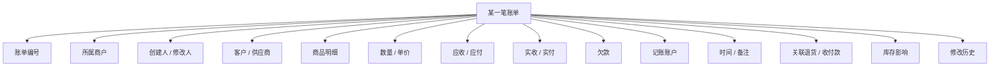

管理员动作：

- 查看；
- 纠正；
- 作废 / 撤销；
- 恢复可恢复记录；
- 查看关联记录；
- 查看完整变更历史。

所有纠错必须：

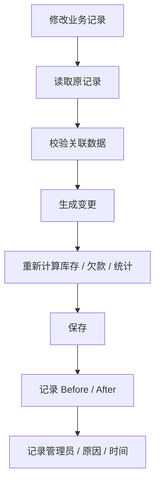

原则：

> 允许纠错，但不能无痕覆盖。

因为本系统是记账系统，管理员纠正金额只影响系统记录，不会向银行、微信或支付宝发起真实资金动作。

## 4.9 库存管理

- 按商户 / 商品查询；
- 当前库存；
- 库存变化历史；
- 来源账单；
- 异常库存；
- 人工调整；
- 错误库存修复；
- 盘点记录；
- 操作人。

必须支持：

```text
库存变化 → 商品 → 商户 → 来源账单 → 操作账号
```

的反查。

## 4.10 记账账户

系统管理员可以：

- 查看商户记账账户；
- 查看账面余额；
- 查看流水；
- 查看关联账单；
- 修正异常记账。

这些账户不是系统实际托管资金的钱包。

## 4.11 商户功能开关

SYSTEM_ADMIN 可以查看并在有审计的情况下修改具体商户功能开关，包括：

- 供应商功能；
- 未来新增的可选业务模块。

## 4.12 Agent 平台与使用管理


SYSTEM_ADMIN 可管理：

- Provider；
- 模型；
- 全局 Agent 开关；
- 商户 Agent 状态；
- 账号使用量；
- Run；
- Tool 调用；
- 错误；
- 使用量。

对话正文的隐私查看规则后续单独设计。

## 4.13 Legacy 导入

必须能下钻：

```text
商户
→ 导入任务
→ 数据类别
→ 某条 Legacy 记录
→ Transform
→ 新系统记录
```

并支持：

- 查看；
- 错误定位；
- 重试；
- 取消；
- 修复后重新导入；
- 完整审计。

## 4.14 审计

审计至少记录：

```text
operator
role
merchant
action
target_type
target_id
before
after
reason
time
result
```

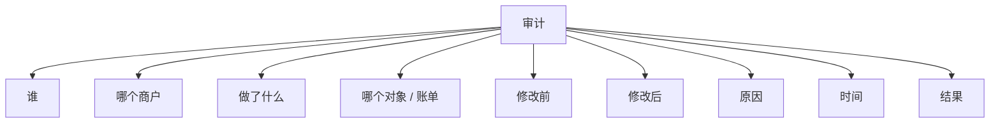

---

# 5. 三类角色的最终边界

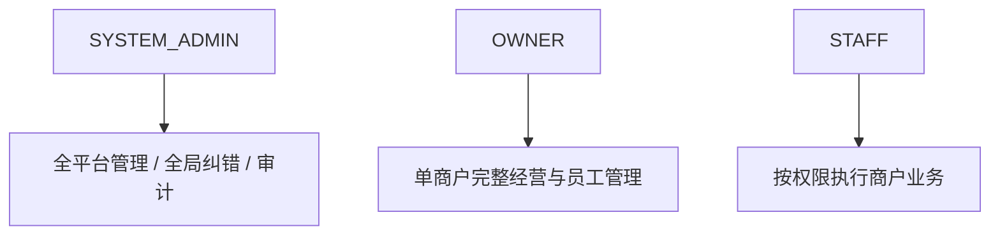

它们不是简单的同一层级权限递增：

- SYSTEM_ADMIN 管平台和全局数据；
- OWNER 管自己的商户；
- STAFF 在 OWNER 授权范围内执行业务。

后续三级业务流程设计必须同时考虑三类用户如何读取和操作同一业务记录。
