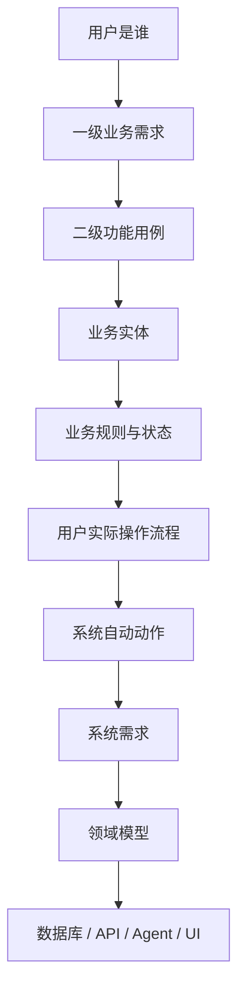
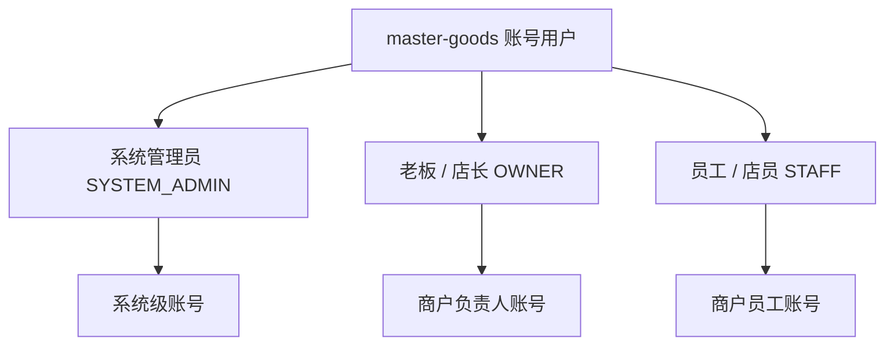
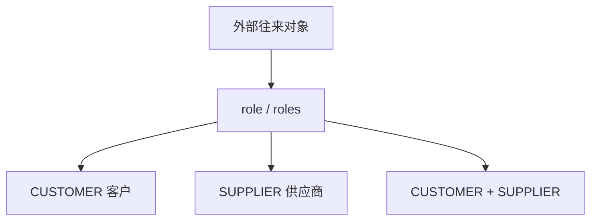
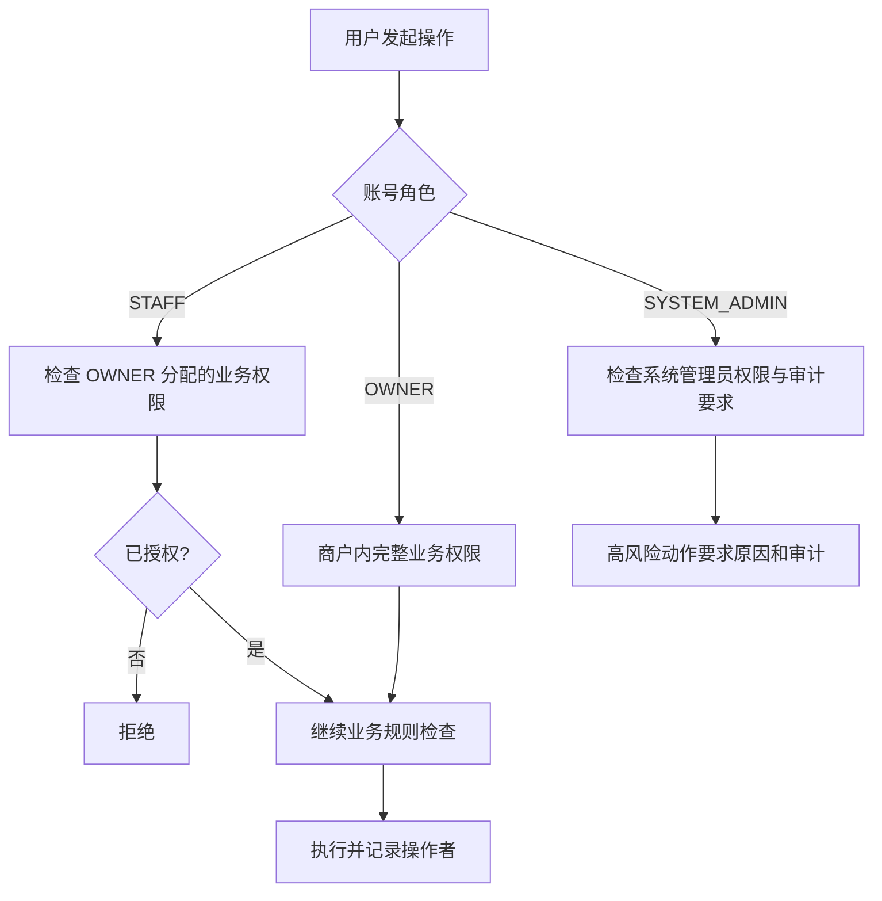
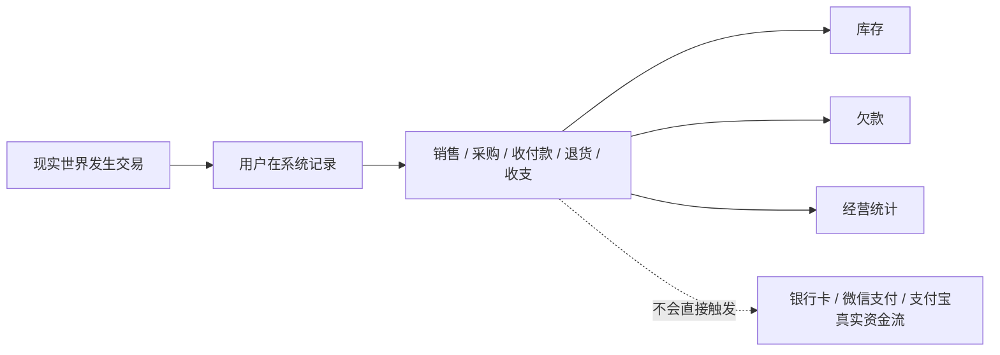
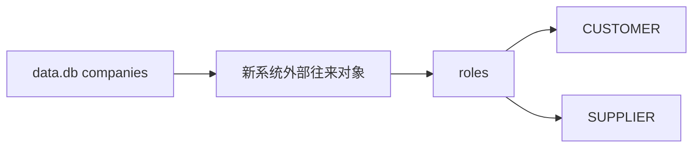
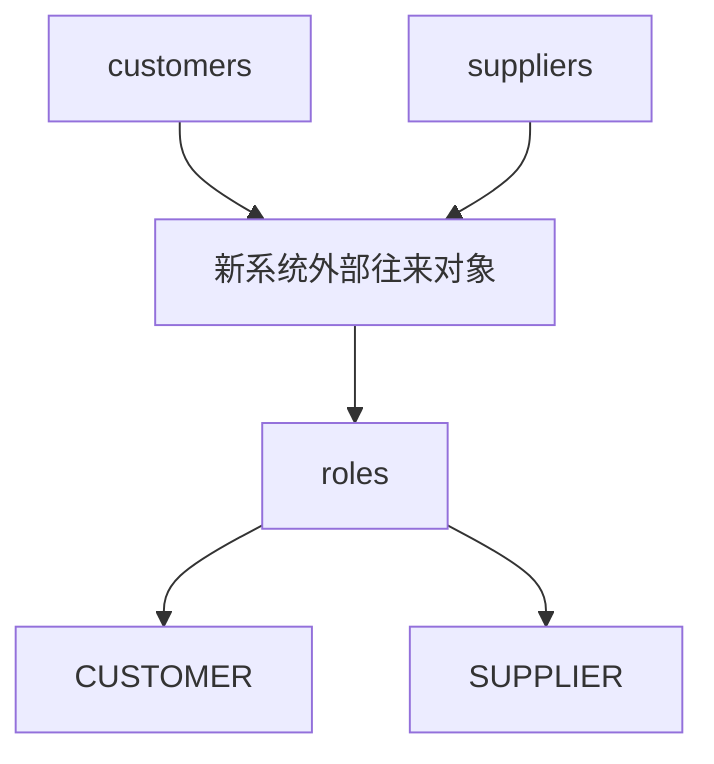
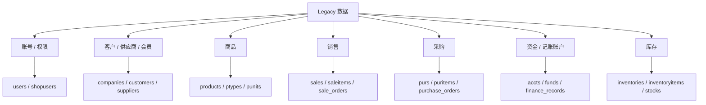
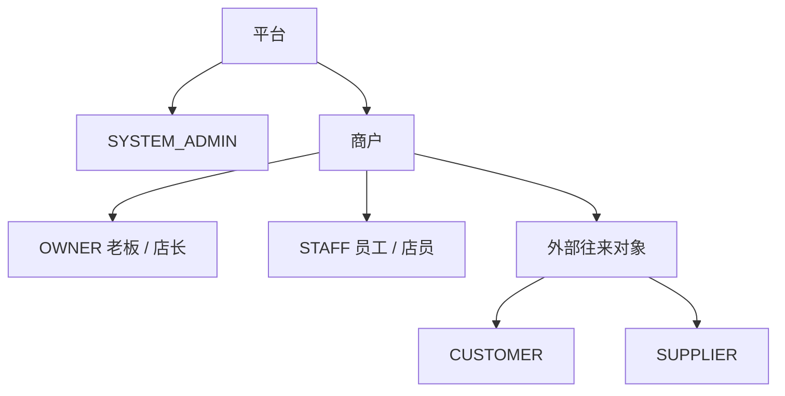

# master-goods vNext：角色与一级用例需求

> 状态：当前产品基线  
> 分支：`rewrite/business-v3`  
> 用途：供后续系统设计、领域建模、数据库设计、API 设计和 Agent 实现阅读。  
> 本文优先于此前讨论中已经被修正的旧角色表述。

## 1. 需求分析顺序



当前已经冻结角色体系和一级用例，二级用例见：
`docs/rewrite/二级功能用例需求.md`。

---

# 2. 系统账号角色

系统只存在三类账号角色：

```text
SYSTEM_ADMIN
OWNER
STAFF
```



## 2.1 SYSTEM_ADMIN

系统管理员属于平台 / 系统侧。

一级职责：

- 管理全部商户；
- 管理全部 OWNER 和 STAFF 账号；
- 管理系统配置；
- 管理 Agent 平台能力；
- 查看和管理全局业务数据；
- 对具体业务记录执行有审计的纠错；
- 管理 Legacy 导入任务；
- 查看完整审计和系统运行状态。

SYSTEM_ADMIN 不是某个商户的店长，但具有跨商户全局管理权限。

## 2.2 OWNER

老板与店长在本系统中是同一个角色：

```text
OWNER = 老板 / 店长
```

OWNER 是一个商户的经营负责人，拥有该商户最高业务权限。

一级职责：

- 卖货；
- 进货；
- 收款 / 付款记账；
- 销售 / 采购退货；
- 记收入 / 支出；
- 商品、库存、外部往来对象和记账账户管理；
- 经营查询；
- 员工和员工权限管理；
- 店铺设置；
- Legacy 数据导入；
- Agent 使用与确认。

## 2.3 STAFF

员工 / 店员是商户内部的执行角色。

STAFF 不继续细分为大量固定岗位，而采用：

```text
STAFF
+
业务权限集合
```

例如同样是 STAFF：

- 员工 A：卖货 + 查库存；
- 员工 B：卖货 + 进货 + 退货 + 库存调整。

STAFF 的可见数据和可执行操作必须由 OWNER 分配权限。

---

# 3. 外部往来对象

客户和供应商都不是系统账号。

它们属于同一个“外部往来对象”的业务角色。



当前冻结：

- 客户不登录系统；
- 供应商不登录系统；
- 同一个真实对象可以同时是客户和供应商；
- UI 可以使用“客户”“供应商”两个用户易懂入口；
- 最终数据库如何表达 roles 在领域模型阶段决定。

---

# 4. 三类账号用户一级用例总图

```mermaid
flowchart TD
    SA[系统管理员]
    OWNER[老板 / 店长]
    STAFF[员工 / 店员]

    subgraph PLATFORM[系统管理员一级用例]
        P1[全局商户与账号管理]
        P2[全局业务数据管理]
        P3[系统配置]
        P4[Agent 平台管理]
        P5[数据迁移]
        P6[系统运行与审计]
    end

    subgraph BUSINESS[商户经营一级用例]
        B1[卖货]
        B2[进货]
        B3[收款 / 付款]
        B4[退货]
        B5[记收入 / 支出]
        B6[商品]
        B7[库存]
        B8[外部往来对象]
        B9[记账账户]
        B10[经营查询]
        B11[Agent]
    end

    subgraph STORE[OWNER 商户管理一级用例]
        S1[员工管理]
        S2[员工权限]
        S3[店铺设置]
        S4[Legacy 数据导入]
        S5[数据导出 / 备份]
    end

    SA --> P1
    SA --> P2
    SA --> P3
    SA --> P4
    SA --> P5
    SA --> P6

    OWNER --> B1
    OWNER --> B2
    OWNER --> B3
    OWNER --> B4
    OWNER --> B5
    OWNER --> B6
    OWNER --> B7
    OWNER --> B8
    OWNER --> B9
    OWNER --> B10
    OWNER --> B11
    OWNER --> S1
    OWNER --> S2
    OWNER --> S3
    OWNER --> S4
    OWNER --> S5

    STAFF --> B1
    STAFF --> B2
    STAFF --> B3
    STAFF --> B4
    STAFF --> B5
    STAFF --> B6
    STAFF --> B7
    STAFF --> B8
    STAFF --> B9
    STAFF --> B10
    STAFF --> B11
```



STAFF 连到经营用例表示“可以被授权”，不是默认拥有全部能力。

---

# 5. 权限基本原则



原则：

- “能查看”与“能修改”分开；
- Agent 必须继承当前用户权限；
- SYSTEM_ADMIN 的业务纠错必须写入审计；
- STAFF 不能给自己提升权限；
- OWNER 管理本商户 STAFF；
- SYSTEM_ADMIN 管理全平台。

---

# 6. 系统的交易性质

master-goods 是经营记录 / 记账系统，不是支付清算系统。



因此：

- “微信账户”是记账账户；
- “收款”是记录已经发生的收款事实；
- “付款”是记录已经发生的付款事实；
- 系统不直接发起银行卡扣款、微信支付、支付宝支付或真实退款。

---

# 7. Legacy 数据兼容角色映射

Legacy 数据兼容原则：

> 兼容旧数据，不继承旧架构。

## 7.1 data.db

关键账号 / 角色表：

- `users`
- `shopusers`
- `company_shopusers`

当前样本 `users` 只有两条明确账号：

- 老板：`is_mgr=1`
- 营业员：`is_mgr=0`

迁移时需要映射到新的：

```text
OWNER
STAFF
```

不能继续沿用旧角色结构。

旧 `companies` 更接近新系统的“外部往来对象”。

当前样本：

- `companies.tye=1`：客户；
- `companies.tye=2`：供应商。



## 7.2 zhihuiji.db

该库没有登录账号表，主要包含：

- `customers`
- `suppliers`
- `products`
- `sale_orders`
- `sale_order_items`
- `purchase_orders`
- `pay_orders`
- `finance_records`

迁移时：



如果同一个真实对象同时存在于 customers 和 suppliers，后续 Transform 阶段处理识别与合并。

---

# 8. Legacy 主要业务领域



实际迁移范围以后按数据价值分类为：

```text
MUST_MIGRATE
SHOULD_MIGRATE
OPTIONAL
IGNORE
```

---

# 9. 当前冻结结论

## 账号用户

```text
SYSTEM_ADMIN
OWNER
STAFF
```

## 外部业务角色

```text
CUSTOMER
SUPPLIER
```

## 关键模型关系



后续系统设计必须基于这一角色模型，不再使用已经废弃的“L1/L2/L3 管理员/店长混合角色”定义。
