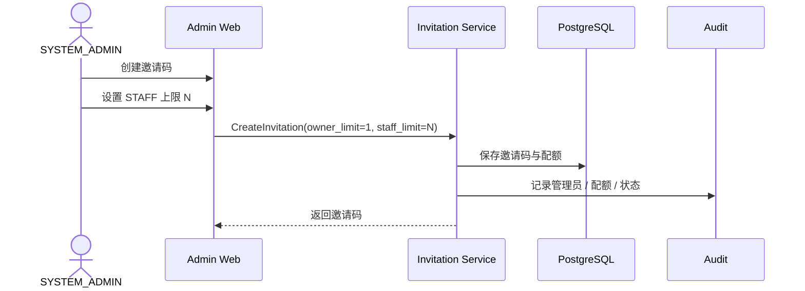
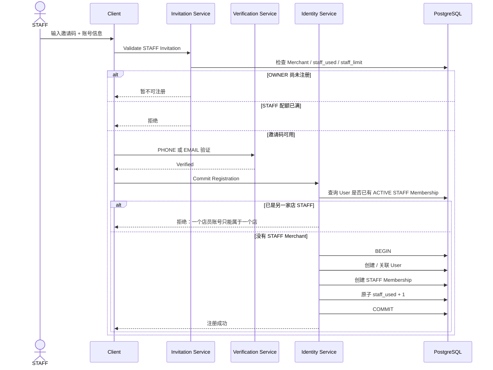

# 01.1 — 注册与邀请码详细设计

# 1. 邀请码规则

```text
OWNER = 店长
一个邀请码 OWNER 上限固定 = 1
STAFF = 店员
STAFF 上限 = N，由 SYSTEM_ADMIN 设置
一个 STAFF 账号只能对应一个 Merchant
```

STAFF 必须等 OWNER 完成注册并绑定 Merchant 后才能注册。

# 2. SYSTEM_ADMIN 创建邀请码



# 3. OWNER 注册

OWNER 使用手机号或邮箱中的任一种完成验证后创建 Merchant 和 OWNER Membership。

# 4. STAFF 注册



# 5. 已有 User 再使用 STAFF 邀请码

如果现有 User 已经存在 STAFF Membership：

```text
不允许再加入第二 Merchant 成为 STAFF
```

如果现有 User 没有 STAFF Membership，则仍需先验证现有账号所有权，再建立 STAFF Membership。

# 6. 配额并发算法

使用条件更新或事务锁保证 `staff_used < staff_limit` 才消耗配额。

同时 STAFF 单店规则与配额消耗必须在同一个事务一致性边界内完成，避免：

```text
配额已经 +1
但 Membership 因单店约束失败
```

# 7. 边界条件

- STAFF 上限调低后不回收已有 STAFF；
- 邀请码停用不影响已注册账号；
- 一个 STAFF User 不允许第二个 ACTIVE STAFF Membership；
- Merchant 关闭后该邀请码不能新增注册；
- 邀请码失败尝试进入限流与 Risk Engine；
- 注册请求支持 Idempotency Key；
- STAFF 从原 Merchant 正式退出 / 归档后，未来是否允许加入另一家店，留到 STAFF 生命周期专题决定。
