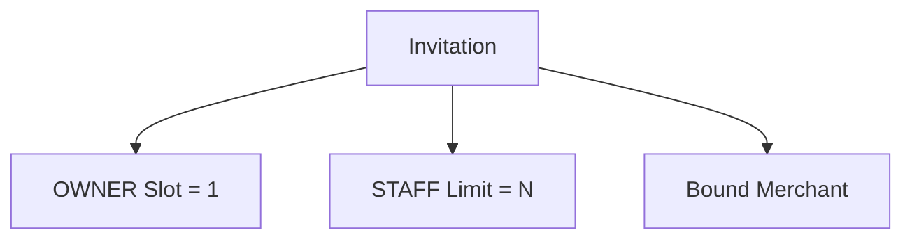
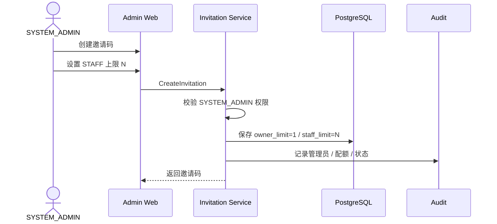
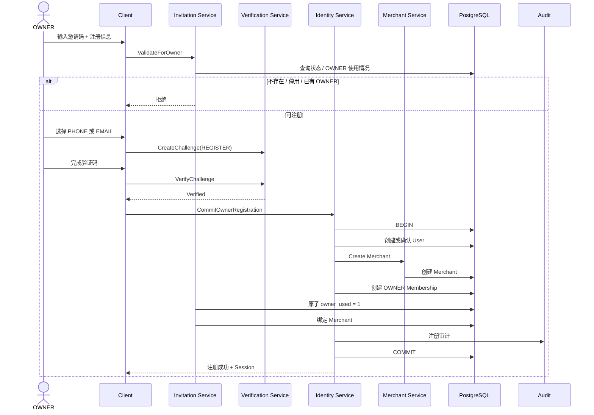
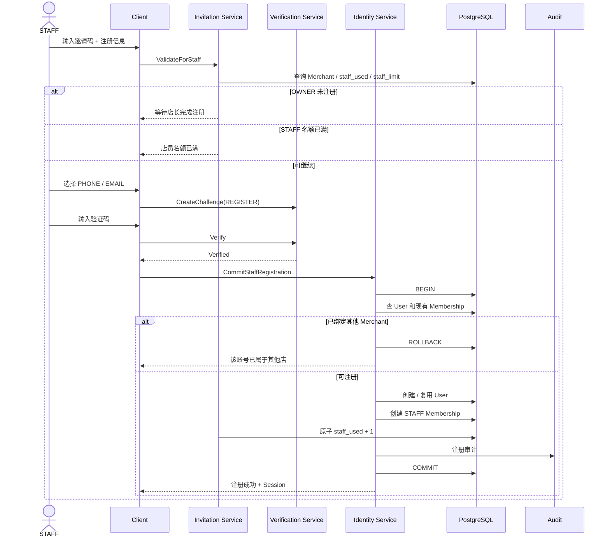
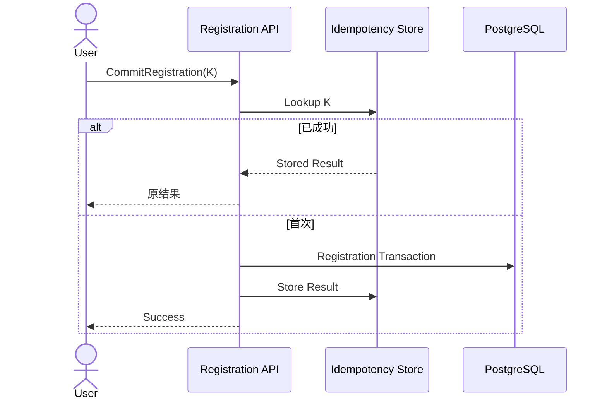

# 01.1 — 注册与邀请码详细设计

> 状态：核心规则已冻结。  
> 邀请码不是普通验证码，而是 Merchant 注册凭证、角色名额和 Merchant 归属的组合。

---

# 1. 角色配额

```text
OWNER = 店长
OWNER 上限固定 1

STAFF = 店员
STAFF 上限 N
N 由 SYSTEM_ADMIN 设置
```

一个邀请码最终绑定一个 Merchant。



---

# 2. SYSTEM_ADMIN 创建邀请码



SYSTEM_ADMIN 可查看、停用、恢复、调整 STAFF 上限、查看已使用人数、Merchant 和注册审计。

OWNER 上限当前固定 1，不设计管理员调高。

---

# 3. OWNER 注册

OWNER 注册成功时必须一起完成：

```text
User
Merchant
OWNER Membership
Invitation OWNER Usage
Invitation -> Merchant Binding
```



配额只在最终事务中消耗，避免“验证码进行到一半却占掉名额”。

---

# 4. STAFF 注册条件

```text
Invitation 可用
AND OWNER 已注册
AND Merchant 已绑定
AND staff_used < staff_limit
AND User 尚未属于其他 Merchant
AND PHONE / EMAIL 验证完成
```

STAFF 账号只能对应一个 Merchant。

---

# 5. STAFF 注册时序



---

# 6. 已有 User

如果 PHONE / EMAIL 已存在，不能仅凭邀请码把账号挂到 Merchant。

如果 User 已有 OWNER / STAFF Merchant Membership：

```text
当前产品不支持第二 Merchant
→ 拒绝
```

如果是未完成注册留下的无 Merchant User，则必须先证明账号所有权再继续。

---

# 7. 配额并发

错误：

```text
A SELECT 9
B SELECT 9
A +1
B +1
=> 11
```

正确方向：

```text
UPDATE invitation
SET staff_used = staff_used + 1
WHERE id = :id
  AND status = 'ACTIVE_BOUND'
  AND staff_used < staff_limit
RETURNING staff_used;
```

或者在事务中行锁。

Membership 创建和配额消耗同一事务。

---

# 8. Idempotency

注册 Command 要带 Idempotency Key。



避免重复 User、Membership、配额消耗。

---

# 9. Invitation 状态

建议：

```text
ACTIVE_UNBOUND
ACTIVE_BOUND
EXHAUSTED
DISABLED
EXPIRED（若启用）
```

```stateDiagram-v2
    [*] --> ACTIVE_UNBOUND
    ACTIVE_UNBOUND --> ACTIVE_BOUND: OWNER 注册
    ACTIVE_BOUND --> EXHAUSTED: STAFF 配额用完
    ACTIVE_UNBOUND --> DISABLED
    ACTIVE_BOUND --> DISABLED
    EXHAUSTED --> DISABLED
```

ACTIVE_BOUND 仍可注册 STAFF。

---

# 10. STAFF 上限降低

例：

```text
staff_used = 8
limit 10 -> 5
```

已有 8 个 STAFF：

- 不删除；
- 不停用；
- 新增拒绝；

直到 used 小于新的 limit。

---

# 11. 注册风险

进入 Risk Engine：

- 高频猜邀请码；
- 同邀请码大量失败；
- 名额满仍不停提交；
- 同 Device 批量注册；
- 同 Identifier 轮换邀请码；
- 试图绕过单 Merchant。

---

# 12. 审计

至少记录：

```text
invitation_id
merchant_id
user_id
role
verification_method
result
failure_reason_code
created_at
```

---

# 13. 已冻结规则

1. 邀请码由 SYSTEM_ADMIN 创建；
2. OWNER 固定 1；
3. STAFF 上限可配置；
4. OWNER 先注册；
5. OWNER 注册创建 Merchant；
6. STAFF 后注册；
7. OWNER / STAFF 只能一个 Merchant；
8. PHONE / EMAIL 可注册验证；
9. 配额原子消耗；
10. 注册提交幂等；
11. 降低 STAFF 上限不回收账号；
12. 停用邀请码不删除已注册账号。
