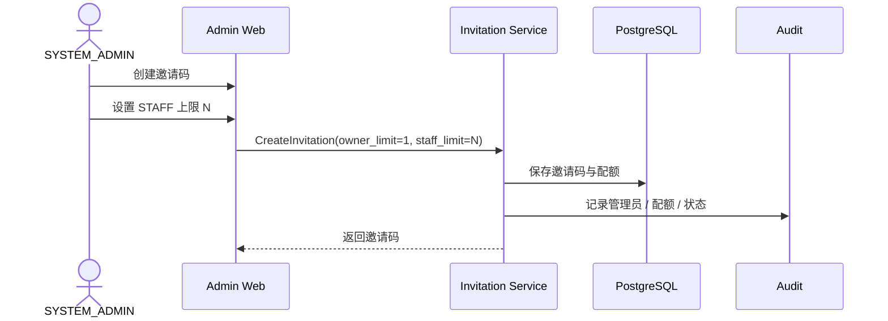
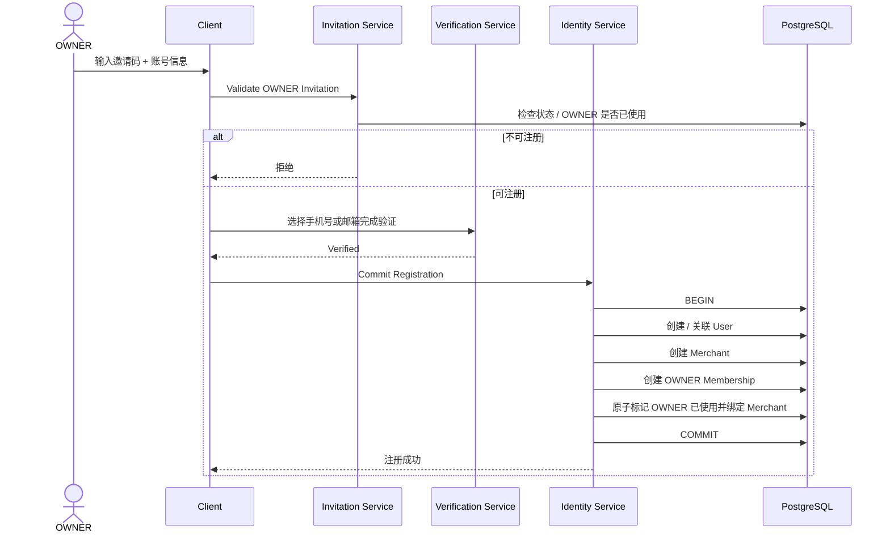
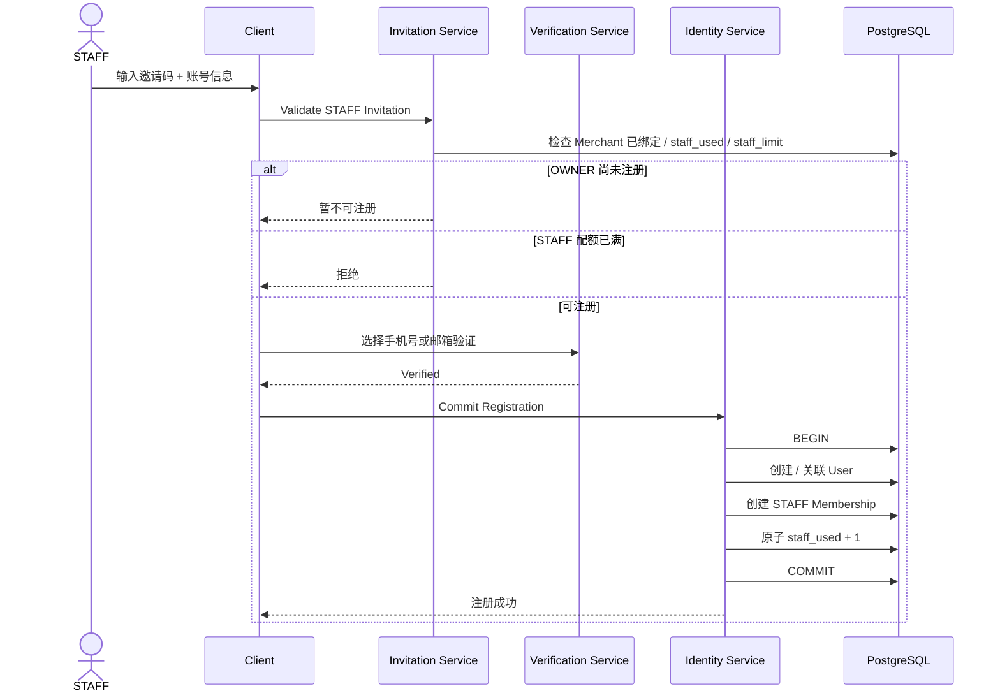

# 01.1 — 注册与邀请码详细设计

# 1. 邀请码规则

```text
OWNER = 店长
一个邀请码 OWNER 上限固定 = 1
STAFF = 店员
STAFF 上限 = N，由 SYSTEM_ADMIN 设置
```

STAFF 必须等 OWNER 完成注册并绑定 Merchant 后才能注册。

# 2. SYSTEM_ADMIN 创建邀请码



SYSTEM_ADMIN 可：

- 创建 / 停用 / 恢复；
- 调整 STAFF 上限；
- 查看已使用数量；
- 查看绑定 Merchant；
- 查看注册记录和审计。

# 3. OWNER 注册



配额只在最终注册事务成功时消耗。

# 4. STAFF 注册



# 5. 已有 User 再使用邀请码

底层支持一个 User 多 Merchant。

若手机号 / 邮箱已经属于现有 User：

```text
邀请码本身不足以证明账号所有权
```

必须先登录现有账号或使用已验证渠道证明身份，再创建新 Membership。

# 6. 配额并发算法

实现阶段优先采用原子条件更新，例如：

```text
UPDATE invitation
SET staff_used = staff_used + 1
WHERE id = ?
  AND status = ACTIVE
  AND staff_used < staff_limit
RETURNING ...
```

只有成功返回才继续提交 Membership。

# 7. 边界条件

- STAFF 上限调低后不回收已有 STAFF，只禁止继续新增；
- 邀请码停用不影响已注册 User；
- 同一 `user_id + merchant_id` 不允许重复有效 Membership；
- 已是该 Merchant OWNER 的 User 不新增 STAFF Membership；
- Merchant 关闭后该邀请码不能新增注册；
- 邀请码错误尝试需要纳入安全限流与风险事件；
- 注册请求需支持 Idempotency Key，避免移动网络重试重复创建账号。
