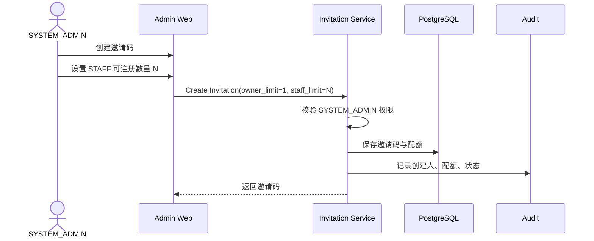
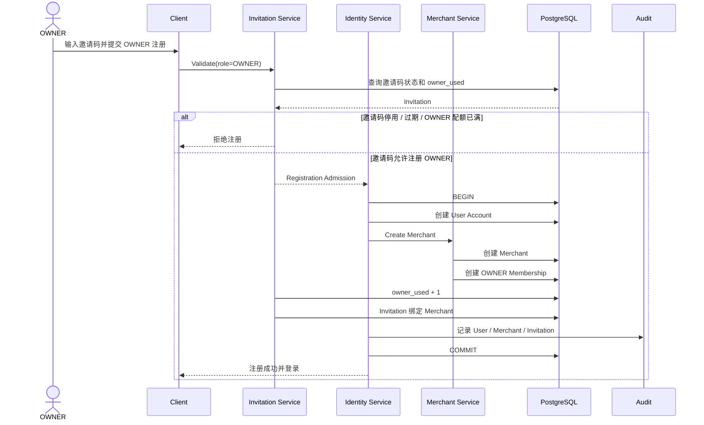
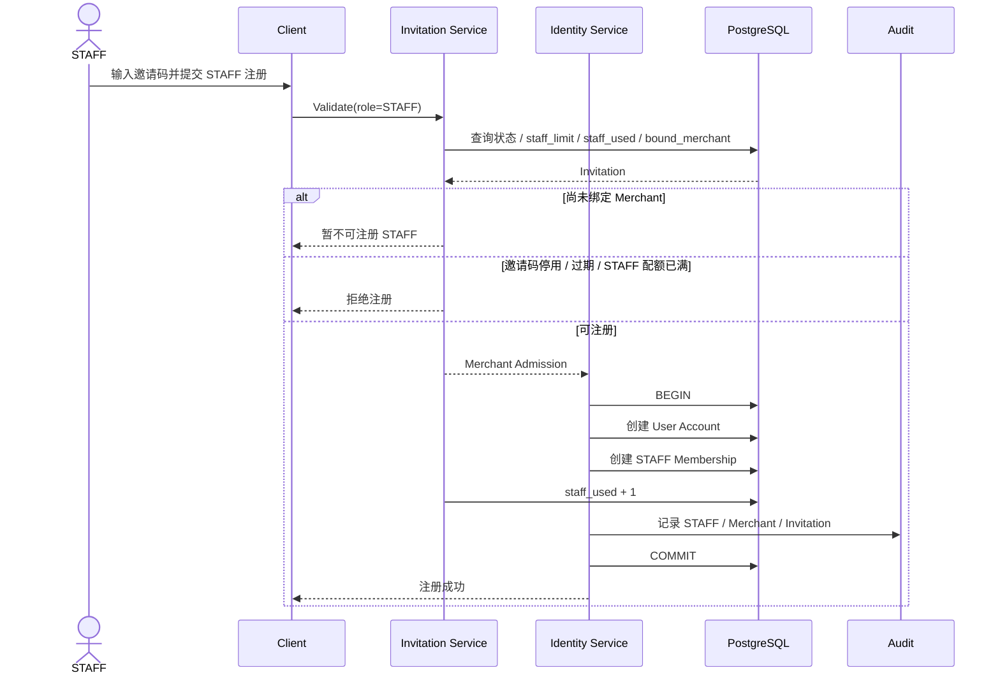
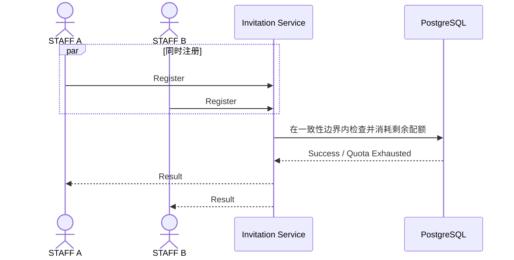
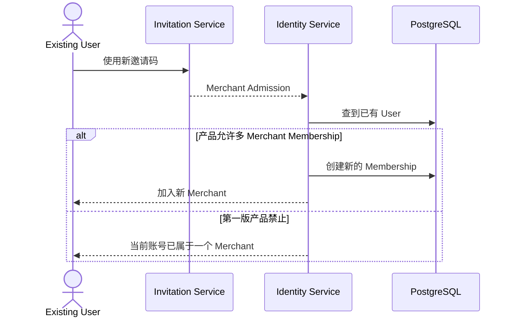

# 01.1 — 注册与邀请码详细设计

> 只讨论账号如何进入系统、邀请码与 Merchant 如何建立关系。  
> 不讨论验证码实现、密码复杂度、Token 格式和 UI 细节。

# 1. 注册原则

注册不开放自由注册。

```text
OWNER 注册
→ 必须有 SYSTEM_ADMIN 邀请码

STAFF 注册
→ 必须有 SYSTEM_ADMIN 邀请码
```

SYSTEM_ADMIN 不使用商户邀请码注册。

# 2. 邀请码业务含义

当前一个邀请码对应一个 Merchant 注册单元。

```text
OWNER 注册上限：1
STAFF 注册上限：N，由 SYSTEM_ADMIN 配置
OWNER 已使用数量
STAFF 已使用数量
状态
绑定 Merchant
有效期（如启用）
```

邀请码不是简单一次性字符串，而是**带角色配额的 Merchant 注册凭证**。

# 3. SYSTEM_ADMIN 创建邀请码



管理员可后续：

- 查看邀请码；
- 停用 / 恢复；
- 调整 STAFF 剩余配额；
- 查看 OWNER / STAFF 已使用数量；
- 查看绑定 Merchant；
- 查看注册记录。

# 4. OWNER 首次注册

第一个 OWNER 使用邀请码时创建 Merchant，并把邀请码绑定到该 Merchant。



一致性要求：

```text
User
Merchant
OWNER Membership
Invitation Usage
```

必须一起成功或一起失败。

# 5. STAFF 注册

OWNER 首次注册完成后，同一邀请码才可以用于 STAFF。



STAFF 不需要自己选择 Merchant。

# 6. 并发注册

同一个邀请码可能同时有多人注册。

业务规则必须保证配额不能因为并发注册被超卖。



# 7. 已有账号再次使用邀请码

建议系统底层支持：

```text
已有 User
+
新 Invitation
→ 验证是本人
→ 创建新的 Merchant Membership
```

而不是复制第二个 User。



当前建议：数据模型允许，多商户产品能力第一版可以不开放。

# 8. 待确认决策

1. 是否允许 SYSTEM_ADMIN 把 `owner_limit` 从 1 调高；
2. 是否允许一个 User 加入多个 Merchant；
3. 邀请码是否一定有有效期；
4. 已注册但 Merchant 后续关闭时，邀请码如何处理；
5. 是否允许管理员手工迁移邀请码绑定的 Merchant。
