# 01.1 — 注册与邀请码

> 来源：ChatGPT 分享对话（第 30 ~ 41 轮）完整提取与整理
> 对应对话中最终形成的文档：`master-goods-system-design-v3/01-账户与身份/01-注册与邀请码.md`
> 子模块详细设计。保留对话中全部时序图、规则与边界。

---

# 1. 设计目标

回答：

```text
OWNER 怎样进入系统？
STAFF 怎样进入系统？
邀请码如何限制一个店的 OWNER / STAFF？
已有账号再次使用邀请码怎么办？
注册的事务一致性边界在哪里？
```

核心规则（已冻结）：

```text
SYSTEM_ADMIN 创建 MerchantInvitation，OWNER 使用未绑定的邀请码注册并创建 Merchant；
STAFF 使用 OWNER 所属 MerchantInvitation 注册，后端只在 STAFF 完成注册时创建 User 和 Membership。
```

一个邀请码包含两个配额：

```text
OWNER 可注册数量：当前主规则 = 1
STAFF 可注册数量：N，由 SYSTEM_ADMIN 配置
```

> 来源：对话第 32、35、36 轮

---

# 2. 邀请码是 Merchant 建立关系的凭证

对话第 35 轮明确：

> 邀请码不是注册验证码，而是 Merchant 建立关系的凭证。

邀请码实际上承担三个作用：

```text
注册资格
+
角色配额
+
Merchant 归属
```

邀请码生命周期：

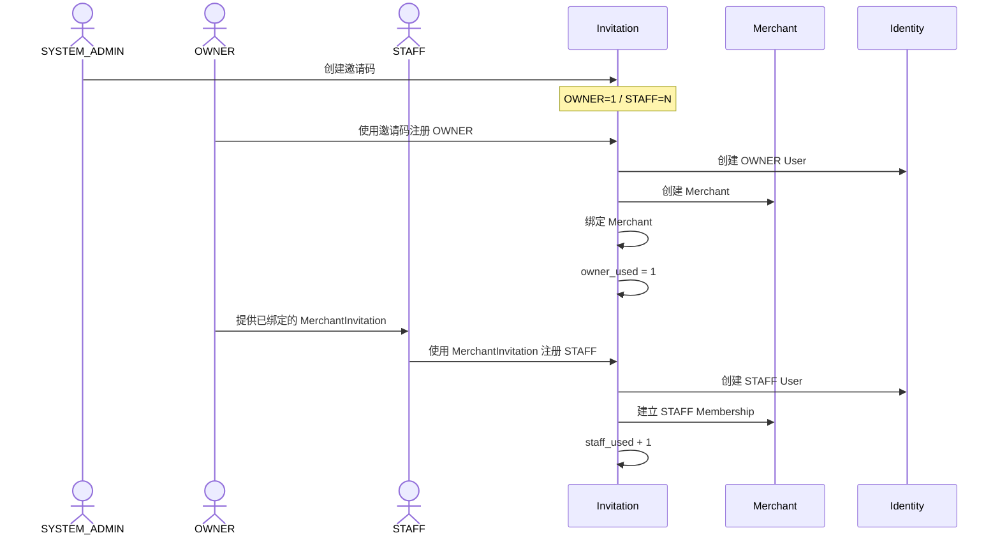

**图示说明（2. 邀请码是 Merchant 建立关系的凭证）：** 这是服务调用时序图，参与者包括 SYSTEM_ADMIN、OWNER、STAFF、Invitation。箭头表示一次调用或返回，alt/else 分支表示 Decision 的不同结果；事务提交前只做校验和状态准备，短信、邮件等外部副作用应在提交后通过 Outbox 执行。

> 来源：对话第 35 轮

---

# 3. SYSTEM_ADMIN 创建邀请码

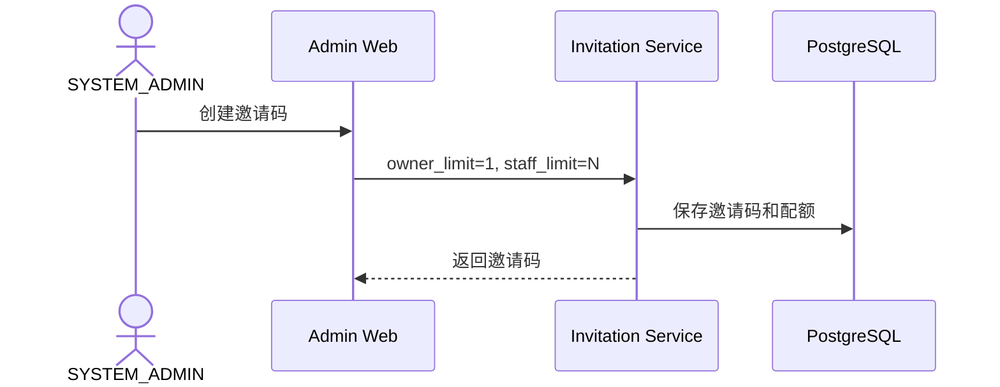

**图示说明（3. SYSTEM_ADMIN 创建邀请码）：** 这是服务调用时序图，参与者包括 SYSTEM_ADMIN、Admin Web、Invitation Service、PostgreSQL。箭头表示一次调用或返回，alt/else 分支表示 Decision 的不同结果；事务提交前只做校验和状态准备，短信、邮件等外部副作用应在提交后通过 Outbox 执行。

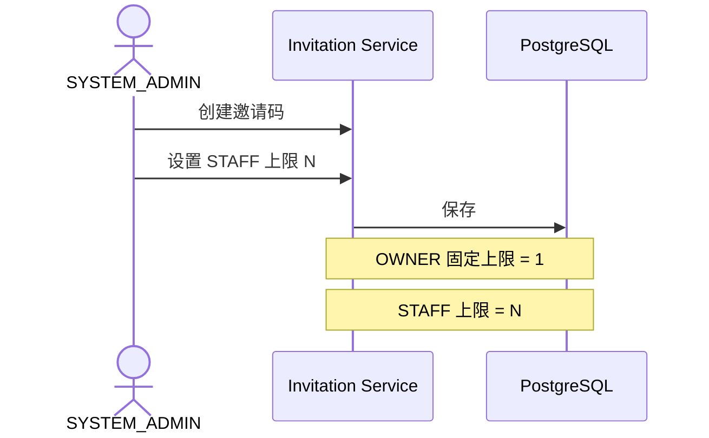

**图示说明（3. SYSTEM_ADMIN 创建邀请码）：** 这是服务调用时序图，参与者包括 SYSTEM_ADMIN、Invitation Service、PostgreSQL。箭头表示一次调用或返回，alt/else 分支表示 Decision 的不同结果；事务提交前只做校验和状态准备，短信、邮件等外部副作用应在提交后通过 Outbox 执行。

SYSTEM_ADMIN 可以看到的管理粒度：

```text
邀请码 ABC123

OWNER：
1 / 1

STAFF：
6 / 20

绑定商户：
XX商店
```

> 来源：对话第 32、36 轮

---

# 4. OWNER 先注册并创建 Merchant

当前基线：

```text
邀请码
→ OWNER 先注册
→ 创建 Merchant
→ 邀请码绑定 Merchant
→ STAFF 再使用同一邀请码加入
```

主流程时序：

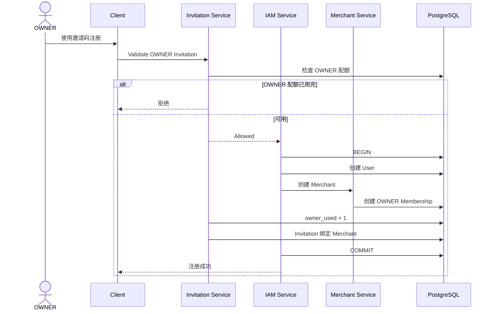

**图示说明（4. OWNER 先注册并创建 Merchant）：** 这是服务调用时序图，参与者包括 OWNER、Client、Invitation Service、IAM Service。箭头表示一次调用或返回，alt/else 分支表示 Decision 的不同结果；事务提交前只做校验和状态准备，短信、邮件等外部副作用应在提交后通过 Outbox 执行。

带 Audit 的版本（第 30、31 轮）：

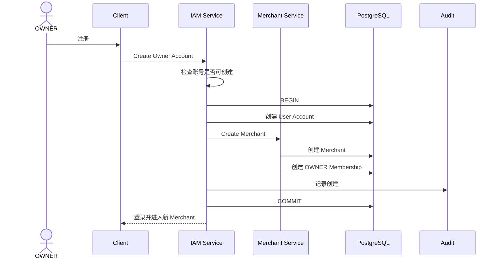

**图示说明（4. OWNER 先注册并创建 Merchant）：** 这是服务调用时序图，参与者包括 OWNER、Client、IAM Service、Merchant Service。箭头表示一次调用或返回，alt/else 分支表示 Decision 的不同结果；事务提交前只做校验和状态准备，短信、邮件等外部副作用应在提交后通过 Outbox 执行。

系统原则：

```text
OWNER 注册
=
User + Merchant + OWNER Membership
```

三个必须一次事务成功。不能出现：

```text
有账号
但是没有 Merchant
```

这种脏状态。

**拒绝分支**（第 36 轮细化）：

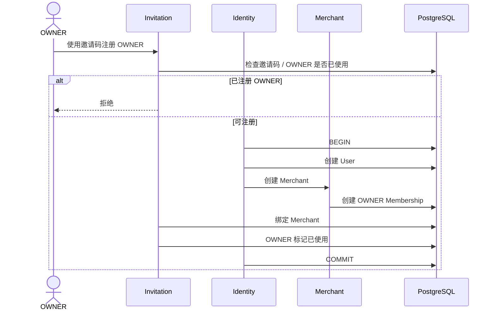

**图示说明（4. OWNER 先注册并创建 Merchant）：** 这是服务调用时序图，参与者包括 OWNER、Invitation、Identity、Merchant。箭头表示一次调用或返回，alt/else 分支表示 Decision 的不同结果；事务提交前只做校验和状态准备，短信、邮件等外部副作用应在提交后通过 Outbox 执行。

> 来源：对话第 30、31、32、36 轮

---

# 5. STAFF 后注册

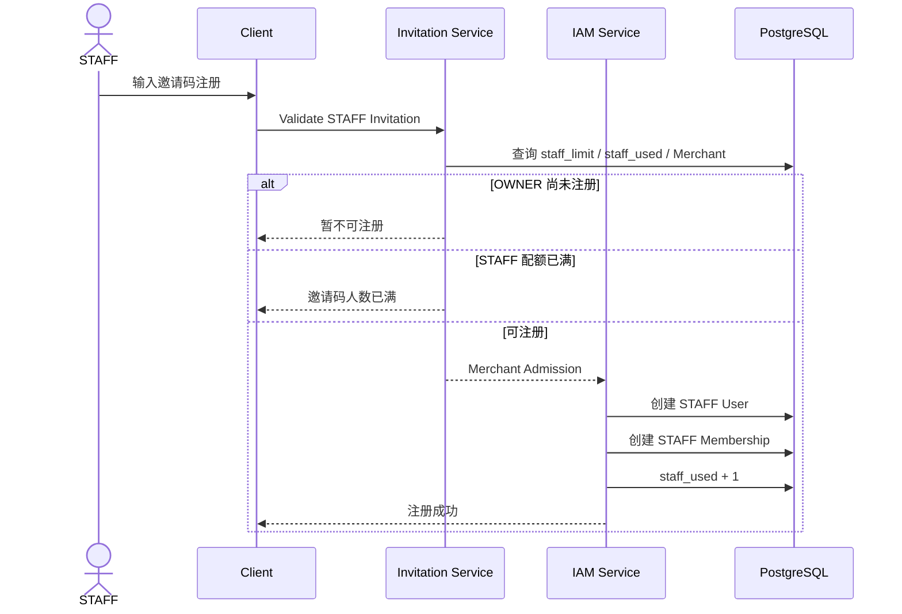

**图示说明（5. STAFF 后注册）：** 这是服务调用时序图，参与者包括 STAFF、Client、Invitation Service、IAM Service。箭头表示一次调用或返回，alt/else 分支表示 Decision 的不同结果；事务提交前只做校验和状态准备，短信、邮件等外部副作用应在提交后通过 Outbox 执行。

第 36 轮版本（决定：创建或关联 User）：

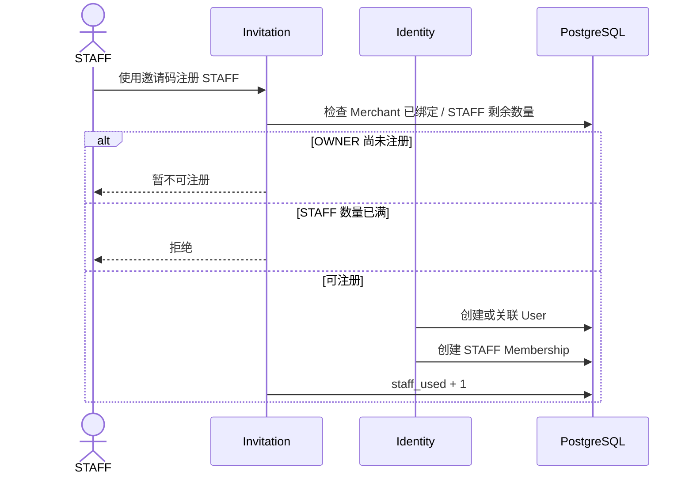

**图示说明（5. STAFF 后注册）：** 这是服务调用时序图，参与者包括 STAFF、Invitation、Identity、PostgreSQL。箭头表示一次调用或返回，alt/else 分支表示 Decision 的不同结果；事务提交前只做校验和状态准备，短信、邮件等外部副作用应在提交后通过 Outbox 执行。

关键约束：

- STAFF 必须等 OWNER 建店后才能注册（已冻结）；
- OWNER 不直接创建 STAFF User；OWNER 只负责提供已绑定的 MerchantInvitation，及注册后的员工管理、权限、停用和密码重置；
- STAFF 自己使用 MerchantInvitation 完成注册，注册事务内创建 User、STAFF Membership 并消耗配额。

> 来源：对话第 32、36 轮

---

# 6. 注册的事务一致性

"STAFF 单店判断"和"邀请码配额消耗"必须处在一个事务一致性边界，不能出现：

```text
STAFF 注册失败
但 staff_used 已经 +1
```

STAFF 注册最终判定（第 39 轮）：

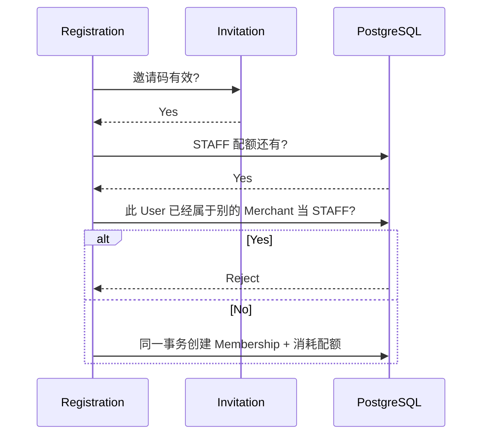

**图示说明（6. 注册的事务一致性）：** 这是服务调用时序图，参与者包括 Registration、Invitation、PostgreSQL。箭头表示一次调用或返回，alt/else 分支表示 Decision 的不同结果；事务提交前只做校验和状态准备，短信、邮件等外部副作用应在提交后通过 Outbox 执行。

配额消耗使用原子条件更新（禁止先 SELECT 再 UPDATE，防止并发超卖）：

```text
UPDATE invitations
SET staff_used = staff_used + 1
WHERE id = :id
  AND status = 'ACTIVE_BOUND'
  AND staff_used < staff_limit
RETURNING staff_used;
```

Membership 创建与配额消耗同事务。

> 来源：对话第 38、39 轮

---

# 7. 已有账号再次输入邀请码（关键边界）

当前规则要求一个 User 只能有一个有效 Merchant Membership。已有账号再次输入邀请码时，必须先证明本人身份，并在已经存在有效 Membership 时拒绝创建第二个 Membership：

```text
手机号 / 邮箱 / 登录账号已经存在
```

这时候不能创建重复 User，也不能仅凭邀请码就自动把别人账号加入新 Merchant。

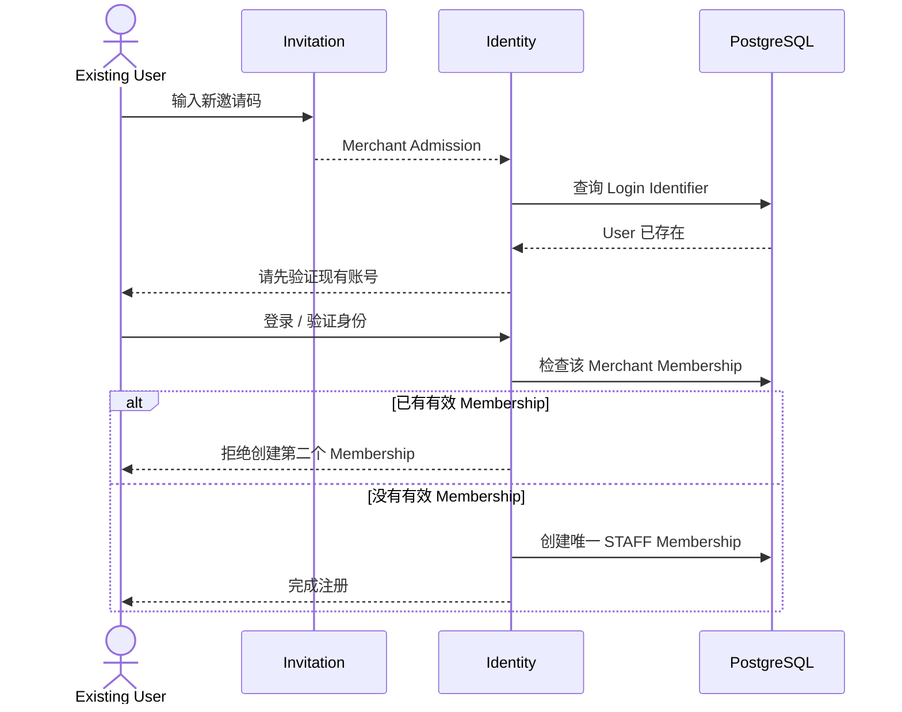

**图示说明（7. 已有账号再次输入邀请码（关键边界））：** 这是服务调用时序图，参与者包括 Existing User、Invitation、Identity、PostgreSQL。箭头表示一次调用或返回，alt/else 分支表示 Decision 的不同结果；事务提交前只做校验和状态准备，短信、邮件等外部副作用应在提交后通过 Outbox 执行。

这能避免“知道某人的手机号 + 拿到邀请码”就把别人的账号直接挂进商户；已有有效 Membership 的 User 必须走店长交接或其他明确的业务流程，不能通过再次注册增加第二个 Merchant Membership。

> 来源：对话第 35、36 轮

---

# 8. STAFF 单店约束（已冻结收紧）

对话第 39 轮按用户要求收紧：

```text
一个 STAFF 账号
→ 只能对应一个 Merchant
```

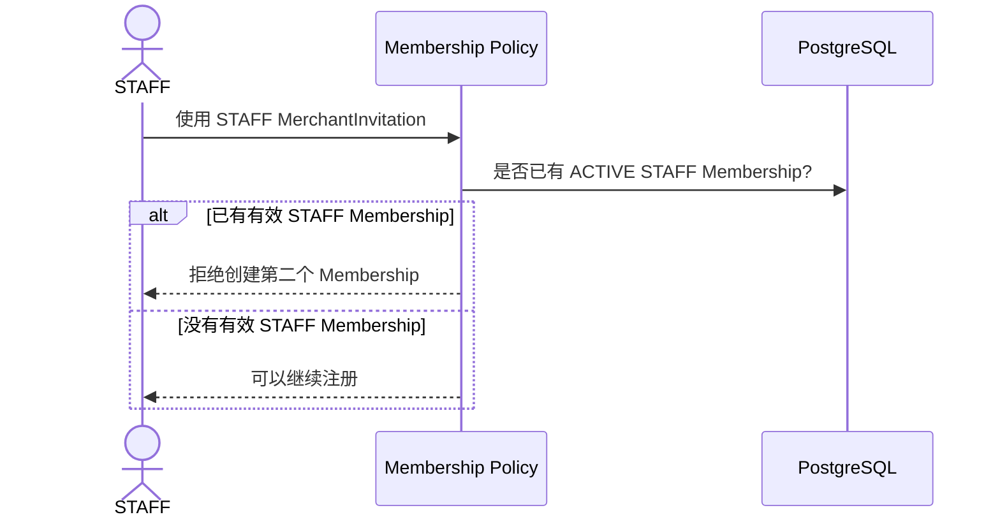

**图示说明（8. STAFF 单店约束（已冻结收紧））：** 这是服务调用时序图，参与者包括 STAFF、Membership Policy、PostgreSQL。箭头表示一次调用或返回，alt/else 分支表示 Decision 的不同结果；事务提交前只做校验和状态准备，短信、邮件等外部副作用应在提交后通过 Outbox 执行。

不过 `User` 和 `Membership` 仍然保持分离（领域设计价值保留），只是增加强约束：

```text
active STAFF membership count <= 1
```

> 来源：对话第 39、40 轮

---

# 9. 邀请码状态机

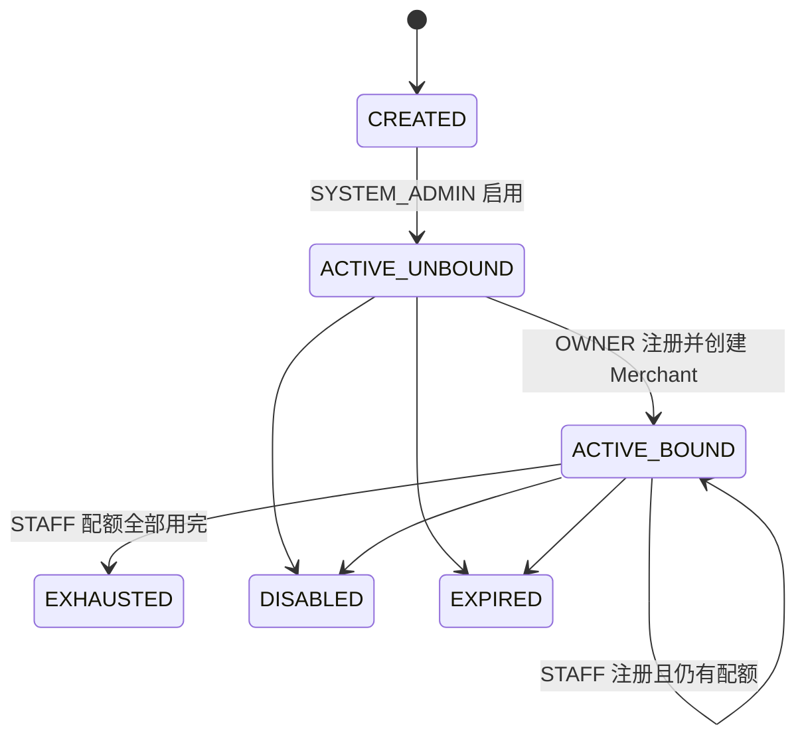

**图示说明（9. 邀请码状态机）：** 这是状态机图，展示 图中标注的参与者和领域节点 的合法状态迁移。迁移必须由命令校验当前状态、操作者、版本和原因后提交；未列出的迁移必须拒绝并写入 Security Event 或 Audit。

重要点：

> `ACTIVE_BOUND` 不代表不可用了。

它表示：

```text
已经绑定 Merchant
OWNER 已注册
STAFF 仍可以继续使用
```

更准确的业务状态枚举：

```text
CREATED
ACTIVE_UNBOUND
ACTIVE_BOUND
EXHAUSTED
DISABLED
EXPIRED
```

这一层以后数据库设计时会很有用。

> 来源：对话第 35 轮

---

# 10. 注册决策（封口设计方向）

第 41 轮确定注册准入 Decision 的输入输出：

```text
输入：
Invitation
Role
User
Identifier
Merchant
Quota

输出：
RegistrationDecision
```

最终系统只认：

```text
ALLOW
或
DENY_INVITATION_INVALID
DENY_OWNER_ALREADY_EXISTS
DENY_STAFF_QUOTA_FULL
DENY_STAFF_ALREADY_HAS_MERCHANT
DENY_IDENTIFIER_CONFLICT
...
```

对应核心算法（第 36、39 轮综合）：

```text
InvitationValid
AND RoleQuotaAvailable
AND IdentifierOwnershipValid
AND StaffHasNoMerchant
AND MerchantStateAllowsRegistration
→ ALLOW
```

注册准入决策系统（08-01）完整时序（第 40 轮）：

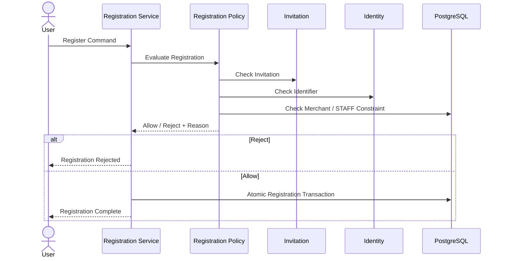

**图示说明（10. 注册决策（封口设计方向））：** 这是服务调用时序图，参与者包括 User、Registration Service、Registration Policy、Invitation。箭头表示一次调用或返回，alt/else 分支表示 Decision 的不同结果；事务提交前只做校验和状态准备，短信、邮件等外部副作用应在提交后通过 Outbox 执行。

使用：

```text
Specification Pattern
Policy Pipeline
Unit of Work
Idempotency
```

> 来源：对话第 40、41 轮

---

# 11. 注册风险与边界

注册相关风险信号（Risk Engine）：

```text
高频猜邀请码
同邀请码大量失败注册
STAFF 配额耗尽后继续大量尝试
已有账号反复绕过身份确认
```

边界条件（第 38 轮）：

```text
已有 User + 新邀请码必须重新证明本人身份
Merchant 被关闭后邀请码禁止新增
同一 User + Merchant 不允许重复 Membership
STAFF 配额不能超卖
```

> 来源：对话第 38 轮

---

# 12. 已冻结规则汇总

1. SYSTEM_ADMIN 创建 MerchantInvitation；OWNER 使用未绑定邀请码注册并创建 Merchant；STAFF 使用已绑定 MerchantInvitation 注册；
2. 一个邀请码 OWNER 固定最多 1；
3. STAFF 上限 N，由 SYSTEM_ADMIN 设置；
4. STAFF 必须等 OWNER 建店后才能注册；
5. OWNER 注册 = User + Merchant + OWNER Membership（同一事务）；
6. 邀请码承担：注册资格 + 角色配额 + Merchant 归属；
7. 邀请码绑定 Merchant 后（ACTIVE_BOUND）STAFF 仍可继续注册；
8. 已有账号再次使用邀请码：必须验证本人身份，不重复创建 User；
9. 一个 STAFF 只能对应一个 Merchant（active STAFF membership count <= 1）；
10. 一个 OWNER 只能对应一个 Merchant；
11. 配额消耗与 Membership 创建必须同事务，不能超卖。

---

# 13. 待确认项

```text
邀请码有效期策略（是否必须有 EXPIRED）
OWNER 自助关闭 / 删除 Merchant 的规则（D01-05）
最后一个 OWNER 能否被停用（D01-04）
```

> 来源：对话第 30 轮遗留决策清单 D01-01、D01-02、D01-04、D01-05（单 Merchant 与单 OWNER 已冻结）
