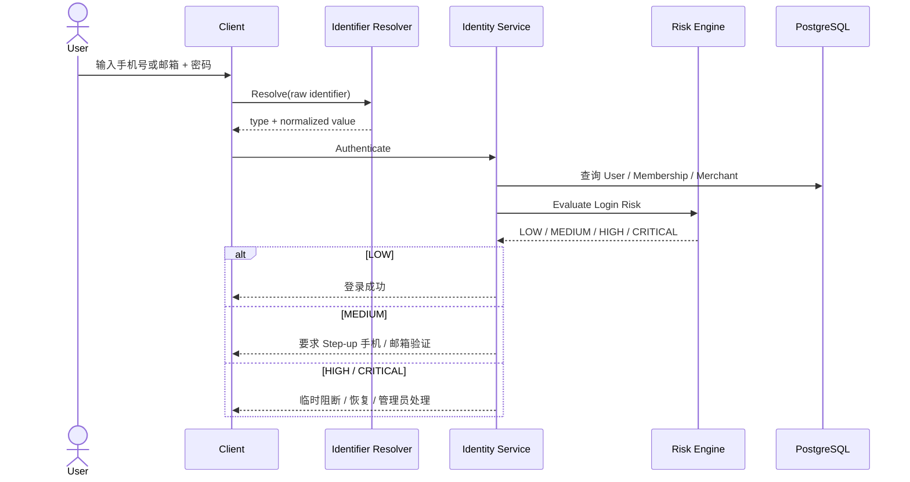
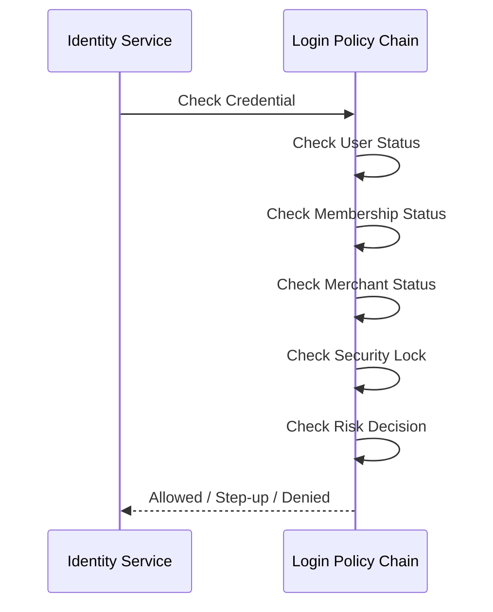
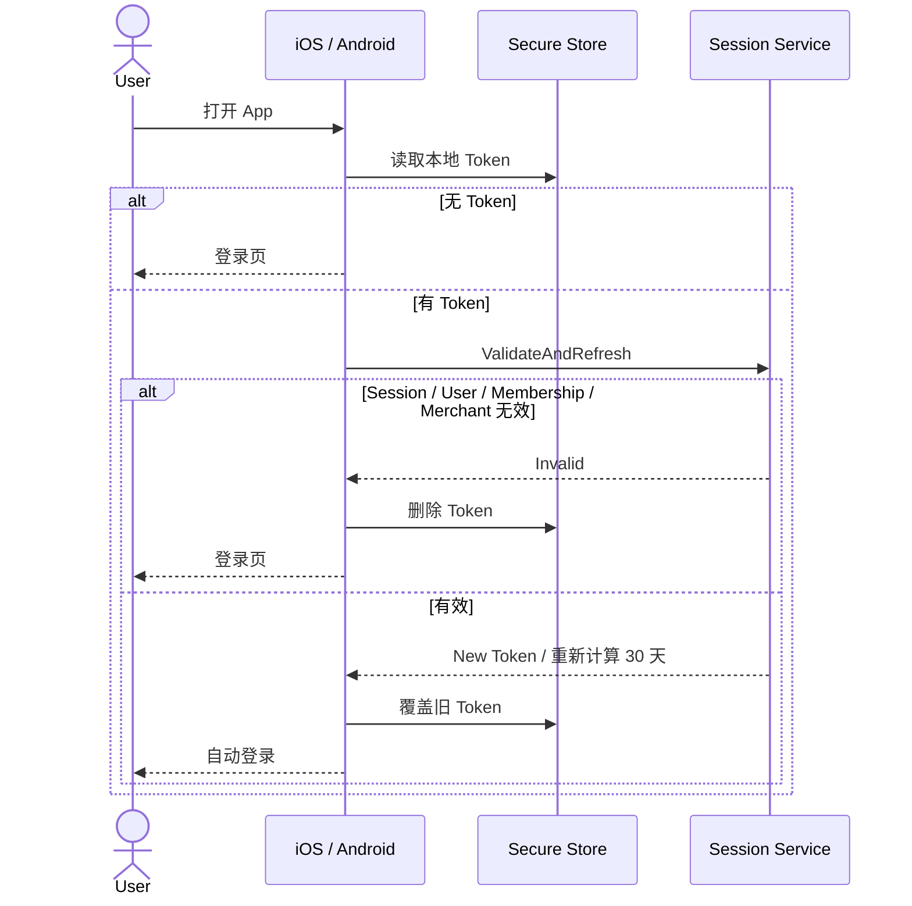

# 01.2 — 登录与会话详细设计

# 1. 登录标识

首期支持：

```text
PHONE
EMAIL
```

用户可以使用任一已验证并启用的 Login Identifier 登录。

登录流程不直接写死手机号 / 邮箱判断，由 `IdentifierResolver` 规范化后进入统一认证。



# 2. 登录 Policy Pipeline



# 3. iOS / Android 30 天滑动 Session



# 4. 多设备登录

已确认允许。每台设备使用独立 Session。

# 5. 修改密码

已确认：

```text
当前设备刷新 Session
其他设备全部失效
```

推荐通过 `security_epoch / session_version` 让旧 Token O(1) 失效。

# 6. SYSTEM_ADMIN 强制全部下线

SYSTEM_ADMIN 可递增目标 User 的安全版本并写 Audit，使全部旧 Session 立即失效。

# 7. Token 有效性

```text
Token 未过期
AND Session 未撤销
AND Token Security Version = User Current Security Version
AND User ACTIVE
AND Membership ACTIVE
AND Merchant 可用
```

# 8. 边界条件

- 同一设备 Token Rotation 不是每次创建新设备 Session；
- 修改 Login Identifier 后可要求当前 Session Step-up 验证；
- Merchant 被冻结时，User 其他 Merchant 的 Session 不应一起失效；
- User 被全局停用时全部 Session 失效；
- TEMP_PASSWORD_RESET_REQUIRED 状态下只能进入改密流程，不能进入经营业务。
