# 01.2 — 登录与会话

> 来源：ChatGPT 分享对话（第 30 ~ 41 轮）完整提取与整理
> 对应对话中最终形成的文档：`master-goods-system-design-v3/01-账户与身份/02-登录与会话.md`
> 子模块详细设计。保留对话中全部时序图、规则与边界。

---

# 1. 设计目标

回答：

```text
登录成功究竟意味着什么？
User / Membership / Merchant 三层状态怎样影响登录？
iOS / Android 怎样 30 天自动登录？
多设备怎样管理？
修改密码 / 停用员工 / 强制下线怎样撤销会话？
```

核心原则（第 35 轮）：

> 登录不能只有「用户名 + 密码正确 = 登录成功」。
>
> 登录应该分成「认证」和「进入业务上下文」。

> 来源：对话第 35 轮

---

# 2. 登录本质上要校验三个状态

不能只校验：

```text
密码正确
```

还需要：

```text
User Status
Membership Status
Merchant Status
```

| 层 | 例子 |
|---|---|
| User | 这个人整个账号是否可用 |
| Membership | 这个人在这家店是否仍有效 |
| Merchant | 这家店是否正常营业 |

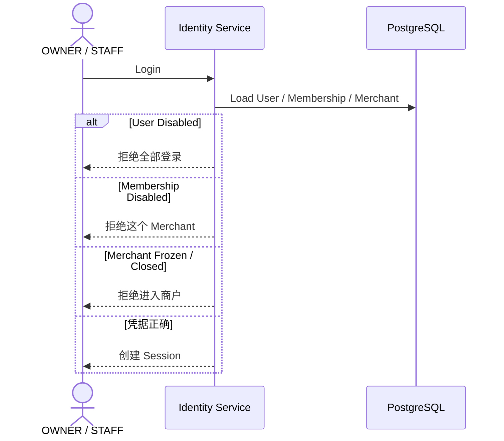

**图示说明（2. 登录本质上要校验三个状态）：** 这是服务调用时序图，参与者包括 OWNER / STAFF、Identity Service、PostgreSQL。箭头表示一次调用或返回，alt/else 分支表示 Decision 的不同结果；事务提交前只做校验和状态准备，短信、邮件等外部副作用应在提交后通过 Outbox 执行。

例如员工离职：

```text
User 仍然存在
Membership = DISABLED
```

这样他的历史业务身份仍然可以保留。

> 来源：对话第 35、36 轮

---

# 3. 完整登录流程（认证 → 业务上下文）

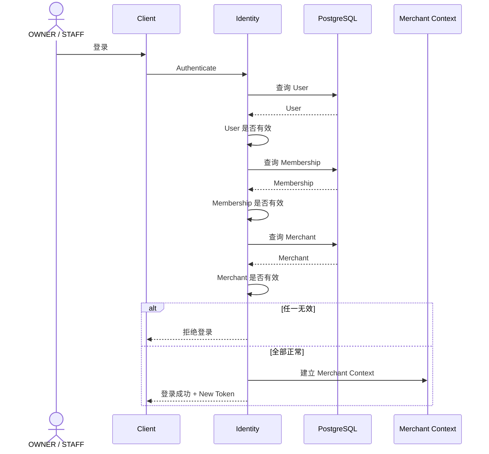

**图示说明（3. 完整登录流程（认证 → 业务上下文））：** 这是服务调用时序图，参与者包括 OWNER / STAFF、Client、Identity、PostgreSQL。箭头表示一次调用或返回，alt/else 分支表示 Decision 的不同结果；事务提交前只做校验和状态准备，短信、邮件等外部副作用应在提交后通过 Outbox 执行。

> 来源：对话第 35 轮

---

# 4. OWNER 登录

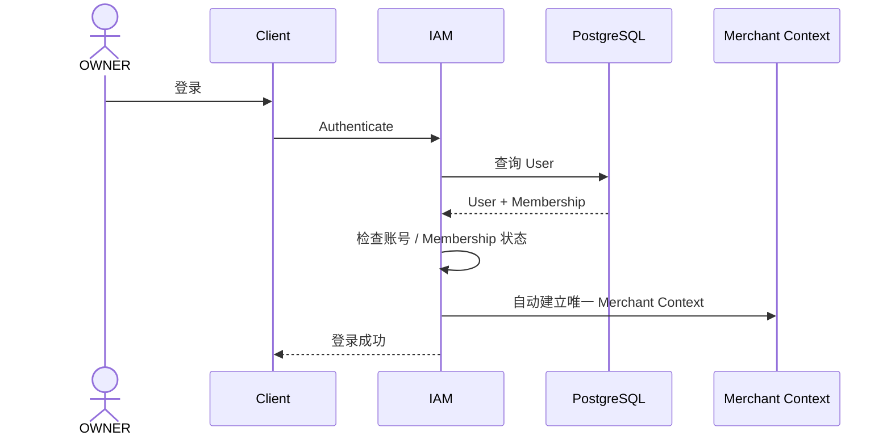

**图示说明（4. OWNER 登录）：** 这是服务调用时序图，参与者包括 OWNER、Client、IAM、PostgreSQL。箭头表示一次调用或返回，alt/else 分支表示 Decision 的不同结果；事务提交前只做校验和状态准备，短信、邮件等外部副作用应在提交后通过 Outbox 执行。

> 来源：对话第 30、31、40 轮

---

# 5. STAFF 登录

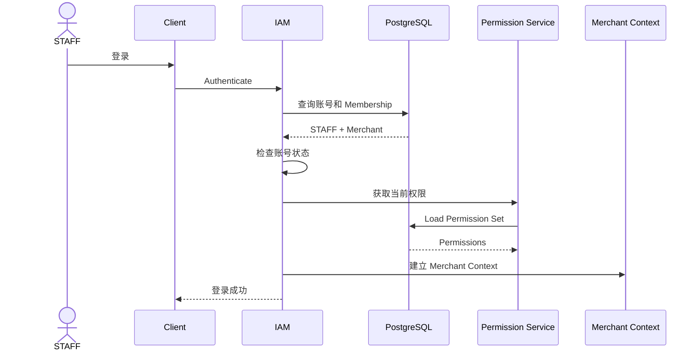

**图示说明（5. STAFF 登录）：** 这是服务调用时序图，参与者包括 STAFF、Client、IAM、PostgreSQL。箭头表示一次调用或返回，alt/else 分支表示 Decision 的不同结果；事务提交前只做校验和状态准备，短信、邮件等外部副作用应在提交后通过 Outbox 执行。

之后所有业务（卖货 / 进货 / 库存 / 查询）都不需要客户端再决定自己属于哪个商户。Backend 已经知道：

```text
User
+
Merchant
+
Role
+
Permissions
```

> 来源：对话第 30、31 轮

---

# 6. SYSTEM_ADMIN 登录和进入某个商户

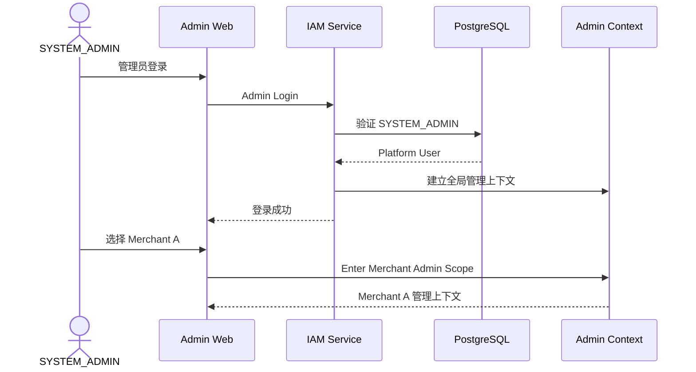

**图示说明（6. SYSTEM_ADMIN 登录和进入某个商户）：** 这是服务调用时序图，参与者包括 SYSTEM_ADMIN、Admin Web、IAM Service、PostgreSQL。箭头表示一次调用或返回，alt/else 分支表示 Decision 的不同结果；事务提交前只做校验和状态准备，短信、邮件等外部副作用应在提交后通过 Outbox 执行。

和 OWNER 的区别非常明确：

```text
OWNER：
Merchant 是"我属于这里"

SYSTEM_ADMIN：
Merchant 是"我现在要管理这里"
```

> 来源：对话第 30 轮

---

# 7. 多设备登录（已冻结）

用户确认（第 36 轮）：允许多设备同时登录。

所以系统不是：

```text
一个 User = 一个 Token
```

而是：

```text
一个 User
→ Session A：iPhone
→ Session B：Android Tablet
→ Session C：另一个设备
```

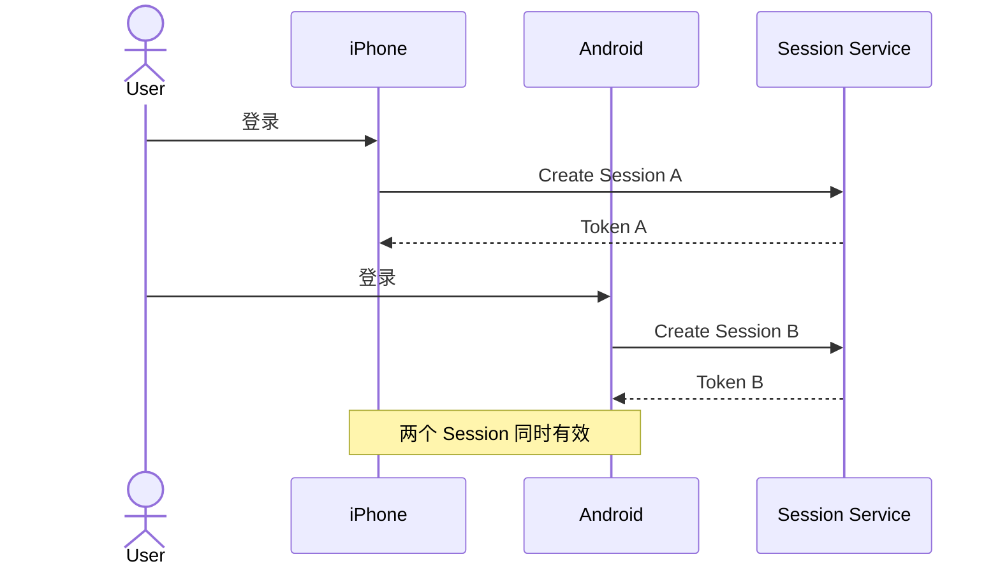

**图示说明（7. 多设备登录（已冻结））：** 这是服务调用时序图，参与者包括 User、iPhone、Android、Session Service。箭头表示一次调用或返回，alt/else 分支表示 Decision 的不同结果；事务提交前只做校验和状态准备，短信、邮件等外部副作用应在提交后通过 Outbox 执行。

这样才能正确支持：

```text
退出当前设备
踢掉某个设备
强制全部下线
```

而不会互相覆盖。

> 来源：对话第 35、36 轮

---

# 8. iOS / Android 30 天自动登录（滑动会话）

当前规则：

```text
登录成功
→ 保存本地 Token
→ Token 有效期 30 天
```

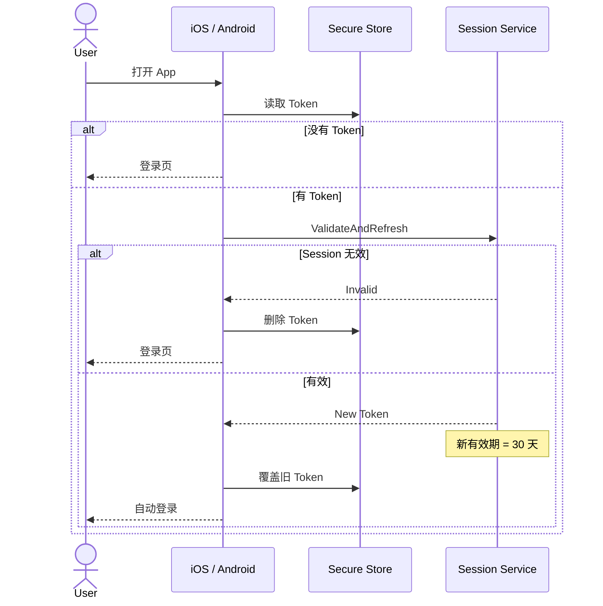

**图示说明（8. iOS / Android 30 天自动登录（滑动会话））：** 这是服务调用时序图，参与者包括 User、iOS / Android、Secure Store、Session Service。箭头表示一次调用或返回，alt/else 分支表示 Decision 的不同结果；事务提交前只做校验和状态准备，短信、邮件等外部副作用应在提交后通过 Outbox 执行。

这是一个**滑动 30 天会话**：

```text
每次手工登录成功
→ 新 Token
→ 30 天

每次自动登录验证成功
→ 新 Token
→ 再重新计算 30 天
```

本地 Token 每次都覆盖，App 不长期积累多个历史 Token。并且：

- iOS / Android 使用安全本地存储；
- 账号 / Membership 被停用后，即使 Token 还没到 30 天，服务端也必须拒绝。

Token 具体形态（JWT / opaque / Access+Refresh 双 Token）留给技术实现设计，暂未锁死。

> 来源：对话第 32、36 轮

---

# 9. "每次刷新 Token"不等于创建无限 Session

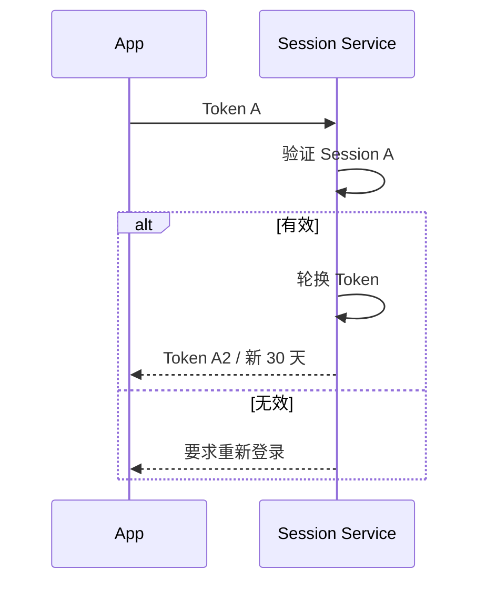

**图示说明（9. "每次刷新 Token"不等于创建无限 Session）：** 这是服务调用时序图，参与者包括 App、Session Service。箭头表示一次调用或返回，alt/else 分支表示 Decision 的不同结果；事务提交前只做校验和状态准备，短信、邮件等外部副作用应在提交后通过 Outbox 执行。

即：

```text
同一个 Session
Token A → Token A2 → Token A3
```

而不是 App 每打开一次就制造一个新设备 Session。

> 来源：对话第 35 轮

---

# 10. Token 是否有效：多层校验

```text
Token 自身未过期
AND
Session 未撤销
AND
User ACTIVE
AND
Membership ACTIVE
AND
Merchant ACTIVE
```

而不是只检查：

```text
exp > now
```

"Token 还剩 20 天"也不代表一定能登录。

> 来源：对话第 35、36 轮

---

# 11. 修改密码后的会话行为（已冻结）

```text
修改密码成功
→ 当前设备 Session 保留并刷新 Token
→ 其他所有 Session 立即撤销
```

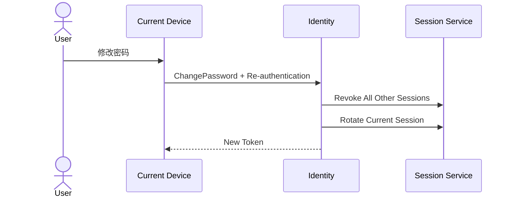

**图示说明（11. 修改密码后的会话行为（已冻结））：** 这是服务调用时序图，参与者包括 User、Current Device、Identity、Session Service。箭头表示一次调用或返回，alt/else 分支表示 Decision 的不同结果；事务提交前只做校验和状态准备，短信、邮件等外部副作用应在提交后通过 Outbox 执行。

用户视角："我改密码以后，其他设备都需要重新登录。"

> 来源：对话第 35、36 轮

---

# 12. 会话撤销能力

因为只有 30 天过期还不够：

```text
员工今天离职
Token 还有 26 天
```

显然不能让他继续用 26 天。所以需要统一撤销能力。

Session Revocation Strategy（第 40 轮）：

```text
LOGOUT_CURRENT
→ revoke session_id

PASSWORD_CHANGE
→ increment security_epoch
→ rotate current session

ADMIN_FORCE_LOGOUT
→ increment security_epoch

STAFF_DISABLED
→ revoke relevant account sessions
```

使用 `security_epoch` 实现 O(1) 全量失效：

```text
User.security_epoch = 18
Token.security_epoch = 17.

17 != 18
→ 立即失效
```

SYSTEM_ADMIN 可强制某账号全部下线（已冻结）。

> 来源：对话第 35、40、41 轮

---

# 13. 停用员工时的会话处理

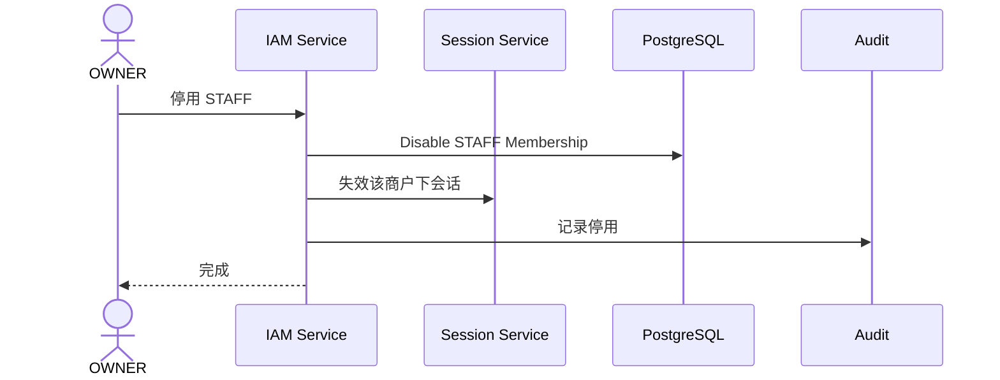

**图示说明（13. 停用员工时的会话处理）：** 这是服务调用时序图，参与者包括 OWNER、IAM Service、Session Service、PostgreSQL。箭头表示一次调用或返回，alt/else 分支表示 Decision 的不同结果；事务提交前只做校验和状态准备，短信、邮件等外部副作用应在提交后通过 Outbox 执行。

但历史业务（以前卖过的货、库存调整、进货）全部继续保留这个 STAFF 为原始操作者。不会因为员工离职就改成老板创建。

> 来源：对话第 30、31 轮

---

# 14. 登录决策（封口设计方向）

第 41 轮确定登录 Decision 的输出：

```text
ALLOW
STEP_UP
RESET_REQUIRED
TEMPORARY_LOCK
DENY
```

决策管线：

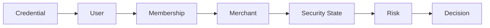

**图示说明（14. 登录决策（封口设计方向））：** 这是责任或数据流图，核心节点包括 Credential。箭头表示调用、归属或数据流向；权限、Merchant 范围和状态判断必须在服务端完成，不能由客户端或单一 UI 分支替代。

内部 Decision 可以区分"不存在 / 密码错误 / 停用"原因；**外部登录响应必须避免暴露账号存在性**。

> 来源：对话第 40、41 轮

---

# 15. 登录风险信号

登录风险包括：

```text
同一个账号短时间连续密码错误
同一个 IP / Device 尝试大量不同账号
同一账号突然出现大量不同设备
临时密码连续输入错误
被要求重置密码但仍持续尝试普通登录
```

Session 风险：

```text
旧 Token 被持续重放
已经撤销的 Session 仍不断访问
短时间创建大量设备 Session
Token Rotation 异常
```

Risk Engine 输出四个级别：

| Level | 行为 |
|---|---|
| LOW | 正常继续 |
| MEDIUM | 手机 / 邮箱二次验证 |
| HIGH | 临时阻断，要求恢复账号 |
| LOW / MEDIUM / HIGH / CRITICAL | 见下 |

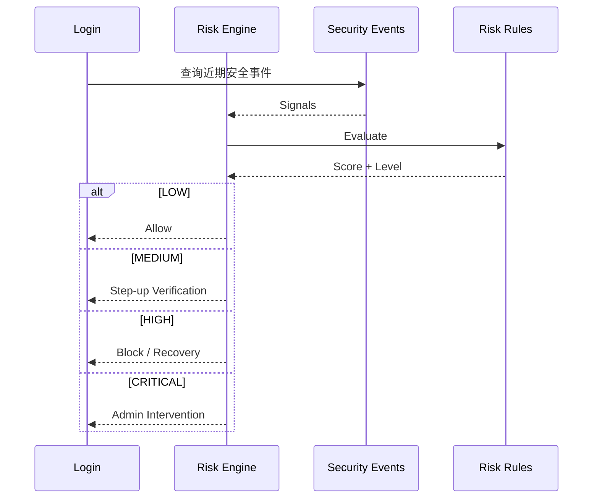

**图示说明（15. 登录风险信号）：** 这是服务调用时序图，参与者包括 Login、Risk Engine、Security Events、Risk Rules。箭头表示一次调用或返回，alt/else 分支表示 Decision 的不同结果；事务提交前只做校验和状态准备，短信、邮件等外部副作用应在提交后通过 Outbox 执行。

> 来源：对话第 38 轮

---

# 16. 已冻结规则汇总

1. 登录校验 User / Membership / Merchant 三层状态；
2. 允许多设备同时登录（一个 User → 多个 Session）；
3. iOS / Android 使用 30 天滑动 Session；
4. 手工登录和自动登录成功都会轮换 Token（同一 Session 内轮换，不新建 Session）；
5. Token 有效性 = Token 未过期 AND Session 未撤销 AND User ACTIVE AND Membership ACTIVE AND Merchant ACTIVE；
6. 修改密码：当前设备保留并刷新，其他设备全部撤销；
7. SYSTEM_ADMIN 可以强制全部下线（security_epoch）；
8. STAFF 停用：Session 立即失效，历史业务记录保留原操作者；
9. 登录失败 / 忘记密码响应不暴露账号存在性；
10. 登录决策输出固定枚举：ALLOW / STEP_UP / RESET_REQUIRED / TEMPORARY_LOCK / DENY。

---

# 17. 待确认项

```text
Web Session 到底 7 天还是 30 天（不阻塞模块完成）
Token 形态：JWT、opaque session token 或 Access + Refresh 双 Token
登录标识最终采用账号名 / 手机号 / 邮箱 / 多 Login Identifier（第 36 轮提出的后续重点）
```

---

# 附录 A：设计演进——多 Merchant 登录分支（历史方案）

以下内容只用于解释设计演进，不属于当前登录规范。当前 `OWNER` 与 `STAFF` 均只能拥有一个 Merchant Membership，登录后直接建立唯一 Merchant Context。

历史方案曾允许底层 Membership 关联多个 Merchant：

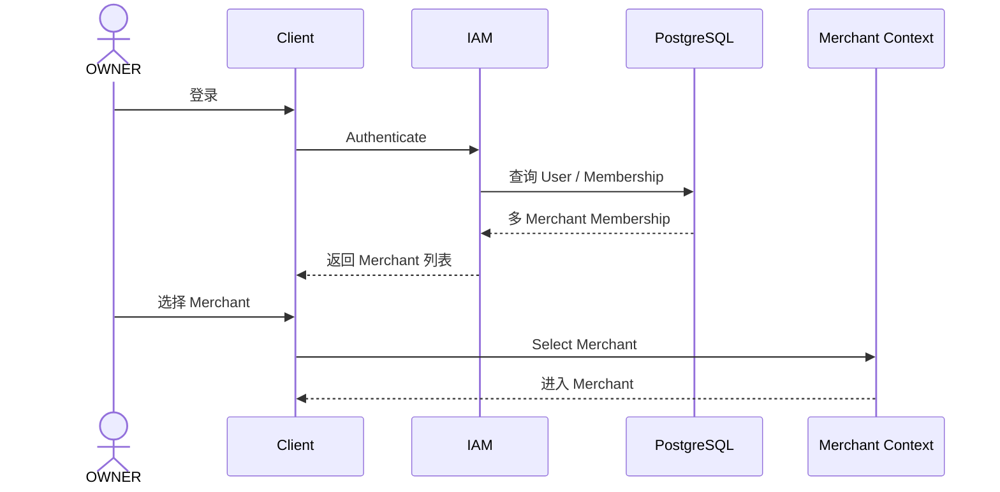

**图示说明（附录 A：历史多 Merchant 登录分支）：** 这是被废弃的历史时序图，展示旧模型中选择 Merchant 的路径；当前单 Merchant 规范不使用该分支。

该分支已被单 Merchant 规则取代，不能作为当前实现路径。
