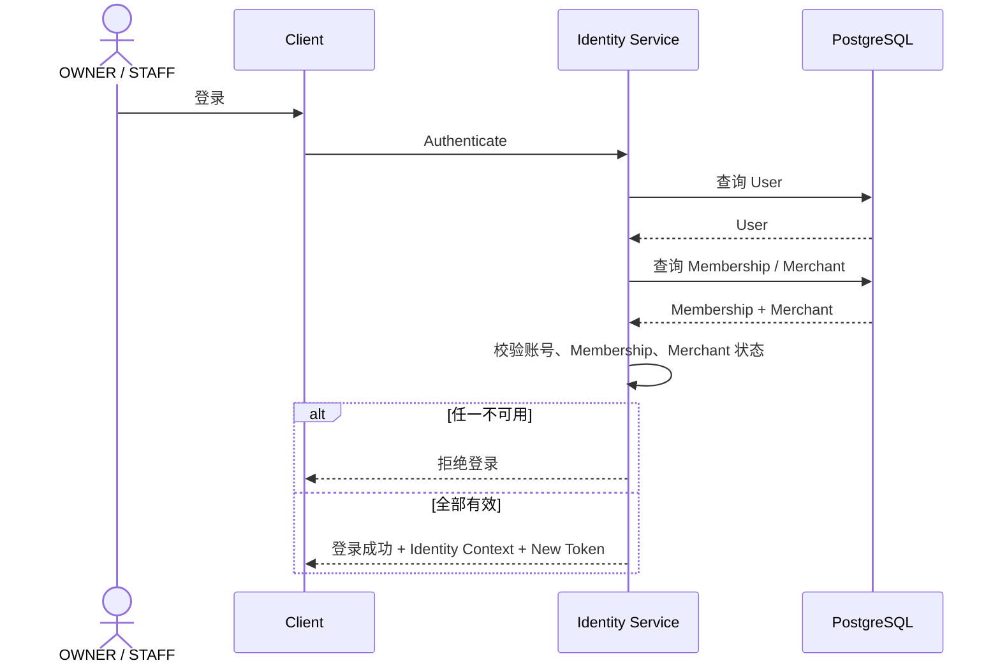
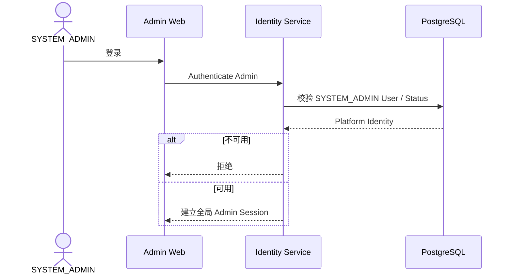
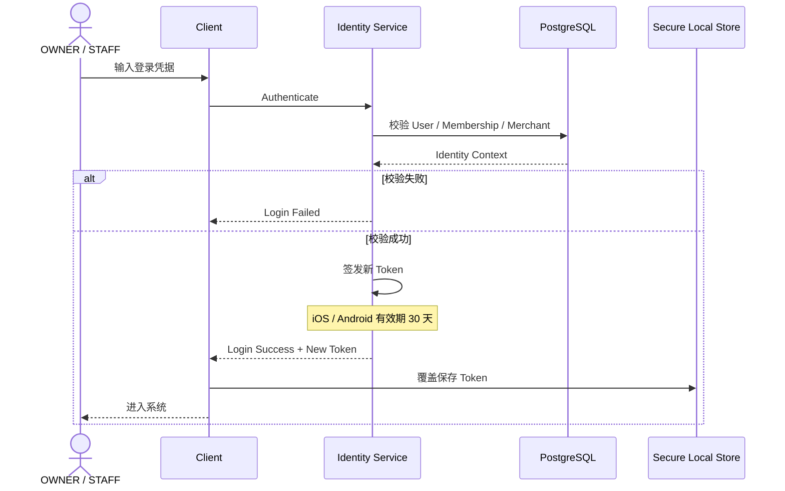
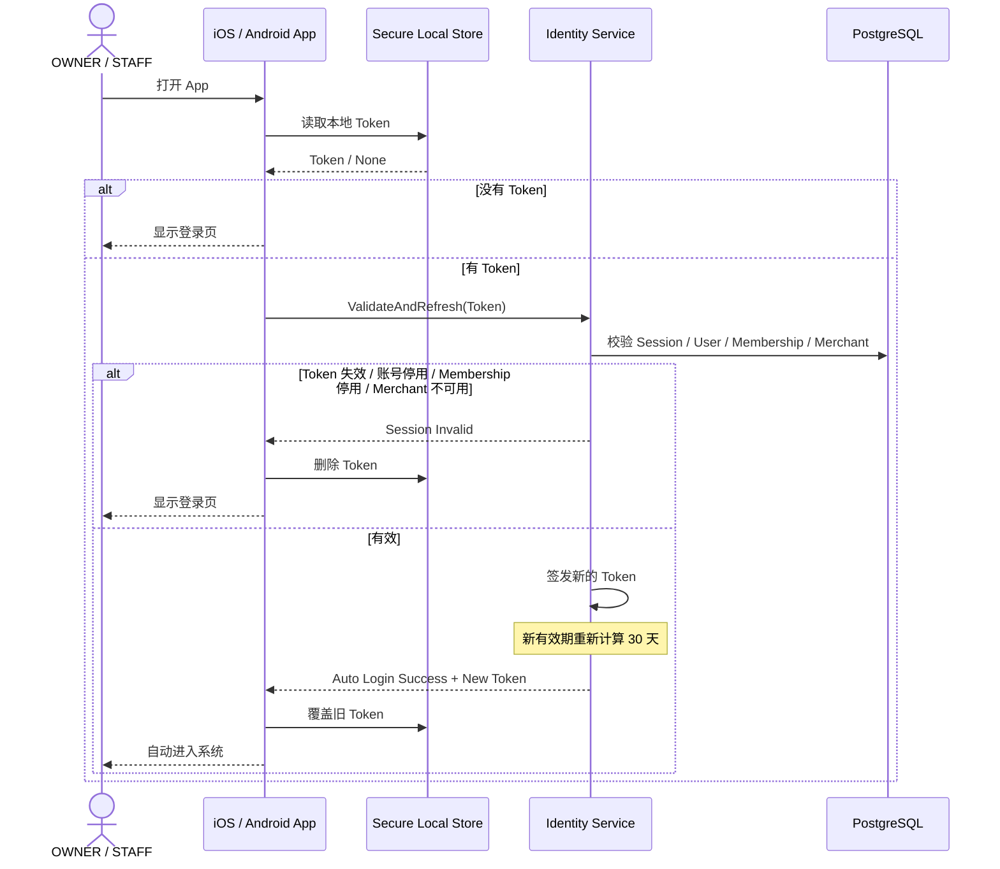
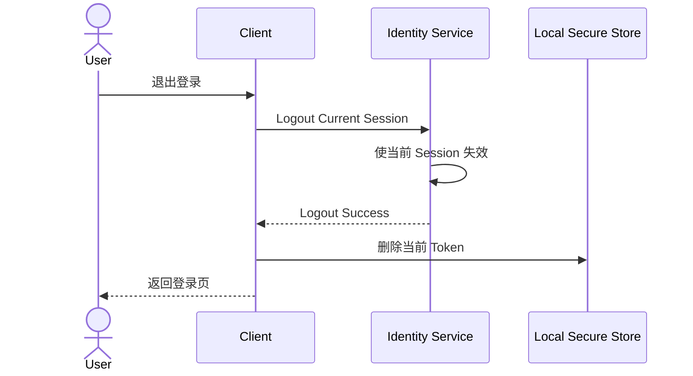

# 01.2 — 登录与会话详细设计

> 只讨论登录后的身份建立、移动端自动登录、Session 生命周期与失效。  
> 不在本阶段冻结 JWT / opaque token、加密算法和具体字段。

# 1. 登录需要同时验证什么

成功进入业务前至少需要确认：

```text
User 有效
账号允许登录
Role 有效
OWNER / STAFF 的 Membership 有效
Merchant 有效
```



# 2. SYSTEM_ADMIN 登录



SYSTEM_ADMIN 进入某个 Merchant 时只是选择管理目标 Merchant，不获得该 Merchant Membership。

# 3. OWNER / STAFF 手工登录



# 4. iOS / Android 30 天自动登录



# 5. Token 刷新原则

当前冻结：

1. 手工登录成功签发新 Token；
2. 自动登录成功也签发新 Token；
3. 客户端覆盖旧 Token；
4. 新 Token 重新获得 30 天有效期；
5. 本地 Token 必须使用系统安全存储；
6. 账号停用具有比 Token 到期时间更高的优先级。

# 6. 登出



# 7. 多设备登录

建议默认同一个 OWNER / STAFF 可以同时保持多个独立 Session。


同时需要：

```text
退出当前设备
强制退出全部设备
SYSTEM_ADMIN / OWNER 停用账号时让相关 Session 全部失效
```

该建议待确认。

# 8. 密码修改后的 Session

建议：

```text
修改密码
→ 当前 Session 重新签发
→ 其他 Session 全部失效
```

此项待确认。

# 9. Web / 微信小程序

当前只冻结 iOS / Android 的 30 天本地 Token 行为。

Web 与微信小程序的持久化策略后续确定，但服务端都必须重新校验 User / Membership / Merchant 状态。

# 10. 待确认决策

1. 是否正式允许多设备同时登录；
2. 修改密码是否让其他设备全部下线；
3. OWNER 是否可以查看并踢出自己的历史设备；
4. STAFF 是否可以查看自己的登录设备；
5. SYSTEM_ADMIN 是否可以对任意账号执行“强制全部退出”；
6. Web 的 Session 生命周期是否与移动端统一。
