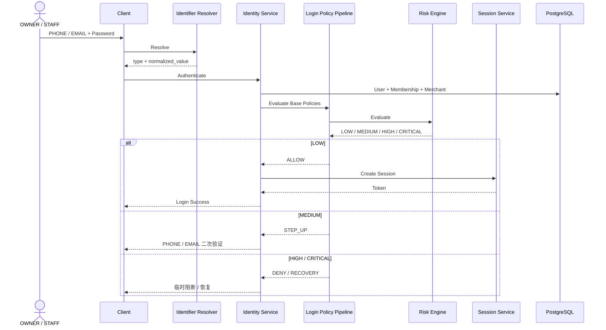
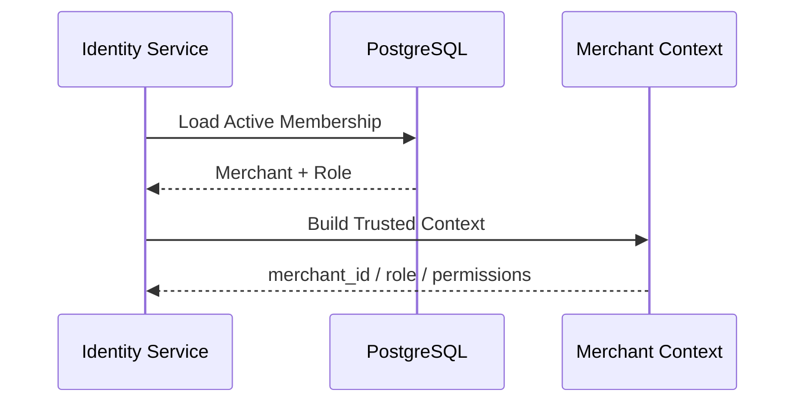
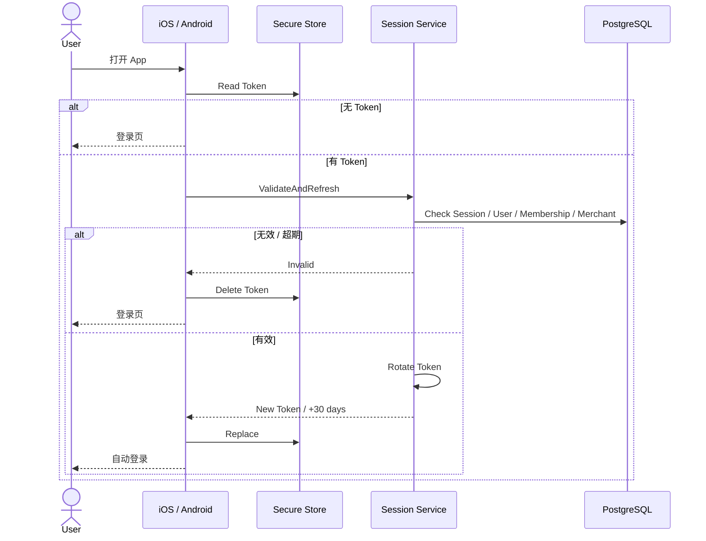
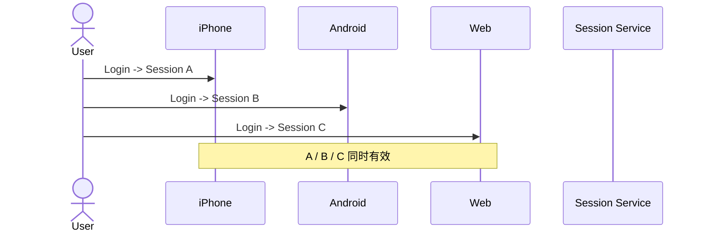
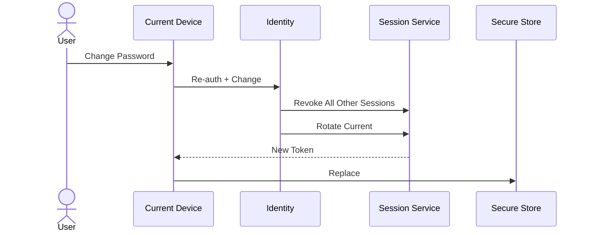
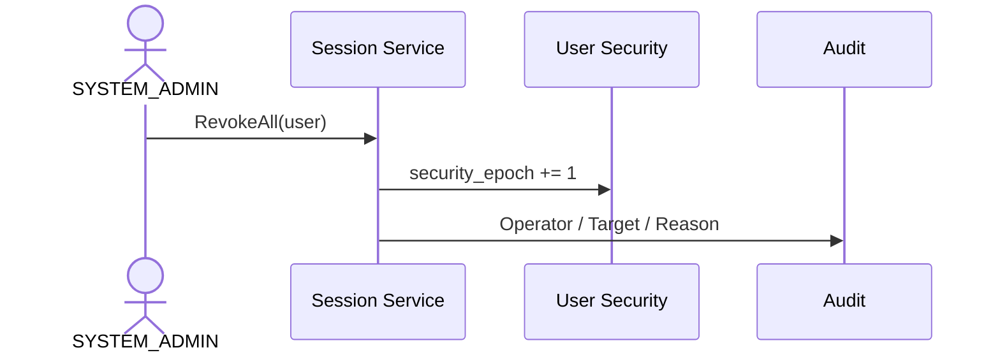

# 01.2 — 登录与会话详细设计

> 状态：核心产品行为已冻结。  
> 首期 Login Identifier：PHONE / EMAIL。

---

# 1. 登录成功的完整条件

```text
Identifier 可解析
Credential 正确
User 可用
Membership 可用
Merchant 可用
Security State 允许
Risk 允许或完成 Step-up
```



---

# 2. Identifier Resolver

Login Service 不写死 phone/email 分支。

Resolver 负责：

1. 判断类型；
2. Normalizer；
3. 返回统一结果；
4. 查询 `(type, normalized_value)` 唯一索引。

---

# 3. Merchant Context

OWNER / STAFF 都只有一个 Merchant，因此登录后不需要 Merchant Selector。



客户端不能自行切到其他 merchant_id。

---

# 4. SYSTEM_ADMIN

SYSTEM_ADMIN 没有 Merchant Membership。

登录成功得到全局 Admin Context；选择 Merchant 只是管理目标。

---

# 5. iOS / Android 30 天滑动 Session

```text
手工登录成功 -> 30 天
App 下次打开 -> ValidateAndRefresh
验证成功 -> Token Rotation -> 新 30 天
```



---

# 6. Token Rotation 和 Session

同一设备：

```text
Session A:
Token A1 -> A2 -> A3
```

不是每次打开 App 新建一个 Session。

---

# 7. 多设备

已冻结允许。



支持退出当前设备、撤销一个 Session、强制全部退出。

---

# 8. 修改密码后的 Session

```text
当前设备 -> Rotation 后保留
其他设备 -> 全部失效
```



---

# 9. SYSTEM_ADMIN 强制全部下线

使用 `security_epoch`：



旧 Token 即使未过期也失效。

---

# 10. Token 最终有效条件

```text
not expired
AND session not revoked
AND token.epoch = user.epoch
AND user ACTIVE
AND membership ACTIVE
AND merchant ACTIVE
AND security_state allows business
```

不能只检查 exp。

---

# 11. Risk 对 Login

```text
LOW -> Allow
MEDIUM -> Step-up PHONE / EMAIL
HIGH -> Block + Recovery
CRITICAL -> SYSTEM_ADMIN
```

Risk 不修改经营业务数据。

---

# 12. 已冻结规则

1. PHONE / EMAIL 登录；
2. OWNER / STAFF 无 Merchant 切换；
3. 多设备同时登录；
4. iOS / Android 30 天滑动；
5. 自动登录轮换 Token；
6. 修改密码踢掉其他设备；
7. SYSTEM_ADMIN 可全部下线；
8. 安全状态优先于 Token 到期；
9. 停用账号不能靠旧 Token 继续使用。
