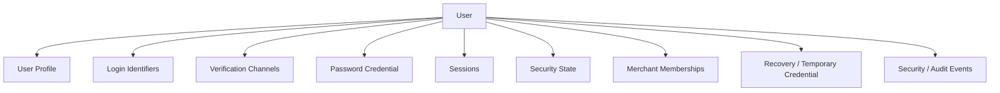
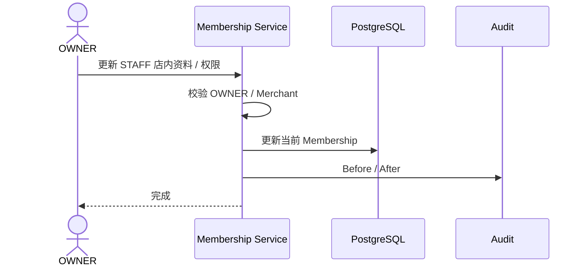
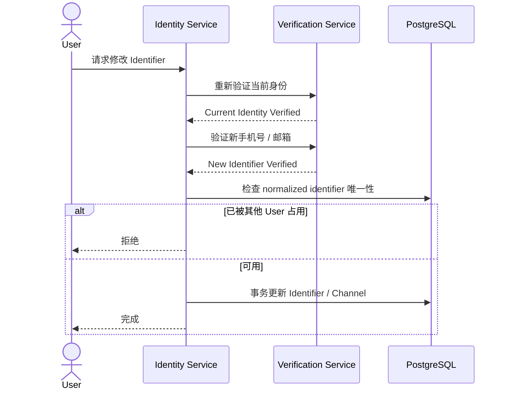

# 01.3 — 用户资料与账号管理详细设计

# 1. 用户信息组件



## 1.1 User Profile

平台级普通资料：

```text
display_name
avatar
locale / timezone（如需要）
created_at
```

## 1.2 Login Identifier

首期：

```text
PHONE
EMAIL
```

一个 User 可绑定多个 Identifier。

## 1.3 Verification Channel

表示手机号 / 邮箱是否：

```text
已验证
允许登录
允许恢复
允许高风险操作验证
```

## 1.4 Password Credential

平台级密码凭据。密码只保存现代 KDF Hash，不保存可逆明文。

## 1.5 Session

多设备独立会话。

## 1.6 Security State

例如：

```text
NORMAL
STEP_UP_REQUIRED
TEMP_PASSWORD_RESET_REQUIRED
PASSWORD_RESET_REQUIRED
TEMPORARY_LOCKED
DISABLED
```

## 1.7 Merchant Membership Profile

```text
merchant
role
membership_status
merchant-local display name / remark
permissions
joined_at
```

# 2. 用户自己编辑资料

普通 Profile 修改不能改变：

```text
Role
Merchant
Permissions
Global Account Status
Membership Status
```

# 3. OWNER 编辑 STAFF

OWNER 管的是 STAFF 在当前 Merchant 的 Membership。



A 店 OWNER 不能修改该 STAFF 在 B 店 Membership，也不能无验证修改其全局 Login Identifier。

# 4. 修改手机号 / 邮箱



# 5. 删除验证渠道

如果删除后会导致：

```text
没有任何可登录 Identifier
或
没有任何可恢复 Verification Channel
```

应拒绝，要求先绑定并验证另一个渠道。

# 6. 店长交接

每个 Merchant 注册阶段只有一个 OWNER。换店长走角色交接，不靠第二次邀请码注册。

SYSTEM_ADMIN 可以强制交接，但必须完整审计。

# 7. 账号删除

存在业务历史、Membership 或 Audit 依赖的 User 不物理删除，只停用 / 归档。

# 8. 边界条件

- User 改名不重写历史业务操作者；
- 账号全局资料和 Membership 店内资料分离；
- 同一 User 多 Merchant 时，OWNER 的账号管理能力必须限定在本 Merchant；
- SYSTEM_ADMIN 可查看 User 全局关系，但不能读取密码明文；
- 绑定第二恢复渠道后再删除第一渠道，避免账号失去恢复能力。
