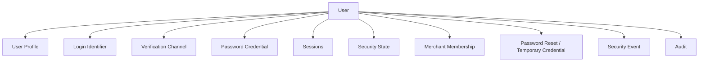
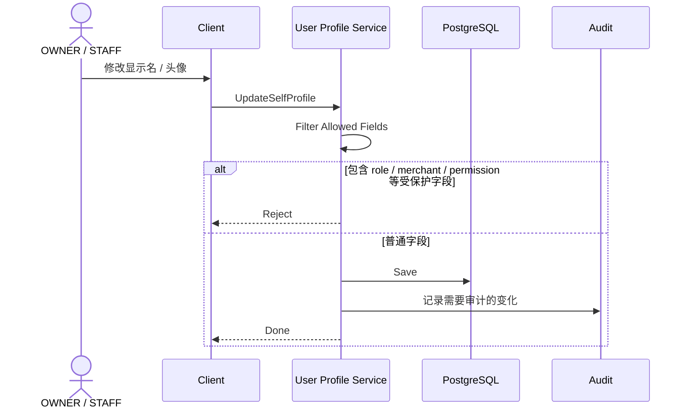
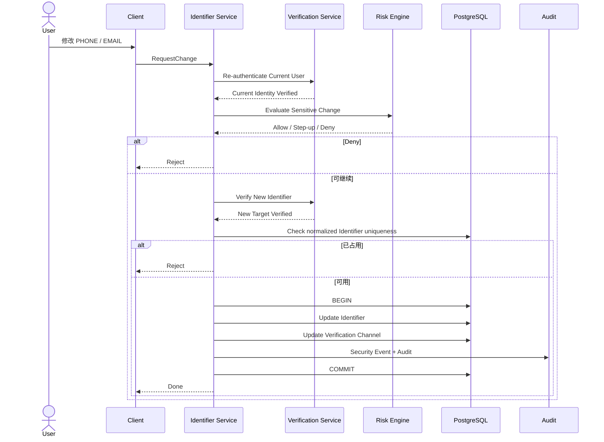
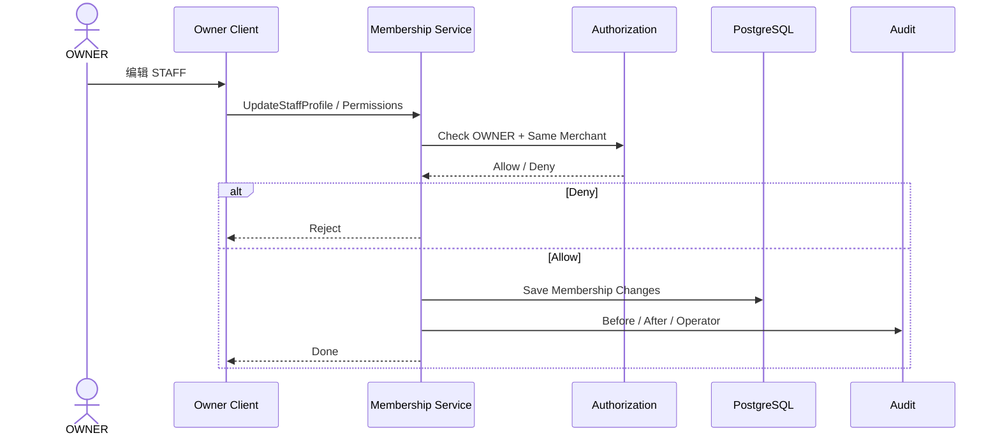
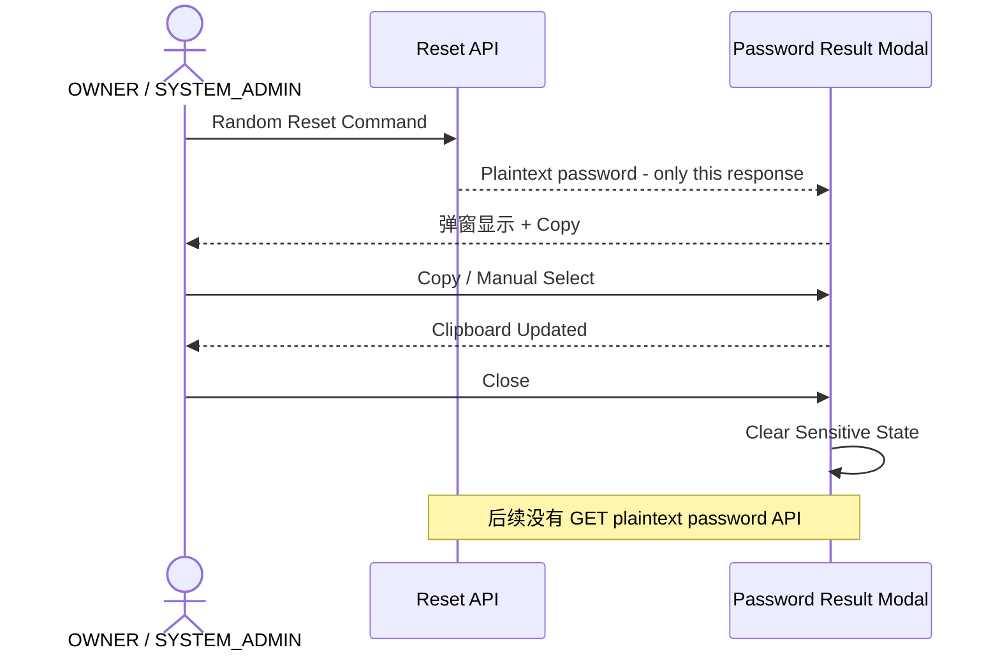

# 01.3 — 用户资料与账号管理详细设计

> 本文重点不是“个人资料页面长什么样”，而是哪些信息属于 User、哪些属于 Merchant、谁可以修改什么。

---

# 1. 用户信息组件



---

# 2. 平台 User Profile

普通资料可包括：

```text
display_name
avatar
locale
timezone
created_at
```

这些信息：

- 不决定 Merchant；
- 不决定 Role；
- 不决定权限；
- 不等于登录标识。

用户自己可以修改允许自助修改的字段。

---

# 3. Login Identifier

首期：

```text
PHONE
EMAIL
```

一个 User 可以同时绑定手机号和邮箱。

Identifier 需要记录：

- 类型；
- 规范化值；
- 是否已验证；
- 是否允许登录；
- 是否允许恢复；
- 是否允许高风险 Step-up。

---

# 4. Merchant Membership

当前商户账号只有一个 Merchant。

```text
OWNER
→ 一个 OWNER Membership

STAFF
→ 一个 STAFF Membership
```

Membership 承载：

```text
merchant_id
role
status
permissions
店内显示名 / 备注
joined_at
```

即使当前只有一个 Merchant，也保留 Membership 分层，因为：

- STAFF 权限属于店铺关系；
- 店长停用员工属于 Membership 行为；
- SYSTEM_ADMIN 全局停用属于 User 行为；
- 历史业务需要保留当时 Merchant / Role；
- Merchant 冻结和 User 禁用不是一个概念。

---

# 5. 用户自助编辑普通资料



普通 Profile API 不能修改：

```text
role
merchant_id
permissions
membership_status
user_status
security_state
password
login_identifier
```

即使恶意客户端提交，也必须拒绝。

---

# 6. 修改手机号 / 邮箱

这是安全资料，不走普通 Profile API。



---

# 7. 删除手机号 / 邮箱

删除前必须检查：

```text
删除后是否仍有至少一个可登录 Identifier？
删除后是否仍有至少一个可恢复 Verification Channel？
```

若任一为否：

```text
Reject
→ 先绑定并验证另一个渠道
```

这样避免用户把自己锁死。

---

# 8. OWNER 管理 STAFF

OWNER 可以：

- 查看本店 STAFF；
- 修改 STAFF 店内显示名 / 备注；
- 配置 STAFF 权限；
- 停用 / 恢复 STAFF Membership；
- 查看 STAFF 在本 Merchant 的操作记录；
- 对 STAFF 执行系统随机临时密码重置。

OWNER 不能：

- 查看 STAFF 原密码；
- 查询已经关闭弹窗的临时密码；
- 自定义设置 STAFF 密码；
- 修改 SYSTEM_ADMIN；
- 无验证修改 STAFF PHONE / EMAIL；
- 修改 STAFF 的平台级安全状态；
- 把 STAFF 迁移到另一 Merchant；
- 给 STAFF 创建第二 Merchant 关系。

---

# 9. OWNER 编辑 STAFF 时序



---

# 10. SYSTEM_ADMIN 账号管理粒度

SYSTEM_ADMIN 可以查看：

```text
User
Role
Merchant
Membership Status
User Status
Security State
已绑定 PHONE / EMAIL 摘要
Session 摘要
登录事件
Password Reset 事件
强制下线历史
```

可以执行：

```text
Disable / Restore User
Disable / Restore Membership
Force Logout All Sessions
Random Password Reset
Admin Defined Password Reset
Require Self Recovery
```

所有高风险动作必须 Audit。

SYSTEM_ADMIN 也不能查看用户原密码。

---

# 11. 一次性密码显示组件

随机 Reset 成功：



前端禁止把密码写入：

- Analytics；
- Crash Report；
- 普通日志；
- localStorage；
- SharedPreferences；
- 非安全数据库缓存。

如果没复制就关闭，只能重新 Reset。

---

# 12. 用户改名与历史业务

业务记录至少保存：

```text
operator_user_id
```

用户改显示名不能改变历史 operator identity。

是否保存 `operator_display_snapshot` 在具体业务领域模型阶段决定。

---

# 13. 账号删除

存在以下任一关系就不物理删除：

```text
业务记录
Audit
Membership
Security Event
Agent Usage
```

只能：

```text
DISABLED
ARCHIVED
```

这样销售、进货、库存、账目和管理员审计都能继续反查原操作者。

---

# 14. 已冻结规则

1. OWNER / STAFF 每账号一个 Merchant；
2. User 与 Membership 仍分层；
3. 普通 Profile 与登录安全资料分开；
4. PHONE / EMAIL 修改必须 Re-auth + 新渠道验证；
5. 删除最后登录 / 恢复渠道必须阻止；
6. OWNER 只管理本店 STAFF；
7. OWNER 不能自定义 STAFF 密码；
8. 随机密码显示一次后不可查询；
9. SYSTEM_ADMIN 高粒度管理账号但不能读原密码；
10. 有业务历史账号不物理删除。
