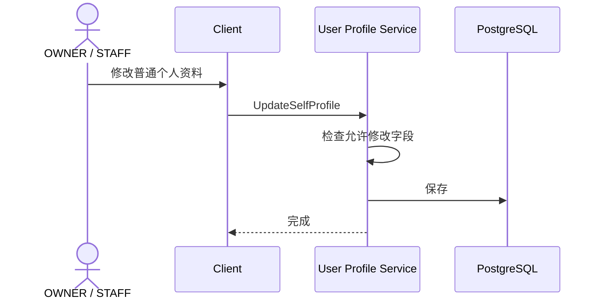
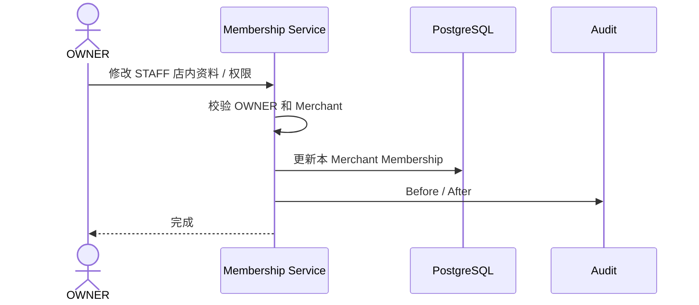
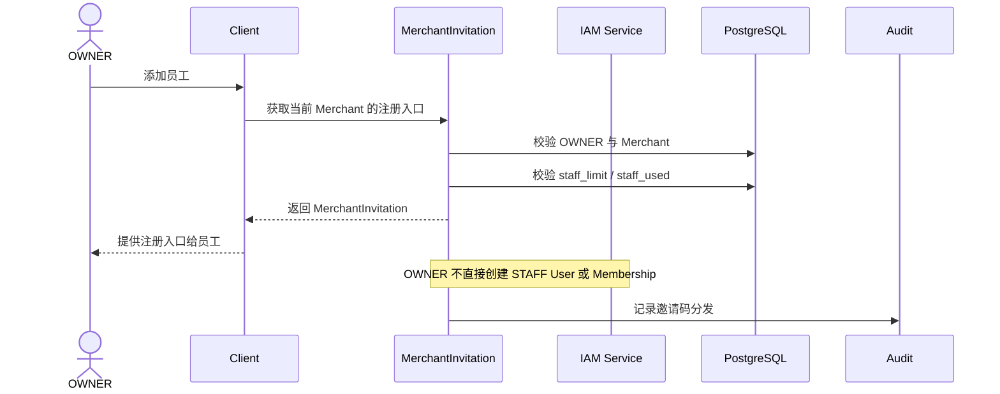
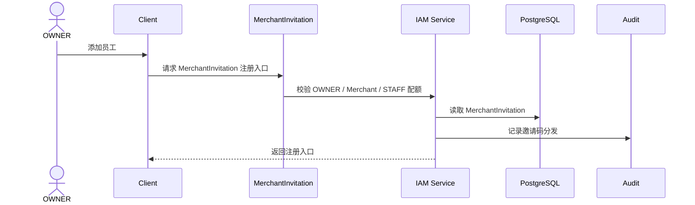
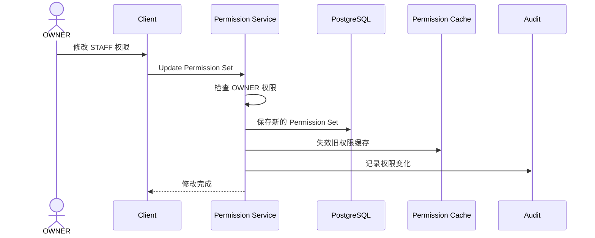
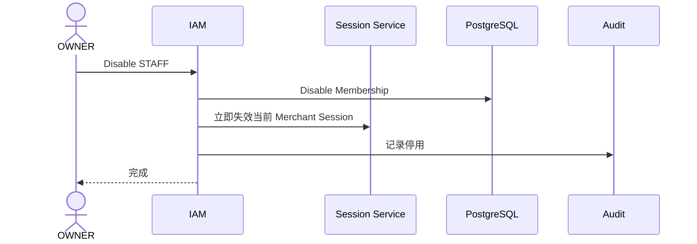
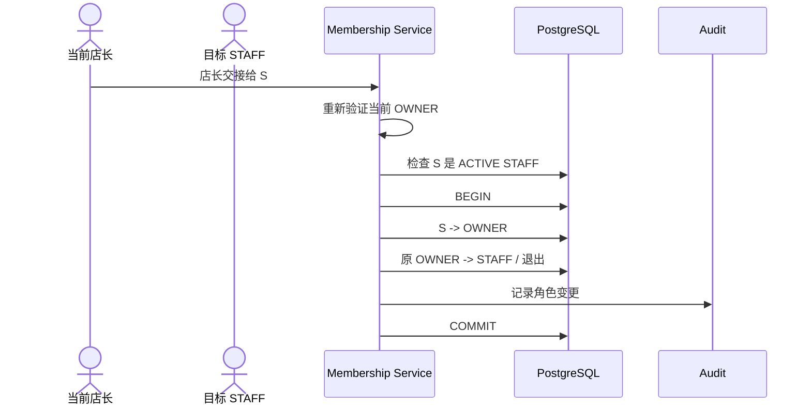
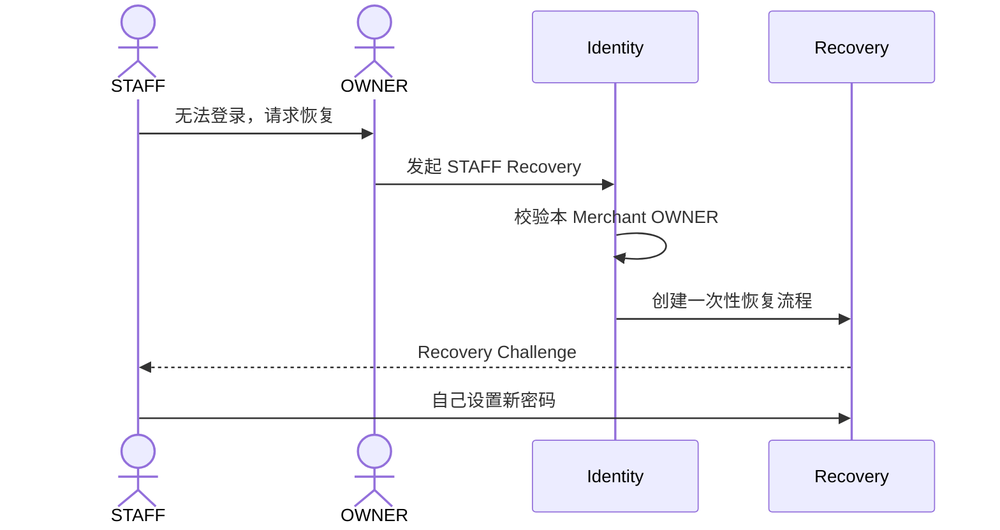

# 01.3 — 用户资料与账号管理

> 来源：ChatGPT 分享对话（第 30 ~ 41 轮）完整提取与整理
> 对应对话中最终形成的文档：`master-goods-system-design-v3/01-账户与身份/03-用户资料与账号管理.md`
> 子模块详细设计。保留对话中全部时序图、规则与边界。

---

# 1. 设计目标

回答：

```text
用户自己能改什么资料？
店长能改员工什么、不能改什么？
员工权限修改怎样生效？
停用员工后历史记录怎样归属？
店长交接怎样处理？
```

核心边界（第 36 轮）：

> **OWNER 管理 STAFF，主要管理的是 Membership，不是 STAFF 的整个全局账号。**

> 来源：对话第 36 轮

---

# 2. 用户资料要分"自己能改"和"店长能改"

普通用户自己可以编辑：

```text
显示名称
头像
允许修改的联系方式
```

但**不能**靠"编辑个人资料"修改：

```text
Role
Merchant
权限
Membership 状态
```



**图示说明（2. 用户资料要分"自己能改"和"店长能改"）：** 这是服务调用时序图，参与者包括 OWNER / STAFF、Client、User Profile Service、PostgreSQL。箭头表示一次调用或返回，alt/else 分支表示 Decision 的不同结果；事务提交前只做校验和状态准备，短信、邮件等外部副作用应在提交后通过 Outbox 执行。

> 来源：对话第 36 轮

---

# 3. OWNER 编辑 STAFF：限制在本 Merchant



**图示说明（3. OWNER 编辑 STAFF：限制在本 Merchant）：** 这是服务调用时序图，参与者包括 OWNER、Membership Service、PostgreSQL、Audit。箭头表示一次调用或返回，alt/else 分支表示 Decision 的不同结果；事务提交前只做校验和状态准备，短信、邮件等外部副作用应在提交后通过 Outbox 执行。

OWNER 可以管理员工，但**不应该**能：

```text
看到员工密码
直接设置员工永久密码
修改超出当前 Merchant 范围的资料
修改员工全局身份
```

这个边界仍然适用：OWNER 管理的是当前 Merchant 的 Membership，不直接修改 STAFF 的全局账号凭据。

> 来源：对话第 36 轮

---

# 4. OWNER 分发 MerchantInvitation，STAFF 自助注册



**图示说明（4. OWNER 分发 MerchantInvitation，STAFF 自助注册）：** 这是服务调用时序图，参与者包括 OWNER、Client、MerchantInvitation、IAM Service。箭头表示调用或返回；OWNER 只分发已绑定 MerchantInvitation，STAFF 后续自行完成注册，User、Membership 和配额在注册事务中一起创建。

带 Audit 的完整版本：



**图示说明（4. OWNER 分发 MerchantInvitation，STAFF 自助注册）：** 这是服务调用时序图，参与者包括 OWNER、Client、MerchantInvitation、IAM Service、PostgreSQL、Audit。箭头表示调用或返回；该流程只产生注册入口和审计记录，不直接创建 STAFF User。

STAFF 不需要理解 Membership。用户看到的注册路径应该是：

```text
OWNER 获取并分发 MerchantInvitation
→ STAFF 使用邀请码自行注册
→ 后端事务创建 STAFF User + Membership
→ STAFF 登录工作
```

> 来源：对话第 30、31 轮

---

# 5. STAFF 权限修改（即时生效）



**图示说明（5. STAFF 权限修改（即时生效））：** 这是服务调用时序图，参与者包括 OWNER、Client、Permission Service、PostgreSQL。箭头表示一次调用或返回，alt/else 分支表示 Decision 的不同结果；事务提交前只做校验和状态准备，短信、邮件等外部副作用应在提交后通过 Outbox 执行。

所以：

> 员工不应该退出重新登录以后才获得新权限。

后端下一次权限判断直接使用新权限。

> 来源：对话第 31 轮

---

# 6. 停用员工



**图示说明（6. 停用员工）：** 这是服务调用时序图，参与者包括 OWNER、IAM、Session Service、PostgreSQL。箭头表示一次调用或返回，alt/else 分支表示 Decision 的不同结果；事务提交前只做校验和状态准备，短信、邮件等外部副作用应在提交后通过 Outbox 执行。

但是历史业务：

```text
销售
进货
退货
库存调整
```

都继续保留：

```text
operator = 原 STAFF
```

不能员工一离职，历史记录就变成"未知用户"。

配套规则：

```text
停用员工后历史记录保留
不能因为停用就删除 User
```

> 来源：对话第 30、31 轮

---

# 7. 店长交接（重要边界）

现在每个邀请码只有一个 OWNER，因此"换店长"不能再注册一个 OWNER。

应该是角色交接：



**图示说明（7. 店长交接（重要边界））：** 这是服务调用时序图，参与者包括 当前店长、目标 STAFF、Membership Service、PostgreSQL。箭头表示一次调用或返回，alt/else 分支表示 Decision 的不同结果；事务提交前只做校验和状态准备，短信、邮件等外部副作用应在提交后通过 Outbox 执行。

待产品决定：

> 原店长交接后，是默认变成 STAFF，还是退出这个 Merchant。

这是用户模块里目前比较重要的未冻结点。

> 来源：对话第 36 轮

---

# 8. 一次性密码显示规则（账号管理相关）

系统生成的随机密码：

```text
Reset 成功
→ 弹窗
→ 可以显示
→ 可以 Copy
→ 关闭
→ 明文从前端状态清除
→ 后端没有再次查询明文的 API
```

前端不得把明文写进：

```text
日志
Analytics
Crash Report
普通本地存储
```

如果店长没复制就关闭：

```text
不能"再查看"
只能重新 Reset
```

重新 Reset 会生成一个新的密码，旧临时密码失效。

> 来源：对话第 38、39 轮

---

# 9. 与密码恢复的边界（账号管理角度）

OWNER 可以帮助"发起恢复"，但不能知道新密码（第 36 轮原始设计）：



**图示说明（9. 与密码恢复的边界（账号管理角度））：** 这是服务调用时序图，参与者包括 STAFF、OWNER、Identity、Recovery。箭头表示一次调用或返回，alt/else 分支表示 Decision 的不同结果；事务提交前只做校验和状态准备，短信、邮件等外部副作用应在提交后通过 Outbox 执行。

第 38、39 轮更新为正式业务：

> **OWNER 可以把本 Merchant STAFF 的密码重置成系统生成的随机字符，然后 OWNER 自己发送给 STAFF。**

详细流程见 `04-密码与账号恢复.md`。

> 来源：对话第 36、38、39 轮

---

# 10. 风险信号（账号管理相关）

用户资料风险：

```text
刚修改手机号
→ 马上修改密码
→ 马上修改恢复邮箱
```

连续高风险账户操作会提高风险。

管理员行为风险：

```text
一个 OWNER 短时间重置大量 STAFF
SYSTEM_ADMIN 短时间重置大量账号
```

管理员并不因为权限高就完全绕过安全监控。

> 来源：对话第 38 轮

---

# 11. 边界条件

```text
有业务历史的 User / Membership 不物理删除
停用 STAFF Membership ≠ 删除 User
修改 STAFF 权限 ≠ 修改 STAFF 密码
修改头像 ≠ 修改登录账号
OWNER 不能看到 / 设置员工永久密码
只有恢复渠道时不能直接删除
Provider 被管理员关闭后不删除历史已验证 Identifier
```

> 来源：对话第 36、38 轮

---

# 12. 已冻结规则汇总

1. 用户自己只能改：显示名、头像、允许修改的联系方式；
2. Role / Merchant / 权限 / Membership 状态不能从个人资料修改；
3. OWNER 编辑 STAFF 只能在本 Merchant 范围内（Membership 级别）；
4. OWNER 不能看到员工密码、不能直接设置员工永久密码、不能修改员工全局身份；
5. STAFF 权限修改立即生效，不需要重新登录；
6. 停用 STAFF：Membership 停用 + Session 失效 + 历史记录保留原操作者；
7. 每个邀请码只有一个 OWNER，"换店长"必须走角色交接流程；
8. 随机密码只显示一次，可复制，关闭后不能再次查看。

---

# 13. 待确认项

```text
建议：店长交接后原 OWNER 默认降为 STAFF；如需离店，另行执行退出 Merchant。
建议：ACTIVE Merchant 下最后一个 OWNER 不能直接停用，必须先完成交接，或先冻结 / 关闭 Merchant。
建议：OWNER 可自助关闭 Merchant，但不能物理删除；关闭前重新验证身份并二次确认，关闭后保留历史并由 SYSTEM_ADMIN 恢复。
```
