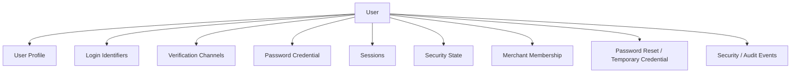
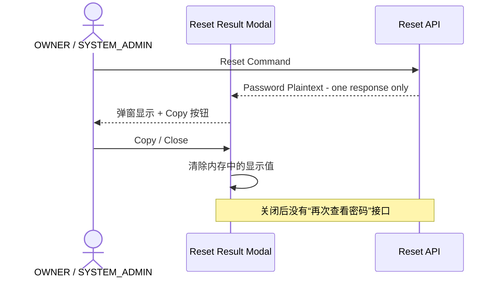

# 01.3 — 用户资料与账号管理详细设计

# 1. 用户信息组件



# 2. User Profile

平台级普通资料：

```text
display_name
avatar
locale / timezone（如需要）
created_at
```

# 3. Login Identifier / Verification Channel

首期支持：

```text
PHONE
EMAIL
```

一个 User 可以同时绑定手机号和邮箱。

# 4. STAFF Membership

已冻结：

```text
一个 STAFF 账号
→ 一个 Merchant
```

因此 OWNER 编辑 STAFF 不再存在“同时修改另一家店 STAFF Membership”的正常业务场景。

但仍坚持：

```text
OWNER 管理的是本店 Membership
不是员工的全局 User Security Identity
```

# 5. 用户自己编辑普通资料

用户可修改允许自助修改的 Profile 字段，但不能通过普通资料编辑改变：

```text
Role
Merchant
Permissions
User Status
Membership Status
```

# 6. 修改手机号 / 邮箱

修改 Identifier 必须：

1. 重新验证当前账号；
2. 验证新手机号 / 邮箱；
3. 检查规范化 Identifier 唯一性；
4. 事务更新；
5. 记录安全事件。

如果删除后会失去所有可恢复渠道，应拒绝删除。

# 7. OWNER 账号管理范围

OWNER 可以：

```text
查看 STAFF
修改店内显示资料
配置 STAFF 权限
停用 / 恢复 STAFF Membership
随机重置 STAFF 临时密码
查看本 Merchant 操作记录
```

OWNER 不可以：

```text
读取原密码
直接查询已经生成过的临时密码
修改 STAFF 的平台级安全状态
无验证修改手机号 / 邮箱
```

# 8. SYSTEM_ADMIN 账号管理

SYSTEM_ADMIN 可以：

```text
查看 User / Membership / Session 摘要
停用 / 恢复
强制全部下线
随机密码重置
管理员输入密码重置
要求自助恢复
调整安全状态
```

所有高风险操作必须 Audit。

# 9. 一次性密码弹窗

OWNER / SYSTEM_ADMIN 执行产生“可见密码”的重置后：



前端不得把该明文写入普通本地存储、日志、Analytics 或 Crash Report。

# 10. 账号删除

存在业务历史或审计依赖的 User 不物理删除，只停用 / 归档。
