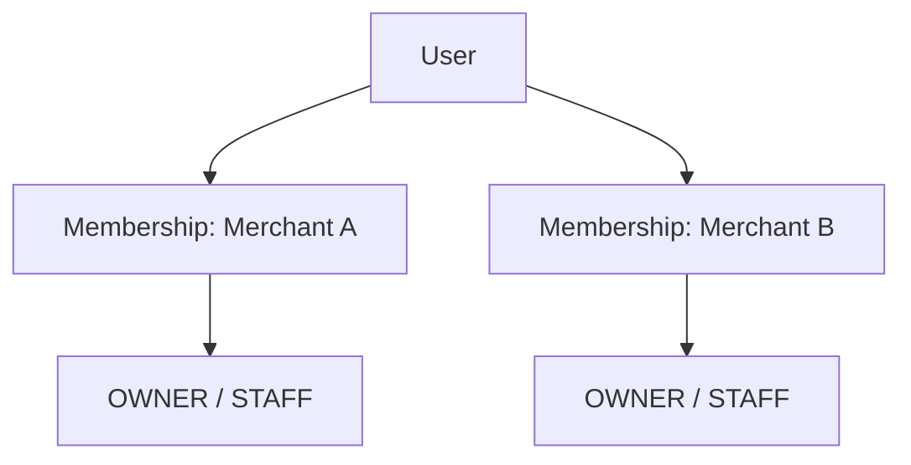
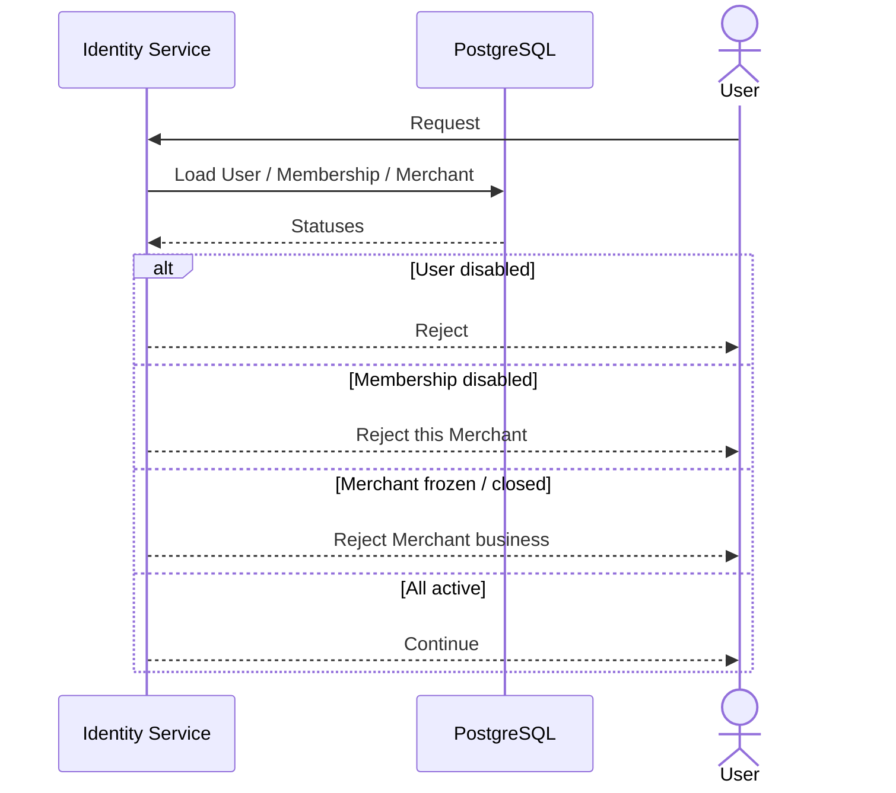
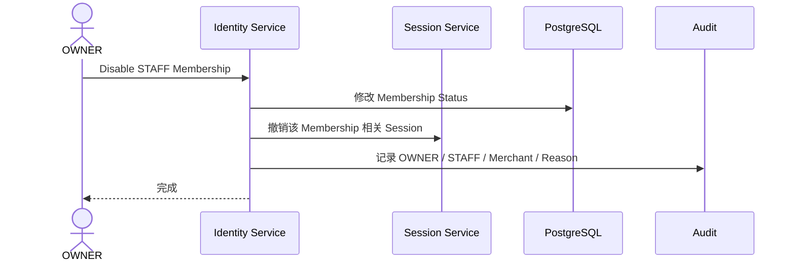
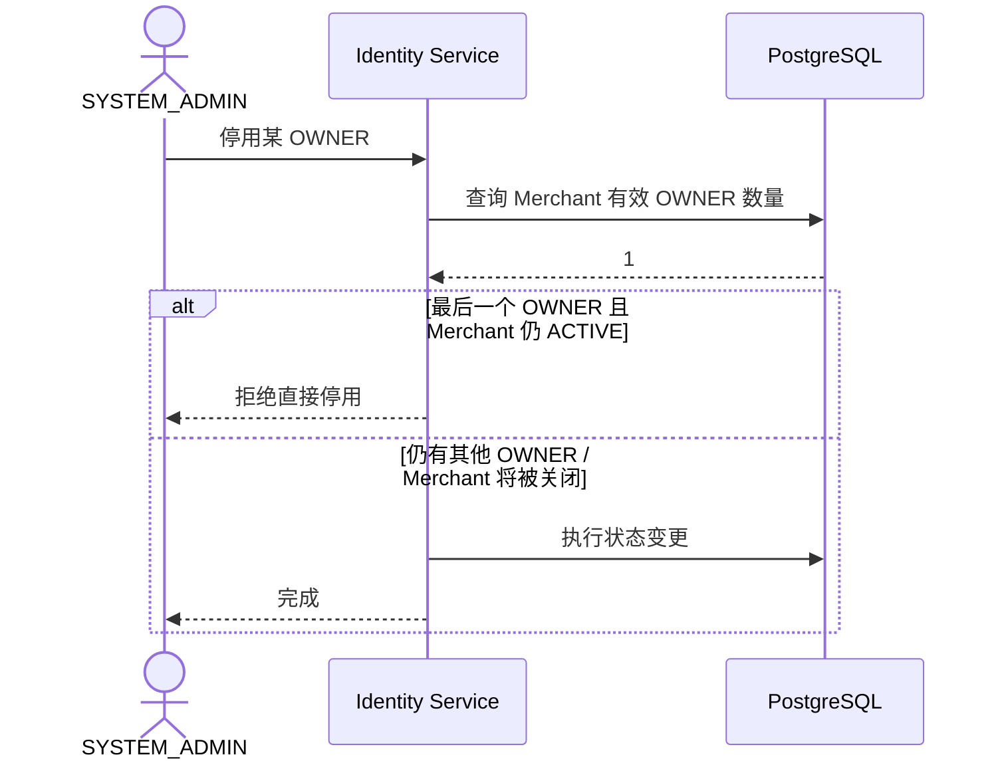

# 01.3 — 账号状态与商户成员关系详细设计

# 1. User 与 Membership 分离



系统底层建议允许一个 User 拥有多个 Membership。第一版产品是否开放多 Merchant 使用后续决定。

# 2. 状态层级

账号是否能工作至少需要：

```text
User Status
Membership Status
Merchant Status
```



# 3. STAFF 停用



历史业务记录不删除。

# 4. 历史操作者保留

```text
不能登录
≠
历史身份被删除
```

# 5. 最后一个 OWNER

当前建议：一个 Merchant 不允许在仍然正常营业的状态下失去最后一个有效 OWNER。



# 6. 待确认决策

1. 一个 User 是否允许多 Merchant Membership；
2. 一个 Merchant 是否允许多个 OWNER；
3. STAFF 是否可被转移到另一个 Merchant；
4. 是否允许物理删除从未产生业务记录的测试账号；
5. Merchant 关闭后多久允许彻底归档。
