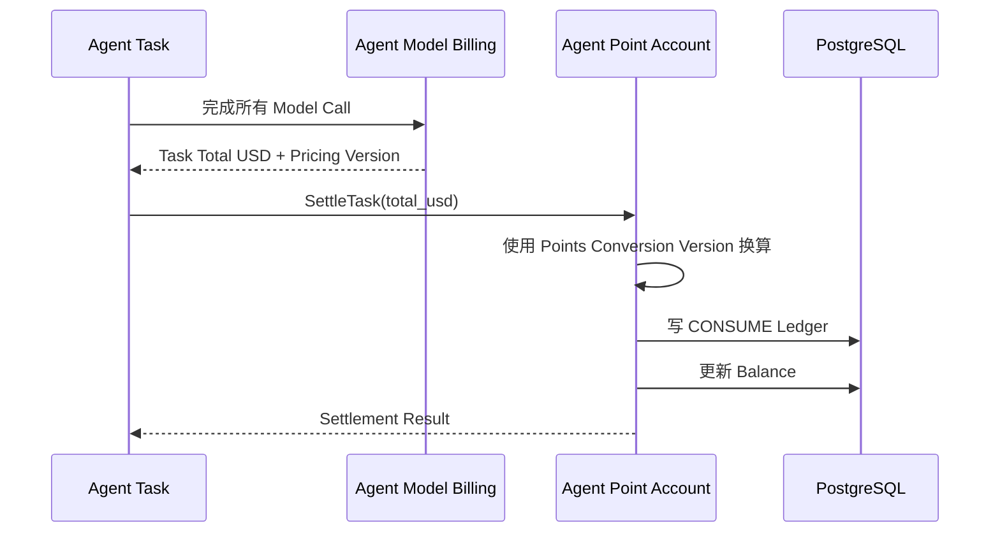
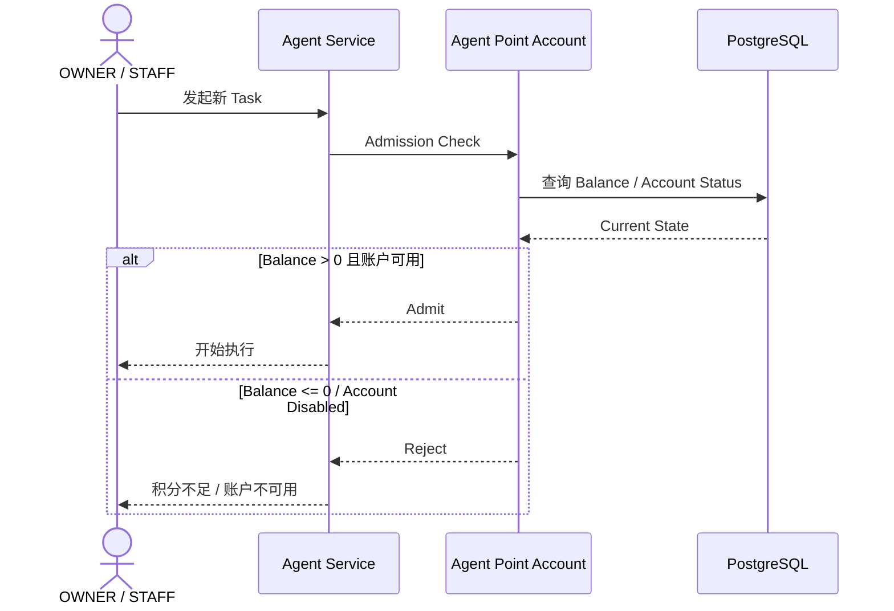
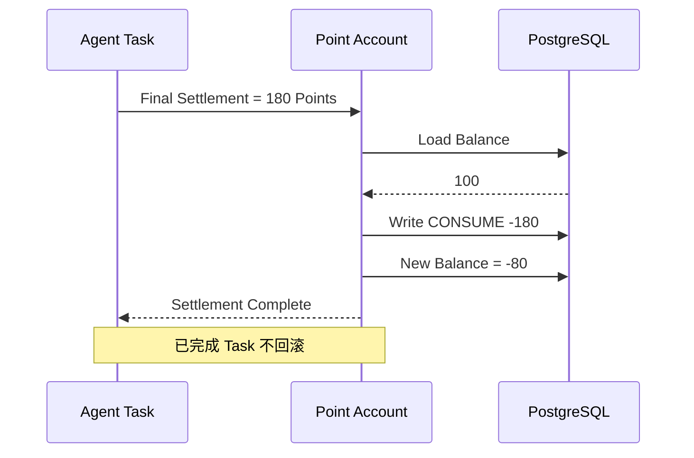
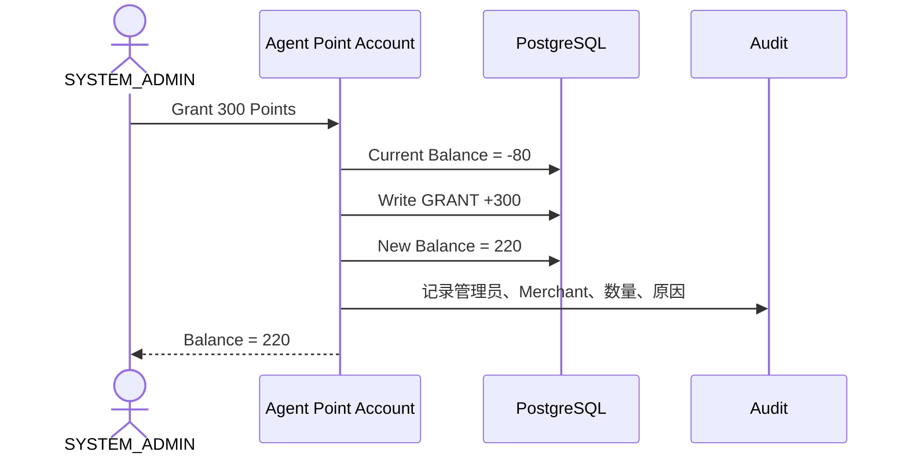
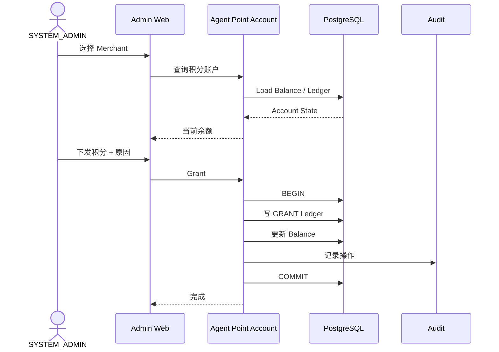

# 01.4 — Agent 积分账户详细设计

> Agent 积分属于账户与身份模块。  
> Agent 模块负责模型调用与 Token 美元成本；本模块负责 Merchant 积分账户、换算、余额、流水和 Task 准入。

# 1. 账户归属

当前冻结：

```text
一个 Merchant
→ 一个 Agent Point Account
```

OWNER / STAFF 使用 Agent 时，都消耗所属 Merchant 的积分账户。

# 2. 与 Agent 模块的边界



Agent 模块不修改积分余额。

# 3. Task 准入



# 4. 已准入 Task 可把余额扣成负数



Task 一旦获得准入，就必须允许执行到本次任务完成。

# 5. 后续下发积分自动抵扣负数



```text
new_balance = old_balance + ledger_amount
```

负数无需单独“还款”。

# 6. 积分流水

至少支持：

```text
GRANT
CONSUME
ADJUST
REFUND
```

建议流水包含：

```text
merchant
task_id（如适用）
type
amount
balance_before
balance_after
reason
operator
conversion_version
created_at
```

# 7. USD → Points 换算

模型的 Input / Output / Cache USD 定价属于 Agent 模块。

账户模块只接收：

```text
Task Total USD
```

再按 SYSTEM_ADMIN 配置的 `USD → Points Conversion Version` 完成积分结算。

历史 Task 保存其使用的 conversion version，不被后续比例修改重算。

# 8. SYSTEM_ADMIN 下发积分



# 9. 并发 Task

多个 Task 可以在余额 > 0 时近乎同时通过准入，最终导致更大的负余额。

当前原则仍是：**已准入 Task 必须完成。**

后续实现阶段可讨论并发任务数量限制、最低启动积分阈值或预留额度，但不改变负余额 + 后续充值抵扣规则。
