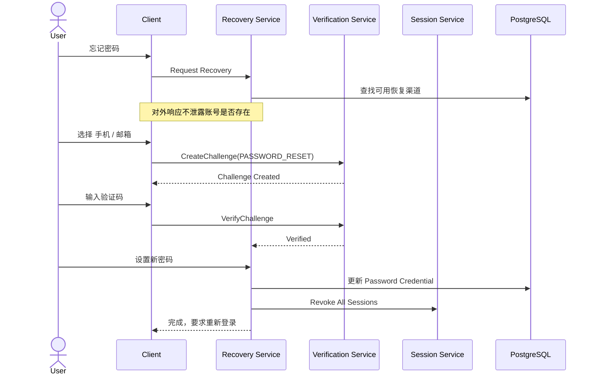
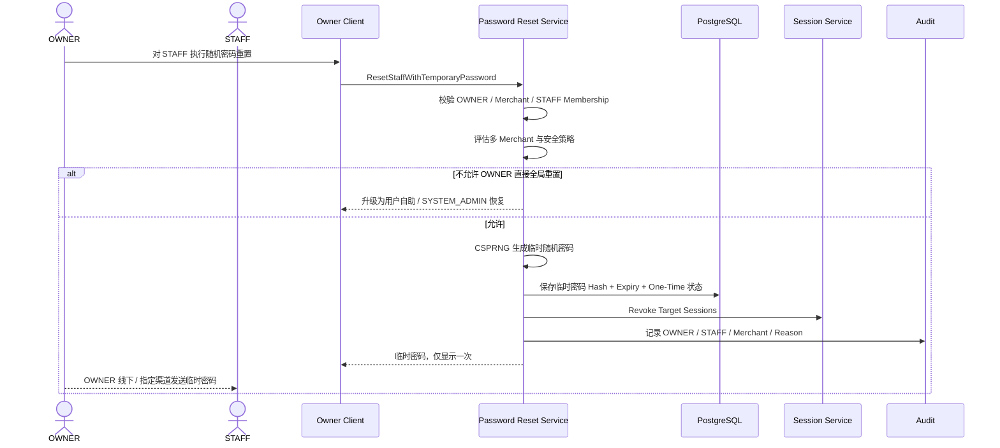
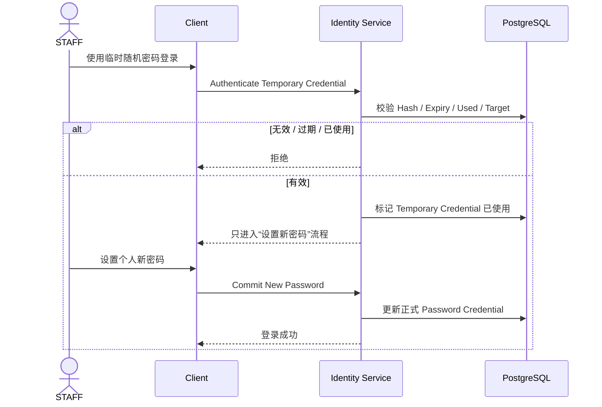

# 01.4 — 密码与账号恢复详细设计

> 当前正式支持三类恢复路径：
>
> 1. 用户手机号 / 邮箱自助恢复；
> 2. OWNER 为本 Merchant STAFF 执行“随机临时密码重置”；
> 3. SYSTEM_ADMIN 可对 OWNER / STAFF 执行随机临时密码重置，也可要求用户走自助恢复。

# 1. 核心原则

```text
任何管理员都不能读取用户原密码
密码数据库不保存明文
随机临时密码只显示一次
临时密码必须强制用户首次登录后修改
```

正式密码建议使用 Argon2id 或同等级现代 KDF，参数版本化以便未来升级。

# 2. 自助忘记密码

用户可从本人已验证且系统启用的：

```text
PHONE
EMAIL
```

中选择恢复方式。



# 3. OWNER 随机重置 STAFF 密码

用户要求的正式行为：

> OWNER 可以将本 Merchant STAFF 的密码重置为系统生成的一段随机字符，并由 OWNER 发送给 STAFF。



STAFF 使用临时密码：



## 3.1 临时密码安全属性

```text
CSPRNG 生成
管理员不可自定义固定弱密码
明文只返回一次
数据库只保存 Hash
一次性使用
短 TTL
首次使用强制改密
不能直接进入经营页面
```

# 4. 多 Merchant 边界：OWNER 不能越权接管全局账号

一个 User 可能同时属于 Merchant A / Merchant B。

正式 Password Credential 属于 User，因此 A 店 OWNER 若直接替 STAFF 重置全局密码，会影响 B 店。

因此增加关键规则：

```text
若目标 User 只有当前一个 ACTIVE Merchant Membership
→ OWNER 可执行随机临时密码重置

若目标 User 同时属于多个 ACTIVE Merchant
→ OWNER 不能直接重置全局密码
→ 只能发起 Recovery Request
→ 用户通过 PHONE / EMAIL 自助恢复
   或 SYSTEM_ADMIN 处理
```

这样满足店长管理员工，又不让 A 店店长获得影响 B 店账号的全局权限。

# 5. SYSTEM_ADMIN 密码重置

SYSTEM_ADMIN 可选择：

```text
TEMPORARY_RANDOM_PASSWORD
SELF_SERVICE_RECOVERY_REQUIRED
```

## 5.1 随机临时密码

流程与 OWNER 类似，但 SYSTEM_ADMIN 权限是平台级，可用于 OWNER / STAFF；必须填写原因并完整 Audit。

## 5.2 要求用户自助恢复

SYSTEM_ADMIN 可：

```text
标记 PASSWORD_RESET_REQUIRED
撤销所有 Session
用户必须通过 PHONE / EMAIL 验证后设置新密码
```

# 6. Password Reset Strategy

采用 Strategy Pattern：

```text
PasswordResetStrategy
├── SelfServiceVerifiedReset
├── OwnerTemporaryPasswordReset
└── AdminTemporaryPasswordReset
```

后续若增加 Passkey Recovery 等，不修改 Recovery 主流程。

# 7. 临时密码生成算法

建议：

- 使用 CSPRNG；
- 长度 / 字符集由 SYSTEM_ADMIN 安全配置给出最小策略；
- 避免易混字符可提高人工转发可读性；
- 熵必须达到安全下限；
- 只保存 Argon2id / HMAC verifier；
- 临时凭据设置 `expires_at`、`used_at`、`attempt_count`；
- 校验使用常量时间比较。

# 8. 防账号枚举

忘记密码接口**不能公开返回**：

```text
这个手机号不存在
这个邮箱不存在
```

统一返回：

```text
如果该账号存在且恢复渠道可用，我们已发送恢复信息。
```

内部系统仍记录真实结果用于安全分析。

# 9. 边界条件

- 多次 Recovery Challenge：仅最新有效 Challenge 可完成；
- 重置密码不自动把 DISABLED User 恢复 ACTIVE；
- STAFF Membership 被停用后即使拿到旧临时密码也不能进入经营业务；
- 临时密码使用成功后立即失效；
- 临时密码泄漏 / 多次错误尝试触发风险事件；
- OWNER 自己忘记密码：优先自助 PHONE / EMAIL；无法恢复时由 SYSTEM_ADMIN 处理；
- SYSTEM_ADMIN 自己的账号恢复不能由本人绕过验证完成，应由另一个有权限的 SYSTEM_ADMIN 或部署级恢复机制处理；
- 同一 Reset Command 需要 Idempotency Key，避免点击两次生成多个并行有效临时密码。
