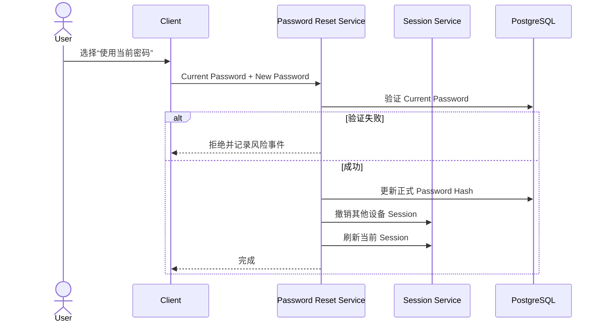
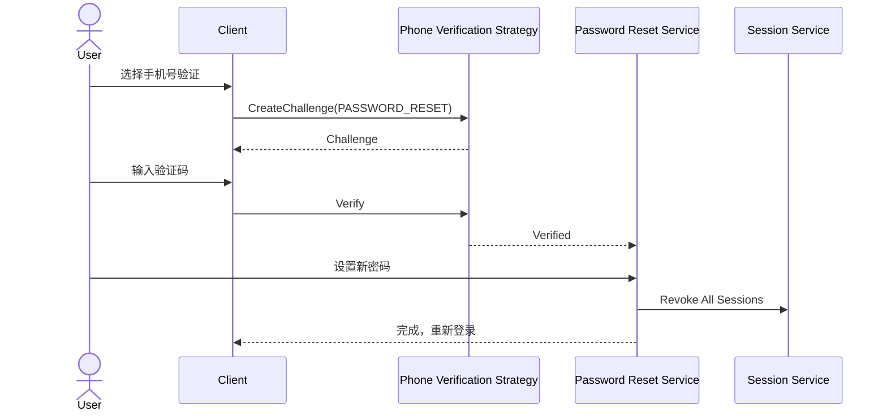
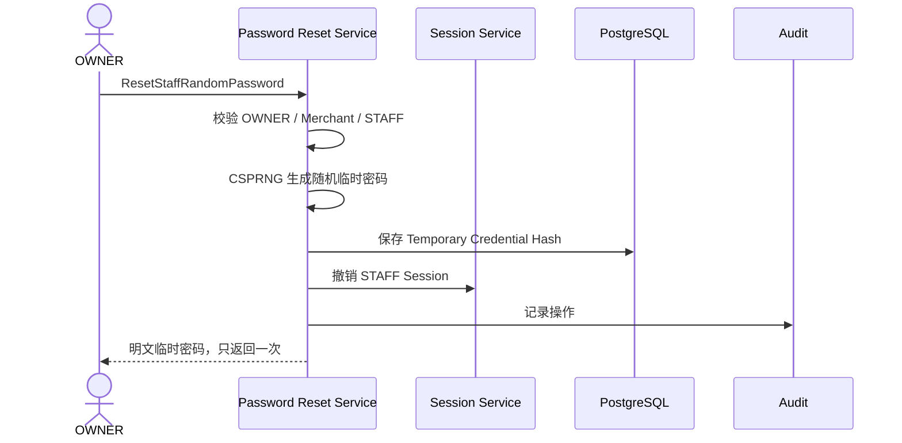
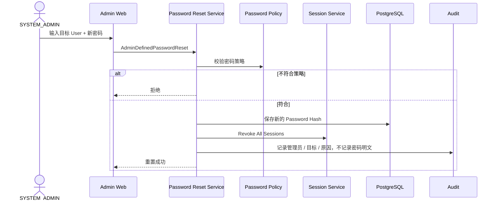

# 01.4 — 密码与账号恢复详细设计

# 1. 密码重置总体设计

用户自己重置密码有三条正式路径：

```text
SELF_CURRENT_PASSWORD
SELF_PHONE_VERIFICATION
SELF_EMAIL_VERIFICATION
```

管理侧：

```text
OWNER_RANDOM_TEMPORARY_PASSWORD
ADMIN_RANDOM_TEMPORARY_PASSWORD
ADMIN_DEFINED_PASSWORD
ADMIN_REQUIRE_SELF_RECOVERY
```

采用 Strategy Pattern：

```text
PasswordResetStrategy
├── SelfCurrentPasswordReset
├── SelfPhoneVerifiedReset
├── SelfEmailVerifiedReset
├── OwnerRandomTemporaryReset
├── AdminRandomTemporaryReset
├── AdminDefinedPasswordReset
└── AdminRequireSelfRecovery
```

# 2. 用户已有密码验证后修改

适用于用户知道当前密码、只是主动换密码。



# 3. 用户手机号验证后重置



# 4. 用户邮箱验证后重置

流程与手机号一致，只替换为 Email Verification Strategy。

# 5. 忘记密码防账号枚举

忘记密码接口不能公开返回：

```text
这个手机号不存在
这个邮箱不存在
```

统一响应：

```text
如果该账号存在且恢复渠道可用，我们已发送恢复信息。
```

# 6. OWNER 随机重置 STAFF

一个 STAFF 账号只能对应一个 Merchant，因此 OWNER 对本店 STAFF 进行随机临时密码重置不会影响第二家店 STAFF Membership。



# 7. 一次性可见弹窗

成功后 UI：

```text
显示临时密码
提供 Copy
允许手工选中
关闭后立即从 UI 状态清除
以后无法再次查看
```

服务端：

```text
仅创建命令响应返回一次明文
DB 只存 Hash
没有 GET plaintext password API
日志 / Audit 不记录明文
```

如果 OWNER 关闭弹窗前没有复制，只能重新执行一次新的 Reset，旧临时凭据同时失效。

# 8. STAFF 使用临时密码

临时密码：

```text
一次性
有 TTL
有最大尝试次数
首次登录只能进入设置新密码流程
```

设置正式密码成功后 Temporary Credential 立即失效。

# 9. SYSTEM_ADMIN 重置方式

SYSTEM_ADMIN 可以选择：

## 9.1 系统随机密码

与 OWNER Random Reset 类似，但可作用于 OWNER / STAFF。

## 9.2 管理员输入密码

SYSTEM_ADMIN 可以输入一个新密码：



管理员输入的密码是可用于登录的有效密码。

为了安全，建议默认标记：

```text
PASSWORD_CHANGE_RECOMMENDED
```

是否强制首次登录修改由 SYSTEM_ADMIN 的安全策略配置决定。

## 9.3 要求用户自助恢复

SYSTEM_ADMIN 可直接设置 `PASSWORD_RESET_REQUIRED` 并撤销所有 Session。

# 10. 管理员输入密码的显示边界

管理员自己输入的密码不需要服务器再次长期提供。

重置成功 UI 可以显示一次确认框：

```text
重置成功
[显示 / 隐藏]
[复制]
[关闭]
```

关闭后系统仍不能再次查询该明文。

# 11. 密码算法

正式密码：

- 使用 Argon2id 或同级现代 KDF；
- 每个 Credential 独立 salt；
- 参数版本化，登录成功时可 opportunistic rehash；
- 不保存明文，不可逆加密保存。

临时随机密码：

- CSPRNG；
- 熵达到系统安全下限；
- 数据库保存 Hash；
- 一次性和 TTL。

# 12. 幂等与重复点击

每个 Reset Command 带 Idempotency Key。

同一个命令重复提交只能返回同一“已执行结果状态”，**不能为了重放响应再次返回旧密码明文**。

如果客户端丢失首次明文响应，只能重新创建新的 Reset。

# 13. 边界条件

- STAFF 被停用后临时密码不能恢复其 Membership；
- User 被全局 DISABLED 后密码重置不自动恢复 User；
- PASSWORD_RESET_REQUIRED 状态只允许进入恢复相关 API；
- 临时密码错误尝试进入 Risk Engine；
- OWNER 不允许手工指定 STAFF 密码；OWNER 使用系统随机临时密码；
- SYSTEM_ADMIN 可以随机生成，也可以管理员输入；
- SYSTEM_ADMIN 自己不能绕过验证给自己重置，应由另一 SYSTEM_ADMIN 或部署级恢复机制处理；
- 手机 / 邮箱 Provider 不可用时，可以选择另一已验证渠道；不自动静默切换。
