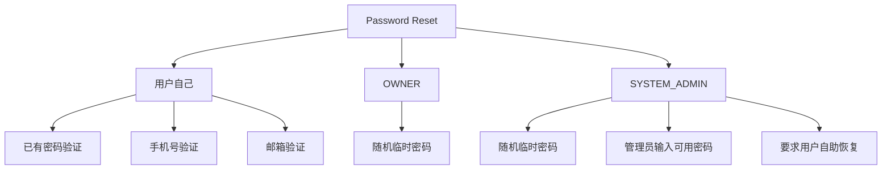
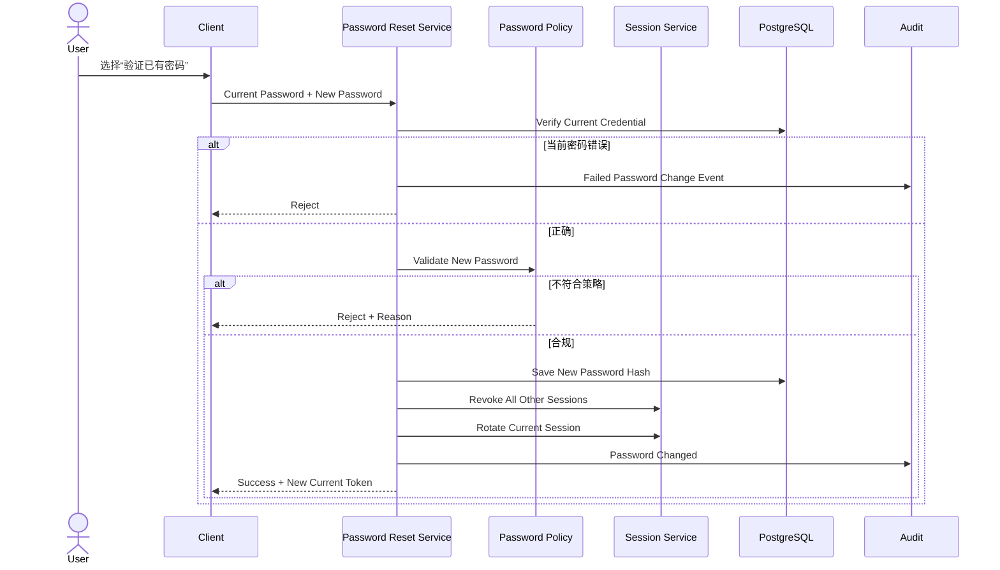
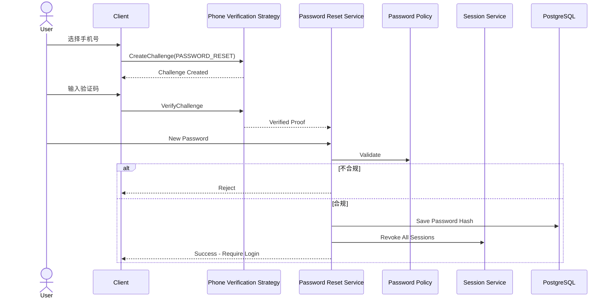
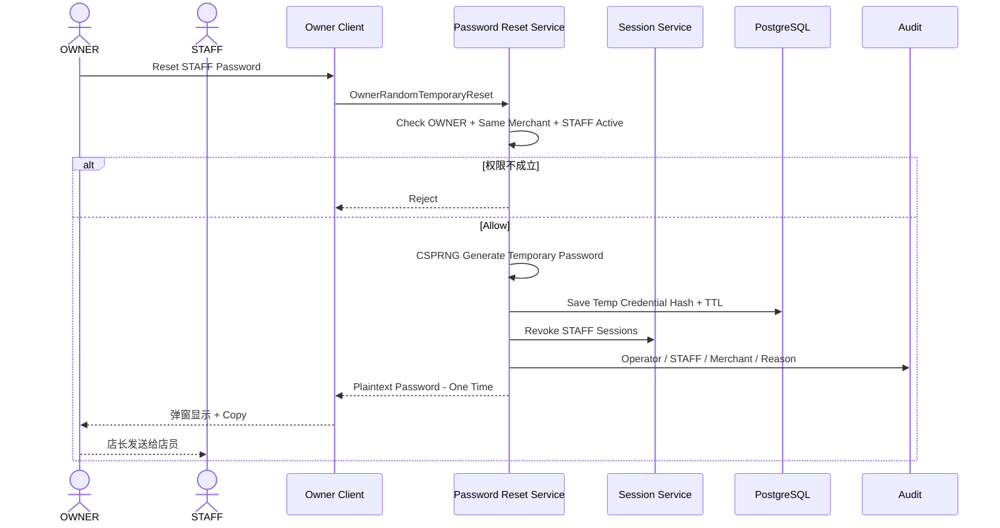
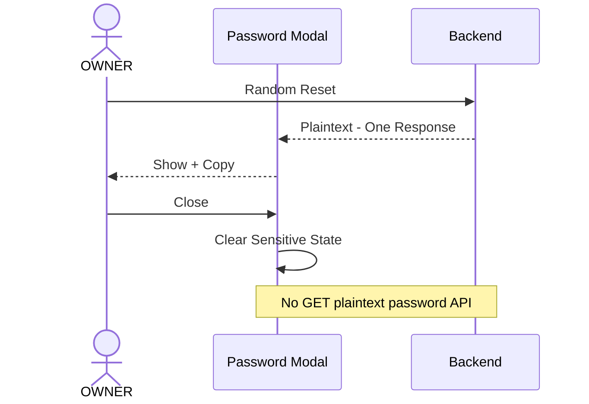
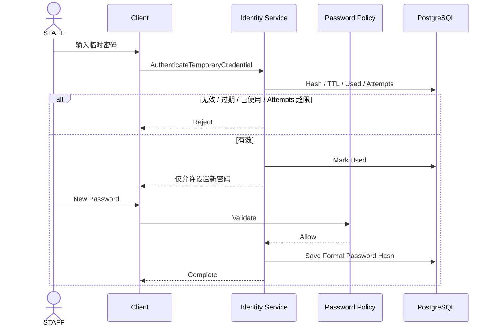
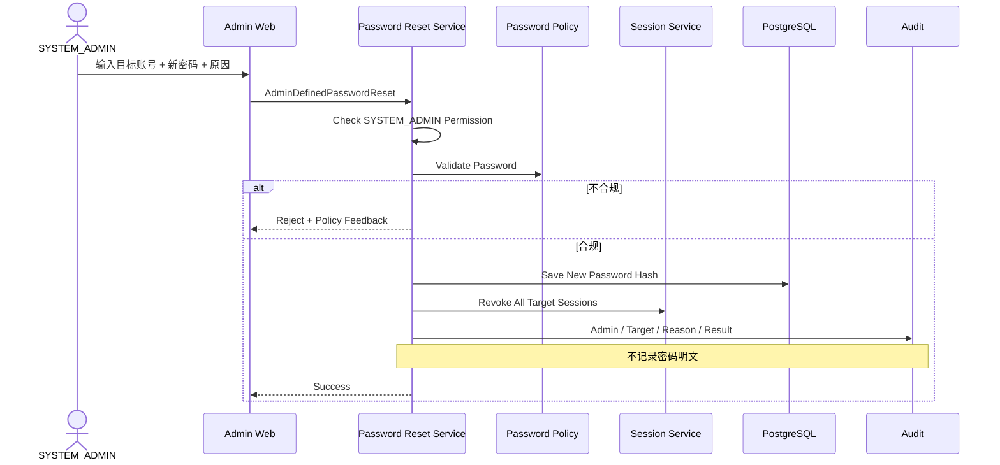

# 01.4 — 密码与账号恢复详细设计

> 本文完整记录用户自助改密、忘记密码、OWNER 重置 STAFF、SYSTEM_ADMIN 随机重置和管理员直接设置密码的行为。

---

# 1. Password Reset 不是一个流程

当前正式 Strategy：

```text
用户自己：
1. SELF_CURRENT_PASSWORD
2. SELF_PHONE_VERIFICATION
3. SELF_EMAIL_VERIFICATION

OWNER：
4. OWNER_RANDOM_TEMPORARY_PASSWORD

SYSTEM_ADMIN：
5. ADMIN_RANDOM_TEMPORARY_PASSWORD
6. ADMIN_DEFINED_PASSWORD
7. ADMIN_REQUIRE_SELF_RECOVERY
```



---

# 2. Strategy Pattern

```text
PasswordResetStrategy
├── SelfCurrentPasswordReset
├── SelfPhoneVerifiedReset
├── SelfEmailVerifiedReset
├── OwnerRandomTemporaryReset
├── AdminRandomTemporaryReset
├── AdminDefinedPasswordReset
└── AdminRequireSelfRecovery
```

主流程：

```text
Resolve Strategy
→ Authorization / Policy
→ Execute Reset
→ Session Handling
→ Security Event
→ Audit
```

这样以后新增 Passkey Recovery 不改已有流程。

---

# 3. 用户知道当前密码



不发送 PHONE / EMAIL Challenge。

---

# 4. 用户通过 PHONE 重置



忘记密码成功后重新登录，不继承旧 Session。

---

# 5. 用户通过 EMAIL 重置

与 PHONE 完全同一主流程，只更换 Email Verification Strategy。

Password Reset Service 不直接依赖 SMTP / Email API。

---

# 6. 防账号枚举

匿名 Forgot Password 不能返回：

```text
“这个手机号不存在”
“这个邮箱不存在”
```

对外统一：

```text
如果该账号存在且恢复渠道可用，我们已发送恢复信息。
```

内部 Security Event 仍记录真实结果，但不回显给匿名调用者。

---

# 7. OWNER 随机重置 STAFF

OWNER 不自己输入 STAFF 密码。



---

# 8. 临时密码属性

必须：

```text
CSPRNG
足够熵
短 TTL
一次性
最大尝试次数
DB 只保存 Hash
明文只在创建响应一次返回
日志 / Audit 不记录
第一次使用只能进入设置正式密码
```

OWNER 不允许自行填：

```text
123456
abc123
员工生日
```

---

# 9. 一次性弹窗

```text
Reset Success
→ Modal
→ Show
→ Copy
→ Close
→ Clear
→ 永久无法再次查看旧明文
```



如果忘记复制，只能执行新的 Reset；新的 Reset 使旧临时密码失效。

---

# 10. STAFF 使用临时密码



临时密码不能直接进入经营首页。

---

# 11. SYSTEM_ADMIN 随机重置

SYSTEM_ADMIN 可以对 OWNER / STAFF 使用随机 Reset。

与 OWNER 区别：

- 平台级范围；
- 可以作用于 OWNER；
- 必须写原因；
- 必须 Audit；
- 仍然只显示一次明文。

---

# 12. SYSTEM_ADMIN 直接输入可用密码

用户已经明确：

> SYSTEM_ADMIN 可以自己输入一个新密码，这个密码保存后就是可以正常登录的正式密码。



如果未来需要“下次必须修改”，应作为管理员明确选择的额外动作，而不是默认改变 Admin Defined Password 的含义。

---

# 13. SYSTEM_ADMIN 要求自助恢复

另一个动作：

```text
PASSWORD_RESET_REQUIRED
```

SYSTEM_ADMIN 标记状态并撤销 Session。

用户只能通过 PHONE / EMAIL Recovery 完成后再恢复正常登录。

---

# 14. 正式密码存储

建议：

- Argon2id 或同等级现代 KDF；
- 每个 Credential 独立 Salt；
- 参数版本化；
- 登录成功可 Opportunistic Rehash；
- 禁止可逆保存。

SYSTEM_ADMIN 输入的密码也立即 Hash。

---

# 15. Password Policy

SYSTEM_ADMIN 配置 Policy，例如：

```text
min_length
max_length
common_password blacklist
identifier similarity
password history（如果启用）
```

管理员直接设置也不能绕过同一 Policy。

---

# 16. Reset Idempotency 特殊规则

普通 Idempotency 希望重放返回相同结果。

随机密码 Reset 例外：

- 第一次成功返回明文；
- 服务端不保存可回读明文；
- 同 Idempotency Key 重放只返回“已执行”；
- 不再次返回旧密码；
- 如明文丢失，创建新的 Reset。

---

# 17. 边界条件

- User DISABLED：重置密码不会自动 ACTIVE；
- Membership DISABLED：拿临时密码也不能经营；
- 临时密码过期：重新 Reset；
- 临时密码成功后立即失效；
- 多次 Reset：新临时凭据使旧凭据失效；
- PHONE Provider 不可用可让用户显式选 EMAIL；
- OWNER 自己无法自助恢复时由 SYSTEM_ADMIN；
- SYSTEM_ADMIN 不能给自己绕过恢复；
- 管理员输入密码必须记录原因；
- Audit 不记录密码明文；
- Random Reset 错误尝试进入 Risk Engine。

---

# 18. 已冻结规则

1. 用户自助：当前密码 / PHONE / EMAIL；
2. OWNER 只随机重置 STAFF；
3. OWNER 不手工设置 STAFF 密码；
4. 随机密码弹窗一次性显示；
5. 关闭后无法再次查看；
6. SYSTEM_ADMIN 可随机；
7. SYSTEM_ADMIN 可直接输入正式可用密码；
8. SYSTEM_ADMIN 可要求用户自助恢复；
9. 临时密码首次使用强制设置正式密码；
10. DB 只保存 Hash；
11. 重置会处理 Session；
12. Forgot Password 不暴露账号存在性。
