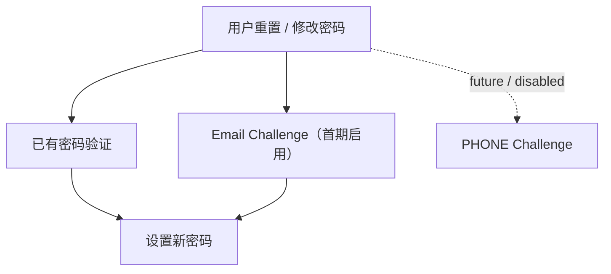
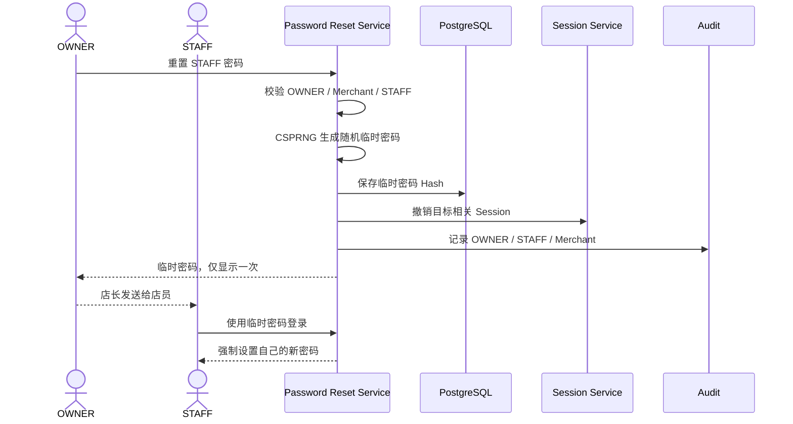
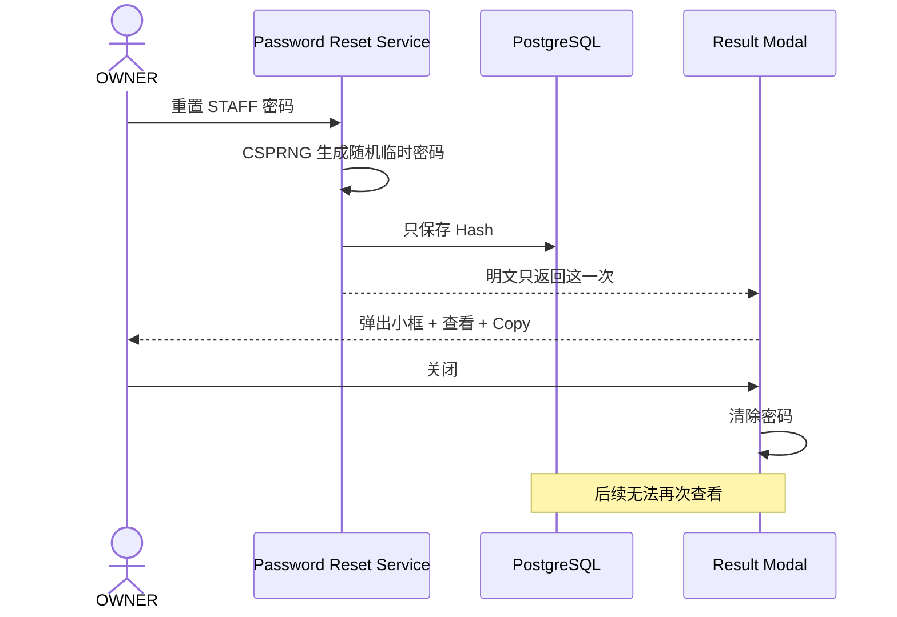
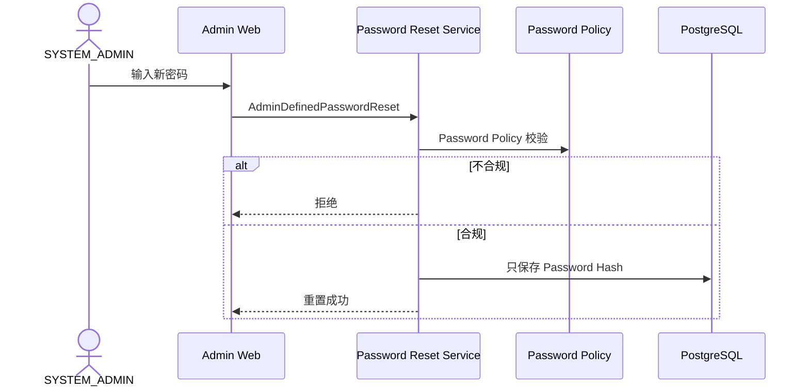
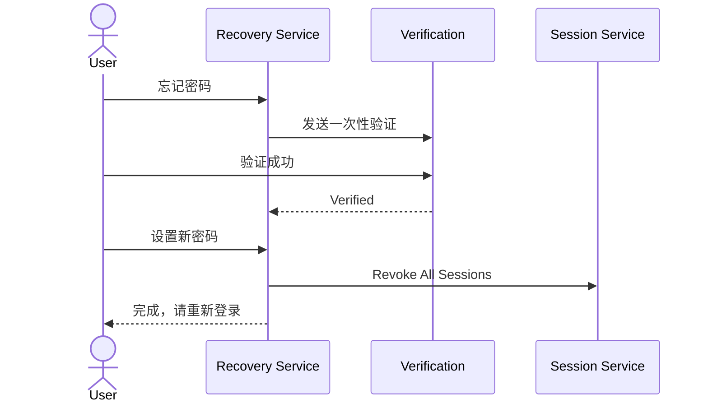
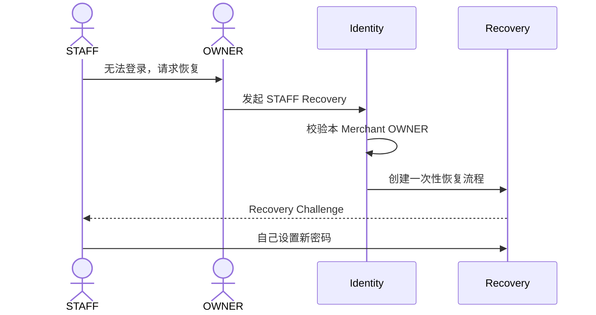
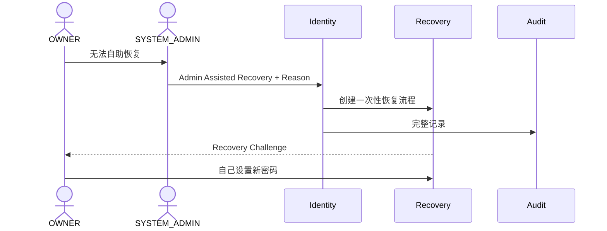
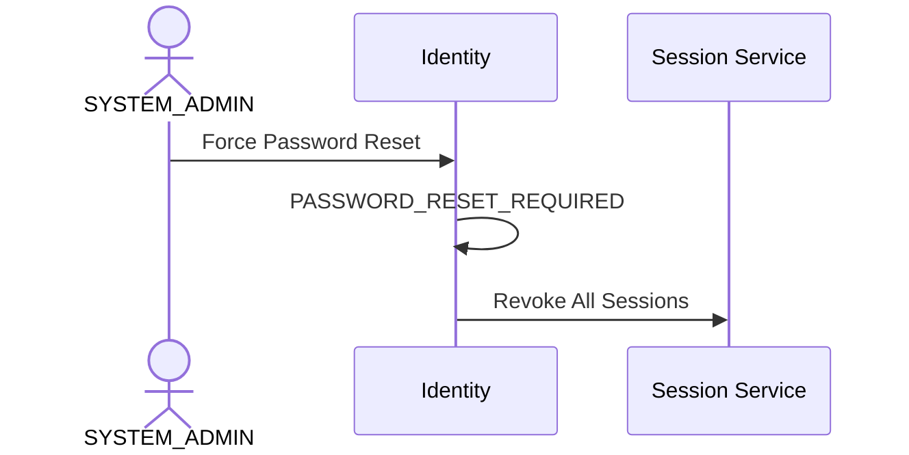
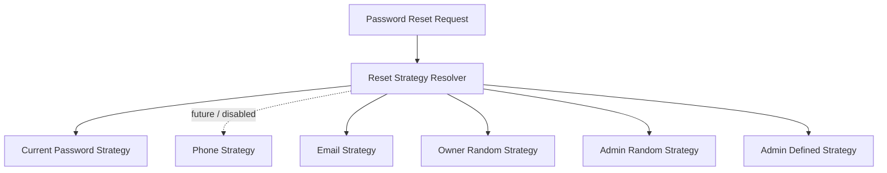
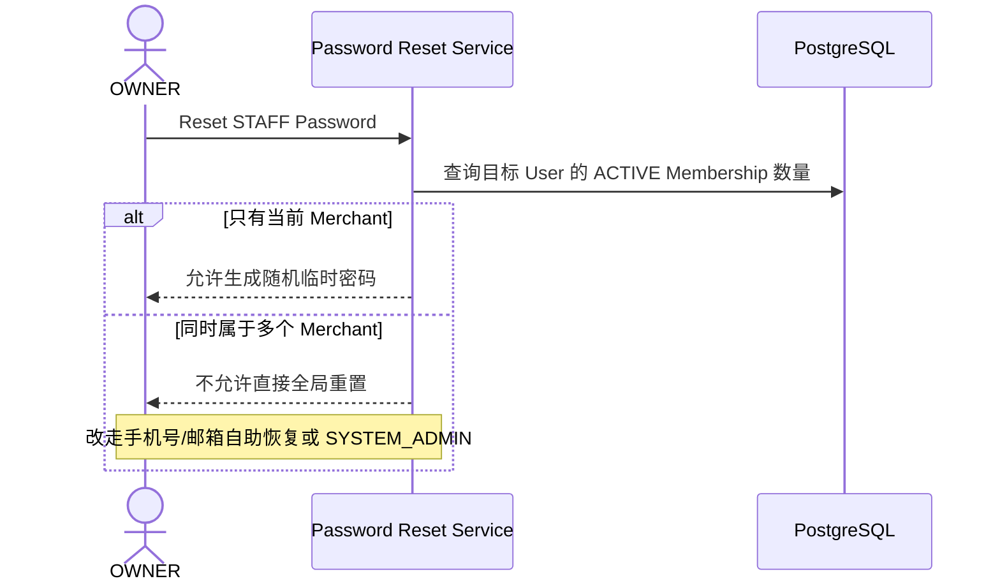

# 01.4 — 密码与账号恢复

> 来源：ChatGPT 分享对话（第 36 ~ 41 轮）完整提取与整理
> 对应对话中最终形成的文档：`master-goods-system-design-v3/01-账户与身份/04-密码与账号恢复.md`
> 子模块详细设计。保留对话中全部时序图、规则与边界。

---

# 1. 设计目标

回答：

```text
用户自己怎样改 / 找回密码？
OWNER 怎样重置 STAFF 密码？
SYSTEM_ADMIN 怎样随机重置或直接设置密码？
临时密码怎样显示与失效？
忘记密码怎样防止账号枚举？
高风险怎样判断？
```

---

# 2. 密码体系总览（已冻结）

用户自己处理密码统一为三条路径：



**图示说明（2. 密码体系总览（已冻结））：** 这是责任或数据流图，核心节点包括 用户重置 / 修改密码。箭头表示调用、归属或数据流向；权限、Merchant 范围和状态判断必须在服务端完成，不能由客户端或单一 UI 分支替代。

```text
SELF_CURRENT_PASSWORD
SELF_EMAIL_VERIFICATION
```

"已有密码验证"适合用户知道旧密码、主动换密码；首期 Email Challenge 用于忘记密码或无法提供旧密码的情况。PHONE Strategy 保留扩展能力但默认禁用。

OWNER / SYSTEM_ADMIN 侧：

```text
OWNER：
└── 系统随机重置 STAFF 临时密码

SYSTEM_ADMIN：
├── 系统随机密码
├── 管理员指定密码
└── 强制用户自助恢复
```

> 来源：对话第 39、41 轮

---

# 3. OWNER 重置 STAFF（系统随机密码）

**OWNER 不能自己填写员工密码**，走系统随机密码：



**图示说明（3. OWNER 重置 STAFF（系统随机密码））：** 这是服务调用时序图，参与者包括 OWNER、STAFF、Password Reset Service、PostgreSQL。箭头表示一次调用或返回，alt/else 分支表示 Decision 的不同结果；事务提交前只做校验和状态准备，短信、邮件等外部副作用应在提交后通过 Outbox 执行。

显示弹窗版本：



**图示说明（3. OWNER 重置 STAFF（系统随机密码））：** 这是服务调用时序图，参与者包括 OWNER、Password Reset Service、PostgreSQL、Result Modal。箭头表示一次调用或返回，alt/else 分支表示 Decision 的不同结果；事务提交前只做校验和状态准备，短信、邮件等外部副作用应在提交后通过 Outbox 执行。

临时密码具有：

```text
随机生成
一次性
有过期时间
数据库不保存明文
店长只能看到创建时那一次
第一次使用必须修改
不能拿临时密码直接长期经营
```

如果店长没复制就关闭：

```text
不能"再查看"
只能重新 Reset
```

重新 Reset 会生成一个新的密码，旧临时密码失效。

> 来源：对话第 38、39 轮

---

# 4. SYSTEM_ADMIN 三种处理方式

| 模式 | 行为 |
|---|---|
| Random | 系统随机生成 |
| Admin Defined | SYSTEM_ADMIN 自己输入新密码 |
| Self Recovery | 强制用户通过 Email Challenge 自己恢复 |

### 方式 A：随机临时密码

```text
SYSTEM_ADMIN
→ Reset
→ 系统生成随机字符
→ 管理员发送给用户
→ 用户首次登录强制修改
```

### 方式 B：不接触密码（强制自助恢复）

```text
SYSTEM_ADMIN
→ PASSWORD_RESET_REQUIRED
→ 用户自己用 Email Challenge 验证
→ 设置新密码
```

### 方式 C：管理员自己输入密码



**图示说明（方式 C：管理员自己输入密码）：** 这是服务调用时序图，参与者包括 SYSTEM_ADMIN、Admin Web、Password Reset Service、Password Policy。箭头表示一次调用或返回，alt/else 分支表示 Decision 的不同结果；事务提交前只做校验和状态准备，短信、邮件等外部副作用应在提交后通过 Outbox 执行。

这个密码是**实际可以登录的密码**。系统管理员操作必须 Audit，但 Audit 里绝不能保存密码明文。

> 来源：对话第 38、39 轮

---

# 5. 一次性密码显示规则（已冻结）

对于系统生成的随机密码：

```text
Reset 成功
→ 弹窗
→ 可以显示
→ 可以 Copy
→ 关闭
→ 明文从前端状态清除
→ 后端没有再次查询明文的 API
```

前端不得把明文写进：

```text
日志
Analytics
Crash Report
普通本地存储
```

> 来源：对话第 39 轮

---

# 6. 忘记密码（防账号枚举）



**图示说明（6. 忘记密码（防账号枚举））：** 这是服务调用时序图，参与者包括 User、Recovery Service、Verification、Session Service。箭头表示一次调用或返回，alt/else 分支表示 Decision 的不同结果；事务提交前只做校验和状态准备，短信、邮件等外部副作用应在提交后通过 Outbox 执行。

**注意：忘记密码接口不能公开返回"这个手机号不存在"。** 否则容易被用来枚举系统账号。

> 来源：对话第 36、37 轮

---

# 7. STAFF 无法自助时的恢复

OWNER 可以帮助"发起恢复"，但不能知道新密码：



**图示说明（7. STAFF 无法自助时的恢复）：** 这是服务调用时序图，参与者包括 STAFF、OWNER、Identity、Recovery。箭头表示一次调用或返回，alt/else 分支表示 Decision 的不同结果；事务提交前只做校验和状态准备，短信、邮件等外部副作用应在提交后通过 Outbox 执行。

这样 OWNER 有员工管理能力，但没有员工账号密码控制权。

（第 38、39 轮更新：OWNER 也可以直接重置为系统随机临时密码，见第 3 节。）

> 来源：对话第 36 轮

---

# 8. OWNER 无法自助恢复时由 SYSTEM_ADMIN 处理

因为 OWNER 已经是店长：



**图示说明（8. OWNER 无法自助恢复时由 SYSTEM_ADMIN 处理）：** 这是服务调用时序图，参与者包括 OWNER、SYSTEM_ADMIN、Identity、Recovery。箭头表示一次调用或返回，alt/else 分支表示 Decision 的不同结果；事务提交前只做校验和状态准备，短信、邮件等外部副作用应在提交后通过 Outbox 执行。

SYSTEM_ADMIN 也不应该直接看到或者设置成一个自己知道的永久密码（除 Admin Defined 模式外）。

> 来源：对话第 36 轮

---

# 9. SYSTEM_ADMIN 强制密码重置

例如检测到账号有安全风险：



**图示说明（9. SYSTEM_ADMIN 强制密码重置）：** 这是服务调用时序图，参与者包括 SYSTEM_ADMIN、Identity、Session Service。箭头表示一次调用或返回，alt/else 分支表示 Decision 的不同结果；事务提交前只做校验和状态准备，短信、邮件等外部副作用应在提交后通过 Outbox 执行。

用户下次必须先重置密码。

> 来源：对话第 36 轮

# 10. Password Reset Strategy Resolver（封口设计）

目前已经确定的密码操作组合：

```text
SELF_CURRENT_PASSWORD
SELF_EMAIL_VERIFICATION

OWNER_RANDOM_TEMPORARY_PASSWORD

ADMIN_RANDOM_TEMPORARY_PASSWORD
ADMIN_DEFINED_PASSWORD
ADMIN_REQUIRE_SELF_RECOVERY
```

不能写成一个巨大：

```go
if owner ...
else if admin ...
else if email ...
```

而应该：



**图示说明（11. Password Reset Strategy Resolver（封口设计））：** 这是责任或数据流图，核心节点包括 Password Reset Request。箭头表示调用、归属或数据流向；权限、Merchant 范围和状态判断必须在服务端完成，不能由客户端或单一 UI 分支替代。

每个 Strategy 自己定义：

- 谁可以执行
- 需要什么验证
- Session 怎么处理
- 是否返回一次性明文
- 是否强制首次修改
- Audit 等级

映射关系（第 40 轮）：

```text
User + CURRENT_PASSWORD -> SelfCurrentPasswordReset
User + EMAIL -> SelfEmailVerifiedReset

OWNER + STAFF + RANDOM -> OwnerRandomTemporaryReset

SYSTEM_ADMIN + RANDOM -> AdminRandomTemporaryReset
SYSTEM_ADMIN + DEFINED -> AdminDefinedPasswordReset
SYSTEM_ADMIN + REQUIRE_RECOVERY -> AdminRequireSelfRecovery
```

未列组合默认 DENY。

> 来源：对话第 40、41 轮

---

# 11. Password Policy Engine

因为 SYSTEM_ADMIN 可以手工输入密码，Password Policy 不能写死在前端。

统一接口：

```text
PasswordPolicy.evaluate(password, context)
```

输出：

```text
PASS
或
FAIL + reasons
```

Policy 列表：

```text
LengthPolicy
CommonPasswordPolicy
IdentifierSimilarityPolicy
HistoryPolicy（如启用）
```

不建议只依靠：

```text
必须有大小写 + 数字 + 特殊字符
```

这种古老固定规则。更适合：

```text
最低长度
弱密码黑名单
近似熵 / guessability
上下文词检测
```

SYSTEM_ADMIN 直接设置也经过同一 Engine。

> 来源：对话第 40、41 轮

---

# 12. 算法与安全实现

## 13.1 临时随机密码

```text
CSPRNG
+
一次性
+
短有效期
+
Hash 保存
+
首次登录强制改密
```

## 13.2 验证码（Challenge）

```text
CSPRNG
+
Hash / MAC
+
TTL
+
Attempt Count
+
Constant-time Compare
```

数据库不存明文验证码。

## 13.3 临时凭据有效性

```text
exists
AND ACTIVE
AND now < expires_at
AND used_at IS NULL
AND attempts < max_attempts
AND target account not globally disabled
```

成功后立即标记 USED。

## 13.4 Session 全量撤销

`security_epoch` 递增（O(1)）：

```text
User.security_epoch += 1
```

当前设备若保留，重新签发新 epoch Token。

## 13.5 限流

```text
Sliding Window
或
Token Bucket
```

按 account / identifier / IP / device / purpose 限制。

> 来源：对话第 38、40 轮

---

# 13. 密码 / 恢复风险信号

登录风险：

```text
同一个账号短时间连续密码错误
同一个 IP / Device 尝试大量不同账号
同一账号突然出现大量不同设备
临时密码连续输入错误
被要求重置密码但仍持续尝试普通登录
```

手机 / 邮箱验证风险：

```text
短时间大量申请验证码
同一个验证码连续错误
同一手机号 / 邮箱被大量账号尝试
短时间大量密码恢复
```

Risk Engine 输出：

| Level | 行为 |
|---|---|
| LOW | 正常继续 |
| MEDIUM | 手机 / 邮箱二次验证 |
| HIGH | 临时阻断，要求恢复账号 |
| CRITICAL | 锁定高风险动作，由 SYSTEM_ADMIN 处理 |

SYSTEM_ADMIN 可管理风险规则（是否启用 / Weight / 阈值 / 验证码 TTL / 最大失败次数 / 冷却时间 / 限流策略），配置要版本化并审计。

> 来源：对话第 38 轮

---

# 14. 边界条件（第 38 轮补充）

```text
只有一个恢复渠道时不能直接删除
Provider 被管理员关闭后不删除历史已验证 Identifier
已有 Challenge 使用创建时配置版本
临时密码多次输错进入 Risk Engine
重置密码不能自动解除 DISABLED
已有 User + 新邀请码必须重新证明本人身份
Merchant 被关闭后邀请码禁止新增
同一 User + Merchant 不允许重复 Membership
SYSTEM_ADMIN 自己忘记密码时，不能"自己给自己恢复"
```

最后一条说明：

> 需要另一个有权限 SYSTEM_ADMIN 或部署级 Bootstrap / Recovery，防止一个管理员完全绕开身份验证。

> 来源：对话第 38 轮

---

# 15. 已冻结规则汇总

1. 用户自助改密首期两条路径：当前密码 / Email Challenge；PHONE Strategy 保留但默认禁用；
2. OWNER 重置 STAFF 密码走系统随机字符（不能自己填写），店长自行发送给员工；
3. 临时密码：随机生成、一次性、有过期时间、不存明文、只显示一次、首次登录强制改密；
4. 一次性密码弹窗可查看可复制，关闭后无法再次查看，后端无再次查询明细的 API；
5. SYSTEM_ADMIN 三种模式：随机生成 / 自己输入（经 Password Policy 校验）/ 强制自助恢复；
6. 忘记密码与登录接口不暴露账号是否存在；
7. OWNER / STAFF 单店规则下，OWNER 重置当前 Merchant 的 STAFF 密码不影响其他账号；
8. 密码操作全部映射为 Strategy，禁止巨型 if / else；
9. Audit 绝不保存密码明文；前端不得把明文写入日志 / Analytics / Crash Report / 普通本地存储；
10. 重置密码不能自动解除 DISABLED。

---

# 16. 待确认项

```text
建议正式密码至少 12 字符，启用弱密码黑名单，不强制大小写数字符号组合
建议随机临时密码约 16 字符，由 CSPRNG 生成；TTL 继续可配置
首期 Email Challenge：TTL 5 分钟、重发冷却 60 秒、单 Challenge 最多 5 次；数值可配置
```

---

# 附录 A：设计演进——多 Merchant 密码重置边界（历史方案）

以下内容只记录被废弃的多 Merchant 方案，不属于当前密码恢复规范。当前 `OWNER` 与 `STAFF` 均只能属于一个 Merchant，因此不存在同一 STAFF 在多个 Merchant 间共享全局密码而产生的跨店影响。

历史方案曾允许一个 User 属于多个 Merchant，店长重置密码前需要检查目标 User 的 Membership 数量：



**图示说明（附录 A：历史多 Merchant 密码重置边界）：** 这是被废弃的历史安全边界时序图，展示旧模型下跨 Merchant 密码重置的额外检查；当前单 Merchant 规范不使用该分支。

该检查属于历史兼容说明，当前实现不再走多 Merchant 分支。
