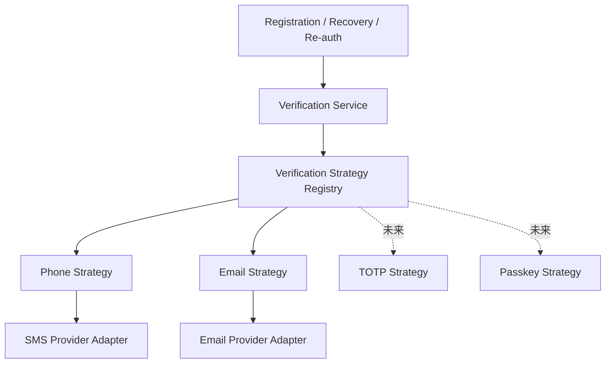
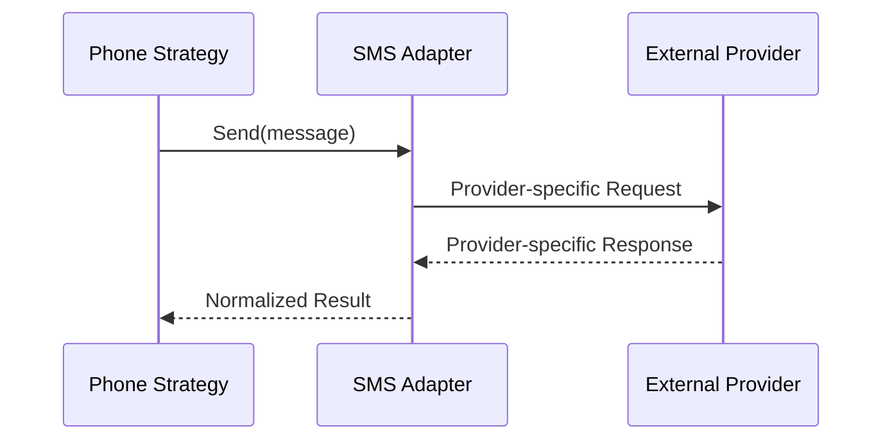
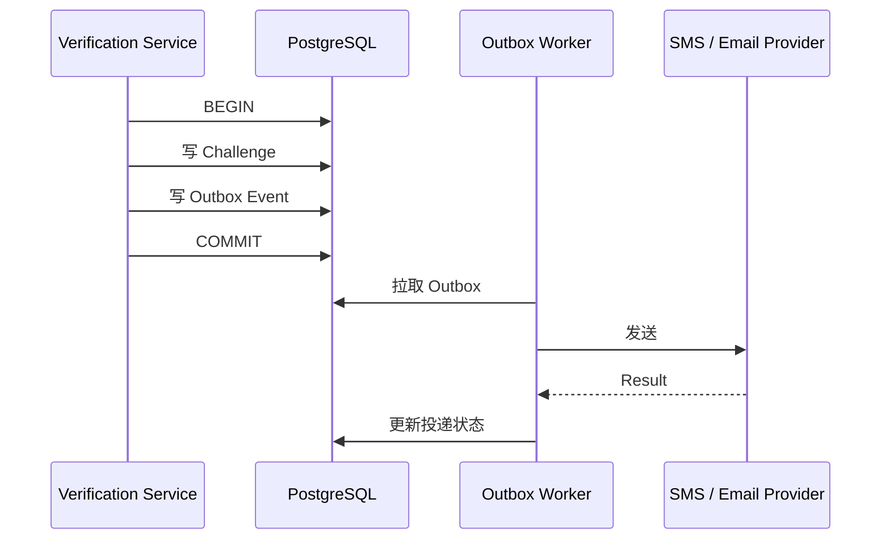
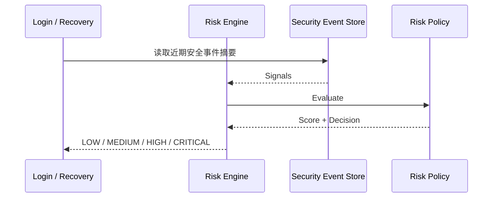

# 01.5 — 验证方式与安全策略详细设计

> 首期验证方式：**手机号 + 邮箱**。  
> 验证能力用于注册、忘记密码、修改账号、高风险操作、账号恢复。  
> 验证 Provider、风险规则和阈值均由 SYSTEM_ADMIN 管理配置。

# 1. 可扩展验证架构

采用：

```text
Strategy
+ Provider Registry / Factory
+ Adapter
```



业务只调用：

```text
CreateChallenge(method, target, purpose)
VerifyChallenge(challenge_id, proof)
```

不关心短信 / 邮件具体供应商。

# 2. SYSTEM_ADMIN 验证配置

SYSTEM_ADMIN 可配置：

```text
PHONE 是否启用
EMAIL 是否启用
Phone Provider
Email Provider
发送模板
Challenge TTL
Resend Cooldown
Maximum Attempts
Rate Limit Policy
Risk Score Weights / Thresholds
```

配置应版本化，便于审计和回滚。

# 3. Verification Strategy

概念接口：

```text
VerificationStrategy
├── Method()
├── NormalizeTarget()
├── CanSend()
├── SendChallenge()
├── VerifyProof()
└── MaskTarget()
```

新增 TOTP / Passkey / 企业 SSO 时只新增 Strategy 并注册到 Registry。

# 4. Provider Adapter

短信 / 邮箱供应商差异由 Adapter 层吸收。



# 5. Challenge 设计

概念组件：

```text
challenge_id
method
purpose
target_ref / target_hash
proof_hash
status
expires_at
attempt_count
max_attempts
created_at
verified_at
```

Purpose：

```text
REGISTER
PASSWORD_RESET
CHANGE_IDENTIFIER
REAUTHENTICATE
ACCOUNT_RECOVERY
HIGH_RISK_ACTION
```

# 6. Challenge 算法

- CSPRNG 生成 OTP / proof；
- DB 不保存明文；
- hash / MAC 校验；
- constant-time compare；
- 短 TTL；
- 最新 Challenge 可使同 Purpose 旧 Challenge 失效；
- 达到最大尝试次数后锁定 Challenge。

# 7. Outbox 提升可靠性

创建 Challenge 与 Outbox Event 在同一个 DB 事务写入。



第三方网络故障不阻塞注册 / Recovery 核心事务。

# 8. Rate Limit 算法

发送与验证分别限流。

首选：

```text
Sliding Window
或 Token Bucket
```

Key 组合：

```text
purpose
method
normalized target
IP
device
```

避免单一 IP 或手机号维度被绕过。

# 9. 安全风险判断

第一阶段采用**规则型 Risk Engine**，可解释、可审计。



## 9.1 主要风险信号

### 登录失败类

- 同一账号短时间连续密码错误；
- 同一 IP / Device 尝试大量不同账号；
- 同一账号短时间来自大量不同 IP / Device；
- 临时密码连续失败；
- PASSWORD_RESET_REQUIRED 状态仍尝试普通登录。

### Verification / Recovery 类

- 短时间大量请求短信 / 邮箱验证码；
- 同 Challenge 多次错误；
- 多个不同账号向同一 target 高频发送；
- 忘记密码后立刻出现大量失败登录；
- OWNER / SYSTEM_ADMIN 连续对大量账号执行重置。

### 设备 / 会话类

- 新设备登录并紧接高风险账号操作；
- 一个账号短时间建立异常数量 Session；
- 已撤销 Session 持续重放；
- Token Rotation 异常 / 重复使用旧 Token。

### 账号资料变更类

- 刚修改手机号 / 邮箱后立即改密码；
- 刚重置密码后立即再次改恢复渠道；
- 多个高风险资料变更连续发生。

### 邀请码 / 注册类

- 同 IP / Device 高频猜邀请码；
- 同邀请码短时间大量失败注册；
- STAFF 配额耗尽后持续重试；
- 已存在账号反复尝试绕过现有身份验证。

# 10. Risk Score

```text
risk_score = Σ(weight_i × signal_i)
```

SYSTEM_ADMIN 可配置权重和阈值。

建议决策：

| 风险级别 | 系统动作 |
|---|---|
| LOW | 正常允许 |
| MEDIUM | 要求 PHONE / EMAIL Step-up Verification |
| HIGH | 临时阻断；要求密码恢复或管理员确认 |
| CRITICAL | 锁定高风险动作；SYSTEM_ADMIN 介入 |

不建议第一阶段使用不可解释 ML 模型。

# 11. 风险计数性能优化

Security Event 按：

```text
user_id
normalized_identifier_hash
ip_hash
device_id
event_type
occurred_at
```

建立组合索引。

常见近 5 分钟 / 1 小时计数可使用：

- PostgreSQL 时间窗口索引查询；
- 高频后再增加聚合 Counter；
- RateLimiter 接口保持抽象，未来可切 Redis。

# 12. 防账号枚举

Forgot Password / Recovery：

```text
账号存在
账号不存在
```

对外响应语义保持一致。

可进一步控制存在 / 不存在路径的响应时间差，降低 timing side-channel。

# 13. 其他边界

- PHONE Provider 故障不自动偷偷切 EMAIL；用户显式选择另一方式；
- 用户只有一个恢复渠道时，删除它前必须先绑定第二渠道；
- 验证 Provider 被 SYSTEM_ADMIN 停用后，已有 Verified Identifier 不删除，只是不再用于该方式的新 Challenge；
- 验证配置修改对新 Challenge 生效；已经创建的 Challenge 固定使用创建时配置版本；
- Provider 临时故障采用 exponential backoff + jitter 重试；
- 每个 Security Decision 都应记录命中的 Risk Rule，便于管理员解释为什么被拦截。
