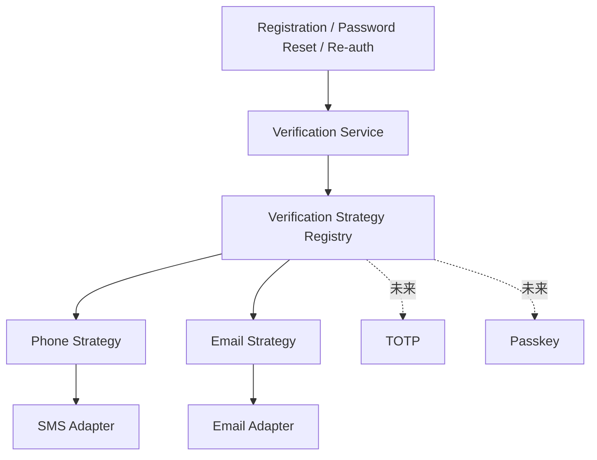

# 01.5 — 验证方式与安全策略详细设计

> 首期验证方式：手机号 + 邮箱。  
> 验证 Provider、密码策略、风险规则与阈值由 SYSTEM_ADMIN 管理配置。

# 1. 可扩展验证设计

采用：

```text
Strategy
+ Provider Registry / Factory
+ Adapter
```



# 2. 验证用途

```text
REGISTER
PASSWORD_RESET
CHANGE_IDENTIFIER
REAUTHENTICATE
ACCOUNT_RECOVERY
HIGH_RISK_ACTION
```

# 3. SYSTEM_ADMIN 配置

可配置：

```text
PHONE / EMAIL 启停
Provider
Template
Challenge TTL
Resend Cooldown
Max Attempts
Rate Limit
Password Policy
Risk Rule Weight
Risk Threshold
Admin Defined Password 是否要求首次修改
```

配置应版本化并可审计。

# 4. Challenge 算法

- CSPRNG 生成；
- DB 不保存明文；
- Hash / MAC；
- constant-time compare；
- TTL；
- attempt_count；
- 最新 Challenge 可使旧 Challenge 失效。

# 5. Outbox

Challenge 与 Outbox Event 同事务写入，由 Worker 调 SMS / Email Adapter。

# 6. Rate Limit

发送和验证分别限流。

推荐 Sliding Window / Token Bucket。

Key：

```text
purpose
method
normalized target
IP
device
user_id（如已知）
```

# 7. Risk Engine

第一阶段采用可解释的 Rule + Weighted Score。

```text
risk_score = Σ(weight_i × signal_i)
```

# 8. 风险信号

## 8.1 登录

- 同一账号短时间连续密码错误；
- 同 IP / Device 尝试大量账号；
- 同账号短时间大量新设备；
- 已撤销 Token 重放；
- 临时密码连续错误。

## 8.2 Verification / Recovery

- 高频申请 PHONE / EMAIL Challenge；
- 同 Challenge 连续错误；
- 同 target 被大量账号请求；
- 短时间多次 Password Reset；
- 用户刚完成重置又立即发起下一次重置。

## 8.3 OWNER / SYSTEM_ADMIN Reset

- OWNER 短时间重置多个 STAFF；
- 同 STAFF 短时间被重复 Reset；
- SYSTEM_ADMIN 短时间批量设置密码；
- 管理员输入密码连续触发 Password Policy 拒绝；
- 重置完成后目标账号立即出现陌生设备登录。

## 8.4 用户资料变化

- 修改手机号 / 邮箱后立即改密码；
- 改密码后立即删除恢复渠道；
- 短时间连续变更多个 Identifier。

## 8.5 注册

- 高频猜邀请码；
- STAFF 配额耗尽后持续尝试；
- 同设备批量注册多个账号；
- STAFF User 尝试加入第二 Merchant。

# 9. Risk Decision

| Level | Action |
|---|---|
| LOW | Allow |
| MEDIUM | Step-up PHONE / EMAIL |
| HIGH | Block sensitive action + Recovery |
| CRITICAL | Lock sensitive action + SYSTEM_ADMIN |

每个 Decision 记录：

```text
risk_score
matched_rule_ids
policy_version
decision
```

便于解释。

# 10. 性能算法

Security Event 索引建议围绕：

```text
user_id
identifier_hash
ip_hash
device_id
event_type
occurred_at
```

近 5 分钟 / 1 小时窗口优先 PostgreSQL 索引聚合；达到高频规模后再把 RateLimiter / Counter 抽象实现切 Redis。

# 11. 防账号枚举

Forgot Password 对“存在 / 不存在”返回相同语义，并尽量降低响应时间差异。

# 12. Provider 故障

- 不静默切换用户未选择的验证渠道；
- 临时错误 exponential backoff + jitter；
- 已创建 Challenge 固定使用创建时配置版本；
- Provider 停用不删除历史 Verified Identifier。

# 13. 下一轮继续详细设计

以下设计模式和判断算法将在 `08-设计模式与判断算法清单.md` 中专题展开：

```text
Password Policy Engine
Account State Machine
Invitation State Machine
Reset Strategy Resolver
Authorization Specification
Risk Rule Composition
Session Revocation Strategy
Idempotency Store
Outbox Retry Policy
Identifier Resolution Algorithm
```
