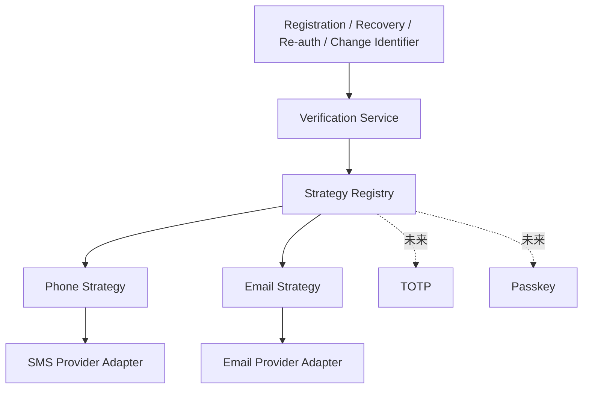
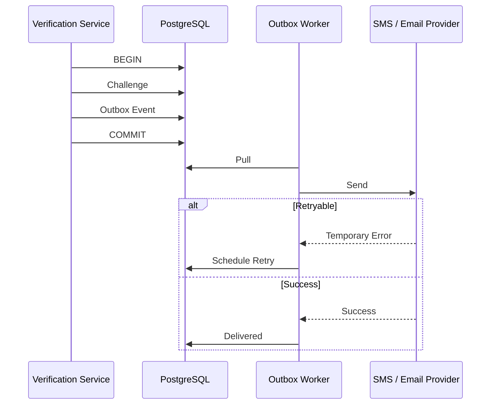

# 01.5 — 验证方式与安全策略详细设计

> 首期 Verification Method：PHONE + EMAIL。  
> 设计目标：注册、Recovery、账号变更、高风险 Step-up 复用同一验证框架，同时允许未来扩展。

---

# 1. 可扩展验证

错误做法：

```text
if phone -> send sms
else -> send email
```

正式采用：

```text
Strategy
+ Registry / Factory
+ Adapter
```



业务模块只调用：

```text
CreateChallenge(method, target, purpose)
VerifyChallenge(challenge_id, proof)
```

---

# 2. Verification Strategy

概念接口：

```text
VerificationStrategy
├── Method()
├── NormalizeTarget()
├── CanSend()
├── CreateChallenge()
├── SendChallenge()
├── VerifyProof()
└── MaskTarget()
```

增加新方式：

```text
实现 Strategy
→ 注册 Registry
→ SYSTEM_ADMIN 配置启用
```

主业务流程不改。

---

# 3. Adapter

Phone Strategy 不知道 Twilio、阿里云、腾讯云等具体 API。

Email Strategy 不知道 SMTP 或第三方邮件 API。

Adapter 统一外部响应为：

```text
SUCCESS
TEMPORARY_FAILURE
PERMANENT_FAILURE
RATE_LIMITED
INVALID_TARGET
```

---

# 4. SYSTEM_ADMIN 配置

可配置：

```text
PHONE / EMAIL enable
Provider
Template
Challenge TTL
Resend Cooldown
Max Attempts
Rate Limit
Risk Weights / Thresholds
Password Policy
Temporary Password Policy
```

配置版本化并 Audit。

已创建 Challenge 固定使用创建时版本。

---

# 5. Verification Purpose

```text
REGISTER
PASSWORD_RESET
CHANGE_IDENTIFIER
REAUTHENTICATE
ACCOUNT_RECOVERY
HIGH_RISK_ACTION
```

每个 Purpose 可以有独立 TTL、最大失败次数和 Risk Weight。

---

# 6. Challenge 数据与算法

概念字段：

```text
challenge_id
method
purpose
target_hash / target_ref
proof_hash
config_version
status
expires_at
attempt_count
max_attempts
created_at
verified_at
used_at
```

要求：

- CSPRNG；
- 不存明文；
- Hash / MAC；
- constant-time compare；
- TTL；
- attempts；
- 达上限锁定；
- 新 Challenge 可让旧同 Purpose Challenge 失效；
- Verified 后不可重复使用。

---

# 7. Outbox



重试使用 exponential backoff + jitter。

---

# 8. Rate Limit

发送和验证分别限流。

推荐：

```text
Sliding Window
或
Token Bucket
```

Key 组合：

```text
purpose
method
target_hash
IP
device
user_id
```

多维限流减少误伤和绕过。

---

# 9. Risk Engine

首期使用可解释的 Rule + Weighted Score：

```text
risk_score = Σ(weight_i × signal_i)
```

每个 Decision 保存：

```text
score
matched_rule_ids
policy_version
decision
```

---

# 10. 登录风险

- 同账号短时间连续密码错误；
- 同 IP / Device 尝试大量账号；
- 同账号短时间异常多新设备；
- 临时密码连续错误；
- PASSWORD_RESET_REQUIRED 仍普通登录；
- revoked Token 重放；
- 旧 Token Rotation 重放；
- 极短时间建立大量 Session。

---

# 11. Verification / Recovery 风险

- 高频短信 / 邮箱 Challenge；
- 同 Challenge 多次错误；
- 同 target 被大量账号请求；
- 短时间大量 Forgot Password；
- Reset 完成后马上再次 Reset；
- 同 target 多 IP / Device 高频调用。

---

# 12. Invitation / Registration 风险

- 猜邀请码；
- 同邀请码大量失败；
- STAFF 配额耗尽继续提交；
- 同 Device 批量注册；
- 同 Identifier 尝试多个 Invitation；
- 试图绕过单 Merchant。

---

# 13. 用户资料风险

例如：

```text
修改手机号
→ 马上改密码
→ 马上删除邮箱
```

还包括：

- 新设备登录后立即修改恢复渠道；
- Reset 后立即绑定新 Identifier；
- 短时间连续改多个安全字段。

---

# 14. OWNER / SYSTEM_ADMIN 风险

- OWNER 短时间重置大量 STAFF；
- 同 STAFF 被反复 Reset；
- SYSTEM_ADMIN 批量设置密码；
- SYSTEM_ADMIN 大量强制下线；
- 管理员连续 Password Policy 失败；
- Reset 后目标账号立即陌生设备登录。

Audit 记录合法管理行为；Security Event 用于判断异常，二者不能混成一张表。

---

# 15. Risk Decision

| Level | Action |
|---|---|
| LOW | Allow |
| MEDIUM | Step-up PHONE / EMAIL |
| HIGH | Block sensitive action + Recovery |
| CRITICAL | Lock sensitive action + SYSTEM_ADMIN review |

Risk 不直接修改销售 / 库存等业务数据。

---

# 16. 风险窗口与索引

Security Event 常用字段：

```text
user_id
identifier_hash
ip_hash
device_id
event_type
occurred_at
```

常用窗口：

```text
1 min
5 min
1 hour
24 hour
```

第一阶段用 PostgreSQL 时间范围索引查询。

规模上升后，RateLimiter / RiskCounter 接口可切 Redis，业务层不变。

---

# 17. 防账号枚举

Forgot Password 的“账号存在 / 不存在”返回同样语义。

也应尽量降低 timing side-channel，避免不存在账号稳定 5ms、存在账号稳定 800ms。

---

# 18. Provider 故障

PHONE Provider 失败：

- 不偷偷切 EMAIL；
- 如果用户有已验证 Email，可以提示其主动选择 Email。

Provider 被停用：

- 历史 Verified Identifier 不删除；
- 不再创建该 Method 新 Challenge。

---

# 19. 已冻结规则

1. PHONE + EMAIL 首期；
2. Strategy 扩展；
3. Adapter 隔离 Provider；
4. SYSTEM_ADMIN 配置验证与 Risk；
5. Challenge 不存明文；
6. Outbox；
7. 多业务共用 Verification；
8. Risk 可解释；
9. MEDIUM Step-up；
10. Forgot Password 防枚举；
11. Provider 不静默跨渠道；
12. Decision 记录命中规则。
