# 01.5 — 验证方式与安全策略详细设计

> Verification Method 产品模型支持 EMAIL / PHONE。
> 当前部署可以先启用 EMAIL；PHONE Strategy / SMS Adapter 因短信资质、备案或 Provider 准备情况保持 disabled，后续通过配置启用。
> 设计目标：注册、Recovery、账号变更、高风险 Step-up 复用同一验证框架，同时允许未来扩展。

---

# 1. 可扩展验证

错误做法：

```text
if phone -> send sms
else -> send email
```

正式采用：

```text
Strategy
+ Registry / Factory
+ Adapter
```

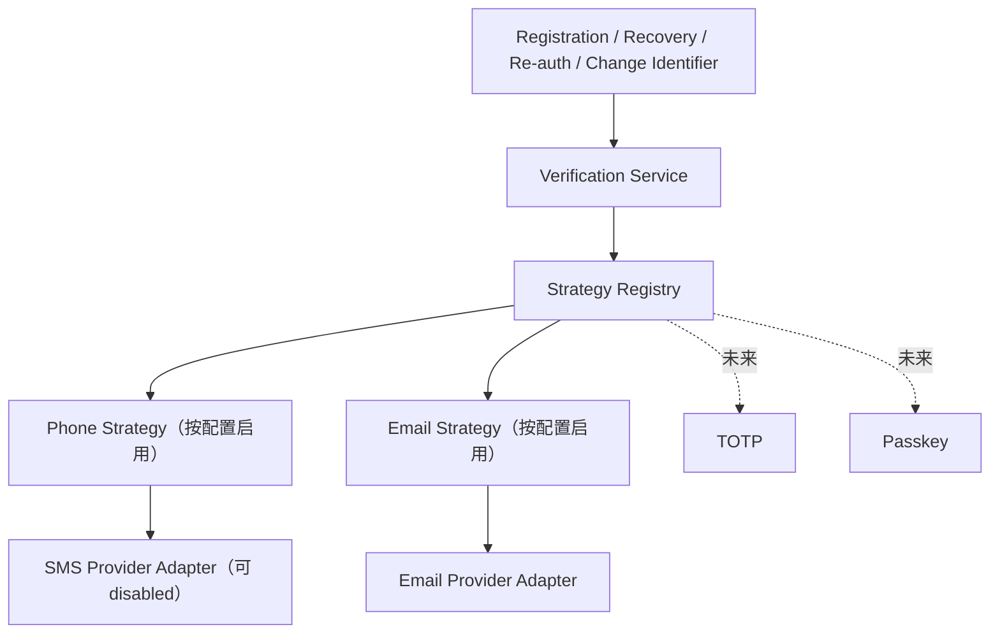
```mermaid
flowchart TD
    APP[Registration / Recovery / Re-auth / Change Identifier]
    APP --> SERVICE[Verification Service]
    SERVICE --> REG[Strategy Registry]

    REG --> PHONE[Phone Strategy（按配置启用）]
    REG --> EMAIL[Email Strategy（按配置启用）]
    REG -.未来.-> TOTP[TOTP]
    REG -.未来.-> PASSKEY[Passkey]

    PHONE --> SMS[SMS Provider Adapter（可 disabled）]
    EMAIL --> MAIL[Email Provider Adapter]
```

**图示说明（1. 可扩展验证）：** 这是责任或数据流图，核心节点包括 Registration / Recovery / Re-auth / Change Identifier。箭头表示调用、归属或数据流向；权限、Merchant 范围和状态判断必须在服务端完成，不能由客户端或单一 UI 分支替代。

业务模块只调用：

```text
CreateChallenge(method, target, purpose)
VerifyChallenge(challenge_id, proof)
```

---

# 2. Verification Strategy

概念接口：

```text
VerificationStrategy
├── Method()
├── NormalizeTarget()
├── CanSend()
├── CreateChallenge()
├── SendChallenge()
├── VerifyProof()
└── MaskTarget()
```

增加新方式：

```text
实现 Strategy
→ 注册 Registry
→ SYSTEM_ADMIN 配置启用
```

主业务流程不改。

---

# 3. Adapter

Phone Strategy 不知道具体短信供应商 API；当前 SMS Provider 可保持 disabled，待资质 / 备案和 Provider 准备后启用。

Email Strategy 不知道 SMTP 或第三方邮件 API。

Adapter 统一外部响应为：

```text
SUCCESS
TEMPORARY_FAILURE
PERMANENT_FAILURE
RATE_LIMITED
INVALID_TARGET
```

---

# 4. SYSTEM_ADMIN 配置

可配置：

```text
EMAIL enable / disable
PHONE enable / disable（当前可 disabled）
Provider
Template
Challenge TTL
Resend Cooldown
Max Attempts
Rate Limit
Risk Weights / Thresholds
Password Policy
Temporary Password Policy
```

配置版本化并 Audit。

已创建 Challenge 固定使用创建时版本。

---

# 5. Verification Purpose

```text
REGISTER
PASSWORD_RESET
CHANGE_IDENTIFIER
REAUTHENTICATE
ACCOUNT_RECOVERY
HIGH_RISK_ACTION
```

每个 Purpose 可以有独立 TTL、最大失败次数和 Risk Weight。

---

# 6. Challenge 数据与算法

概念字段：

```text
challenge_id
method
purpose
target_hash / target_ref
proof_hash
config_version
status
expires_at
attempt_count
max_attempts
created_at
verified_at
used_at
```

要求：

- CSPRNG；
- 不存明文；
- Hash / MAC；
- constant-time compare；
- TTL；
- attempts；
- 达上限锁定；
- 新 Challenge 可让旧同 Purpose Challenge 失效；
- Verified 后不可重复使用。

---

# 7. Outbox

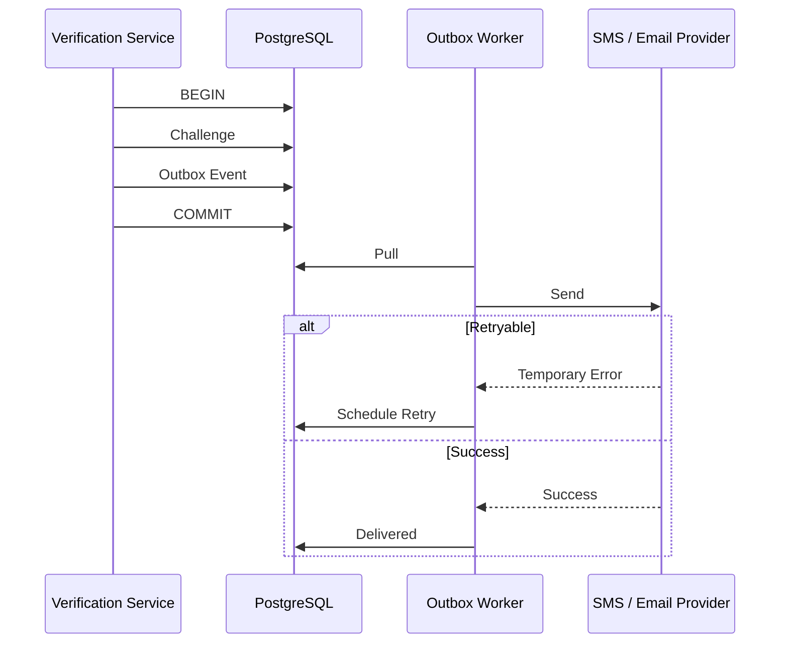
```mermaid
sequenceDiagram
    participant VERIFY as Verification Service
    participant DB as PostgreSQL
    participant WORKER as Outbox Worker
    participant PROVIDER as SMS / Email Provider

    VERIFY->>DB: BEGIN
    VERIFY->>DB: Challenge
    VERIFY->>DB: Outbox Event
    VERIFY->>DB: COMMIT

    WORKER->>DB: Pull
    WORKER->>PROVIDER: Send

    alt Retryable
        PROVIDER-->>WORKER: Temporary Error
        WORKER->>DB: Schedule Retry
    else Success
        PROVIDER-->>WORKER: Success
        WORKER->>DB: Delivered
    end
```

**图示说明（7. Outbox）：** 这是服务调用时序图，参与者包括 Verification Service、PostgreSQL、Outbox Worker、SMS / Email Provider。箭头表示一次调用或返回，alt/else 分支表示 Decision 的不同结果；事务提交前只做校验和状态准备，短信、邮件等外部副作用应在提交后通过 Outbox 执行。

重试使用 exponential backoff + jitter。

---

# 8. Rate Limit

发送和验证分别限流。

推荐：

```text
Sliding Window
或
Token Bucket
```

Key 组合：

```text
purpose
method
target_hash
IP
device
user_id
```

多维限流减少误伤和绕过。

---

# 9. Risk Engine

采用两阶段 Risk Decision：

```text
HardRuleComposite
→ 命中：DENY / RECOVERY_ONLY
→ 未命中：WeightedRiskComposite
→ Threshold Decision
```

Hard Rule：User DISABLED、Membership DISABLED、Merchant CLOSED、Session REVOKED / EXPIRED、Verification Method disabled 等，直接决定结果。

Weighted Rule 才计算 `risk_score = Σ(weight_i × signal_i)`。Decision 保存 hard_rule_code、matched_rule_ids、risk_score、risk_level、action、policy_version。

# 10. 登录风险

- 同账号短时间连续密码错误；
- 同 IP / Device 尝试大量账号；
- 同账号短时间异常多新设备；
- 临时密码连续错误；
- PASSWORD_RESET_REQUIRED 仍普通登录；
- revoked Token 重放；
- 旧 Token Rotation 重放；
- 极短时间建立大量 Session。

---

# 11. Verification / Recovery 风险

- 高频 Email Challenge；
- 同 Challenge 多次错误；
- 同 target 被大量账号请求；
- 短时间大量 Forgot Password；
- Reset 完成后马上再次 Reset；
- 同 target 多 IP / Device 高频调用。

---

# 12. Invitation / Registration 风险

- 猜邀请码；
- 同邀请码大量失败；
- STAFF 配额耗尽继续提交；
- 同 Device 批量注册；
- 同 Identifier 尝试多个 Invitation；
- 试图绕过单 Merchant。

---

# 13. 用户资料风险

例如：

```text
修改手机号
→ 马上改密码
→ 马上删除邮箱
```

还包括：

- 新设备登录后立即修改恢复渠道；
- Reset 后立即绑定新 Identifier；
- 短时间连续改多个安全字段。

---

# 14. OWNER / SYSTEM_ADMIN 风险

- OWNER 短时间重置大量 STAFF；
- 同 STAFF 被反复 Reset；
- SYSTEM_ADMIN 批量设置密码；
- SYSTEM_ADMIN 大量强制下线；
- 管理员连续 Password Policy 失败；
- Reset 后目标账号立即陌生设备登录。

Audit 记录合法管理行为；Security Event 用于判断异常，二者不能混成一张表。

---

# 15. Risk Decision

| Level | Action |
|---|---|
| LOW | Allow |
| MEDIUM | 对当前 User + Device / Session 使用已启用的 EMAIL / PHONE Step-up |
| HIGH | Block sensitive action + Recovery |
| CRITICAL | Lock sensitive action + SYSTEM_ADMIN review |

Risk 不直接修改销售 / 库存等业务数据。

---

# 16. 风险窗口与索引

Security Event 常用字段：

```text
user_id
identifier_hash
ip_hash
device_id
event_type
occurred_at
```

常用窗口：

```text
1 min
5 min
1 hour
24 hour
```

第一阶段用 PostgreSQL 时间范围索引查询。

规模上升后，RateLimiter / RiskCounter 接口可切 Redis，业务层不变。

---

# 17. 防账号枚举

Forgot Password 的“账号存在 / 不存在”返回同样语义。

也应尽量降低 timing side-channel，避免不存在账号稳定 5ms、存在账号稳定 800ms。

---

# 18. Provider 故障

PHONE Provider 失败（未来启用后）：

- 不偷偷切 EMAIL；
- 如果用户有已验证 Email，可以提示其主动选择 Email。

Provider 被停用：

- 历史 Verified Identifier 不删除；
- 不再创建该 Method 新 Challenge。

---

# 19. 已冻结规则

1. EMAIL / PHONE 均为正式 Verification Method；实际 enabled methods 由配置决定，PHONE Provider 当前可 disabled；
2. Strategy 扩展；
3. Adapter 隔离 Provider；
4. SYSTEM_ADMIN 配置验证与 Risk；
5. Challenge 不存明文；
6. Outbox；
7. 多业务共用 Verification；
8. Risk 可解释；
9. MEDIUM Step-up；
10. Forgot Password 防枚举；
11. Provider 不静默跨渠道；
12. Decision 记录命中规则。


# 20. Clock 与 SecureRandom

所有 TTL、过期、Cooldown、Risk Window 使用可注入 `Clock.Now()`；生产使用 SystemClock，测试使用 FakeClock。

Session Token、Invitation Code、OTP、Temporary Password 统一通过 `SecureRandom / EntropySource` 使用 CSPRNG 生成；测试可注入 deterministic 实现。


# 21. 与身份认证能力模型的边界

本文件负责“如何安全执行 Verification”：

```text
Challenge
Strategy
Registry
Provider Adapter
Outbox
Rate Limit
Risk
Clock
SecureRandom
```

本文件 负责“有哪些身份能力、分别服务什么 Purpose、当前应该选哪一种”。

新增能力不允许破坏这条边界：

```text
Identity Method
→ VerificationResolver
→ VerificationStrategy / Credential Strategy
→ Provider Adapter（如果需要外部 Provider）
```

因此 TOTP、Passkey、可信设备、恢复码、微信身份不需要硬塞进 PHONE / EMAIL 分支。

# 22. 扩展身份认证能力详细设计（整合原 09 文档）

> 本节吸收原独立 本文件 的具体认证方式、能力注册表、选择算法、设计模式和失败边界，避免身份设计在同一模块内出现两个并列 Source of Truth。

## 4. 方案一：邮箱验证码

邮箱验证码是第一阶段默认 Verification Method。

适用：

- 注册；
- 忘记密码；
- 修改邮箱；
- 高风险二次验证；
- SYSTEM_ADMIN 要求用户自助恢复。

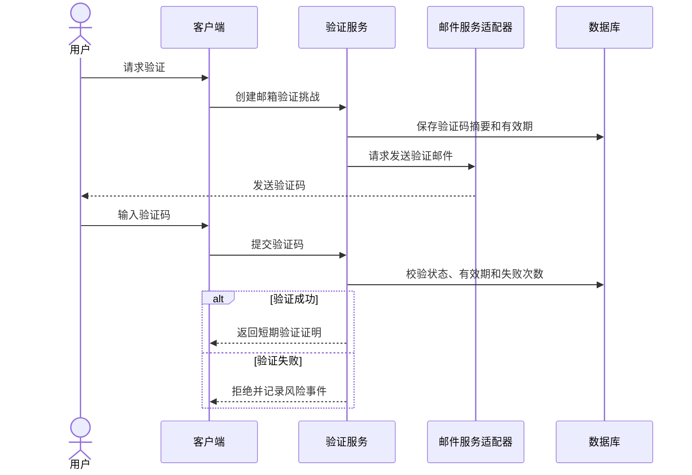
```mermaid
sequenceDiagram
    actor 用户
    participant 客户端
    participant 验证服务
    participant 邮件服务适配器
    participant 数据库

    用户->>客户端: 请求验证
    客户端->>验证服务: 创建邮箱验证挑战
    验证服务->>数据库: 保存验证码摘要和有效期
    验证服务->>邮件服务适配器: 请求发送验证邮件
    邮件服务适配器-->>用户: 发送验证码

    用户->>客户端: 输入验证码
    客户端->>验证服务: 提交验证码
    验证服务->>数据库: 校验状态、有效期和失败次数

    alt 验证成功
        验证服务-->>客户端: 返回短期验证证明
    else 验证失败
        验证服务-->>客户端: 拒绝并记录风险事件
    end
```

设计模式：

```text
验证策略（Strategy）
+ 策略注册表（Registry）
+ 邮件服务适配器（Adapter）
+ 事务外发信箱（Outbox）
```

安全要求：

- Challenge Code 不保存明文；
- 验证使用 Hash / MAC 和 constant-time compare；
- Challenge 有 TTL；
- 失败次数有限制；
- Proof 必须绑定 User、Purpose、Target Command、有效期；
- REGISTER 的 Proof 不能直接拿去执行 CHANGE_IDENTIFIER；
- 发送由 Outbox 提交后执行，不在核心事务里调用邮件网络 API。

---

## 5. 方案二：邮件确认链接

邮箱验证不一定要求用户手工输入验证码，也可以发送一次性确认链接。

流程：

```text
系统发邮件
→ 用户点击“确认是我”
→ 浏览器 / App Deep Link
→ 服务端验证一次性 Token
→ 返回 Verification Proof
```

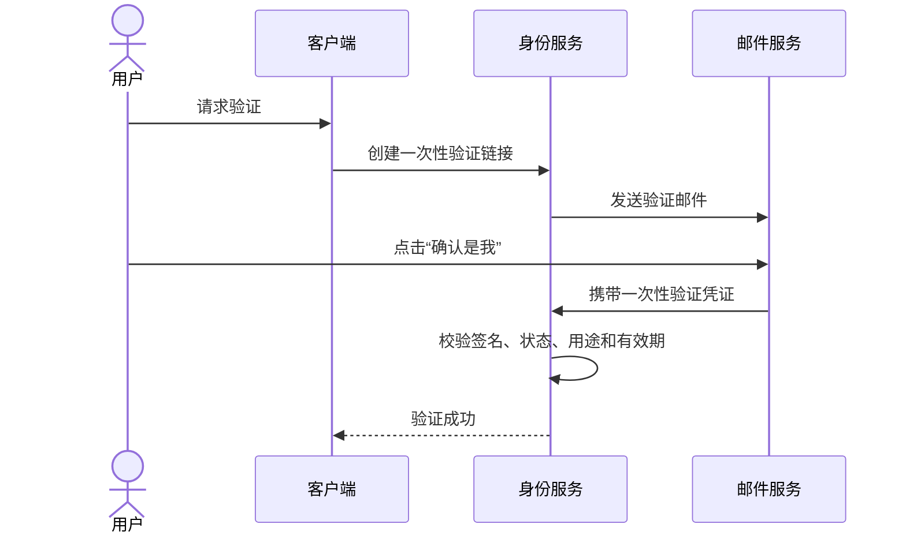
```mermaid
sequenceDiagram
    actor 用户
    participant 客户端
    participant 身份服务
    participant 邮件服务

    用户->>客户端: 请求验证
    客户端->>身份服务: 创建一次性验证链接
    身份服务->>邮件服务: 发送验证邮件

    用户->>邮件服务: 点击“确认是我”
    邮件服务->>身份服务: 携带一次性验证凭证
    身份服务->>身份服务: 校验签名、状态、用途和有效期
    身份服务-->>客户端: 验证成功
```

必须处理跨设备：

```text
Web 正在注册
+
用户在手机邮件客户端点击链接
```

因此一次性 Token 至少绑定：

```text
purpose
target_user / pending_identity
target_identifier
challenge_id
expires_at
one_time_state
config_version
```

Token 不能是永不过期的固定 URL，也不能完成与 Purpose 无关的高风险操作。

---

## 6. 方案三：身份验证器 TOTP

TOTP 适合 SYSTEM_ADMIN 和可选开启的 OWNER，不建议第一阶段要求普通 STAFF 使用。

绑定：

```text
系统生成 TOTP Secret
→ 用户扫描二维码
→ 用户输入一次动态码确认绑定成功
→ Secret 受保护保存
```

使用时：

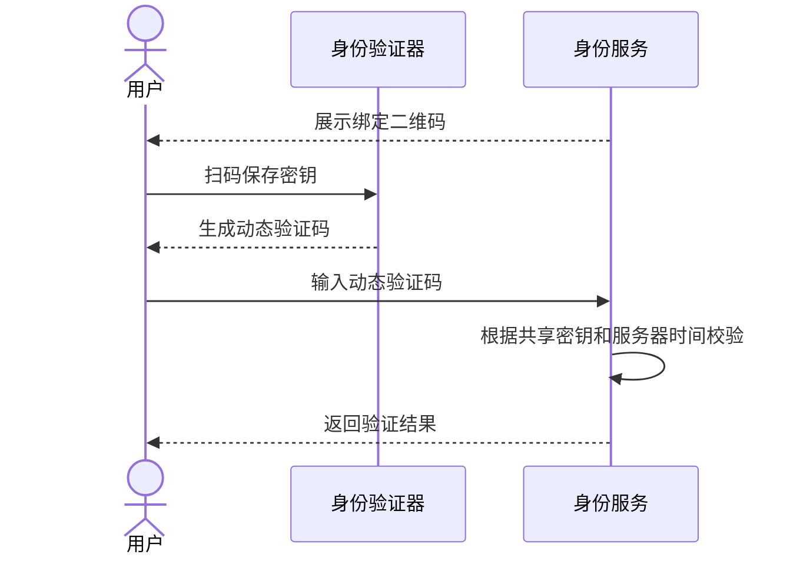
```mermaid
sequenceDiagram
    actor 用户
    participant 身份验证器
    participant 身份服务

    身份服务-->>用户: 展示绑定二维码
    用户->>身份验证器: 扫码保存密钥
    身份验证器-->>用户: 生成动态验证码
    用户->>身份服务: 输入动态验证码
    身份服务->>身份服务: 根据共享密钥和服务器时间校验
    身份服务-->>用户: 返回验证结果
```

优点：

- 不依赖短信备案；
- 不依赖邮件实时到达；
- Provider 成本低；
- 非常适合 SYSTEM_ADMIN；
- 适合高风险操作 Step-up。

边界：

- TOTP Secret 是高敏感数据，不能进入 Audit / Log；
- 绑定必须先完成当前身份重新认证；
- 解绑同样属于高风险操作；
- 丢失 TOTP 设备时必须回到独立 Recovery 流程；
- TOTP 不应成为唯一 Recovery Method；
- 服务端校验允许有限时间窗口，但窗口由策略版本控制。

---

## 7. 方案四：通行密钥 Passkey

Passkey 适合作为长期的低摩擦登录和高风险二次验证方式。

体验：

```text
选择账号
→ Face ID / 指纹 / Windows Hello / 设备 PIN
→ 设备完成私钥签名
→ 系统验证公钥
→ 登录
```

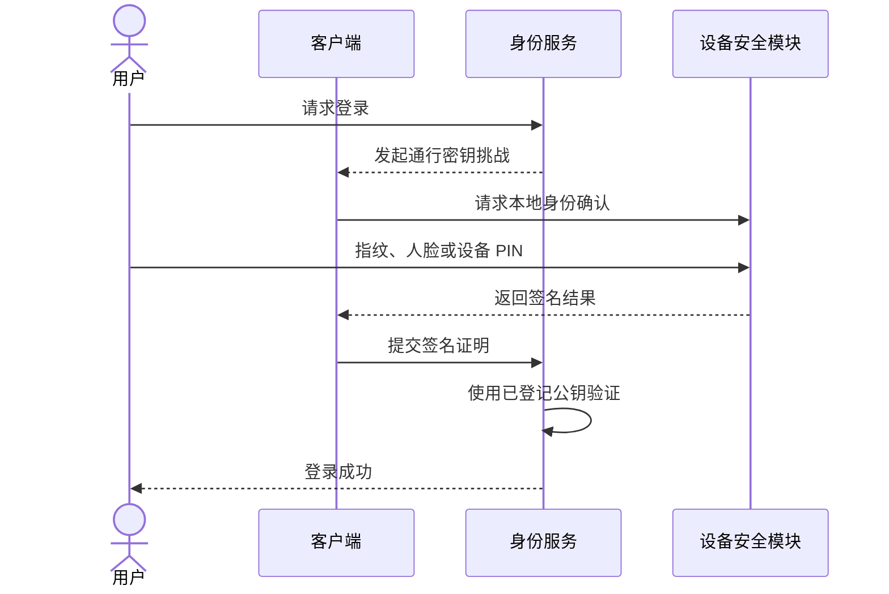
```mermaid
sequenceDiagram
    actor 用户
    participant 客户端
    participant 身份服务
    participant 设备安全模块

    用户->>身份服务: 请求登录
    身份服务-->>客户端: 发起通行密钥挑战
    客户端->>设备安全模块: 请求本地身份确认
    用户->>设备安全模块: 指纹、人脸或设备 PIN
    设备安全模块-->>客户端: 返回签名结果
    客户端->>身份服务: 提交签名证明
    身份服务->>身份服务: 使用已登记公钥验证
    身份服务-->>用户: 登录成功
```

服务器保存：

```text
credential_id
public_key
counter / authenticator metadata
user_id
created_at
last_used_at
status
```

服务器**不保存**：

```text
用户指纹
Face ID 数据
设备 PIN
设备私钥
```

第一阶段不强制实现，因为需要额外设计：

- 换手机；
- 设备丢失；
- 多设备 Passkey；
- Passkey 撤销；
- Recovery；
- 微信小程序实际支持边界。

领域模型应现在保留 Credential 扩展点，但实际启用放到后续阶段。

---

## 8. 方案五：可信设备确认

可信设备确认利用现有多设备 Session、Device Context 和 Risk Engine。

典型场景：

```text
新电脑登录
→ Risk 判定需要 Step-up
→ 已登录 Android / iOS 设备收到确认请求
→ 用户确认或拒绝
```

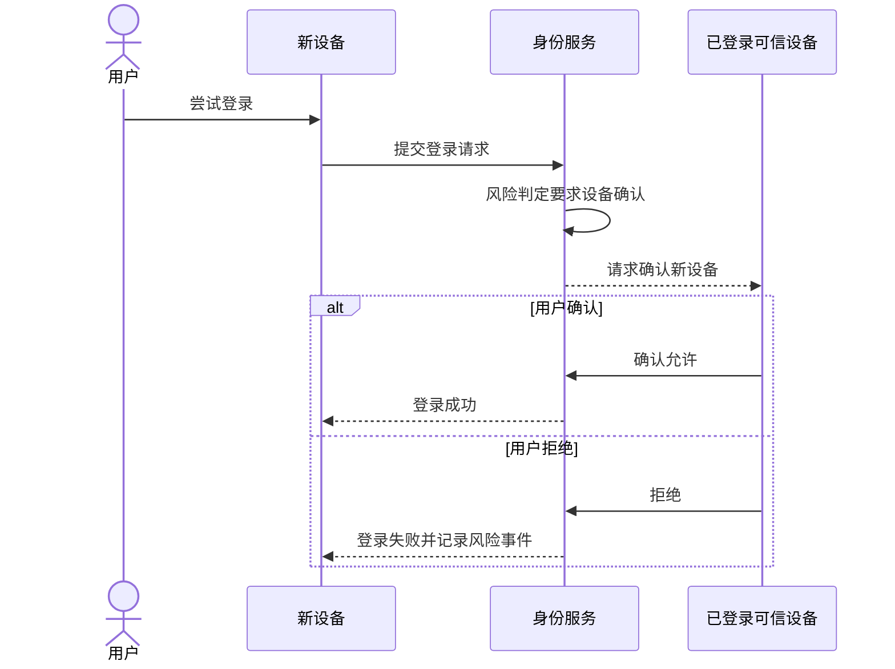
```mermaid
sequenceDiagram
    actor 用户
    participant 新设备
    participant 身份服务
    participant 已登录可信设备

    用户->>新设备: 尝试登录
    新设备->>身份服务: 提交登录请求
    身份服务->>身份服务: 风险判定要求设备确认
    身份服务-->>已登录可信设备: 请求确认新设备

    alt 用户确认
        已登录可信设备->>身份服务: 确认允许
        身份服务-->>新设备: 登录成功
    else 用户拒绝
        已登录可信设备->>身份服务: 拒绝
        身份服务-->>新设备: 登录失败并记录风险事件
    end
```

适合：

- 新设备登录；
- 修改敏感设置；
- 高风险动作 Step-up。

不适合：

- 唯一账号恢复方式。

原因：用户可能已经没有任何可信设备。

可信设备 Proof 必须绑定：

```text
approver_session_id
target_login_attempt_id
target_device_ref
purpose
expires_at
decision
```

不能把“某设备曾经登录过”永久等价成“永远可信”。

---

## 9. 方案六：一次性恢复码

OWNER / SYSTEM_ADMIN 可以选择生成一组一次性 Recovery Code。

例如：

```text
J2KP-48DR
TG7M-21QX
...
```

规则：

- 一次生成 8～10 个是可配置默认值，不是硬业务常量；
- 每个只能消费一次；
- 数据库只保存 Hash；
- 新生成一组时可以撤销旧组；
- 查看只允许生成当次；
- 不进入日志 / Audit 明文；
- 使用 Recovery Code 后必须触发高风险 Audit，并建议撤销其他 Session；
- 普通 STAFF 不强制使用，因为保存和管理成本较高。

恢复码主要用于：

```text
OWNER
SYSTEM_ADMIN
```

它是 Recovery Method，不是日常 Login Credential。

---

## 10. 方案七：管理员辅助恢复

master-goods 存在明确的组织管理关系，因此可以利用组织链路恢复账号，而不强迫手机号承担所有恢复责任。

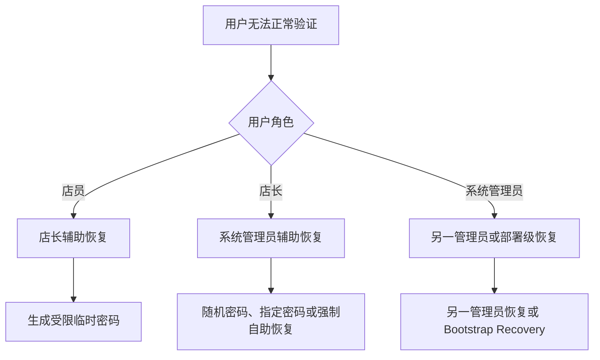
```mermaid
flowchart TD
    A[用户无法正常验证]
    A --> B{用户角色}

    B -->|店员| C[店长辅助恢复]
    B -->|店长| D[系统管理员辅助恢复]
    B -->|系统管理员| E[另一管理员或部署级恢复]

    C --> C1[生成受限临时密码]
    D --> D1[随机密码、指定密码或强制自助恢复]
    E --> E1[另一管理员恢复或 Bootstrap Recovery]
```

既有规则保持：

- OWNER 只能对本 Merchant STAFF 执行允许的恢复动作；
- OWNER 不能读取 STAFF 原密码；
- OWNER 随机临时密码使用 PREPARED → Copy Confirm → ACTIVE；
- OWNER 不能直接设置 STAFF 永久密码；
- SYSTEM_ADMIN 高风险恢复必须 Audit；
- 恢复成功后按 PasswordResetStrategy 决定 Session 撤销范围。

---

## 11. 微信身份：作为 ExternalIdentity，不作为 User 本身

微信小程序未来可以提供快捷登录：

```text
微信身份
→ OpenID / UnionID
→ 绑定现有 User
```

正确关系：

```text
User
├── LoginIdentifier: EMAIL
├── LoginIdentifier: PHONE
├── PasswordCredential
├── PasskeyCredential
└── ExternalIdentity
    └── WECHAT
```

禁止设计成：

```text
微信 OpenID = User ID
```

原因：

- Web、Android、iOS 仍然要与同一个 User 统一；
- 微信身份可能解绑 / 重新授权；
- 一个 User 的平台身份不能由单一客户端生态决定；
- 外部身份 Provider 的生命周期不能成为内部 User 主键生命周期。

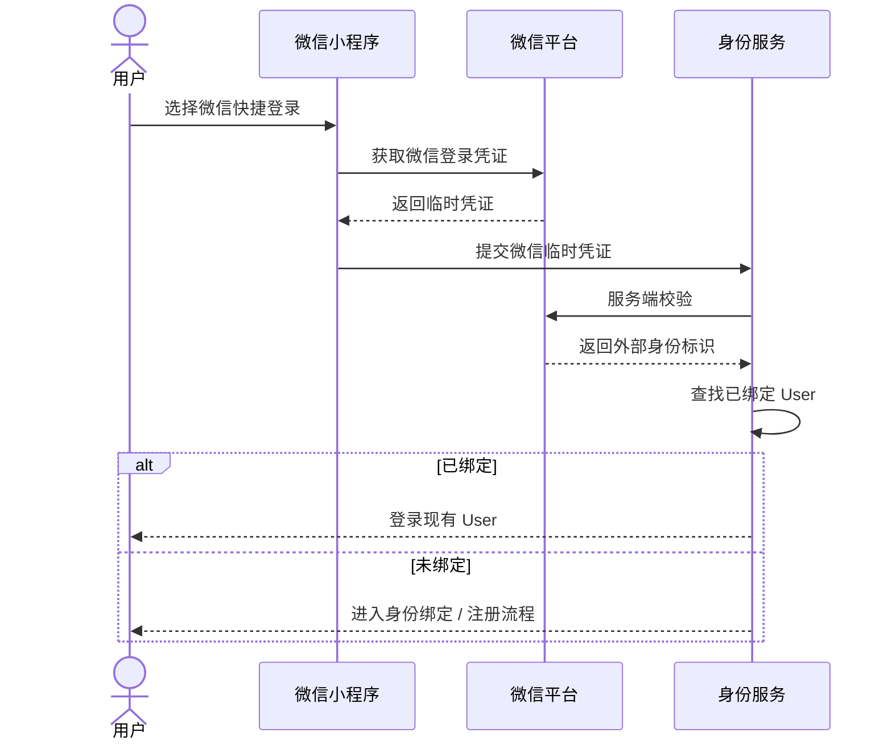
```mermaid
sequenceDiagram
    actor 用户
    participant 微信小程序
    participant 微信平台
    participant 身份服务

    用户->>微信小程序: 选择微信快捷登录
    微信小程序->>微信平台: 获取微信登录凭证
    微信平台-->>微信小程序: 返回临时凭证
    微信小程序->>身份服务: 提交微信临时凭证
    身份服务->>微信平台: 服务端校验
    微信平台-->>身份服务: 返回外部身份标识
    身份服务->>身份服务: 查找已绑定 User

    alt 已绑定
        身份服务-->>用户: 登录现有 User
    else 未绑定
        身份服务-->>用户: 进入身份绑定 / 注册流程
    end
```

ExternalIdentity Adapter 负责隔离微信平台 API。

---

## 12. 认证能力注册表

业务代码禁止演化成：

```text
if email ...
else if phone ...
else if totp ...
else if passkey ...
```

统一采用认证能力注册表。

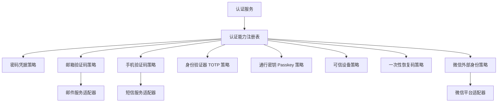
```mermaid
flowchart TD
    A[认证服务]
    A --> B[认证能力注册表]

    B --> C[密码凭据策略]
    B --> D[邮箱验证码策略]
    B --> E[手机验证码策略]
    B --> F[身份验证器 TOTP 策略]
    B --> G[通行密钥 Passkey 策略]
    B --> H[可信设备策略]
    B --> I[一次性恢复码策略]
    B --> J[微信外部身份策略]

    D --> K[邮件服务适配器]
    E --> L[短信服务适配器]
    J --> M[微信平台适配器]
```

概念接口：

```text
AuthenticationMethod
├── Key()
├── Supports(purpose)
├── CanUse(user, context)
├── Begin(context)
├── Verify(proof)
├── RiskLevel()
└── Enabled(configVersion)
```

不同 Method 支持不同 Purpose：

```text
邮箱验证码：
- 注册
- 忘记密码
- 二次验证
- 修改登录标识

TOTP：
- 二次验证
- 高风险操作

Passkey：
- 登录
- 二次验证

可信设备：
- 新设备登录确认
- 二次验证

恢复码：
- 账号恢复

微信外部身份：
- 微信小程序快捷登录
- 外部身份绑定
```

---

## 13. 验证能力选择算法

Risk Engine 不应该硬编码：

```text
MEDIUM -> 发邮件
```

正确流程：

```text
Risk Decision
→ REQUIRED_STEP_UP
→ VerificationResolver
→ 根据上下文计算可用 Method
→ 返回一种或多种允许用户选择的方法
```

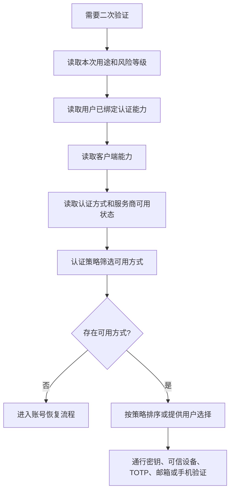
```mermaid
flowchart TD
    A[需要二次验证]
    --> B[读取本次用途和风险等级]
    B --> C[读取用户已绑定认证能力]
    C --> D[读取客户端能力]
    D --> E[读取认证方式和服务商可用状态]
    E --> F[认证策略筛选可用方式]

    F --> G{存在可用方式?}
    G -->|否| H[进入账号恢复流程]
    G -->|是| I[按策略排序或提供用户选择]
    I --> J[通行密钥、可信设备、TOTP、邮箱或手机验证]
```

不要把“Passkey > 可信设备 > TOTP > Email > Phone”写成永久硬编码优先级。

`VerificationPolicy` 根据以下输入决策：

```text
purpose
risk_level
actor_role
client_type
client_capabilities
bound_methods
verified_methods
provider_availability
device_trust
policy_version
```

概念伪代码：

```text
ResolveVerificationMethods(context):
    methods = Registry.All()

    candidates =
        methods
        .filter(method -> method.Enabled(context.config_version))
        .filter(method -> method.Supports(context.purpose))
        .filter(method -> method.CanUse(context.user, context))
        .filter(method -> ProviderAvailable(method))
        .filter(method -> ClientSupports(method))

    if candidates.empty:
        return RECOVERY_REQUIRED

    return VerificationPolicy.RankOrOffer(candidates, context)
```

算法复杂度：

```text
O(M)
```

其中 M 是已注册认证方式数量，实际数量很小。不要为了该 Resolver 引入复杂索引结构。

---

## 16. 设计模式应用

### 16.1 Strategy

适用于：

- Email Verification；
- Phone Verification；
- TOTP；
- Passkey；
- Trusted Device；
- Recovery Code；
- External Identity。

每个 Strategy 自己声明 Supported Purpose。

### 16.2 Registry / Factory

根据：

```text
method_key
purpose
config_version
client_capability
```

找到对应实现。

### 16.3 Adapter

隔离：

- Email Provider；
- SMS Provider；
- WeChat API；
- 未来其他外部 Identity Provider。

### 16.4 Policy Object / Specification

用于：

- Method 是否启用；
- User 是否已绑定；
- 是否已验证；
- 当前 Purpose 是否允许；
- Risk Level 是否需要更强方式；
- 客户端是否支持；
- Provider 是否健康。

### 16.5 Resolver

`VerificationResolver` 负责“当前允许用什么”，不负责执行验证。

### 16.6 State Machine

Challenge、Recovery Code、Passkey Credential、External Identity Binding 都应有明确生命周期。

### 16.7 Outbox

Email / SMS / Push 类外部发送在数据库提交后可靠执行。

---

## 17. 编码边界和失败条件

### 17.1 Login Identifier 与 Verification 状态分离

```text
phone exists
≠
phone verified
≠
phone enabled for login
≠
phone enabled for recovery
```

Email 同理。

### 17.2 Provider disabled

Method 在领域模型中存在，但 Provider disabled 时：

- 不创建需要外部发送的新 Challenge；
- 不删除历史 Verified Identifier；
- 不静默切换到用户没选择的其他方式；
- Resolver 可以提供其他合法候选。

### 17.3 Provider 临时故障

- Challenge 已创建时保留 config_version；
- Outbox 按 Retry Policy 重试；
- Permanent Failure 进入失败状态；
- 不允许因为 Provider 网络超时重复创建无限 Challenge。

### 17.4 Proof 不可跨用途重放

```text
REGISTER Proof
不能用于 PASSWORD_RESET

STEP_UP Proof
不能用于 CHANGE_IDENTIFIER
```

Proof 必须短 TTL，并绑定 Purpose / User / Target。

### 17.5 可信设备不是永久信任

设备被撤销、Session 被强制下线、security_epoch 改变或 Risk 达到阈值后，可信状态必须重新评估。

### 17.6 TOTP / Passkey 丢失

不能因为启用了更强认证方式就删除其他 Recovery 路径。绑定或解绑强认证方式都属于高风险操作。

### 17.7 Recovery Code 并发消费

同一恢复码必须用原子条件从 ACTIVE → USED，只能一个请求成功。

### 17.8 External Identity 解绑

解绑微信身份不能导致 User 失去全部可登录 / 可恢复能力；必须先检查至少存在另一条有效账号控制路径。

### 17.9 Audit 与秘密

Audit 可以记录：

```text
method
purpose
actor
target
result
policy_version
risk_decision
provider
```

但不能记录：

```text
密码
OTP
TOTP Secret
Passkey 私钥
Recovery Code 明文
完整 Session Token
Provider Secret
```

---
