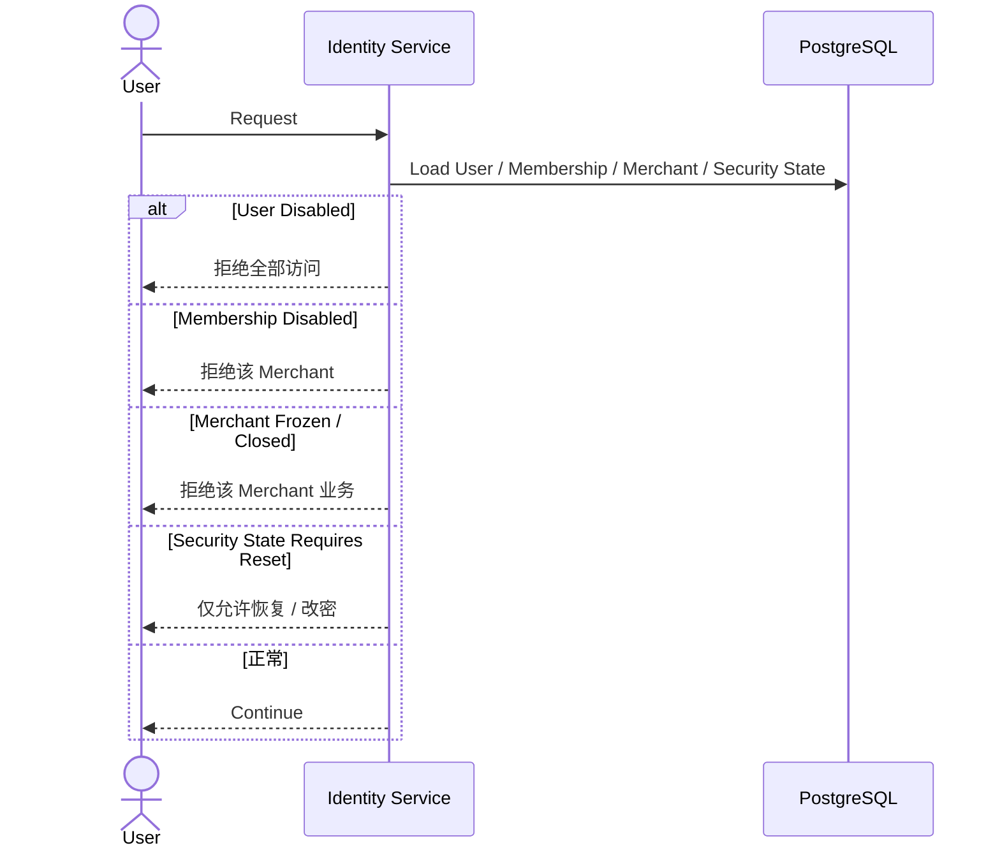

# 01.6 — 账号状态与商户成员关系详细设计

# 1. User 与 Membership 分离

已确认：

```text
一个 User
→ 可以拥有多个 Merchant Membership
```

第一版 UI 可以暂不暴露多 Merchant 切换。

# 2. 状态层级

```text
User Status
Membership Status
Merchant Status
Security State
```



# 3. STAFF 停用

停用 Membership 后：

- 当前 Merchant Session 失效；
- 历史业务记录保留原 operator_user_id；
- 不影响 User 在其他 Merchant 的 Membership。

# 4. User 全局停用

SYSTEM_ADMIN 全局停用 User 后：

- 所有 Session 失效；
- 全部 Merchant Membership 暂不可使用；
- 历史业务和审计不删除。

# 5. 店长交接

当前注册阶段每个 Merchant 只有 1 个 OWNER。

换店长必须走角色交接事务：

```text
目标 STAFF -> OWNER
原 OWNER -> STAFF 或退出
```

具体原 OWNER 交接后默认行为留到后续确认。

# 6. 边界条件

- Password Credential 属于 User，因此全局密码变化影响所有 Merchant；
- Membership Status 只影响对应 Merchant；
- Merchant 被 SYSTEM_ADMIN 冻结不应注销 User；
- 被停用 Membership 仍保留审计和历史操作者关系；
- 不物理删除已有业务历史的 User / Membership。
