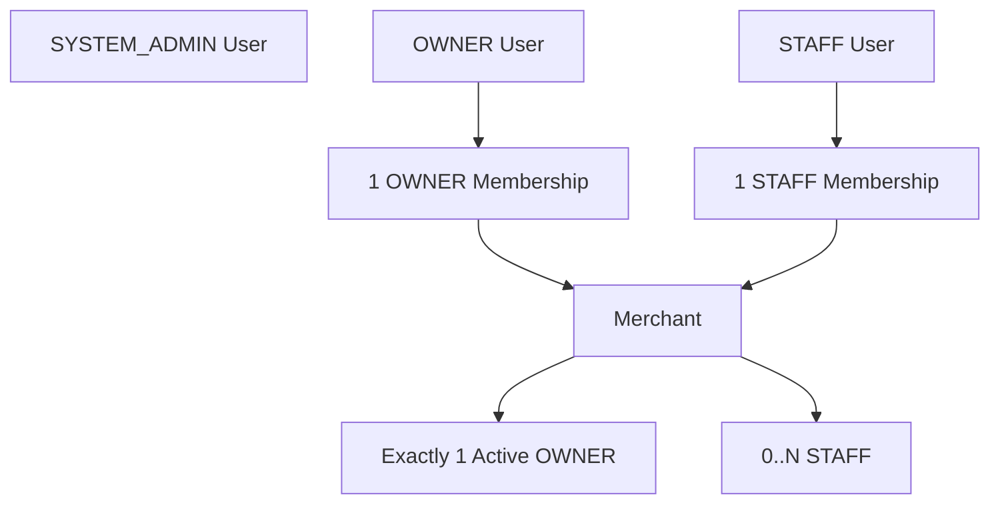
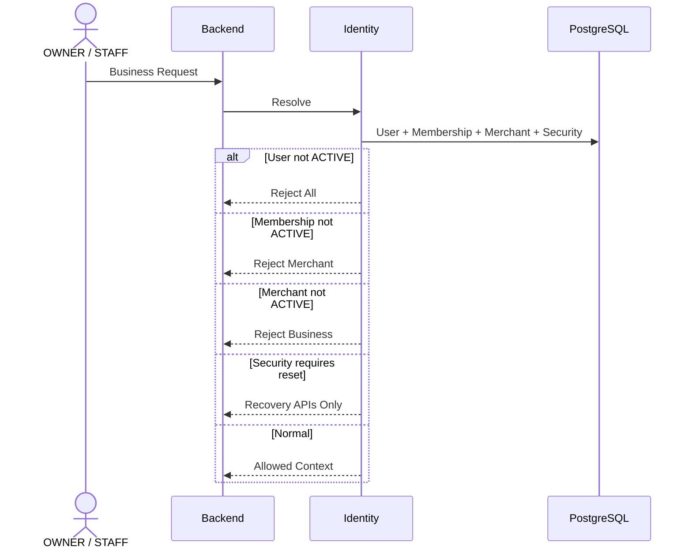
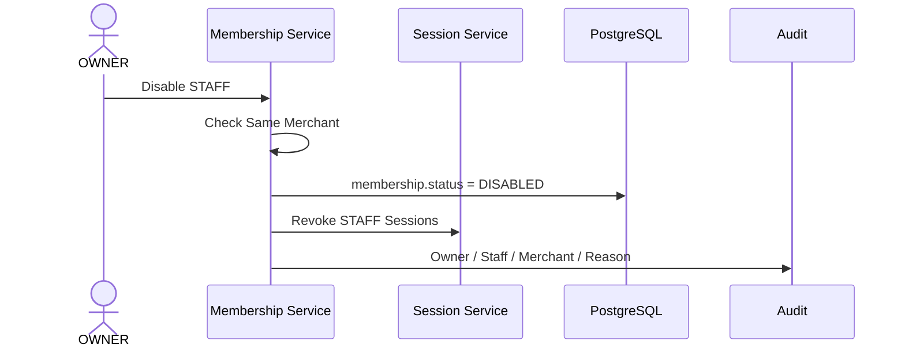
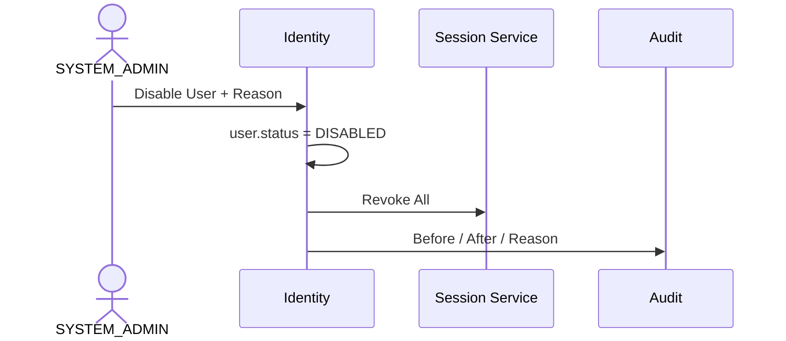
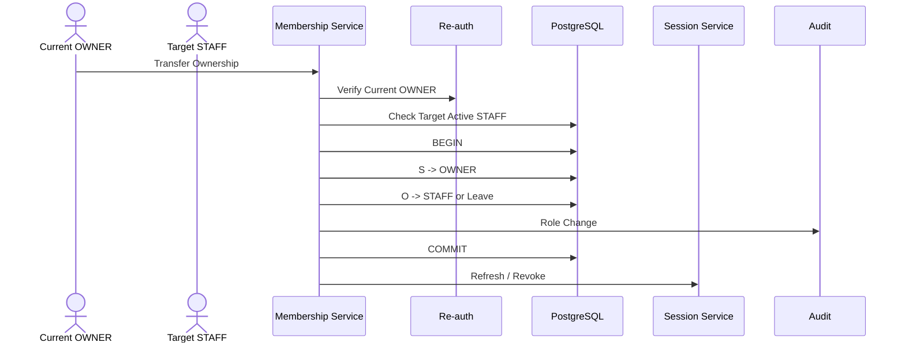

# 01.6 — 账号状态与商户成员关系详细设计

> 当前产品已经明确：OWNER 和 STAFF 都不支持多 Merchant。

---

# 1. 为什么仍需要 Membership

即使一个 User 只属于一家店，也不把 role / merchant / permissions 全塞进 User。

原因：

- SYSTEM_ADMIN 没 Merchant；
- STAFF 权限属于商户关系；
- STAFF 离职和 User 全局停用不同；
- Merchant 冻结和账号删除不同；
- 历史业务要保留当时 Merchant Role。

---

# 2. 当前基数



```text
SYSTEM_ADMIN -> 0 Merchant Membership
OWNER -> 1 Merchant
STAFF -> 1 Merchant
```

---

# 3. 状态层级

```text
User Status
Membership Status
Merchant Status
Security State
```

## User

```text
ACTIVE
DISABLED
ARCHIVED
```

## Membership

```text
ACTIVE
DISABLED
LEFT / ARCHIVED（生命周期后续细化）
```

## Merchant

```text
ACTIVE
FROZEN
CLOSED
```

## Security

```text
NORMAL
STEP_UP_REQUIRED
TEMP_PASSWORD_RESET_REQUIRED
PASSWORD_RESET_REQUIRED
TEMPORARY_LOCKED
```

---

# 4. 业务请求判定



---

# 5. STAFF 停用



历史销售 / 进货 / 库存等不删除。

---

# 6. SYSTEM_ADMIN 全局停用



比 Membership Disable 更强。

---

# 7. Merchant 冻结

Merchant FROZEN：

- OWNER / STAFF 不能经营；
- User 不删除；
- PHONE / EMAIL 不删除；
- Password 不删除；
- 历史业务 SYSTEM_ADMIN 仍可管理；
- 账号恢复与后台排障由 Admin Policy 控制。

---

# 8. OWNER 单店

已经冻结：

> 不支持 OWNER 多 Merchant。

系统不做 OWNER Merchant Selector，不预埋多店切换。

未来若产品变化，应重新设计，而不是现在制造复杂性。

---

# 9. STAFF 单店

同样：

```text
一个 STAFF -> 一家店
```

好处：

- 权限简单；
- UI 简单；
- 店员理解简单；
- Password Reset 边界简单；
- Session Merchant Context 唯一。

---

# 10. 店长交接

换店长不是添加第二 OWNER，而是角色事务：



原 OWNER 变 STAFF 还是退出，后续专题确认。

---

# 11. 不物理删除

有业务 / Audit / Security / Agent Usage 依赖时，不物理删除 User / Membership。

---

# 12. 已冻结规则

1. SYSTEM_ADMIN 无 Merchant；
2. OWNER 单店；
3. STAFF 单店；
4. Merchant 一个 OWNER；
5. User / Membership / Merchant / Security 状态分开；
6. STAFF 停用不删除历史；
7. User Disable 全局失效；
8. Merchant Frozen 不删除 User；
9. 历史业务可反查操作者；
10. 不设计 OWNER / STAFF 多店。
