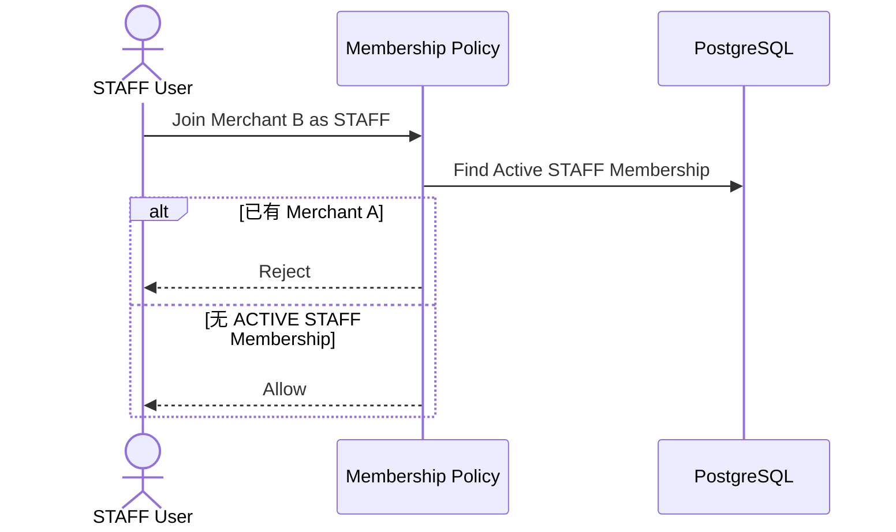

# 01.6 — 账号状态与商户成员关系详细设计

# 1. User 与 Membership 分离

User 是平台账号；Membership 是商户关系。

已确认新增约束：

```text
STAFF User
→ 只能有一个 ACTIVE STAFF Membership
→ 只能对应一个 Merchant
```

OWNER 的多 Merchant 产品能力不在本规则中冻结。

# 2. 状态层级

```text
User Status
Membership Status
Merchant Status
Security State
```

# 3. STAFF 单店判定



# 4. STAFF 停用

停用 Membership：

- 该 Merchant 访问立即失效；
- Session 撤销；
- 历史业务保留；
- STAFF 是否在正式离店后允许加入新 Merchant，后续 STAFF 生命周期专题决定。

# 5. User 全局停用

SYSTEM_ADMIN 全局停用 User：

- 所有 Session 失效；
- 所有 Membership 暂不可用；
- 历史数据不删除。

# 6. Password Credential 与 Membership

正式 Password Credential 仍属于 User。

但由于 STAFF 只能对应一个店，OWNER 对本店 STAFF 的随机临时密码重置不会影响第二个 STAFF Merchant。

# 7. 店长交接

注册阶段一个 Merchant 只有一个 OWNER。

换店长走角色交接事务，不通过第二 OWNER 注册。

# 8. 不物理删除历史身份

有业务 / Audit 依赖的 User、Membership 不物理删除。
