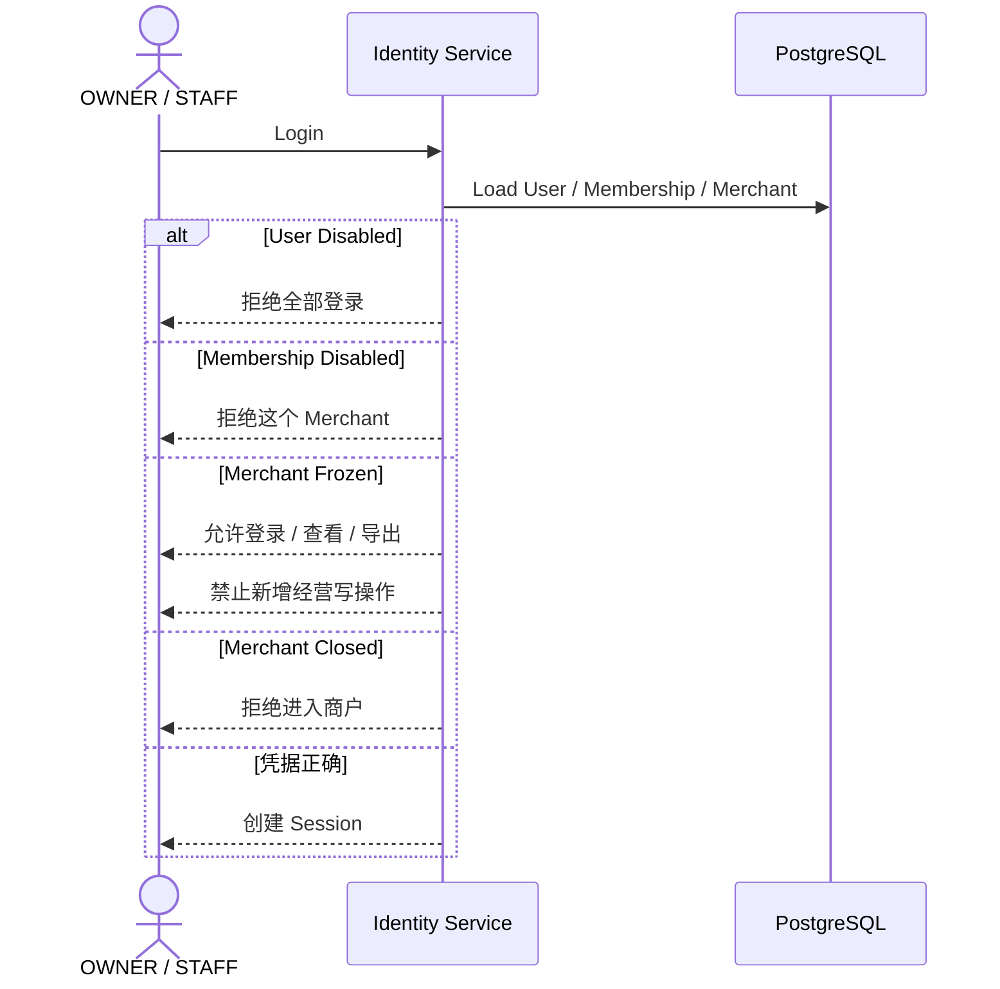
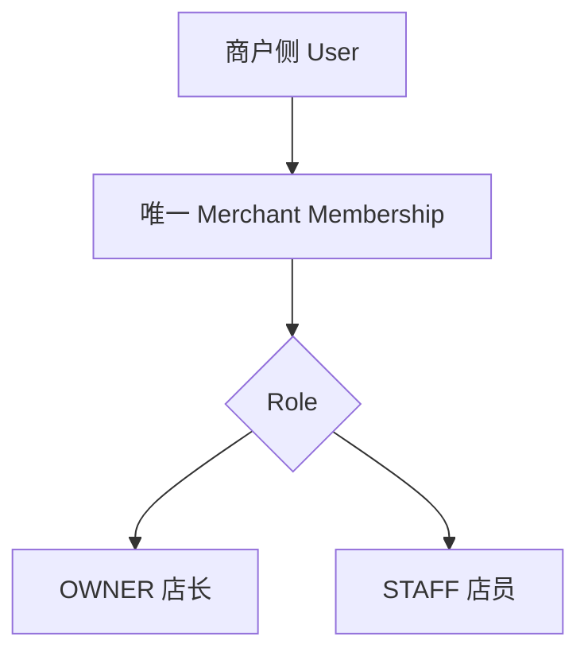
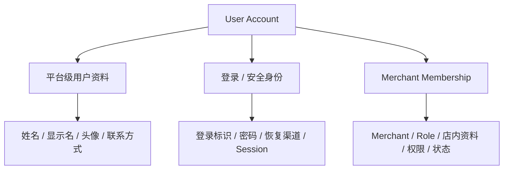
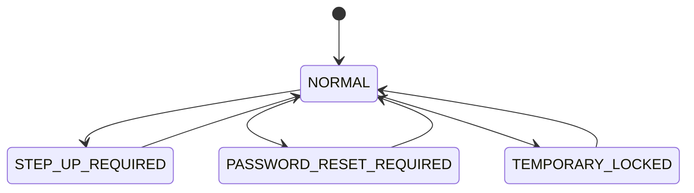
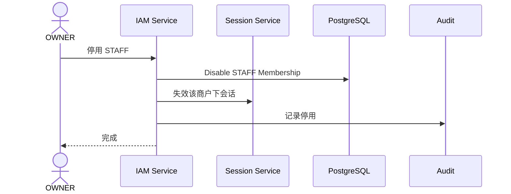

# 01.6 — 账号状态与商户成员关系

> 来源：ChatGPT 分享对话（第 35 ~ 41 轮）完整提取与整理
> 对应对话中最终形成的文档：`master-goods-system-design-v3/01-账户与身份/05-账号状态与商户成员关系.md`
> 子模块详细设计。保留对话中全部状态机、时序图与边界。

---

# 1. 设计目标

回答：

```text
User / Membership / Merchant 各自有哪些状态？
状态怎样影响登录与业务权限？
停用账号后历史记录怎么办？
成员关系为什么是"单店"？
哪些状态迁移是合法的？
```

---

# 2. 三层状态模型

登录本质上要分别校验账号、Security State、Membership 和 Merchant 四个维度（第 36 轮）：

| 层 | 作用 | 例子 |
|---|---|---|
| User Account Status | 这个人整个账号是否可用 | ACTIVE / DISABLED |
| Security State | 登录安全条件和恢复要求 | NORMAL / STEP_UP_REQUIRED / PASSWORD_RESET_REQUIRED / TEMPORARY_LOCKED |
| Membership | 这个人在这家店是否仍有效 | ACTIVE / DISABLED |
| Merchant | 这家店是否正常营业 | ACTIVE / FROZEN / CLOSED |



**图示说明（2. 三层状态模型）：** 这是服务调用时序图，参与者包括 OWNER / STAFF、Identity Service、PostgreSQL。箭头表示一次调用或返回，alt/else 分支表示 Decision 的不同结果；事务提交前只做校验和状态准备，短信、邮件等外部副作用应在提交后通过 Outbox 执行。

`FROZEN` 不是删除：普通商户可以登录、查看和导出历史数据，但不能新增经营写操作；`SYSTEM_ADMIN` 仍可执行管理、排障、恢复和审计操作。`CLOSED` 保留历史数据，禁止新注册和普通业务写入，恢复必须由 SYSTEM_ADMIN 执行。

例如员工离职：

```text
User 仍然存在
Membership = DISABLED
```

历史记录仍然知道这是哪个人。

> 来源：对话第 35、36 轮

---

# 3. 商户成员关系（已冻结为单店）

当前规范：

```text
一个 STAFF 账号
→ 只能对应一个 Merchant

active STAFF membership count <= 1
```

**最终冻结：**

```text
SYSTEM_ADMIN
→ 平台级账号，不属于 Merchant

OWNER
→ 一个账号只对应一个 Merchant

STAFF
→ 一个账号只对应一个 Merchant
```



**图示说明（3. 商户成员关系（已冻结为单店））：** 这是责任或数据流图，核心节点包括 商户侧 User。箭头表示调用、归属或数据流向；权限、Merchant 范围和状态判断必须在服务端完成，不能由客户端或单一 UI 分支替代。

User 与 Membership 仍然值得分开，因为它们职责不同：

```text
User
= 登录、安全、资料、密码、Session

Membership
= 属于哪家店、OWNER/STAFF、权限、状态
```

但产品基数关系收紧为：

```text
Merchant-side User
→ 最多一个有效 Merchant Membership
```

这会让后面的权限、密码重置、Session、STAFF 管理简单很多。

> 来源：对话第 30、31、39、40 轮

---

# 4. Merchant Membership 承载的内容

```text
merchant_id
role
membership_status
STAFF permissions
merchant-local display / remark
joined_at
```

对应组件结构：



**图示说明（4. Merchant Membership 承载的内容）：** 这是责任或数据流图，核心节点包括 User Account。箭头表示调用、归属或数据流向；权限、Merchant 范围和状态判断必须在服务端完成，不能由客户端或单一 UI 分支替代。

修改边界的例子：

```text
修改头像 ≠ 修改登录账号
修改 STAFF 权限 ≠ 修改 STAFF 密码
停用 STAFF Membership ≠ 删除 User
Merchant 冻结 ≠ 删除 PHONE / EMAIL
```

> 来源：对话第 36 轮

---

# 5. User Security State 状态机

对话第 40 轮给出 User Security State：



**图示说明（5. User Security State 状态机）：** 这是状态机图，展示 图中标注的参与者和领域节点 的合法状态迁移。迁移必须由命令校验当前状态、操作者、版本和原因后提交；未列出的迁移必须拒绝并写入 Security Event 或 Audit。

语义：

```text
NORMAL
→ 正常

STEP_UP_REQUIRED
→ 需要二次验证（手机 / 邮箱）

PASSWORD_RESET_REQUIRED
→ 必须先重置密码（SYSTEM_ADMIN 强制或风险触发）

TEMPORARY_LOCKED
→ 临时锁定（风险 / 连续失败）
```

`DISABLED` 不属于 Security State。账号停用由独立的 `User Account Status` 表示，避免出现 `User.status = ACTIVE` 与 `SecurityState = DISABLED` 的歧义组合。

使用：

```text
State Pattern / Explicit State Machine
```

目的不是为了"套模式"，而是防止：

```text
已经 USED 的临时密码再次使用
已经 DISABLED 的邀请码还能注册
已经 REVOKED 的 Session 被刷新
```

> 来源：对话第 40 轮

---

# 6. 其他状态机

对话中至少固定以下状态机的核心合法状态迁移（08-04 收口）：

```text
User Account Status
Security State
Membership
Session
Invitation
Verification Challenge
Temporary Credential
```

其中：

**Invitation State**：

```text
CREATED
ACTIVE_UNBOUND
ACTIVE_BOUND
EXHAUSTED
DISABLED
EXPIRED
```

**Session State**：

```text
ACTIVE
ROTATED
REVOKED
EXPIRED
```

**Temporary Credential State**：

```text
ACTIVE
USED
EXPIRED
LOCKED
REVOKED
```

**Verification Challenge State**：

```text
CREATED
SENT
VERIFIED
EXPIRED
REVOKED
ATTEMPT_EXCEEDED
```

不用现在设计数据库字段，但必须知道哪些转换合法。

> 来源：对话第 40 轮

---

# 7. 状态迁移的通用要求

Invitation、Membership、User Security、Session、Challenge 和 Temporary Credential 的迁移都需要：

| 字段 | 含义 |
|---|---|
| current_state | 当前合法状态 |
| expected_state | 命令预期旧状态 |
| transition_event | 触发事件 |
| expected_version | 并发控制版本 |
| new_version | 成功迁移版本 |
| actor_ref | 操作者 |
| reason_code | 原因分类 |
| policy_version | 依据的规则版本 |
| transitioned_at | 服务端时间 |
| transition_result | APPLIED、CONFLICT、INVALID、DENIED |

Handler 不能直接随意写状态字符串。

核心不变量：

```text
状态字段只能通过合法迁移改变
```

> 来源：对话第 40 轮

---

# 8. 停用与恢复

## 8.1 停用 STAFF



**图示说明（8.1 停用 STAFF）：** 这是服务调用时序图，参与者包括 OWNER、IAM Service、Session Service、PostgreSQL。箭头表示一次调用或返回，alt/else 分支表示 Decision 的不同结果；事务提交前只做校验和状态准备，短信、邮件等外部副作用应在提交后通过 Outbox 执行。

历史业务（销售 / 进货 / 退货 / 库存调整）继续保留 `operator = 原 STAFF`。

最后一个 OWNER 不能在 `Merchant = ACTIVE` 时被直接停用：

```text
CanDisableOwnerSpecification
target.role = OWNER
AND active_owner_count = 1
AND merchant.status = ACTIVE
→ DENY_LAST_OWNER
```

允许的路径只有：先执行 `TransferOwnerCommand`，或先进入 Merchant `FROZEN / CLOSED` 的受控生命周期流程。该不变量同样约束 SYSTEM_ADMIN 的强制操作，并必须写入拒绝原因和 Audit。

## 8.2 账号停用后的处理规则

```text
有业务历史的 User / Membership 不物理删除
停用 STAFF Membership ≠ 删除 User
账号停用后已有业务记录继续保留
```

## 8.3 恢复

```text
停用不是删除，可通过独立的账号状态迁移恢复
User Account Status: DISABLED --> ACTIVE
Security State 保持或重新设置为 NORMAL
```

> 来源：对话第 30、31、36、40 轮

---

# 9. 状态与登录决策的关系

登录校验链路中状态的作用（封口设计）：


**图示说明（9. 状态与登录决策的关系）：** 这是责任或数据流图，核心节点包括 Credential。箭头表示调用、归属或数据流向；权限、Merchant 范围和状态判断必须在服务端完成，不能由客户端或单一 UI 分支替代。

输出：

```text
ALLOW
STEP_UP
RESET_REQUIRED
TEMPORARY_LOCK
DENY
```

对应关系：

```text
User DISABLED
→ DENY（拒绝全部登录）

Membership DISABLED
→ DENY（拒绝这个 Merchant，历史记录仍保留）

Merchant FROZEN
→ ALLOW（作用域为 READ_ONLY：允许登录、查看、导出；禁止新增经营写操作）

Merchant CLOSED
→ DENY（拒绝进入商户）

Security State = STEP_UP_REQUIRED
→ STEP_UP

Security State = PASSWORD_RESET_REQUIRED
→ RESET_REQUIRED

Security State = TEMPORARY_LOCKED
→ TEMPORARY_LOCK
```

> 来源：对话第 36、40、41 轮

---

# 10. 边界条件

```text
重置密码不能自动解除 DISABLED
Merchant 被关闭后邀请码禁止新增
同一 User + Merchant 不允许重复 Membership
停用员工后历史记录保留原操作者
只有恢复渠道时不能直接删除
```

> 来源：对话第 38 轮

---

# 11. 已冻结规则汇总

1. 三层状态：User / Membership / Merchant，登录时全部校验；
2. 一个 OWNER 只对应一个 Merchant（第 40 轮冻结）；
3. 一个 STAFF 只对应一个 Merchant（第 39 轮冻结，active STAFF membership count <= 1）；
4. User 与 Membership 保持分层（职责不同）；
5. 停用不删除历史业务记录；
6. 关键状态机：User Security、Membership、Session、Invitation、Verification Challenge、Temporary Password；
7. 状态迁移必须遵守合法路径，不能随意写状态字符串；
8. 状态与登录决策的映射固定（DENY / STEP_UP / RESET_REQUIRED / TEMPORARY_LOCK）。

---

# 12. 待确认项

```text
建议确认：Merchant FROZEN 允许登录、查看、导出，禁止新增经营写操作；SYSTEM_ADMIN 可正常管理和恢复
建议确认：ACTIVE Merchant 下最后一个 OWNER 不能直接停用，必须交接或先冻结 / 关闭 Merchant
```
