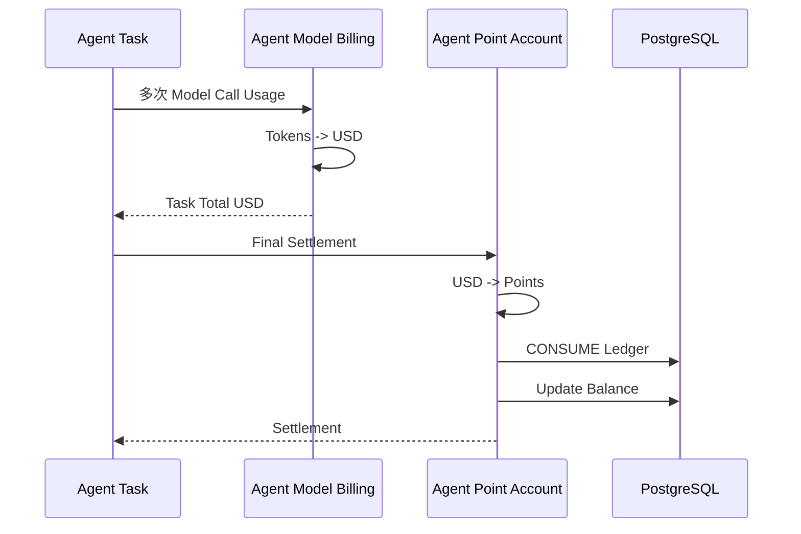
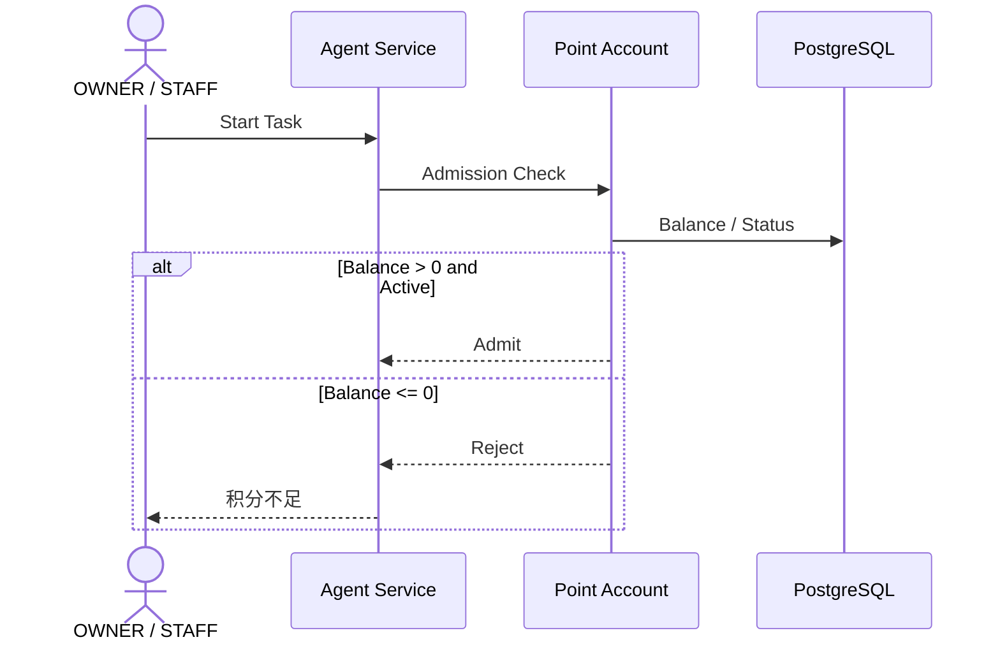
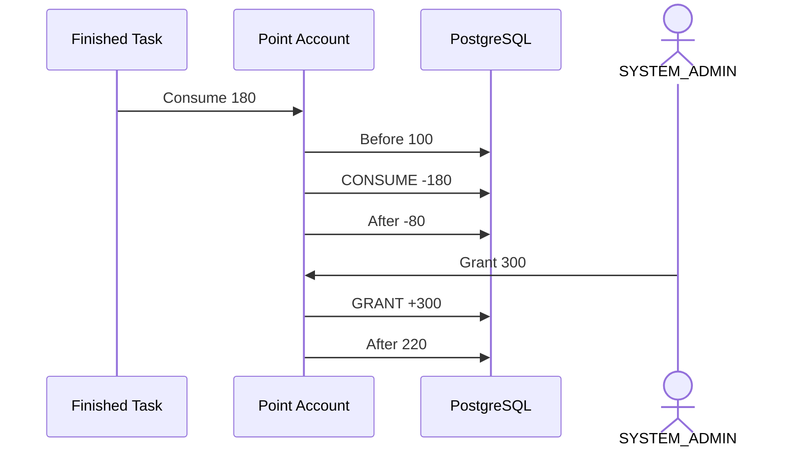
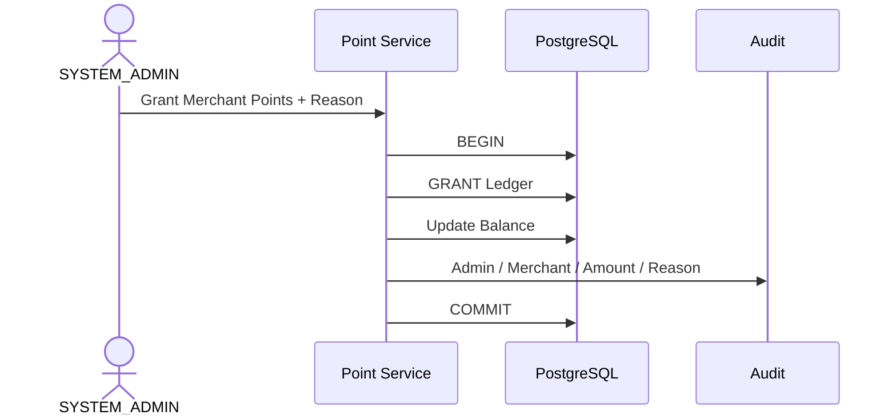

# 01.7 — Agent 积分账户详细设计

> Agent 积分属于账户模块。Agent 模块负责 Model Call / Token Usage / USD Cost；账户模块负责 USD -> Points、余额与 Ledger。

---

# 1. 为什么是账户

Agent Points 具有：

```text
Balance
Ledger
Grant
Consume
Adjust
Refund
Negative Balance
Status
```

所以它不是 LLM Runtime 内部变量，也不是经营现金。

---

# 2. 归属

```text
一个 Merchant
→ 一个 Agent Point Account
```

OWNER / STAFF 共用本店积分。

SYSTEM_ADMIN 下发。

---

# 3. 与 Agent 的边界



---

# 4. Task 级准入

一个 Agent Task 可多次调用模型：

```text
Call #1 -> Tool -> Call #2 -> Tool -> Call #3 -> Final
```

准入只在 Task 开始前判断。



---

# 5. Task 一旦开始必须完成

如果：

```text
Start Balance = 100
Actual Cost = 180
```

不能在 100 用完时中断。

因为 Tool 可能已经改变业务数据，而后续模型调用还需要完成任务和解释结果。

所以允许：

```text
Balance = -80
```

---

# 6. 负余额与充值抵扣



不需要单独欠费账户。

---

# 7. 下一个 Task

```text
Balance > 0 -> Allow New Task
Balance <= 0 -> Reject New Task
```

已完成 Task 不回滚。

---

# 8. USD -> Points

Agent 模块给：

```text
Task Total USD
```

Account 模块按：

```text
Points Conversion Version
```

换算。

历史保存 conversion version，后续改比例不重算历史。

---

# 9. Ledger

至少：

```text
GRANT
CONSUME
ADJUST
REFUND
```

记录：

```text
merchant_id
type
task_id
amount
balance_before
balance_after
reason
operator
conversion_version
created_at
```

不能只有 balance。

---

# 10. SYSTEM_ADMIN 下发



---

# 11. 并发 Task

多个 Task 同时看到 Balance > 0，都可能被准入，然后最终形成更深负数。

当前优先规则：

> 已准入 Task 必须完成。

未来可加并发上限、最低启动积分、预留额度，但不能中途截断已准入 Task。

---

# 12. 已冻结规则

1. Points 属于 Merchant Account；
2. SYSTEM_ADMIN 下发；
3. OWNER / STAFF 共用；
4. Task 级准入；
5. 已准入 Task 完成；
6. 可扣负；
7. 负数阻止新 Task；
8. 充值自动抵扣；
9. Ledger 可追溯；
10. Token USD 定价属于 Agent；
11. Points Balance 属于 Account。
