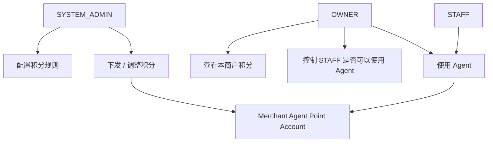
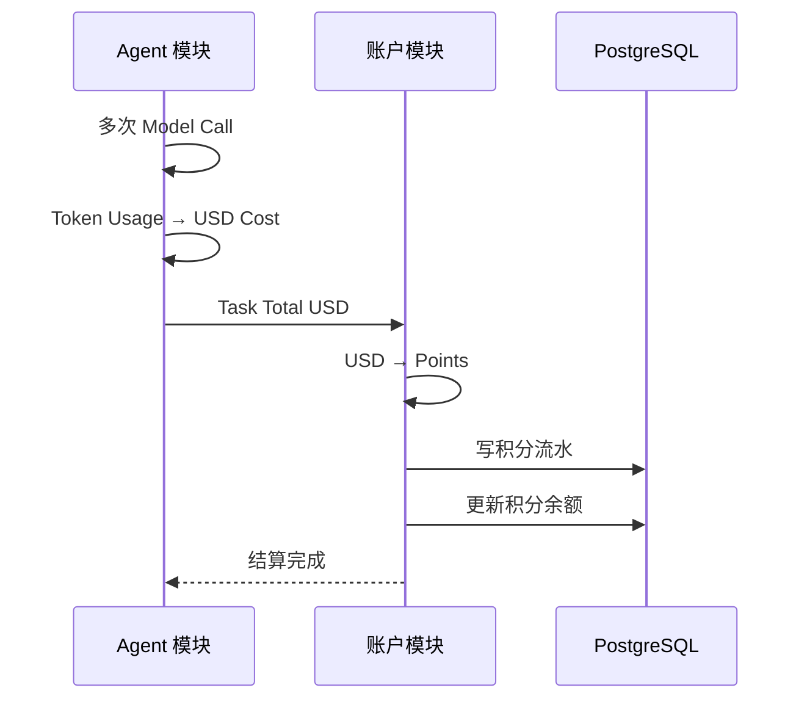
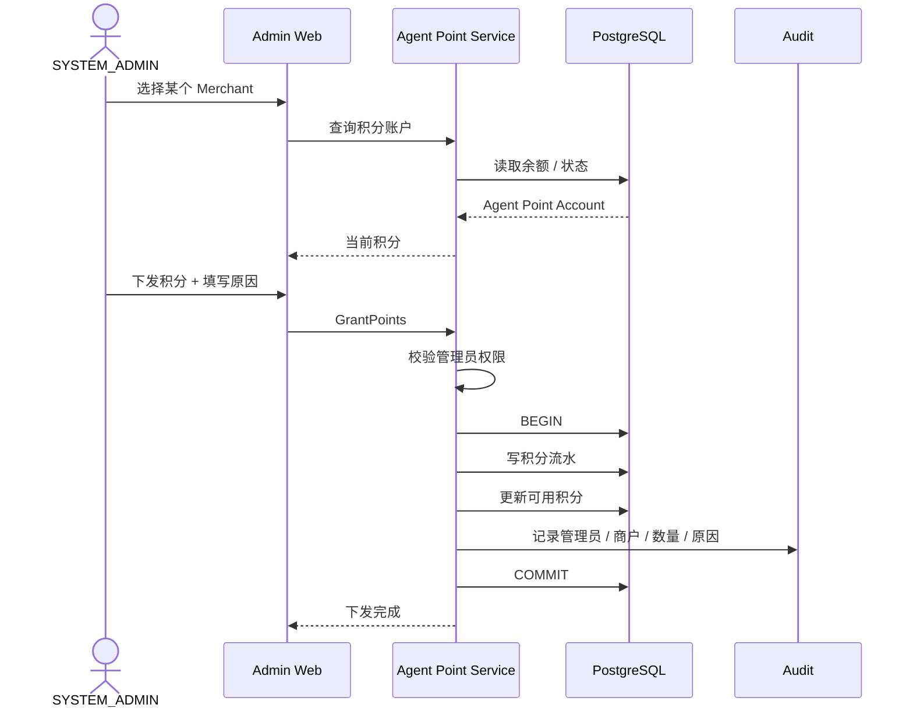
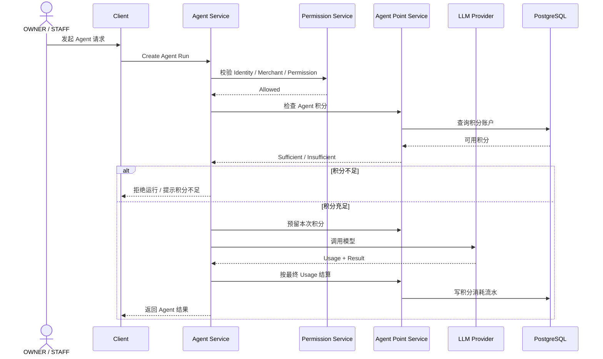
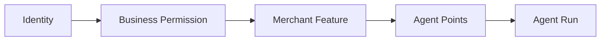
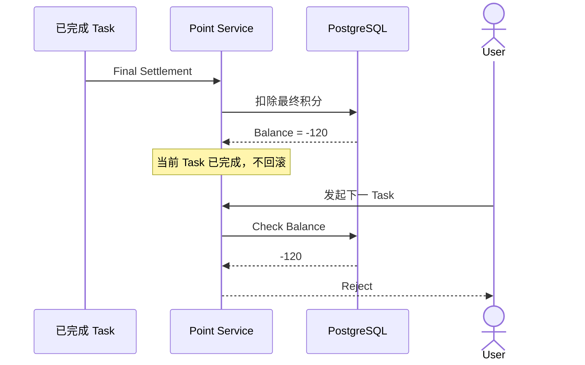
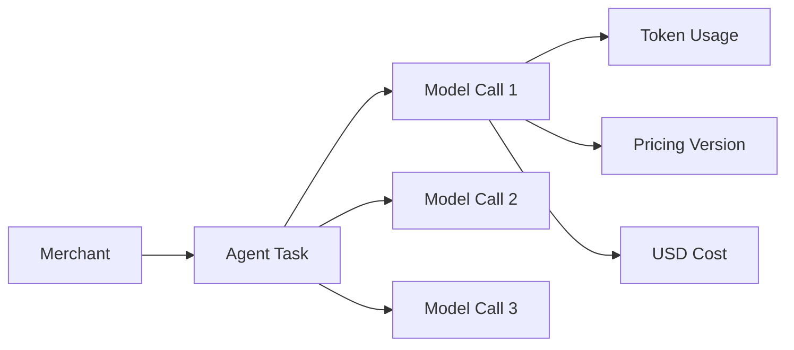

# 01.7 — Agent 积分账户

> 来源：ChatGPT 分享对话（第 30 ~ 36 轮）完整提取与整理
> 对应对话中最终形成的文档：`master-goods-system-design-v3/01-账户与身份/06-Agent积分账户.md`
> 子模块详细设计。保留对话中全部时序图、规则与边界。

---

# 1. 设计目标

回答：

```text
Agent 使用为什么需要独立积分系统？
积分归谁（账号主体）？
SYSTEM_ADMIN 怎样下发与配置积分？
积分不足时 Agent 怎样表现？
模型定价变化怎样不影响历史？
```

用户原始要求（第 30 轮）：

> Agent 使用需要有单独的积分系统，由系统管理员下发配置。

> 来源：对话第 30 轮

---

# 2. 积分体系定位

与商户经营记账**完全分离**。它不是：

```text
现金
微信
支付宝
银行卡
经营收入
```

而是：

```text
平台 Agent Usage Credit
```

角色关系：



**图示说明（2. 积分体系定位）：** 这是责任或数据流图，核心节点包括 SYSTEM_ADMIN、OWNER、STAFF。箭头表示调用、归属或数据流向；权限、Merchant 范围和状态判断必须在服务端完成，不能由客户端或单一 UI 分支替代。

当前建议（对话原文）：

> **积分主账户归 Merchant，而不是直接归某个自然人账号。**

原因是 OWNER 和 STAFF 都属于同一家商户，Agent 本质上服务商户经营。

以后可以在 Merchant 积分池之上再设置：

```text
STAFF Agent 使用权限
STAFF 单次 / 每日上限
```

但 OWNER 不能自己"造积分"。只有 SYSTEM_ADMIN 能下发和调整总积分。

> 来源：对话第 30 轮

---

# 3. 归属调整（重要演进）

**第 35 轮正式调整**：Agent 积分体系部分归入**账户与身份模块**。

```text
账户与身份
→ Agent积分账户
```

而 Agent 模块只负责：

```text
Provider / Model / Model Call / Token Usage / USD Cost
```

两者关系：



**图示说明（3. 归属调整（重要演进））：** 这是服务调用时序图，参与者包括 Agent 模块、账户模块、PostgreSQL。箭头表示一次调用或返回，alt/else 分支表示 Decision 的不同结果；事务提交前只做校验和状态准备，短信、邮件等外部副作用应在提交后通过 Outbox 执行。

> **"模型花了多少钱"属于 Agent；"账户还有多少积分"属于账户系统。**

> 来源：对话第 35 轮

---

# 4. SYSTEM_ADMIN 下发积分



**图示说明（4. SYSTEM_ADMIN 下发积分）：** 这是服务调用时序图，参与者包括 SYSTEM_ADMIN、Admin Web、Agent Point Service、PostgreSQL。箭头表示一次调用或返回，alt/else 分支表示 Decision 的不同结果；事务提交前只做校验和状态准备，短信、邮件等外部副作用应在提交后通过 Outbox 执行。

重要原则：

> **积分系统不能只保存一个 balance 数字。**

至少要有：

```text
当前余额
+
积分流水
+
SYSTEM_ADMIN 操作审计
```

否则以后管理员手工加减积分时没有可追溯性。

> 来源：对话第 30 轮

---

# 5. OWNER / STAFF 使用 Agent



**图示说明（5. OWNER / STAFF 使用 Agent）：** 这是服务调用时序图，参与者包括 OWNER / STAFF、Client、Agent Service、Permission Service。箭头表示一次调用或返回，alt/else 分支表示 Decision 的不同结果；事务提交前只做校验和状态准备，短信、邮件等外部副作用应在提交后通过 Outbox 执行。

因此 Agent 真正有**四层 Gate**：



**图示说明（5. OWNER / STAFF 使用 Agent）：** 这是责任或数据流图，核心节点包括 Identity。箭头表示调用、归属或数据流向；权限、Merchant 范围和状态判断必须在服务端完成，不能由客户端或单一 UI 分支替代。

不是有 Agent 按钮就一定能调用模型。

> 来源：对话第 30 轮

---

# 6. Task 完成权（不中途打断）

规则：

> **Task 一旦通过开始准入，就获得本次任务的完成权。**

不能出现：

```text
Tool 已经创建销售
↓
模型准备第二次推理
↓
积分刚好为 0
↓
强制中断整个 Task
```

这种情况会把业务流程卡在半路。

> 来源：对话第 32 轮

---

# 7. 余额不足只阻止"下一个 Task"



**图示说明（7. 余额不足只阻止"下一个 Task"）：** 这是服务调用时序图，参与者包括 已完成 Task、Point Service、PostgreSQL、User。箭头表示一次调用或返回，alt/else 分支表示 Decision 的不同结果；事务提交前只做校验和状态准备，短信、邮件等外部副作用应在提交后通过 Outbox 执行。

也就是说：

```text
允许：
某 Task 结束时积分变负

不允许：
负积分继续启动新的 Task
```

直到 SYSTEM_ADMIN 再下发积分。

已冻结行为：

```text
Agent Points 属于 Merchant 账户
已准入 Task 可以扣成负数
后续充值自然抵消负余额
Balance <= 0 不允许新 Task
```

> 来源：对话第 32、41 轮

---

# 8. 定价必须版本化

因为 SYSTEM_ADMIN 以后可能修改：

```text
GPT-X input 价格
GPT-X output 价格
缓存价格
USD → Points 比例
```

所以不能修改价格以后，把历史消费也跟着变掉。

每次调用要保存：

```text
provider
model
input_tokens
output_tokens
cached_tokens
pricing_version
input_usd
output_usd
cache_usd
total_usd
```

管理员可以完整下钻：



**图示说明（8. 定价必须版本化）：** 这是责任或数据流图，核心节点包括 Merchant。箭头表示调用、归属或数据流向；权限、Merchant 范围和状态判断必须在服务端完成，不能由客户端或单一 UI 分支替代。

配置版本化要求（第 40 轮）：

| 配置 | 关键字段 |
|---|---|
| Agent Pricing | pricing_version、input_usd、output_usd、cached_input_usd、usd_to_points_version |

旧 Challenge、旧 Session、历史 Task 和 Model Call 必须继续引用创建时的版本；发布新版本不能重算历史事实。

> 来源：对话第 32、40 轮

---

# 9. 与 Agent 模块的职责边界

| 主题 | 归属 |
|---|---|
| Provider / Model 配置 | Agent 模块 |
| Model Call 记录 | Agent 模块 |
| Token Usage → USD Cost | Agent 模块 |
| Task 总 USD 结算请求 | Agent 模块 → 账户模块 |
| USD → Points 换算 | 账户模块 |
| 积分余额 / 流水 / 负数 / 充值抵扣 | 账户模块 |
| 积分下发 / 规则配置 | SYSTEM_ADMIN（账户模块实现） |

对话第 35 轮提交确认的目录边界：

```text
docs/system-design/
├── 01-账户与身份/
│   └── 06-Agent积分账户.md        ← 积分账户属于账户模块
└── 10-Agent/
    ├── Agent模块.md
    └── 01-模型提供商与模型配置.md  ← Provider / Model / Pricing 属于 Agent 模块
```

> 来源：对话第 35 轮

---

# 10. 已冻结规则汇总

1. Agent 积分是平台 Agent Usage Credit，与经营记账完全分离；
2. 积分主账户归 Merchant，不归个人账号；
3. 只有 SYSTEM_ADMIN 能下发 / 调整积分（OWNER 不能造积分）；
4. 积分系统必须有：当前余额 + 积分流水 + SYSTEM_ADMIN 操作审计；
5. Agent 调用四层 Gate：Identity → Business Permission → Merchant Feature → Agent Points；
6. Task 一旦准入获得完成权，执行中不断；
7. 已准入 Task 可以扣成负数；负余额只阻止下一个 Task；
8. Balance <= 0 不允许新 Task；充值自然抵消负余额；
9. 模型定价与 USD → Points 比例必须版本化，历史消费不随价格调整改变。

---

# 11. 待确认项

```text
STAFF 单次 / 每日 Agent 使用上限的具体数值
积分规则的完整配置项（SYSTEM_ADMIN 侧）
USD → Points 换算比例的具体值
积分流水的对账与报表形态
```
