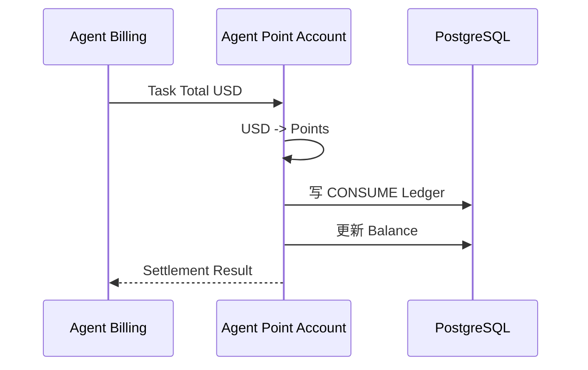

# 01.7 — Agent 积分账户详细设计

> Agent 积分属于账户模块。Agent 模块只负责 Model Call、Token Usage 与 Task USD Cost。

# 1. 归属

```text
一个 Merchant
→ 一个 Agent Point Account
```

# 2. 账户能力

```text
Balance
Ledger
Grant
Consume
Adjust
Refund
Negative Balance
Status
```

# 3. Task 结算



# 4. 允许负余额

已准入 Task 完成后可以：

```text
100 - 180 = -80
```

SYSTEM_ADMIN 后续下发 300：

```text
-80 + 300 = 220
```

负数自然由后续充值抵扣。

# 5. 新 Task 准入

```text
Balance > 0
→ 允许新 Task

Balance <= 0
→ 禁止新 Task
```

已准入 Task 不因中途积分耗尽而停止。
