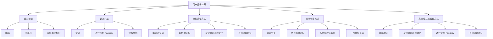
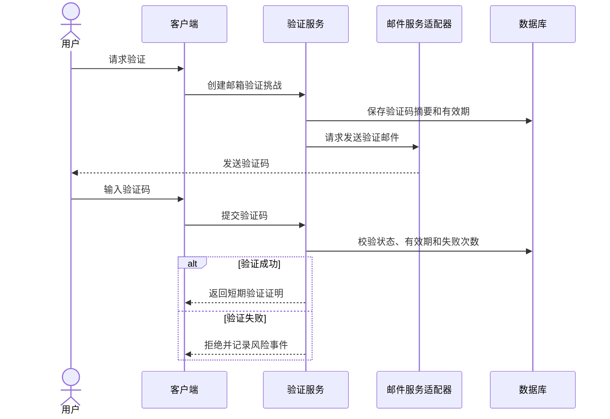
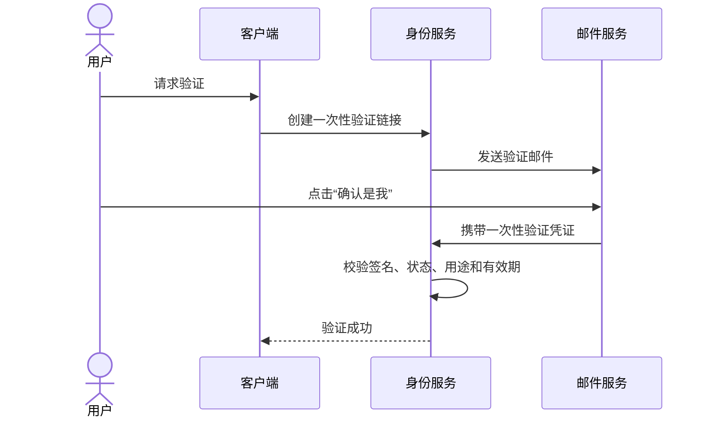
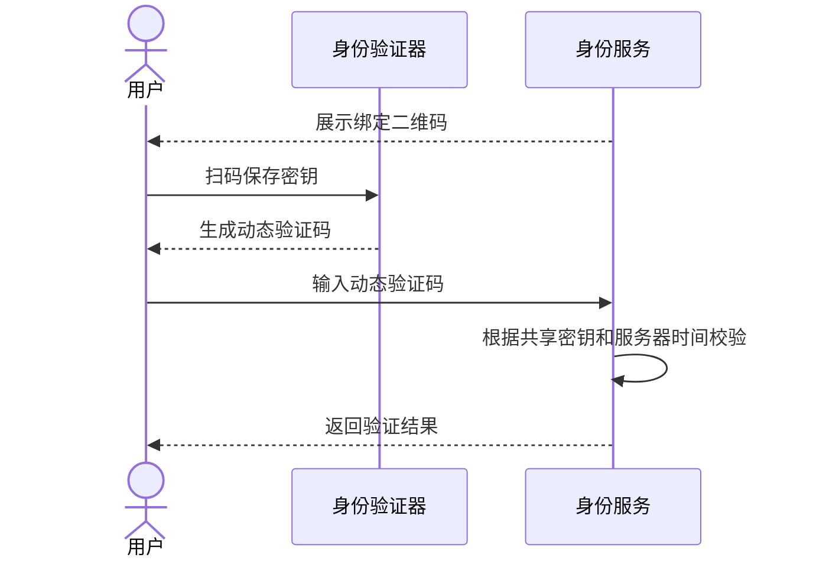
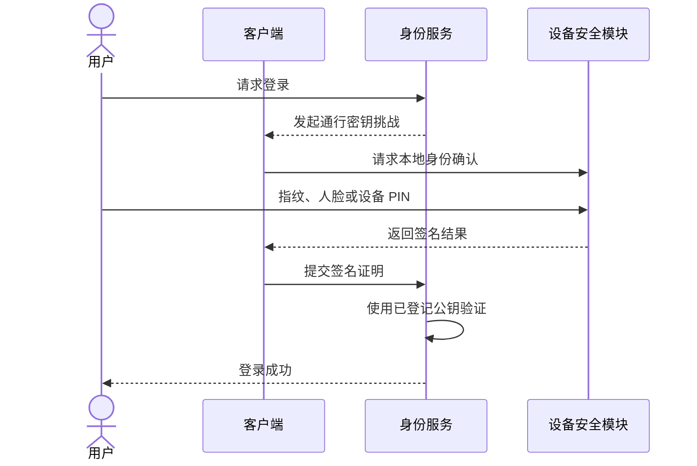
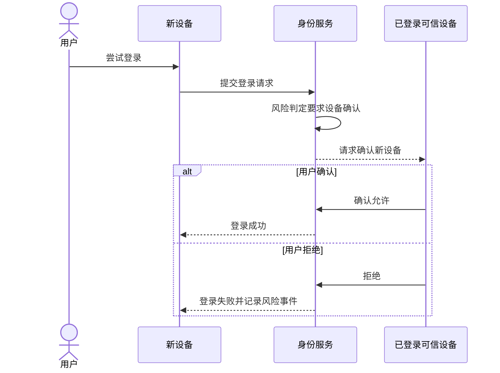
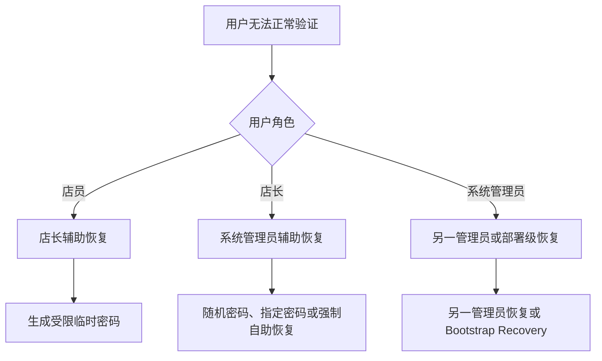
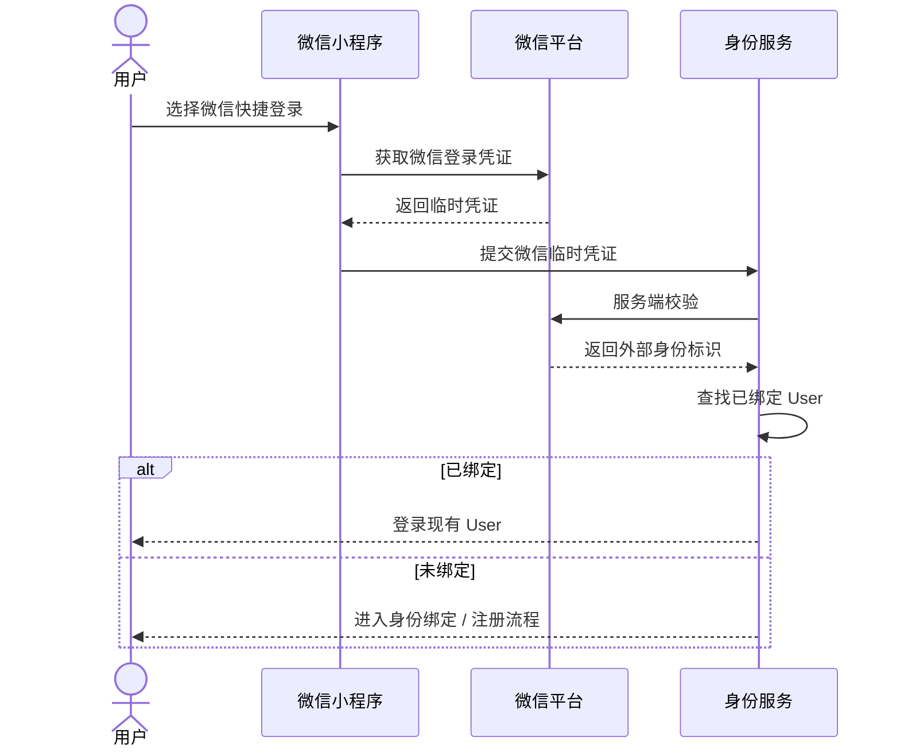
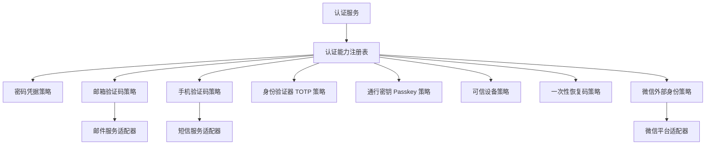
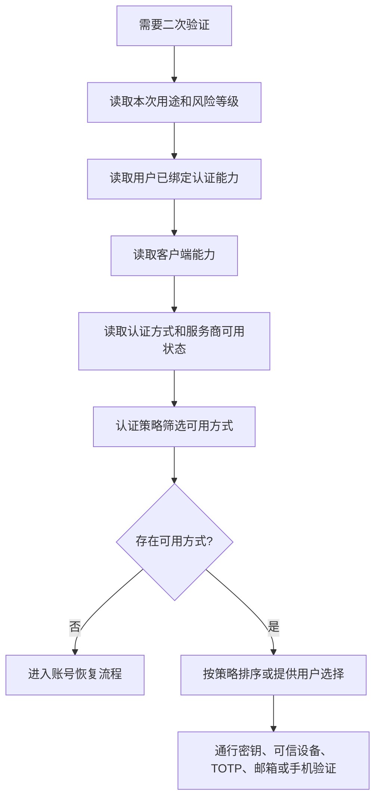

# 01.9 — 身份认证能力与验证方式

> 本文把“登录标识、登录凭据、身份验证方式、账号恢复方式、高风险二次验证方式”拆开设计。
> 核心目标：短信是否已经完成备案、某个 Provider 是否可用，都不能迫使系统重写登录、恢复、风险和用户身份模型。
> 图表中的业务节点统一使用中文；Passkey、TOTP、Strategy 等标准技术名仅作为括号中的补充术语。

---

# 1. 为什么不能把 PHONE / EMAIL 当成全部身份体系

身份体系至少拆成五层：

```text
登录标识
≠
登录凭据
≠
身份验证方式
≠
账号恢复方式
≠
高风险二次验证方式
```

例如：

- 邮箱可以是“登录标识”，也可以是“邮箱验证方式”；
- 密码是“登录凭据”，不是登录标识；
- 通行密钥（Passkey）是“登录凭据 / 二次验证凭据”，通常不是 Login Identifier；
- 恢复码是“账号恢复方式”，不应该拿来作为日常登录方式；
- 可信设备确认适合新设备登录和 Step-up，不适合作为唯一恢复方式。



这五层必须在领域模型、Policy 和 Strategy 上保持职责分离。

---

# 2. 当前部署基线：可以完全不依赖短信

产品模型正式支持：

```text
Login Identifier:
- EMAIL
- PHONE

Verification Method:
- EMAIL
- PHONE
- 未来可增加 TOTP / Passkey / Trusted Device 等
```

但是“架构支持”不等于“当前环境必须启用”。

当前第一阶段建议：

```text
主要登录：
邮箱 + 密码

注册证明：
邀请码 + 邮箱验证

忘记密码：
邮箱验证

店员丢失邮箱：
店长随机临时密码

店长丢失邮箱：
SYSTEM_ADMIN 恢复

SYSTEM_ADMIN 丢失账号：
另一 SYSTEM_ADMIN / Bootstrap Recovery

高风险二次验证：
邮箱验证
```

当前部署可以：

```text
EMAIL = enabled
PHONE = disabled
```

PHONE 保留完整领域能力，但短信资质、备案和 Provider 没有准备好时，不允许：

```text
手机号登录
手机号找回密码
手机号 Step-up
短信 Challenge
```

手机号在未验证阶段只能作为普通联系方式：

```text
Contact Identifier
verification_status = UNVERIFIED
```

关键不变量：

> **“保存了手机号”绝不等于“手机号已经证明属于该 User”。**

未来完成短信接入后：

```text
验证手机号
→ PHONE = VERIFIED
→ VerificationPolicy 允许其参加 Login / Recovery / Step-up
```

主登录流程、Risk Engine 和 Password Reset 主流程不需要重写。

---

# 3. 身份能力矩阵

| 能力 | 类型 | 日常登录 | 注册验证 | 忘记密码 | 高风险二次验证 | 当前阶段 |
|---|---|---:|---:|---:|---:|---|
| 密码 | 登录凭据 | 是 | 否 | 否 | 可作为重新认证 | 启用 |
| 邮箱验证码 | 验证方式 | 否 | 是 | 是 | 是 | 启用 |
| 邮件确认链接 | 验证方式 | 否 | 可选 | 可选 | 可选 | 可扩展 |
| 手机短信验证码 | 验证方式 | 可组合 | 可选 | 可选 | 可选 | Provider 暂停启用 |
| 身份验证器 TOTP | 验证 / 二次验证 | 可组合 | 否 | 不作为唯一恢复 | 是 | 第二阶段 |
| 通行密钥 Passkey | 登录凭据 / 二次验证 | 是 | 否 | 不作为唯一恢复 | 是 | 第三阶段 |
| 可信设备确认 | 二次验证 | 否 | 否 | 否 | 是 | 第二阶段 |
| 一次性恢复码 | 恢复方式 | 否 | 否 | 是 | 否 | 第二阶段，主要 OWNER / SYSTEM_ADMIN |
| 店长临时密码 | 恢复方式 | 受限登录 | 否 | STAFF | 否 | 已支持 |
| SYSTEM_ADMIN 恢复 | 恢复方式 | 否 | 否 | OWNER / STAFF | 否 | 已支持 |
| 微信外部身份 | 外部身份 | 快捷登录 | 可绑定 | 不作为唯一恢复 | 可扩展 | 第三阶段 |

任何一种 Method 都不要求支持全部 Purpose。

---

# 4. 方案一：邮箱验证码

邮箱验证码是第一阶段默认 Verification Method。

适用：

- 注册；
- 忘记密码；
- 修改邮箱；
- 高风险二次验证；
- SYSTEM_ADMIN 要求用户自助恢复。



设计模式：

```text
验证策略（Strategy）
+ 策略注册表（Registry）
+ 邮件服务适配器（Adapter）
+ 事务外发信箱（Outbox）
```

安全要求：

- Challenge Code 不保存明文；
- 验证使用 Hash / MAC 和 constant-time compare；
- Challenge 有 TTL；
- 失败次数有限制；
- Proof 必须绑定 User、Purpose、Target Command、有效期；
- REGISTER 的 Proof 不能直接拿去执行 CHANGE_IDENTIFIER；
- 发送由 Outbox 提交后执行，不在核心事务里调用邮件网络 API。

---

# 5. 方案二：邮件确认链接

邮箱验证不一定要求用户手工输入验证码，也可以发送一次性确认链接。

流程：

```text
系统发邮件
→ 用户点击“确认是我”
→ 浏览器 / App Deep Link
→ 服务端验证一次性 Token
→ 返回 Verification Proof
```



必须处理跨设备：

```text
Web 正在注册
+
用户在手机邮件客户端点击链接
```

因此一次性 Token 至少绑定：

```text
purpose
target_user / pending_identity
target_identifier
challenge_id
expires_at
one_time_state
config_version
```

Token 不能是永不过期的固定 URL，也不能完成与 Purpose 无关的高风险操作。

---

# 6. 方案三：身份验证器 TOTP

TOTP 适合 SYSTEM_ADMIN 和可选开启的 OWNER，不建议第一阶段要求普通 STAFF 使用。

绑定：

```text
系统生成 TOTP Secret
→ 用户扫描二维码
→ 用户输入一次动态码确认绑定成功
→ Secret 受保护保存
```

使用时：



优点：

- 不依赖短信备案；
- 不依赖邮件实时到达；
- Provider 成本低；
- 非常适合 SYSTEM_ADMIN；
- 适合高风险操作 Step-up。

边界：

- TOTP Secret 是高敏感数据，不能进入 Audit / Log；
- 绑定必须先完成当前身份重新认证；
- 解绑同样属于高风险操作；
- 丢失 TOTP 设备时必须回到独立 Recovery 流程；
- TOTP 不应成为唯一 Recovery Method；
- 服务端校验允许有限时间窗口，但窗口由策略版本控制。

---

# 7. 方案四：通行密钥 Passkey

Passkey 适合作为长期的低摩擦登录和高风险二次验证方式。

体验：

```text
选择账号
→ Face ID / 指纹 / Windows Hello / 设备 PIN
→ 设备完成私钥签名
→ 系统验证公钥
→ 登录
```



服务器保存：

```text
credential_id
public_key
counter / authenticator metadata
user_id
created_at
last_used_at
status
```

服务器**不保存**：

```text
用户指纹
Face ID 数据
设备 PIN
设备私钥
```

第一阶段不强制实现，因为需要额外设计：

- 换手机；
- 设备丢失；
- 多设备 Passkey；
- Passkey 撤销；
- Recovery；
- 微信小程序实际支持边界。

领域模型应现在保留 Credential 扩展点，但实际启用放到后续阶段。

---

# 8. 方案五：可信设备确认

可信设备确认利用现有多设备 Session、Device Context 和 Risk Engine。

典型场景：

```text
新电脑登录
→ Risk 判定需要 Step-up
→ 已登录 Android / iOS 设备收到确认请求
→ 用户确认或拒绝
```



适合：

- 新设备登录；
- 修改敏感设置；
- 高风险动作 Step-up。

不适合：

- 唯一账号恢复方式。

原因：用户可能已经没有任何可信设备。

可信设备 Proof 必须绑定：

```text
approver_session_id
target_login_attempt_id
target_device_ref
purpose
expires_at
decision
```

不能把“某设备曾经登录过”永久等价成“永远可信”。

---

# 9. 方案六：一次性恢复码

OWNER / SYSTEM_ADMIN 可以选择生成一组一次性 Recovery Code。

例如：

```text
J2KP-48DR
TG7M-21QX
...
```

规则：

- 一次生成 8～10 个是可配置默认值，不是硬业务常量；
- 每个只能消费一次；
- 数据库只保存 Hash；
- 新生成一组时可以撤销旧组；
- 查看只允许生成当次；
- 不进入日志 / Audit 明文；
- 使用 Recovery Code 后必须触发高风险 Audit，并建议撤销其他 Session；
- 普通 STAFF 不强制使用，因为保存和管理成本较高。

恢复码主要用于：

```text
OWNER
SYSTEM_ADMIN
```

它是 Recovery Method，不是日常 Login Credential。

---

# 10. 方案七：管理员辅助恢复

master-goods 存在明确的组织管理关系，因此可以利用组织链路恢复账号，而不强迫手机号承担所有恢复责任。



既有规则保持：

- OWNER 只能对本 Merchant STAFF 执行允许的恢复动作；
- OWNER 不能读取 STAFF 原密码；
- OWNER 随机临时密码使用 PREPARED → Copy Confirm → ACTIVE；
- OWNER 不能直接设置 STAFF 永久密码；
- SYSTEM_ADMIN 高风险恢复必须 Audit；
- 恢复成功后按 PasswordResetStrategy 决定 Session 撤销范围。

---

# 11. 微信身份：作为 ExternalIdentity，不作为 User 本身

微信小程序未来可以提供快捷登录：

```text
微信身份
→ OpenID / UnionID
→ 绑定现有 User
```

正确关系：

```text
User
├── LoginIdentifier: EMAIL
├── LoginIdentifier: PHONE
├── PasswordCredential
├── PasskeyCredential
└── ExternalIdentity
    └── WECHAT
```

禁止设计成：

```text
微信 OpenID = User ID
```

原因：

- Web、Android、iOS 仍然要与同一个 User 统一；
- 微信身份可能解绑 / 重新授权；
- 一个 User 的平台身份不能由单一客户端生态决定；
- 外部身份 Provider 的生命周期不能成为内部 User 主键生命周期。



ExternalIdentity Adapter 负责隔离微信平台 API。

---

# 12. 认证能力注册表

业务代码禁止演化成：

```text
if email ...
else if phone ...
else if totp ...
else if passkey ...
```

统一采用认证能力注册表。



概念接口：

```text
AuthenticationMethod
├── Key()
├── Supports(purpose)
├── CanUse(user, context)
├── Begin(context)
├── Verify(proof)
├── RiskLevel()
└── Enabled(configVersion)
```

不同 Method 支持不同 Purpose：

```text
邮箱验证码：
- 注册
- 忘记密码
- 二次验证
- 修改登录标识

TOTP：
- 二次验证
- 高风险操作

Passkey：
- 登录
- 二次验证

可信设备：
- 新设备登录确认
- 二次验证

恢复码：
- 账号恢复

微信外部身份：
- 微信小程序快捷登录
- 外部身份绑定
```

---

# 13. 验证能力选择算法

Risk Engine 不应该硬编码：

```text
MEDIUM -> 发邮件
```

正确流程：

```text
Risk Decision
→ REQUIRED_STEP_UP
→ VerificationResolver
→ 根据上下文计算可用 Method
→ 返回一种或多种允许用户选择的方法
```



不要把“Passkey > 可信设备 > TOTP > Email > Phone”写成永久硬编码优先级。

`VerificationPolicy` 根据以下输入决策：

```text
purpose
risk_level
actor_role
client_type
client_capabilities
bound_methods
verified_methods
provider_availability
device_trust
policy_version
```

概念伪代码：

```text
ResolveVerificationMethods(context):
    methods = Registry.All()

    candidates =
        methods
        .filter(method -> method.Enabled(context.config_version))
        .filter(method -> method.Supports(context.purpose))
        .filter(method -> method.CanUse(context.user, context))
        .filter(method -> ProviderAvailable(method))
        .filter(method -> ClientSupports(method))

    if candidates.empty:
        return RECOVERY_REQUIRED

    return VerificationPolicy.RankOrOffer(candidates, context)
```

算法复杂度：

```text
O(M)
```

其中 M 是已注册认证方式数量，实际数量很小。不要为了该 Resolver 引入复杂索引结构。

---

# 14. 推荐分阶段落地

## 14.1 第一阶段：最低实施复杂度

```text
邮箱 + 密码
邮箱 Challenge
邀请码注册

STAFF 无法恢复
→ OWNER 临时密码

OWNER 无法恢复
→ SYSTEM_ADMIN

SYSTEM_ADMIN 无法恢复
→ 另一管理员 / Bootstrap Recovery

PHONE
→ 模型保留
→ Provider disabled
```

这一阶段不依赖短信。

## 14.2 第二阶段：提高安全性

增加：

```text
TOTP
→ SYSTEM_ADMIN 默认推荐
→ OWNER 可选

可信设备确认
一次性恢复码
```

仍然不要求 SMS。

## 14.3 第三阶段：提高登录体验

增加：

```text
Passkey
PHONE 短信验证
微信快捷身份
```

因为它们作为新 Strategy / Credential / ExternalIdentity 接入，所以不需要重写第一阶段主流程。

---

# 15. 领域术语统一

在文档和代码中统一使用：

```text
Identity Method
├── Login Identifier
├── Authentication Credential
├── Verification Method
├── Recovery Method
├── Step-up Method
└── External Identity
```

中文含义：

| 英文概念 | 中文职责 | 例子 |
|---|---|---|
| Login Identifier | 系统找到 User 的标识 | 邮箱、手机号 |
| Authentication Credential | 证明“我掌握该账号凭据”的材料 | 密码、Passkey |
| Verification Method | 对某个目标或行为做额外验证 | Email OTP、SMS OTP、TOTP |
| Recovery Method | 正常登录链路失效后恢复账号 | 邮箱恢复、恢复码、管理员恢复 |
| Step-up Method | 风险升高时追加身份证明 | Passkey、TOTP、可信设备、邮箱 |
| External Identity | 第三方平台身份绑定 | 微信 |

该层级位于现有 `VerificationStrategy` 之上。VerificationStrategy 继续负责具体验证流程，但不再承担整个身份体系的所有职责。

---

# 16. 设计模式应用

## 16.1 Strategy

适用于：

- Email Verification；
- Phone Verification；
- TOTP；
- Passkey；
- Trusted Device；
- Recovery Code；
- External Identity。

每个 Strategy 自己声明 Supported Purpose。

## 16.2 Registry / Factory

根据：

```text
method_key
purpose
config_version
client_capability
```

找到对应实现。

## 16.3 Adapter

隔离：

- Email Provider；
- SMS Provider；
- WeChat API；
- 未来其他外部 Identity Provider。

## 16.4 Policy Object / Specification

用于：

- Method 是否启用；
- User 是否已绑定；
- 是否已验证；
- 当前 Purpose 是否允许；
- Risk Level 是否需要更强方式；
- 客户端是否支持；
- Provider 是否健康。

## 16.5 Resolver

`VerificationResolver` 负责“当前允许用什么”，不负责执行验证。

## 16.6 State Machine

Challenge、Recovery Code、Passkey Credential、External Identity Binding 都应有明确生命周期。

## 16.7 Outbox

Email / SMS / Push 类外部发送在数据库提交后可靠执行。

---

# 17. 编码边界和失败条件

## 17.1 Login Identifier 与 Verification 状态分离

```text
phone exists
≠
phone verified
≠
phone enabled for login
≠
phone enabled for recovery
```

Email 同理。

## 17.2 Provider disabled

Method 在领域模型中存在，但 Provider disabled 时：

- 不创建需要外部发送的新 Challenge；
- 不删除历史 Verified Identifier；
- 不静默切换到用户没选择的其他方式；
- Resolver 可以提供其他合法候选。

## 17.3 Provider 临时故障

- Challenge 已创建时保留 config_version；
- Outbox 按 Retry Policy 重试；
- Permanent Failure 进入失败状态；
- 不允许因为 Provider 网络超时重复创建无限 Challenge。

## 17.4 Proof 不可跨用途重放

```text
REGISTER Proof
不能用于 PASSWORD_RESET

STEP_UP Proof
不能用于 CHANGE_IDENTIFIER
```

Proof 必须短 TTL，并绑定 Purpose / User / Target。

## 17.5 可信设备不是永久信任

设备被撤销、Session 被强制下线、security_epoch 改变或 Risk 达到阈值后，可信状态必须重新评估。

## 17.6 TOTP / Passkey 丢失

不能因为启用了更强认证方式就删除其他 Recovery 路径。绑定或解绑强认证方式都属于高风险操作。

## 17.7 Recovery Code 并发消费

同一恢复码必须用原子条件从 ACTIVE → USED，只能一个请求成功。

## 17.8 External Identity 解绑

解绑微信身份不能导致 User 失去全部可登录 / 可恢复能力；必须先检查至少存在另一条有效账号控制路径。

## 17.9 Audit 与秘密

Audit 可以记录：

```text
method
purpose
actor
target
result
policy_version
risk_decision
provider
```

但不能记录：

```text
密码
OTP
TOTP Secret
Passkey 私钥
Recovery Code 明文
完整 Session Token
Provider Secret
```

---

# 18. 与现有账户文档的职责边界

`02-登录与会话.md`：

- 登录 Decision；
- Session；
- Device Context；
- Token Rotation；
- 调用认证能力，不定义所有 Method 细节。

`04-密码与账号恢复.md`：

- PasswordResetStrategy；
- Temporary Credential；
- Recovery 业务路径；
- 使用本文的 Recovery Method / Verification Method。

`05-验证方式与安全策略.md`：

- Challenge；
- Provider Adapter；
- Outbox；
- Rate Limit；
- Risk；
- 具体 Verification Strategy 的基础设施。

本文：

- 五层 Identity Method 模型；
- 各种认证 / 恢复方案；
- Authentication Capability Registry；
- VerificationResolver；
- 分阶段启用策略。

`08-设计模式与判断算法.md`：

- Resolver / Policy / State / 并发 / 幂等算法的统一约束。

---

# 19. 当前冻结与后续启用状态

当前冻结：

1. 身份体系分成 Login Identifier、Authentication Credential、Verification Method、Recovery Method、Step-up Method，并额外保留 External Identity；
2. EMAIL / PHONE 都是正式产品模型能力；
3. 当前可以 EMAIL enabled、PHONE disabled；
4. PHONE 未完成 Provider / 备案条件时，不参与真实 Verification；
5. 第一阶段不依赖 SMS；
6. STAFF 可以由 OWNER 临时密码恢复；
7. OWNER 由 SYSTEM_ADMIN 辅助恢复；
8. SYSTEM_ADMIN 必须存在管理员级 / 部署级恢复路径；
9. VerificationResolver 不能硬编码固定渠道；
10. TOTP、Passkey、可信设备、恢复码、微信身份均通过扩展能力接入，不重写 User 主模型；
11. 所有业务流程图节点使用中文，标准技术名称只作为补充标记。

当前后置实现：

```text
短信 Provider
TOTP
Passkey
可信设备 Push 确认
Recovery Code UI
微信快捷登录
```

“后置实现”不等于“领域模型不存在”，而是：

```text
supported_by_architecture = true
enabled = false
```
