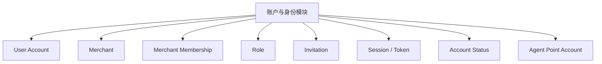
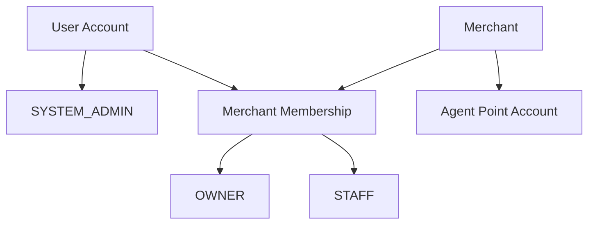
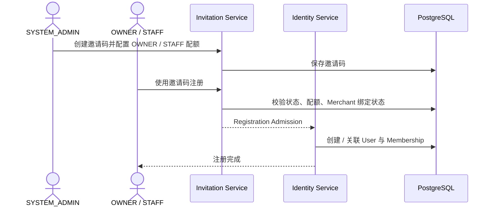
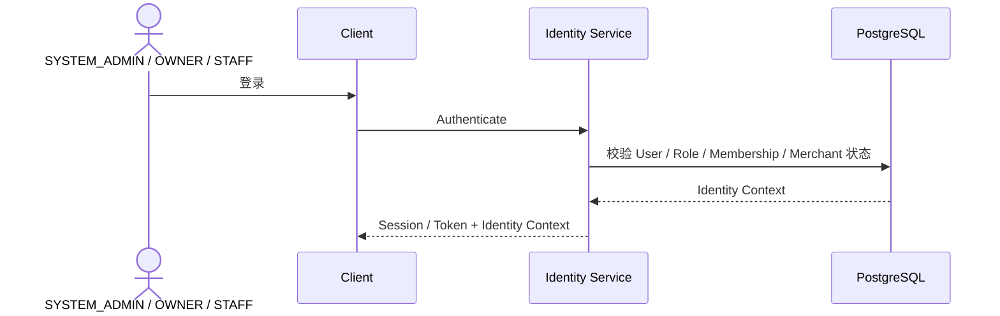
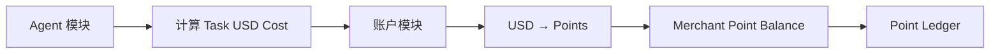

# 01 — 账户与身份模块

> 顶层模块文档  
> 负责用户账号、商户归属、注册、登录、会话、账号状态以及 Merchant Agent 积分账户。

# 1. 模块范围



三个系统账号角色：

```text
SYSTEM_ADMIN
OWNER
STAFF
```

客户 / 供应商不是系统账号。

# 2. 子模块

| 子模块 | 文档 | 负责内容 |
|---|---|---|
| 注册与邀请码 | `01-注册与邀请码.md` | 邀请码创建、OWNER / STAFF 注册、配额、绑定 Merchant |
| 登录与会话 | `02-登录与会话.md` | 手工登录、移动端自动登录、30 天滑动 Token、登出 |
| 账号状态与商户成员关系 | `03-账号状态与商户成员关系.md` | Membership、停用、恢复、历史操作者、多设备 / 多 Merchant 边界 |
| Agent 积分账户 | `04-Agent积分账户.md` | Merchant 积分余额、Ledger、负余额、充值抵扣、Task 准入与结算 |

# 3. 核心关系



SYSTEM_ADMIN：

```text
平台级身份
不依赖 Merchant Membership
```

OWNER / STAFF：

```text
User
+
Merchant Membership
+
Role
```

# 4. 注册总入口



# 5. 登录总入口



iOS / Android 支持：

```text
30 天滑动 Token
+
App 再次打开自动登录
```

# 6. Agent 积分为什么属于账户模块

Agent 积分本质是 Merchant 在平台上的：

> **Agent Usage Credit Account**

它具备典型账户属性：

```text
balance
ledger
grant
consume
adjust
negative balance
recharge offset
status
```

因此它不是 Agent Runtime 的内部状态。



# 7. 当前冻结原则

1. 注册使用 SYSTEM_ADMIN 提供的邀请码；
2. 邀请码当前主规则最多注册 1 个 OWNER；
3. STAFF 注册数量由 SYSTEM_ADMIN 配置；
4. OWNER 首次注册后创建并绑定 Merchant；
5. STAFF 使用同一 Merchant 邀请码加入；
6. iOS / Android 使用 30 天滑动会话；
7. 每次手工登录或自动登录成功都刷新本地 Token；
8. 账号或 Membership 停用立即覆盖未过期 Token；
9. 历史业务记录继续保留原操作者；
10. Agent 积分账户归 Merchant；
11. 积分允许因已准入 Task 最终结算变为负数；
12. 后续充值先自然抵扣负余额；
13. Balance <= 0 时禁止开启新的 Agent Task。
