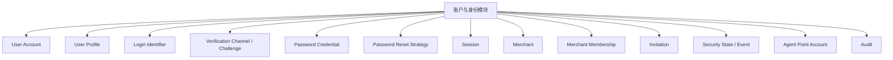
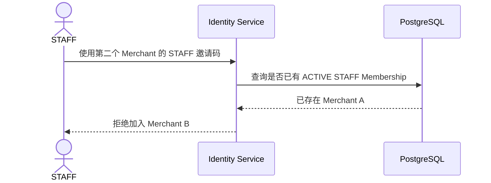

# 01 — 账户与身份模块

> 顶层模块文档。负责 User、Merchant Membership、注册邀请码、登录会话、用户资料、安全恢复、验证渠道以及 Merchant Agent 积分账户。

# 1. 三类系统账号

```text
SYSTEM_ADMIN = 系统管理员
OWNER = 店长
STAFF = 店员
```

客户和供应商不是系统账号。

# 2. 已确认的产品规则

1. 一个邀请码最多注册 **1 个 OWNER（店长）**；
2. STAFF（店员）注册上限 `N` 由 SYSTEM_ADMIN 设置；
3. STAFF 必须等 OWNER 注册完成、邀请码绑定 Merchant 后才能注册；
4. **一个 STAFF 账号只能对应一个 Merchant**；
5. User / Membership 数据结构保持分离；OWNER 的多 Merchant 能力后续单独决定；
6. 允许同一账号多设备同时登录；
7. 修改密码后：当前设备刷新 Session，其他设备全部失效；
8. SYSTEM_ADMIN 可以强制任意账号全部下线；
9. iOS / Android 使用 30 天滑动 Session；
10. 验证方式可扩展，首期为 **手机号 + 邮箱**；
11. 用户自助密码重置支持三条路：**已有密码验证、手机号验证、邮箱验证**；
12. OWNER 可为本店 STAFF 生成随机临时密码；
13. SYSTEM_ADMIN 可选择系统随机密码，也可以输入一个管理员指定的新密码；
14. 重置产生的可见密码只在成功后的弹窗中显示一次，可复制；弹窗关闭后无法再次查看；
15. Agent 积分账户归 Merchant，属于账户模块。

# 3. 账户与身份组件



# 4. STAFF 单 Merchant 约束



规则：

```text
一个 STAFF User
→ 最多一个 ACTIVE STAFF Membership
→ 最多一个 STAFF Merchant
```

这条规则必须由后端 Policy 和数据库约束共同保证，不能只依赖 UI。

# 5. Password Reset Strategy

```text
PasswordResetStrategy
├── SelfCurrentPasswordReset
├── SelfPhoneVerifiedReset
├── SelfEmailVerifiedReset
├── OwnerRandomTemporaryReset
├── AdminRandomTemporaryReset
└── AdminDefinedPasswordReset
```

主流程只负责：

```text
选择 Strategy
→ 校验 Policy
→ 执行 Reset Command
→ 撤销 / 更新 Session
→ Audit
```

# 6. 采用的设计模式

| 模式 | 使用位置 | 作用 |
|---|---|---|
| Strategy | 验证方式、密码重置方式、风险响应 | 扩展新方式不改主流程 |
| Registry + Factory | Verification / PasswordReset Strategy | 根据 method O(1) 选择实现 |
| Adapter | SMS、Email Provider | 隔离第三方 API |
| Chain of Responsibility / Policy Pipeline | 登录、注册、重置、风险判断 | 将多层规则组合起来 |
| Specification / Policy Object | CanRegister / CanReset / CanJoinMerchant | 复杂条件集中且可测试 |
| State Machine | Invitation / Session / Recovery / Security State | 阻止非法状态跳转 |
| Command | ResetPassword / DisableUser / ForceLogout | 高风险操作统一封装、审计、幂等 |
| Unit of Work | 注册、配额消耗、店长交接 | 多实体同成同败 |
| Idempotency | 注册、重置、恢复完成 | 防止重试制造重复状态 |
| Outbox | SMS / Email 发送 | DB 与外部 Provider 解耦 |
| Audit Interceptor | 高风险账号操作 | 统一记录操作者、目标、Before/After、原因 |

# 7. 关键算法原则

## 7.1 Identifier

对 `(identifier_type, normalized_value)` 建唯一索引。

## 7.2 STAFF 单店判定

登录 / 注册时避免扫描全部 Membership，可为 User 维护可索引的 ACTIVE STAFF Membership 查询路径，并以唯一约束或事务条件保证：

```text
active_staff_membership_count <= 1
```

## 7.3 Session 撤销

使用 `security_epoch / session_version` 让“强制全部下线”与“修改密码”无需逐条更新 Token。

## 7.4 临时密码 / 管理员输入密码

数据库永远只保存正式密码 Hash 或临时凭据 Hash；一次性弹窗显示的是本次命令响应中的明文，服务端不提供二次读取 API。

## 7.5 Risk

第一阶段使用：

```text
risk_score = Σ(weight_i × matched_signal_i)
```

规则、权重和阈值由 SYSTEM_ADMIN 配置并版本化。

# 8. 子模块

- `01-注册与邀请码.md`
- `02-登录与会话.md`
- `03-用户资料与账号管理.md`
- `04-密码与账号恢复.md`
- `05-验证方式与安全策略.md`
- `06-账号状态与商户成员关系.md`
- `07-Agent积分账户.md`
- `08-设计模式与判断算法清单.md`
