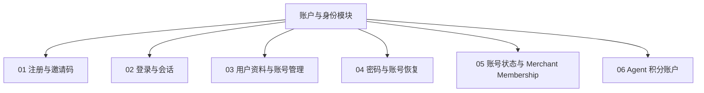
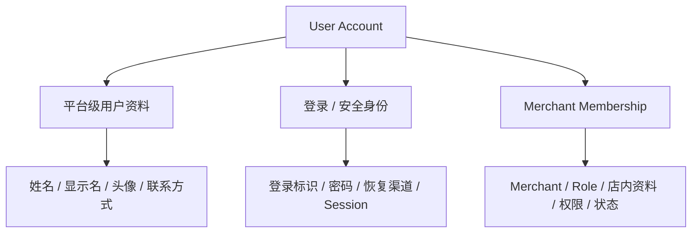
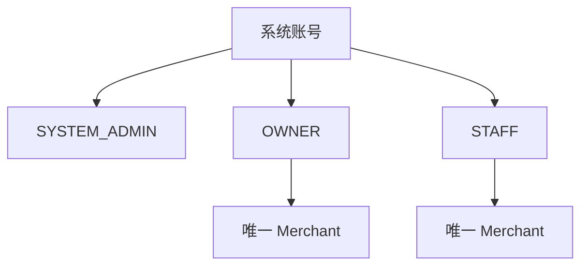
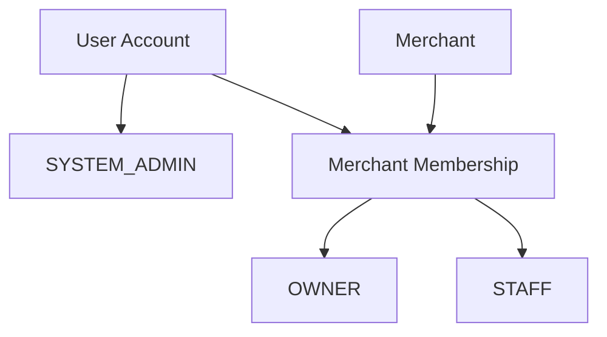
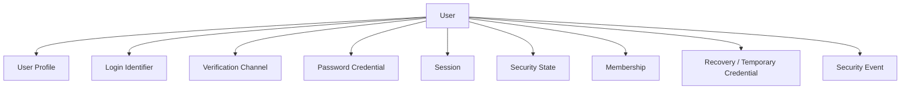
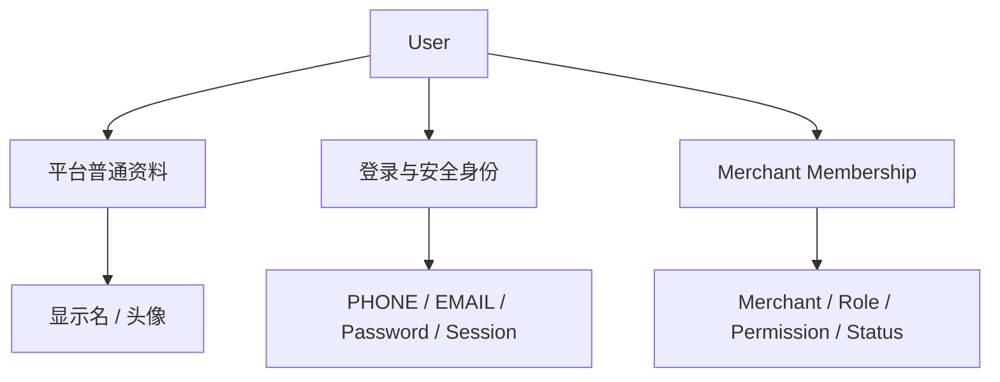
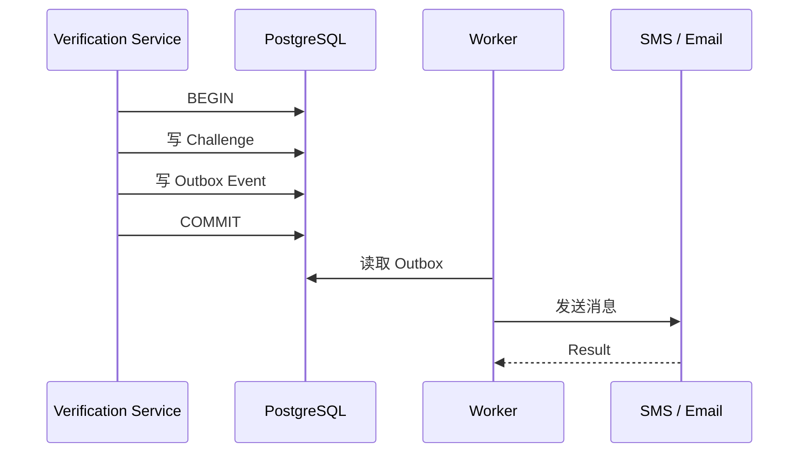
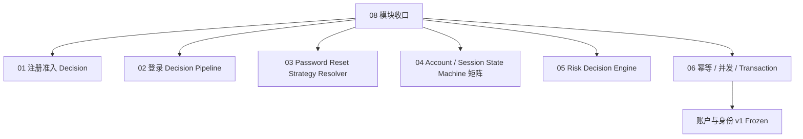

```mermaid
flowchart TD
    ACCOUNT[账户与身份模块]

    ACCOUNT --> USER[User Account]
    ACCOUNT --> PROFILE[User Profile]
    ACCOUNT --> IDENTIFIER[Login Identifier]
    ACCOUNT --> CREDENTIAL[Password Credential]
    ACCOUNT --> VERIFY[Verification Channel]
    ACCOUNT --> CHALLENGE[Verification Challenge]
    ACCOUNT --> SESSION[Session]
    ACCOUNT --> SECURITY[Security State]
    ACCOUNT --> EVENT[Security Event]
    ACCOUNT --> INV[Invitation]
    ACCOUNT --> MERCHANT[Merchant]
    ACCOUNT --> MEMBER[Merchant Membership]
    ACCOUNT --> RESET[Password Reset]
    ACCOUNT --> POINT[Agent Point Account]
    ACCOUNT --> AUDIT[Audit]
```

# 01 — 账户与身份模块

> 来源：ChatGPT 分享对话（第 30 ~ 41 轮，2026-09-26 ~ 09-27）完整提取与整理
> 对应对话中最终形成的文档：`master-goods-system-design-v3/01-账户与身份/账户与身份模块.md`
> 顶层模块文档。本文定义账户领域整体结构，具体流程下钻到同目录子文档。

---

# 1. 模块目标

账户与身份模块要回答：

```text
谁是系统用户？
用户属于哪个 Merchant？
SYSTEM_ADMIN 为什么没有 Merchant？
店长和店员怎样注册？
邀请码如何限制一个店的 OWNER / STAFF？
PHONE / EMAIL 怎样作为可扩展登录和验证方式？
iOS / Android 怎样 30 天自动登录？
多设备 Session 怎样管理？
账号 / Membership / Merchant 状态怎样影响登录？
用户自己怎样改密码？
OWNER 怎样重置 STAFF 密码？
SYSTEM_ADMIN 怎样随机重置或直接设置密码？
高风险登录怎样判断？
Agent 积分账户为什么属于 Account？
```

> 来源：对话第 41 轮（账户模块完成度与目标梳理）

---

# 2. 账户模块拆分为 6 个子模块

对话第 36 轮正式确定拆法：



**图示说明（2. 账户模块拆分为 6 个子模块）：** 这是责任或数据流图，核心节点包括 账户与身份模块。箭头表示调用、归属或数据流向；权限、Merchant 范围和状态判断必须在服务端完成，不能由客户端或单一 UI 分支替代。

> 这个拆法比把"用户"做成一个巨型文档更合适。

> 来源：对话第 36 轮

---

# 3. 账户模型不能只有一张 User

最终概念上明确区分三个层级：



**图示说明（3. 账户模型不能只有一张 User）：** 这是责任或数据流图，核心节点包括 User Account。箭头表示调用、归属或数据流向；权限、Merchant 范围和状态判断必须在服务端完成，不能由客户端或单一 UI 分支替代。

这是后面很多边界问题的基础。当前 `OWNER` 与 `STAFF` 均只有一个 Merchant Membership；OWNER 管理的是当前 Merchant 的 Membership，不是跨店账号。

所以：

> **OWNER 管理 STAFF，主要管理的是 Membership，不是 STAFF 的整个全局账号。**

> 来源：对话第 35、36 轮

---

# 4. 三类系统账号与 Merchant 归属

```text
SYSTEM_ADMIN = 系统管理员
OWNER        = 老板 / 店长
STAFF        = 员工 / 店员
```



**图示说明（4. 三类系统账号与 Merchant 归属）：** 这是责任或数据流图，核心节点包括 系统账号。箭头表示调用、归属或数据流向；权限、Merchant 范围和状态判断必须在服务端完成，不能由客户端或单一 UI 分支替代。

**当前产品固定 OWNER 与 STAFF 各自只有一个 Merchant Membership（已冻结）。**

```text
SYSTEM_ADMIN
→ 0 Merchant Membership

OWNER
→ 正好 1 Merchant Membership
→ Role = OWNER

STAFF
→ 正好 1 Merchant Membership
→ Role = STAFF
```

一个 Merchant 当前只有一个 OWNER。

保留 User 与 Membership 分层，是为了区分平台身份、商户角色、权限、停用和历史操作者，并不是为了支持多店。

**当前核心身份模型：**



**图示说明（4. 三类系统账号与 Merchant 归属）：** 这是责任或数据流图，核心节点包括 User Account、Merchant。箭头表示调用、归属或数据流向；权限、Merchant 范围和状态判断必须在服务端完成，不能由客户端或单一 UI 分支替代。

也就是说把「账号」和「账号在某个商户中的身份」分开。这是非常重要的。

当前建议（对话原文）：

- `SYSTEM_ADMIN` 是平台身份，不依赖 Merchant；
- `OWNER / STAFF` 通过 Membership 属于 Merchant；
- 新 OWNER 注册主路径创建 Merchant；
- STAFF 使用 OWNER 所属的 `MerchantInvitation` 自助注册；
- OWNER 负责注册后的员工管理、权限、停用和密码重置，不直接创建 STAFF User；
- STAFF 停用后历史业务记录继续保留；
- SYSTEM_ADMIN 跨 Merchant 属于"管理目标"，不是 Membership。

> 来源：对话第 30、31、40、41 轮

---

# 5. 账户领域组件



**图示说明（5. 账户领域组件）：** 这是责任或数据流图，核心节点包括 User。箭头表示调用、归属或数据流向；权限、Merchant 范围和状态判断必须在服务端完成，不能由客户端或单一 UI 分支替代。

组件职责：

| 组件 | 作用 |
|---|---|
| User | 平台账号主体 |
| User Profile | 昵称、头像等普通资料 |
| Login Identifier | PHONE / EMAIL |
| Verification Channel | 已验证手机号、邮箱 |
| Password Credential | 正式密码凭据 |
| Session | 多设备登录 |
| Security State | 是否锁定、需要验证、需要改密 |
| Membership | Merchant + OWNER/STAFF + 权限 |
| Temporary Credential | 店长/管理员生成的临时随机密码 |
| Security Event | 登录失败、恢复、异常操作等 |

领域组件展开（第 30 轮版本）：



**图示说明（5. 账户领域组件）：** 这是责任或数据流图，核心节点包括 账户与身份模块。箭头表示调用、归属或数据流向；权限、Merchant 范围和状态判断必须在服务端完成，不能由客户端或单一 UI 分支替代。

这样领域边界会比一个 `users` 巨表清楚得多。

**User Profile**：普通资料：显示名、头像、语言 / 时区等。

**Login Identifier**：首期 PHONE / EMAIL；一个 User 可以同时绑定手机号和邮箱。

**Password Credential**：正式密码凭据属于 User；数据库不保存明文或可逆"可查看密码"。

**Verification Channel**：表示手机号 / 邮箱是否已验证、能否登录、能否恢复、能否 Step-up。

**Session**：每个设备可以有独立 Session；同一个账号允许多个设备同时登录。

**Merchant Membership** 承载：

```text
merchant_id
role
membership_status
STAFF permissions
merchant-local display / remark
joined_at
```

**Invitation**：是"注册资格 + 角色名额 + Merchant 归属"。

```text
OWNER 上限固定 1
STAFF 上限 N，由 SYSTEM_ADMIN 设置
```

**Security Event / Risk**：记录登录失败、Challenge 失败、Token 重放、密码重置、邀请码猜测、高风险资料变化等。

**Agent Point Account**：Merchant 级平台使用积分账户，不属于经营现金账户，也不属于 Agent Runtime。

> 来源：对话第 30、36、38 轮

---

# 6. 用户信息三层结构



**图示说明（6. 用户信息三层结构）：** 这是责任或数据流图，核心节点包括 User。箭头表示调用、归属或数据流向；权限、Merchant 范围和状态判断必须在服务端完成，不能由客户端或单一 UI 分支替代。

因此：

```text
修改头像 ≠ 修改登录账号
修改 STAFF 权限 ≠ 修改 STAFF 密码
停用 STAFF Membership ≠ 删除 User
Merchant 冻结 ≠ 删除 PHONE / EMAIL
```

> 来源：对话第 36 轮

---

# 7. 已冻结产品规则

1. 一个邀请码只有一个 OWNER 名额（默认 1）；
2. OWNER 就是店长（老板 / 店长是同一个角色）；
3. STAFF 就是店员；
4. STAFF 数量上限由 SYSTEM_ADMIN 配置（上限 N）；
5. OWNER 必须先注册并创建 Merchant；
6. STAFF 在 OWNER 注册之后才可注册；
7. OWNER 只能属于一个 Merchant；
8. STAFF 只能属于一个 Merchant（`active STAFF membership count <= 1`）；
9. 允许多设备同时登录；
10. iOS / Android 使用 30 天滑动 Session；
11. 手工登录和自动登录成功都会轮换 Token；
12. 修改密码后当前设备保留并刷新 Session，其他设备失效；
13. SYSTEM_ADMIN 可以强制全部下线；
14. 首期验证方式为 PHONE + EMAIL；
15. 验证方式必须可扩展（Strategy + Registry + Adapter）；
16. 用户自己改 / 重置密码支持：当前密码、手机验证、邮箱验证；
17. OWNER 可随机重置本店 STAFF 密码（系统生成随机字符，店长发送给员工）；
18. 随机密码只显示一次，可复制，关闭后不能再次查看；
19. SYSTEM_ADMIN 可系统随机密码，也可自己输入可直接使用的新密码；
20. 有业务历史的 User / Membership 不物理删除；
21. Agent Points 属于 Merchant 账户；
22. 已准入 Agent Task 可以扣成负数；
23. 后续充值自然抵消负余额；
24. Balance <= 0 不允许新 Task；
25. 忘记密码 / 登录接口不暴露账号是否存在（防账号枚举）。

> 来源：对话第 36、38、39、40、41 轮

---

# 8. 主要设计模式

| 模式 | 位置 | 目的 |
|---|---|---|
| Strategy | Verification、Password Reset、Risk Action | 新方式不改主流程 |
| Registry + Factory | Strategy 选择 | 避免大量 if / else |
| Adapter | SMS / Email Provider | 隔离第三方协议 |
| Policy Pipeline / Chain | Login / Register / Reset | 分层校验 |
| Specification | CanRegister / CanReset / CanJoin | 规则可组合可测试 |
| State Machine | Invitation / Session / Security | 阻止非法状态迁移 |
| Command | Reset / Disable / ForceLogout | 高风险操作统一入口 |
| Unit of Work | 注册 / 配额 / 角色交接 | 原子一致性 |
| Idempotency | 注册 / Reset / Recovery | 防重复执行 |
| Outbox | 短信 / 邮件 | DB 与第三方网络解耦 |
| Audit Interceptor | 高风险账号动作 | 统一审计 |
| Config Versioning | Verification / Risk / Points | 历史可解释 |

对话第 39 轮登记的完整模式清单（下一轮专题）：

```text
Password Reset Strategy
Verification Strategy
Provider Registry
Password Policy Engine
Login Policy Pipeline
Specification Pattern
Account State Machine
Invitation State Machine
Command Pattern
Session Revocation Strategy
Risk Rule Composite
Identifier Resolver
Idempotency
Outbox Retry
Audit Interceptor
Unit of Work
```

> 来源：对话第 38、39 轮

---

# 9. 算法与性能原则

## 9.1 Identifier

先规范化：

```text
手机号 → 统一格式
邮箱 → trim + domain normalize + case policy
```

然后对 `(identifier_type, normalized_value)` 建唯一索引。不会每次登录扫 `users`。

## 9.2 STAFF 配额

禁止：

```text
SELECT staff_used
→ 代码判断
→ UPDATE
```

因为会并发超卖。使用原子条件更新或行锁：

```text
UPDATE ...
WHERE staff_used < staff_limit
```

不能先 SELECT 再 UPDATE。

## 9.3 单 Merchant

后端 Policy 与数据库约束同时保证 OWNER / STAFF 不会产生第二个 Active Merchant Membership。

## 9.4 Session 全量撤销

使用 `security_epoch / session_version` 实现 O(1) 全失效。

例如：

```text
User.security_epoch = 18

Token.security_epoch = 17
```

那么 Token 即使还有 29 天：

```text
17 != 18
→ 立即失效
```

SYSTEM_ADMIN 强制全下线无需逐条扫描所有 Token。

## 9.5 Challenge（验证码）

```text
CSPRNG
+
Hash / MAC
+
TTL
+
Attempt Count
+
Constant-time Compare
```

数据库不存明文验证码。

## 9.6 临时随机密码

```text
CSPRNG
+
一次性
+
短有效期
+
Hash 保存
+
首次登录强制改密
```

## 9.7 Risk

首期：

```text
risk_score = Σ(weight_i × matched_signal_i)
```

使用可解释规则，不用黑盒 ML。算法结构冻结为：

```text
Hard Rule
→ Weighted Rules
→ Threshold
→ Decision
```

## 9.8 限流

采用：

```text
Sliding Window
或
Token Bucket
```

可以同时按：account / identifier / IP / device / purpose 限制。

## 9.9 短信 / 邮件发送（Outbox Pattern）



**图示说明（9.9 短信 / 邮件发送（Outbox Pattern））：** 这是服务调用时序图，参与者包括 Verification Service、PostgreSQL、Worker、SMS / Email。箭头表示一次调用或返回，alt/else 分支表示 Decision 的不同结果；事务提交前只做校验和状态准备，短信、邮件等外部副作用应在提交后通过 Outbox 执行。

不会让第三方邮件 / 短信网络超时把整个注册数据库事务卡住。

> 来源：对话第 38 轮

---

# 10. 子文档

- `01-注册与邀请码.md`
- `02-登录与会话.md`
- `03-用户资料与账号管理.md`
- `04-密码与账号恢复.md`
- 05-验证方式与安全策略.md
- 06-账号状态与商户成员关系.md
- 07-Agent积分账户.md
- 08-设计模式与判断算法.md

---

# 11. 模块收口状态

## 11.1 08 收口六项（第 41 轮，含完整状态机矩阵）



**图示说明（11.1 08 收口六项（第 41 轮））：** 这是责任或数据流图，核心节点包括 08 模块收口。箭头表示调用、归属或数据流向；权限、Merchant 范围和状态判断必须在服务端完成，不能由客户端或单一 UI 分支替代。

## 11.2 决策输出枚举

注册：

```text
ALLOW
或
DENY_INVITATION_INVALID
DENY_OWNER_ALREADY_EXISTS
DENY_STAFF_QUOTA_FULL
DENY_STAFF_ALREADY_HAS_MERCHANT
DENY_IDENTIFIER_CONFLICT
...
```

登录：

```text
ALLOW
STEP_UP_REQUIRED
PASSWORD_RESET_REQUIRED
TEMPORARY_LOCKED
DENY
```

## 11.3 完成标准

完成 08 上述六部分（其中 D4 必须包含 Invitation、User Account、Security State、Membership、Merchant、Session、Challenge、Temporary Credential 的完整迁移矩阵）以后，在顶层文档标记：

```text
01 账户与身份模块
Status: DESIGN FROZEN v1
```

含义不是"永远不能修改"，而是：足以支撑领域模型、数据库 Schema、API 和编码，不再继续自由发散。

## 11.4 不阻塞模块完成的事项

```text
验证码究竟 5 分钟还是 10 分钟
密码最少 10 位还是 12 位
Rate Limit 每分钟多少次
Argon2id memory 参数具体多少
短信供应商是哪家
邮件 Provider 是哪个
Web Session 到底 7 天还是 30 天
```

这些属于实现参数 / 运维安全配置，不是系统模块设计必须冻结的产品结构。

> 来源：对话第 41 轮
