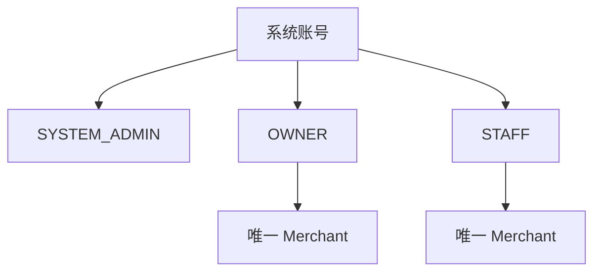
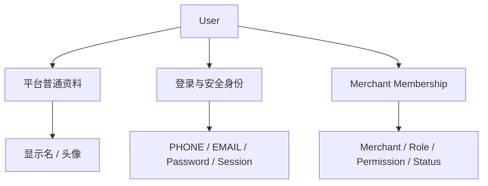

# 01 — 账户与身份模块

> 顶层模块文档。  
> 本文定义账户领域整体结构，具体流程下钻到同目录子文档。  
> 当前内容是已讨论设计的正式记录，不是摘要占位。

---

# 1. 模块目标

账户与身份模块要回答：

```text
谁是系统用户？
用户属于哪个 Merchant？
SYSTEM_ADMIN 为什么没有 Merchant？
店长和店员怎样注册？
邀请码如何限制一个店的 OWNER / STAFF？
PHONE / EMAIL 怎样作为可扩展登录和验证方式？
iOS / Android 怎样 30 天自动登录？
多设备 Session 怎样管理？
账号 / Membership / Merchant 状态怎样影响登录？
用户自己怎样改密码？
OWNER 怎样重置 STAFF 密码？
SYSTEM_ADMIN 怎样随机重置或直接设置密码？
高风险登录怎样判断？
Agent 积分账户为什么属于 Account？
```

---

# 2. 三类系统账号与 Merchant 归属

```text
SYSTEM_ADMIN = 系统管理员
OWNER        = 店长
STAFF        = 店员
```



**当前产品不支持 OWNER 多 Merchant，也不支持 STAFF 多 Merchant。**

```text
SYSTEM_ADMIN
→ 0 Merchant Membership

OWNER
→ 正好 1 Merchant Membership
→ Role = OWNER

STAFF
→ 正好 1 Merchant Membership
→ Role = STAFF
```

一个 Merchant 当前只有一个 OWNER。

保留 User 与 Membership 分层，是为了区分平台身份、商户角色、权限、停用和历史操作者，并不是为了支持多店。

---

# 3. 账户领域组件

```mermaid
flowchart TD
    ACCOUNT[账户与身份模块]

    ACCOUNT --> USER[User Account]
    ACCOUNT --> PROFILE[User Profile]
    ACCOUNT --> IDENTIFIER[Login Identifier]
    ACCOUNT --> CREDENTIAL[Password Credential]
    ACCOUNT --> VERIFY[Verification Channel]
    ACCOUNT --> CHALLENGE[Verification Challenge]
    ACCOUNT --> SESSION[Session]
    ACCOUNT --> SECURITY[Security State]
    ACCOUNT --> EVENT[Security Event]
    ACCOUNT --> INV[Invitation]
    ACCOUNT --> MERCHANT[Merchant]
    ACCOUNT --> MEMBER[Merchant Membership]
    ACCOUNT --> RESET[Password Reset]
    ACCOUNT --> POINT[Agent Point Account]
    ACCOUNT --> AUDIT[Audit]
```



## 3.1 User Account

平台级账号主体，承载全局账号状态、安全状态和安全版本。

## 3.2 User Profile

普通资料：显示名、头像、语言 / 时区等。

## 3.3 Login Identifier

首期：

```text
PHONE
EMAIL
```

一个 User 可以同时绑定手机号和邮箱。

## 3.4 Password Credential

正式密码凭据属于 User；数据库不保存明文或可逆“可查看密码”。

## 3.5 Verification Channel

表示手机号 / 邮箱是否已验证、能否登录、能否恢复、能否 Step-up。

## 3.6 Session

每个设备可以有独立 Session；同一个账号允许多个设备同时登录。

## 3.7 Merchant Membership

承载：

```text
merchant_id
role
membership_status
STAFF permissions
merchant-local display / remark
joined_at
```

## 3.8 Invitation

是“注册资格 + 角色名额 + Merchant 归属”。

```text
OWNER 上限固定 1
STAFF 上限 N，由 SYSTEM_ADMIN 设置
```

## 3.9 Security Event / Risk

记录登录失败、Challenge 失败、Token 重放、密码重置、邀请码猜测、高风险资料变化等。

## 3.10 Agent Point Account

Merchant 级平台使用积分账户，不属于经营现金账户，也不属于 Agent Runtime。

---

# 4. 用户信息三层结构



因此：

```text
修改头像 ≠ 修改登录账号
修改 STAFF 权限 ≠ 修改 STAFF 密码
停用 STAFF Membership ≠ 删除 User
Merchant 冻结 ≠ 删除 PHONE / EMAIL
```

---

# 5. 已冻结产品规则

1. 一个邀请码只有一个 OWNER 名额；
2. OWNER 就是店长；
3. STAFF 就是店员；
4. STAFF 数量上限由 SYSTEM_ADMIN 配置；
5. OWNER 必须先注册并创建 Merchant；
6. STAFF 在 OWNER 注册之后才可注册；
7. OWNER 只能属于一个 Merchant；
8. STAFF 只能属于一个 Merchant；
9. 允许多设备同时登录；
10. iOS / Android 使用 30 天滑动 Session；
11. 手工登录和自动登录成功都会轮换 Token；
12. 修改密码后当前设备保留并刷新 Session，其他设备失效；
13. SYSTEM_ADMIN 可以强制全部下线；
14. 首期验证方式为 PHONE + EMAIL；
15. 验证方式必须可扩展；
16. 用户自己改 / 重置密码支持：当前密码、手机验证、邮箱验证；
17. OWNER 可随机重置本店 STAFF 密码；
18. 随机密码只显示一次，可复制，关闭后不能再次查看；
19. SYSTEM_ADMIN 可系统随机密码，也可自己输入可直接使用的新密码；
20. 有业务历史的 User / Membership 不物理删除；
21. Agent Points 属于 Merchant 账户；
22. 已准入 Agent Task 可以扣成负数；
23. 后续充值自然抵消负余额；
24. Balance <= 0 不允许新 Task。

---

# 6. 主要设计模式

| 模式 | 位置 | 目的 |
|---|---|---|
| Strategy | Verification、Password Reset、Risk Action | 新方式不改主流程 |
| Registry + Factory | Strategy 选择 | 避免大量 if / else |
| Adapter | SMS / Email Provider | 隔离第三方协议 |
| Policy Pipeline / Chain | Login / Register / Reset | 分层校验 |
| Specification | CanRegister / CanReset / CanJoin | 规则可组合可测试 |
| State Machine | Invitation / Session / Security | 阻止非法状态迁移 |
| Command | Reset / Disable / ForceLogout | 高风险操作统一入口 |
| Unit of Work | 注册 / 配额 / 角色交接 | 原子一致性 |
| Idempotency | 注册 / Reset / Recovery | 防重复执行 |
| Outbox | 短信 / 邮件 | DB 与第三方网络解耦 |
| Audit Interceptor | 高风险账号动作 | 统一审计 |
| Config Versioning | Verification / Risk / Points | 历史可解释 |

---

# 7. 算法与性能原则

## 7.1 Identifier

对 `(identifier_type, normalized_value)` 建唯一索引。

## 7.2 STAFF 配额

使用原子条件更新或行锁，不能先 SELECT 再 UPDATE。

## 7.3 单 Merchant

后端 Policy 与数据库约束同时保证 OWNER / STAFF 不会产生第二个 Active Merchant Membership。

## 7.4 Session 全量撤销

使用 `security_epoch / session_version` 实现 O(1) 全失效。

## 7.5 Challenge

CSPRNG + Hash / MAC + TTL + attempt_count + constant-time compare。

## 7.6 Risk

首期：

```text
risk_score = Σ(weight_i × matched_signal_i)
```

使用可解释规则，不用黑盒 ML。

---

# 8. 子文档

- `01-注册与邀请码.md`
- `02-登录与会话.md`
- `03-用户资料与账号管理.md`
- `04-密码与账号恢复.md`
- `05-验证方式与安全策略.md`
- `06-账号状态与商户成员关系.md`
- `07-Agent积分账户.md`
- `08-设计模式与判断算法.md`
