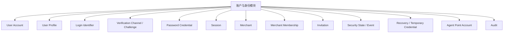
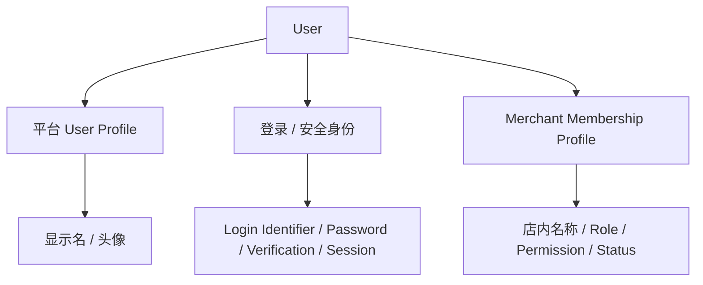

# 01 — 账户与身份模块

> 顶层模块文档。负责 User、Merchant Membership、注册邀请码、登录会话、用户资料、安全恢复、验证渠道以及 Merchant Agent 积分账户。

# 1. 三类系统账号

```text
SYSTEM_ADMIN = 系统管理员
OWNER = 店长
STAFF = 店员
```

客户和供应商不是系统账号。

# 2. 已确认的产品规则

1. 一个邀请码最多注册 **1 个 OWNER（店长）**；
2. STAFF（店员）注册上限 `N` 由 SYSTEM_ADMIN 设置；
3. STAFF 必须等 OWNER 注册完成、邀请码绑定 Merchant 后才能注册；
4. 一个 User 底层支持多个 Merchant Membership；
5. 第一版 UI 可以暂不开放多 Merchant 切换；
6. 允许同一账号多设备同时登录；
7. 修改密码后：当前设备刷新 Session，其他设备全部失效；
8. SYSTEM_ADMIN 可以强制任意账号全部下线；
9. iOS / Android 使用 30 天滑动 Session；
10. 验证方式支持多个 Provider，首期为 **手机号 + 邮箱**；
11. Agent 积分账户归 Merchant，属于账户模块。

# 3. 账户与身份组件



## 3.1 User Account

平台级自然人账号。一个 User 可以拥有多个 Merchant Membership。

## 3.2 User Profile

平台级普通资料，例如：

```text
显示名称
头像
语言 / 时区（如需要）
```

## 3.3 Login Identifier

用于登录和识别 User。首期支持：

```text
PHONE
EMAIL
```

一个 User 可绑定多个 Identifier；同一规范化 Identifier 不能属于多个 User。

## 3.4 Verification Channel

用于：

```text
注册验证
忘记密码
修改手机号 / 邮箱
高风险操作重新验证
账号恢复
```

首期实现 PHONE / EMAIL，但通过 Strategy + Registry + Adapter 保持可扩展。

## 3.5 Merchant Membership

表示：

```text
这个 User 在这个 Merchant 中是什么角色
Membership 是否有效
STAFF 有什么权限
商户内名称 / 备注
```

OWNER 管理 STAFF 时主要管理 Membership，而不是修改 STAFF 整个平台账号。

## 3.6 Security Event / Risk Assessment

统一记录登录失败、验证码失败、密码重置、设备变化、强制下线等安全事件，并供风险策略计算。

## 3.7 Agent Point Account

Merchant 级平台积分账户，独立于经营记账账户。

# 4. 用户信息分层



# 5. 采用的设计模式

| 模式 | 使用位置 | 作用 |
|---|---|---|
| Strategy | 手机、邮箱验证；密码重置方式 | 验证 / 重置方式可扩展，不改主流程 |
| Registry + Factory | Verification / Reset Strategy 选择 | 根据 method O(1) 找到对应实现 |
| Adapter | SMS、Email 外部供应商 | 隔离不同第三方 API |
| Chain of Responsibility / Policy Pipeline | 登录、注册、恢复、风险判断 | 将多层校验串成可组合 Policy |
| Specification / Policy Object | CanRegister / CanLogin / CanReset | 复杂条件集中、可测试 |
| State Machine | Invitation / Session / Recovery / Account | 阻止非法状态跳转 |
| Command | ResetPassword / DisableUser / ForceLogout | 高风险管理操作标准化并统一审计 |
| Unit of Work / Transaction Boundary | 注册、配额消耗、店长交接 | 多实体同成同败 |
| Idempotency | 注册提交、管理员重置、恢复完成 | 防止重试制造重复数据 |
| Outbox | SMS / Email 发送 | DB 事务与外部消息解耦 |
| Audit Interceptor | 高风险账号操作 | 自动记录操作者、目标、Before/After、原因 |

# 6. 关键算法优化原则

## 6.1 Identifier 规范化与索引

```text
PHONE → 统一国际 / 系统标准格式
EMAIL → trim + domain 规范化 + 统一 case policy
```

对：

```text
(identifier_type, normalized_value)
```

建立唯一索引，避免全表扫描。

## 6.2 STAFF 配额原子消耗

不能：

```text
先 SELECT staff_used
再 UPDATE
```

应使用条件更新或行锁，保证：

```text
staff_used < staff_limit
```

时才成功增加。

## 6.3 Session 全量撤销

推荐使用：

```text
security_epoch / session_version
```

修改密码或 SYSTEM_ADMIN 强制全部下线时递增版本，旧 Token 即使未过期也立即失效。

## 6.4 Challenge / 临时凭据

- 使用 CSPRNG；
- 数据库只保存 hash / verifier，不保存可直接使用的明文；
- 临时密码只在创建响应中显示一次；
- 验证使用常量时间比较；
- 有 TTL、attempt_count、used_at。

## 6.5 限流

发送验证码、校验验证码、登录、邀请码尝试采用 Sliding Window 或 Token Bucket。

Key 可组合：

```text
purpose
method
normalized_identifier
IP
device
```

## 6.6 风险计算

第一阶段使用**可解释的规则 + 加权评分**，不使用不可解释 ML。

```text
risk_score = Σ(rule_weight × matched_signal)
```

根据阈值输出：

```text
LOW      → 正常通过
MEDIUM   → Step-up Verification
HIGH     → 临时阻断 / 强制恢复
CRITICAL → 管理员介入
```

权重和阈值由 SYSTEM_ADMIN 安全配置管理。

# 7. 子模块

- `01-注册与邀请码.md`
- `02-登录与会话.md`
- `03-用户资料与账号管理.md`
- `04-密码与账号恢复.md`
- `05-验证方式与安全策略.md`
- `06-账号状态与商户成员关系.md`
- `07-Agent积分账户.md`
