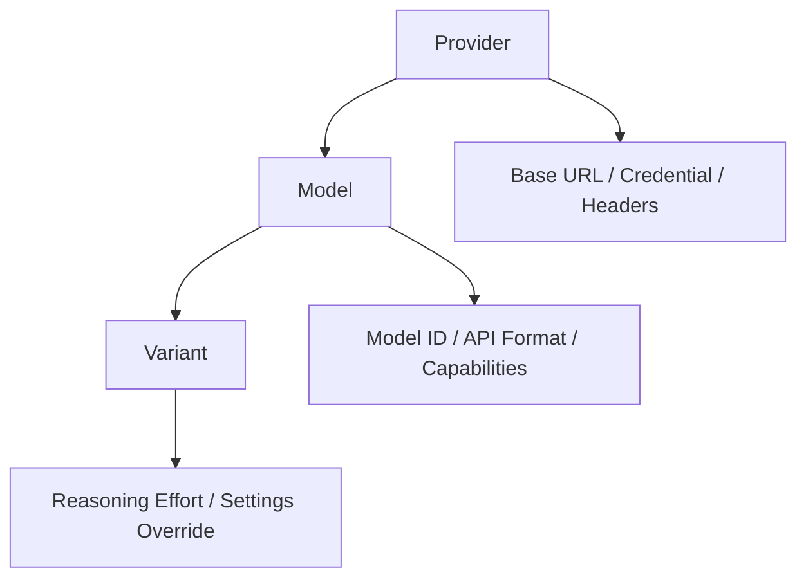
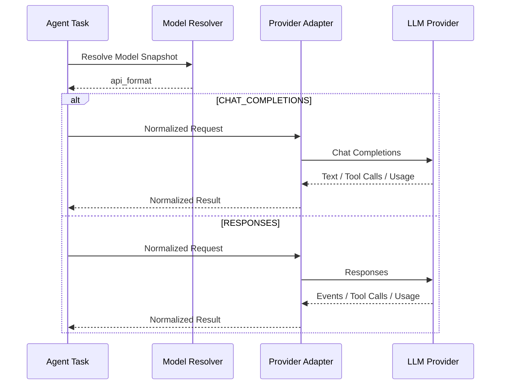
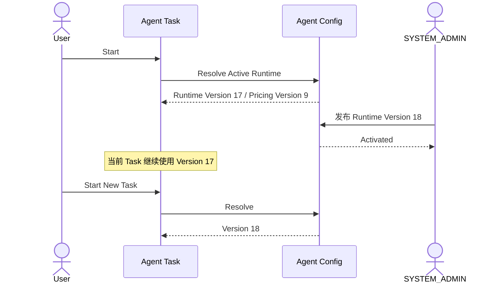
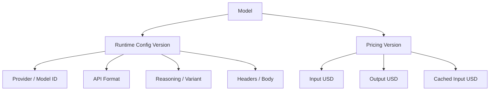
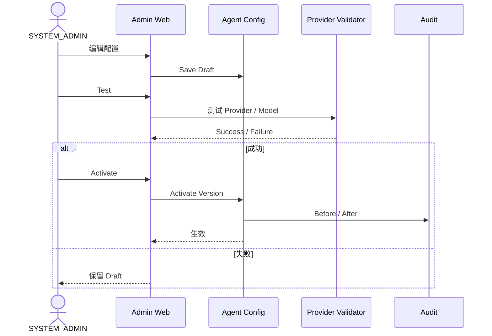

# 10.1 — 模型提供商与模型配置详细设计

# 1. SYSTEM_ADMIN 管理范围

SYSTEM_ADMIN 可以配置：

```text
Provider
Base URL
Credential Reference
Headers
默认 API Format
Model
Model ID
Model Enable / Disable
Context Limit
Output Limit
Tool Capability
Reasoning Effort
Variant
Input Token USD Price
Output Token USD Price
Cached Input USD Price
```

# 2. Provider → Model → Variant



覆盖优先级：

```text
Variant > Model > Provider
```

# 3. 两种 API Format

正式支持：

```text
CHAT_COMPLETIONS
RESPONSES
```



# 4. Model ID 与系统内部 Model Key 分离

```text
model_key
= 系统内部稳定标识

model_id
= 实际发送给 Provider 的模型 ID
```

管理员修改真实模型 ID 时，不需要修改业务代码。

# 5. Reasoning / Variant

统一候选可以包括：

```text
NONE
MINIMAL
LOW
MEDIUM
HIGH
XHIGH
```

但每个模型只启用真实支持的集合。

例如：

```text
fast     → LOW
standard → MEDIUM
deep     → HIGH
```

# 6. 运行配置版本化

SYSTEM_ADMIN 可以随时修改配置，但已开始 Task 不允许中途切模型配置。



# 7. Runtime 与 Pricing 分开版本化



# 8. Model Call Usage

每次 Model Call 至少能够追踪：

```text
task_id
call_seq
provider
model_key
model_id
runtime_config_version
variant
api_format
reasoning_effort
input_tokens
output_tokens
cached_input_tokens
pricing_version
input_usd
output_usd
cached_input_usd
total_usd
status
```

Agent Task 完成后：

```text
Σ Model Call USD Cost
= Task Total USD
```

再交给账户模块进行积分结算。

# 9. 配置发布

建议：

```text
Draft
→ Test
→ Activate
→ Rollback
```


