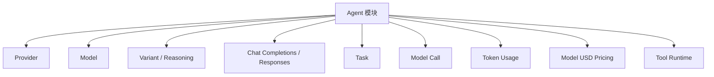
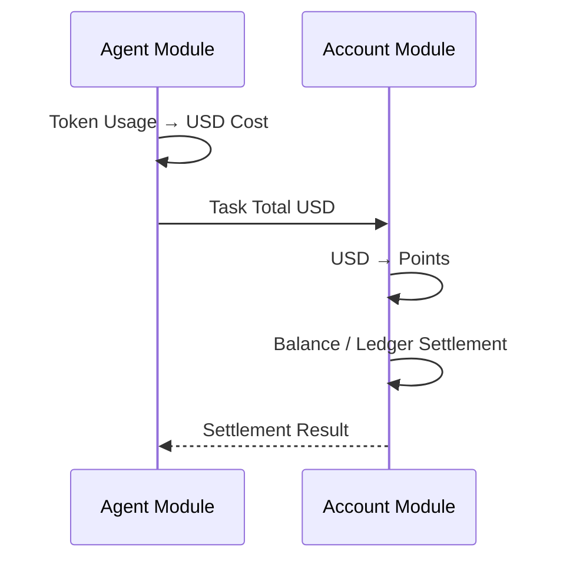

# 10 — Agent 模块

> 顶层模块文档  
> Agent 是独立专题。  
> 本模块负责模型、Provider、运行时、Tool、上下文和模型使用量。  
> Merchant Agent 积分账户已经移至 `01-账户与身份/04-Agent积分账户.md`。

# 1. 当前模块职责

**图示说明（1. 当前模块职责）：** 这是责任或数据流图，核心节点包括 Agent 模块。箭头表示调用、归属或数据流向；权限、Merchant 范围和状态判断必须在服务端完成，不能由客户端或单一 UI 分支替代。

# 2. 与积分账户边界

**图示说明（2. 与积分账户边界）：** 这是服务调用时序图，参与者包括 Agent Module、Account Module。箭头表示一次调用或返回，alt/else 分支表示 Decision 的不同结果；事务提交前只做校验和状态准备，短信、邮件等外部副作用应在提交后通过 Outbox 执行。

积分余额和 Ledger 不属于 Agent 模块。

# 3. 当前子模块

- `01-模型提供商与模型配置.md`
- 后续：Agent Task / Context / Tool / Confirmation

当前先保留 Agent 专题边界，不与账户、销售、进货主流程混写。
