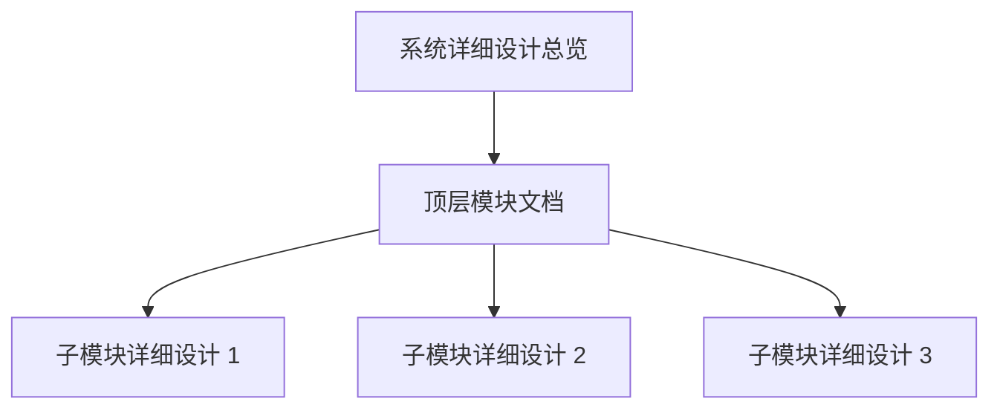

# 系统详细设计文档编写规范

> 本规范用于 `docs/system-design/` 下全部系统设计文档。  
> 核心要求：**对话里已经讨论清楚的内容，文档必须保留同等粒度，不允许只留下结论摘要。**

---

# 1. 为什么建立这份规范

系统详细设计文档是后续 Coding Agent、人工开发和代码审查的 Source of Truth。

因此文档不能只写：

```text
支持手机号登录
支持邮箱验证
支持密码重置
```

而必须把已经讨论过的：

- 为什么这样设计；
- 谁可以执行；
- 谁不可以执行；
- 正常主流程；
- 异常分支；
- 权限边界；
- 状态变化；
- 一致性要求；
- 审计要求；
- 安全风险；
- 设计模式；
- 判断算法；
- 性能优化；
- 并发条件；
- 已冻结规则；
- 仍未冻结的问题；

全部记录下来。

如果对话中有 Mermaid 时序图或关系图，正式文档中也应保留对应 Mermaid，而不是只留下几句文字。

---

# 2. 文档层次



**图示说明（2. 文档层次）：** 这是责任或数据流图，核心节点包括 系统详细设计总览。箭头表示调用、归属或数据流向；权限、Merchant 范围和状态判断必须在服务端完成，不能由客户端或单一 UI 分支替代。

## 2.1 系统总览

负责：

- 系统用户；
- 客户端；
- Backend 总体边界；
- Merchant 隔离；
- 模块目录；
- 全局设计原则；
- 各模块之间的依赖关系。

## 2.2 顶层模块文档

负责：

- 模块职责；
- 模块包含的业务实体；
- 子模块列表；
- 模块级状态与关系；
- 已冻结的产品规则；
- 本模块使用的重要设计模式；
- 跨子模块算法与一致性原则。

## 2.3 子模块详细设计

每份子模块原则上至少包含：

```text
1. 设计目标
2. 角色与权限
3. 业务实体 / 状态
4. 主时序
5. 关键分支时序
6. 状态迁移
7. 一致性 / 事务
8. 安全
9. Audit
10. 设计模式
11. 判断算法
12. 性能 / 索引 / 并发
13. 边界条件
14. 已冻结规则
15. 待确认项
```

已经讨论过的内容不能被删减成一句话。

---

# 3. Mermaid 使用要求

重点业务流程优先使用 `sequenceDiagram`；领域 / 模块关系使用 `flowchart`；生命周期使用 `stateDiagram-v2`。

时序图应尽量体现：

- Actor；
- Client；
- Application Service；
- Policy / Authorization；
- Domain Service；
- Database；
- Audit；
- 外部 Provider；

以及重要的 `alt / opt / loop` 分支。

---

# 4. “结论”和“原因”都要写

错误示例：

```text
STAFF 只能属于一个 Merchant。
```

正式文档还要说明为什么：

- 店员账号以单店工作关系为目标；
- 普通用户不需要理解多店切换；
- OWNER 管理 STAFF 的权限边界更直接；
- STAFF 权限天然落在一个 Merchant Scope；
- 密码重置不会产生跨店控制问题。

Coding Agent 需要知道“为什么”，才能避免后续把冻结规则误认为临时 UI 限制。

---

# 5. 冻结状态必须显式

关键规则使用：

```text
已冻结
讨论中
待确认
不在本阶段
```

如果后来规则被用户修改：

1. 更新正式文档；
2. 删除 / 改写旧结论；
3. 不允许同一目录保留互相冲突的规则。

---

# 6. 文档是 Agent 的执行基线

后续 Coding Agent 开始实现前，应优先阅读：

```text
docs/rewrite/
docs/system-design/
```

如果代码与设计冲突：

```text
先确认文档是不是当前冻结规则
→ 如果是，代码改
→ 如果不是，先更新文档再改代码
```

正式文档不是会议摘要，而是系统行为规范。
