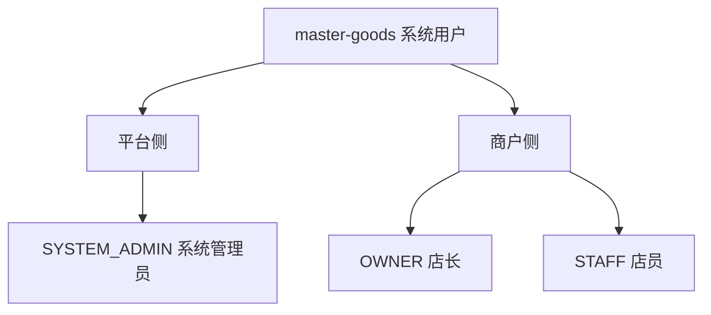
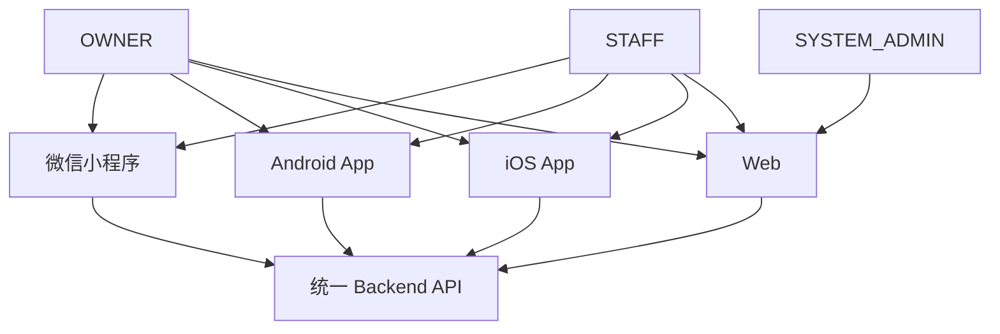
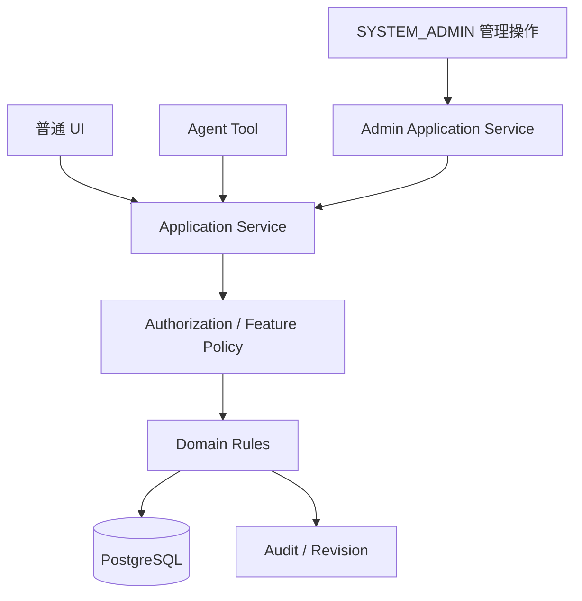
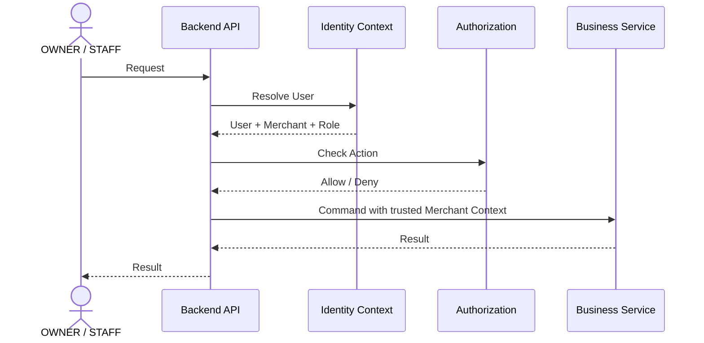
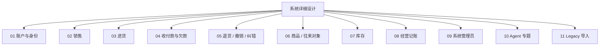
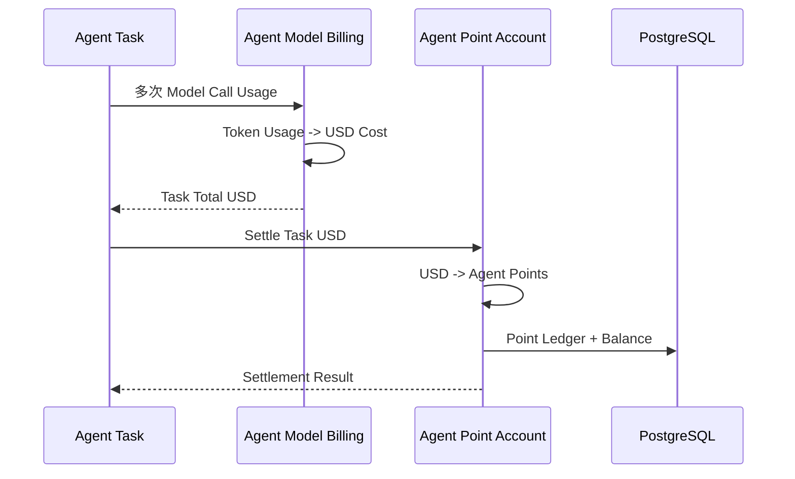

# master-goods vNext 系统详细设计总览

> 状态：持续设计  
> 角色 / 一级用例基线：`docs/rewrite/产品角色与一级用例需求.md`  
> 二级功能基线：`docs/rewrite/二级功能用例需求.md`  
> 文档详细度规范：`docs/system-design/文档编写规范.md`

---

# 1. 三个系统用户

```text
SYSTEM_ADMIN = 系统管理员
OWNER        = 店长
STAFF        = 店员
```

客户和供应商不属于系统账号。



其中：

- SYSTEM_ADMIN 是平台角色；
- OWNER 是一家 Merchant 的店长；
- STAFF 是一家 Merchant 的店员；
- **当前不支持 OWNER 多 Merchant，也不支持 STAFF 多 Merchant**；
- 一个 Merchant 当前只对应一个 OWNER；
- STAFF 数量由 SYSTEM_ADMIN 创建邀请码时设置的上限控制。

---

# 2. 客户端平台

当前平台目标不是 H5，而是：

```text
微信小程序
Android App
iOS App
Web
```



第一阶段：

- SYSTEM_ADMIN 主要使用 Web 管理后台；
- OWNER / STAFF 四端复用同一 Backend；
- 四端不复制业务规则；
- Agent 也是业务入口，不是第二套 Backend。

---

# 3. Backend 总体原则



核心原则：

1. 四端共用 Application Service；
2. Agent Tool 复用同一业务服务；
3. SYSTEM_ADMIN 也不能直接绕过 Domain 改数据库；
4. Merchant 是业务数据隔离边界；
5. 关键业务修改必须可追溯；
6. 收款 / 付款是记账，不是支付网关；
7. Feature Flag 关闭不能删除历史业务数据；
8. 第一阶段采用模块化单体，不提前拆微服务。

---

# 4. Merchant 数据范围

OWNER / STAFF 都只能访问自己唯一所属 Merchant。



服务端不能相信客户端自行传入任意 `merchant_id`。

SYSTEM_ADMIN 跨 Merchant 时，Merchant 是管理目标，不是 Membership。

---

# 5. 系统详细设计模块



当前优先：

```text
01 账户与身份
02 销售
03 进货
```

Agent 保持独立专题。

---

# 6. 账户与身份文档

```text
01-账户与身份/
├── 账户与身份模块.md
├── 01-注册与邀请码.md
├── 02-登录与会话.md
├── 03-用户资料与账号管理.md
├── 04-密码与账号恢复.md
├── 05-验证方式与安全策略.md
├── 06-账号状态与商户成员关系.md
├── 07-Agent积分账户.md
└── 08-设计模式与判断算法.md
```

账户模块不仅是“登录”，还包括 User、Identifier、Password、Verification、Session、Membership、Invitation、Risk、Recovery 和 Agent Point Account。

---

# 7. Agent 与账户模块边界



```text
Provider / Model / Token USD 定价
→ Agent 模块

Merchant Agent 积分余额 / 流水 / 负数 / 充值抵扣
→ 账户模块
```

---

# 8. 文档原则

后续所有模块继续遵循：

```text
顶层模块
→ 子模块详细设计
→ 时序图
→ 原因
→ 权限
→ 边界
→ 状态
→ 模式
→ 算法
→ 性能
→ Audit
→ 冻结规则
```

不再用几行“结论版”代替完整设计。
