# 系统详细设计总览

> 来源：ChatGPT 分享对话（第 21 ~ 41 轮，2026-09-25 ~ 09-27）完整提取与整理
> 对应对话中最终形成的文档：`master-goods-system-design-v3/系统详细设计总览.md`
> 本文与对话内容一比一对应，保留全部细节、表格与 Mermaid 图，并补充组织性描述。

---

# 1. 三个系统用户

对话中最后确定的三个系统用户：

```text
SYSTEM_ADMIN = 系统管理员
OWNER        = 老板 / 店长
STAFF        = 员工 / 店员
```

**客户和供应商不属于系统账号。**

对话中用户明确修正：

> 管理员是系统管理员，不是店长；店长和老板是一个东西。

并且明确：

> 供应商是不需要有账号的，客户也不需要有账号，也就只有前面三类人员有账号。

角色关系：

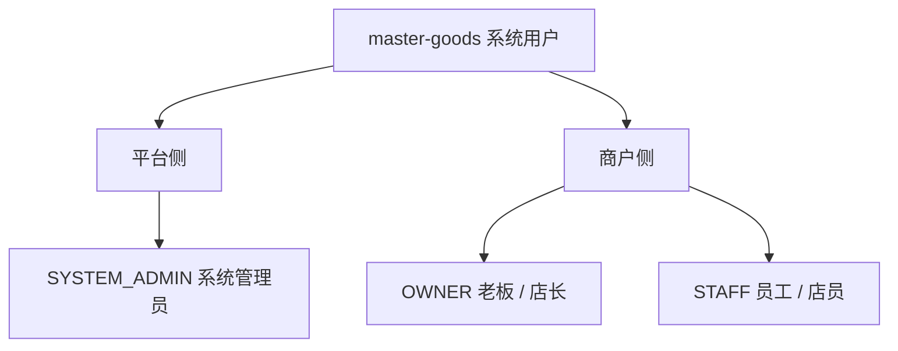

**图示说明（1. 三个系统用户）：** 这是责任或数据流图，核心节点包括 master-goods 系统用户。箭头表示调用、归属或数据流向；权限、Merchant 范围和状态判断必须在服务端完成，不能由客户端或单一 UI 分支替代。

其中：

- SYSTEM_ADMIN 是平台角色；
- OWNER 是一家 Merchant 的老板 / 店长；
- STAFF 是一家 Merchant 的员工 / 店员；
- 客户 / 供应商是"外部业务角色"，不是系统账号，也不是两套独立用户体系；
- 一个 Merchant 当前只对应一个 OWNER；
- **当前不支持 OWNER 多 Merchant，也不支持 STAFF 多 Merchant**（对话第 40 轮冻结）。

> 来源：对话第 19、21、28、30、31、40、41 轮

---

# 2. 客户端平台

当前平台目标不是 H5，而是：

```text
微信小程序
Android App
iOS App
Web
```

对话中用户原本提出"微信小程序、H5、iOS、Web 四个界面"，ChatGPT 在技术栈讨论中给出的四端方案为：微信原生小程序 + H5 + iOS App + Web，并说明 H5 是否独立保留可作为后续决策。

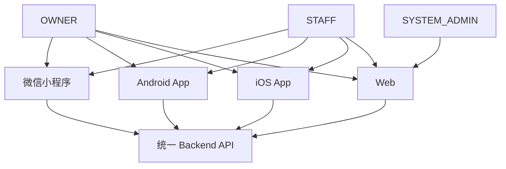

**图示说明（2. 客户端平台）：** 这是责任或数据流图，核心节点包括 SYSTEM_ADMIN、OWNER、STAFF、微信小程序。箭头表示调用、归属或数据流向；权限、Merchant 范围和状态判断必须在服务端完成，不能由客户端或单一 UI 分支替代。

第一阶段：

- SYSTEM_ADMIN 主要使用 Web 管理后台；
- OWNER / STAFF 四端复用同一 Backend；
- 四端不复制业务规则；
- Agent 也是业务入口，不是第二套 Backend。

> 来源：对话第 26、28 轮

---

# 3. 技术栈与平台架构

对话中用户的要求：

> 首先第一个要高性能，低占用，然后 Agent 是使用什么技术栈，还有就是数据库，还有就是我们做的平台支持哪些……四个界面，四套前端对应一整套完整的同一套后端，也就是它们接口是 reuse 的，只是前端技术栈不一样。

ChatGPT 给出的技术组合（第三份文档《技术栈与平台架构规划》）：

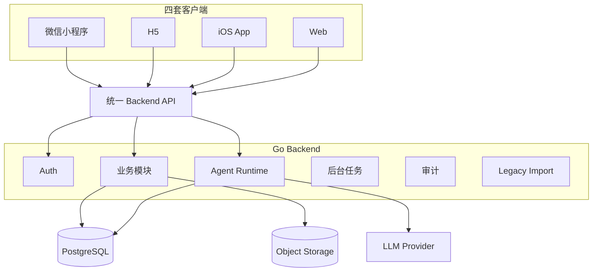

**图示说明（3. 技术栈与平台架构）：** 这是责任或数据流图，核心节点包括 微信小程序、H5、iOS App、Web。箭头表示调用、归属或数据流向；权限、Merchant 范围和状态判断必须在服务端完成，不能由客户端或单一 UI 分支替代。

技术组合建议：

| 层 | 建议 |
|---|---|
| Backend | **Go** |
| HTTP | `net/http + chi` |
| 数据访问 | `pgx + sqlc` |
| 主数据库 | **PostgreSQL** |
| Agent | **Go，先和 Backend 同代码库** |
| Agent 流式 | **SSE** |
| API | REST + JSON + OpenAPI |
| Job Queue | PostgreSQL-backed，第一版不引入 MQ |
| Cache | 第一版不引入 Redis |
| 微信小程序 | 原生小程序 + TypeScript |
| H5 | Vue 3 + TypeScript + Vite |
| iOS | Swift + SwiftUI |
| Web | React + TypeScript + Vite（目前是候选） |
| 文件 | S3-compatible Object Storage |
| Legacy | SQLite → Export → Transform → Import Package |
| 部署 | Go Binary / Docker Compose |

选择 Go 的原因（对应"高性能 + 低占用"）：

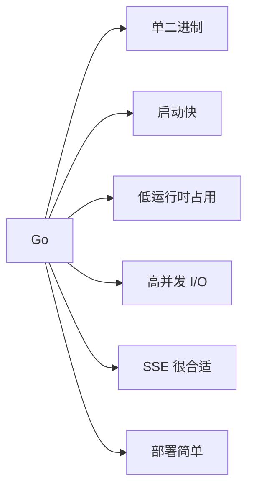

**图示说明（3. 技术栈与平台架构）：** 这是责任或数据流图，核心节点包括 Go。箭头表示调用、归属或数据流向；权限、Merchant 范围和状态判断必须在服务端完成，不能由客户端或单一 UI 分支替代。

关键原则：

- 不继承以前 Spring Boot 的生产架构；
- Agent 第一版不引入 Python Agent Server + Redis + Queue + Vector DB 的重型组合；
- **Agent Tool 和普通 UI API 最终调用同一套业务 Service**（不会出现两套销售逻辑）；
- PostgreSQL 作为统一主库；SQLite 只承担 Legacy 数据库 / 迁移工具 / 可选本地缓存。

未冻结项（对话原文）：

```text
① Go 是否确定为主 Backend + Agent 技术栈
② PostgreSQL 是否确定为统一主数据库
③ H5 和 Web 是统一 Vue，还是分别 Vue / React
```

> 来源：对话第 26 轮

---

# 4. Backend 总体原则

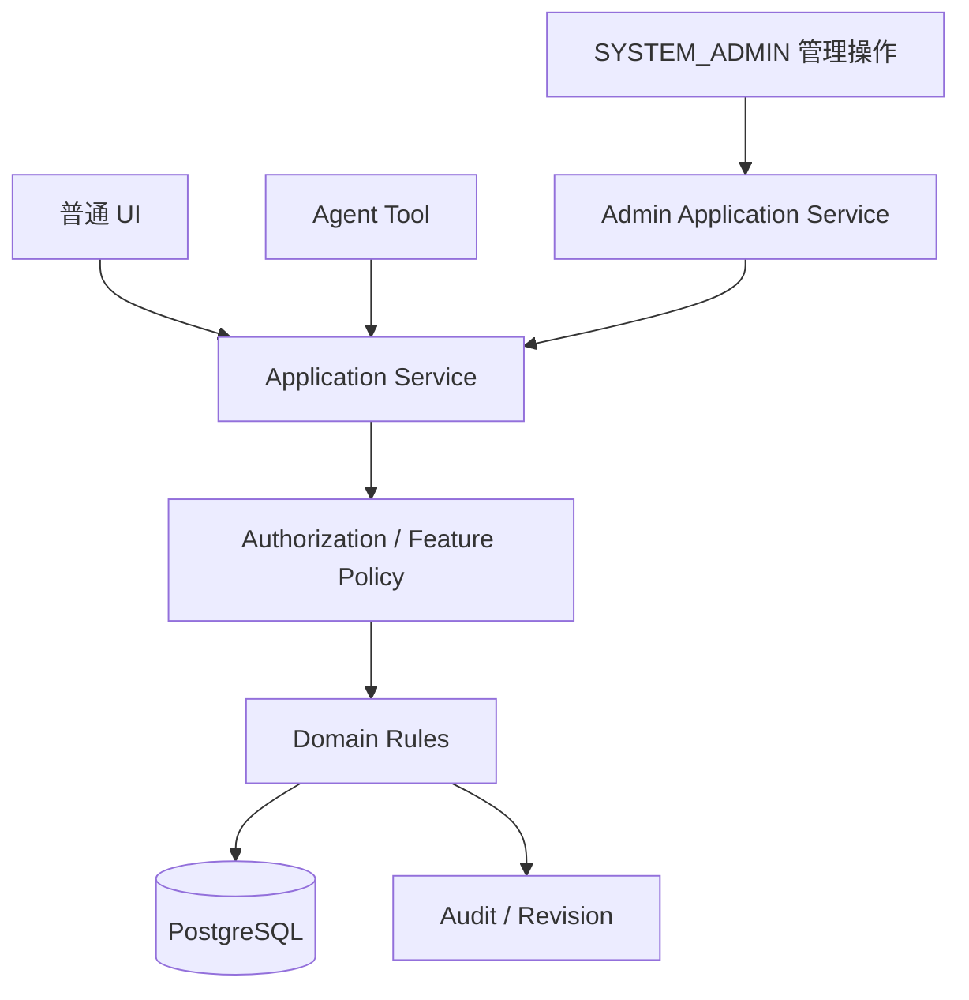

**图示说明（4. Backend 总体原则）：** 这是责任或数据流图，核心节点包括 普通 UI、Agent Tool、SYSTEM_ADMIN 管理操作。箭头表示调用、归属或数据流向；权限、Merchant 范围和状态判断必须在服务端完成，不能由客户端或单一 UI 分支替代。

核心原则：

1. 四端共用 Application Service；
2. Agent Tool 复用同一业务服务；
3. SYSTEM_ADMIN 也不能直接绕过 Domain 改数据库；
4. Merchant 是业务数据隔离边界；
5. 关键业务修改必须可追溯；
6. 收款 / 付款是记账，不是支付网关；
7. Feature Flag 关闭不能删除历史业务数据；
8. 第一阶段采用模块化单体，不提前拆微服务。

三种入口全部复用同一套业务 Service：

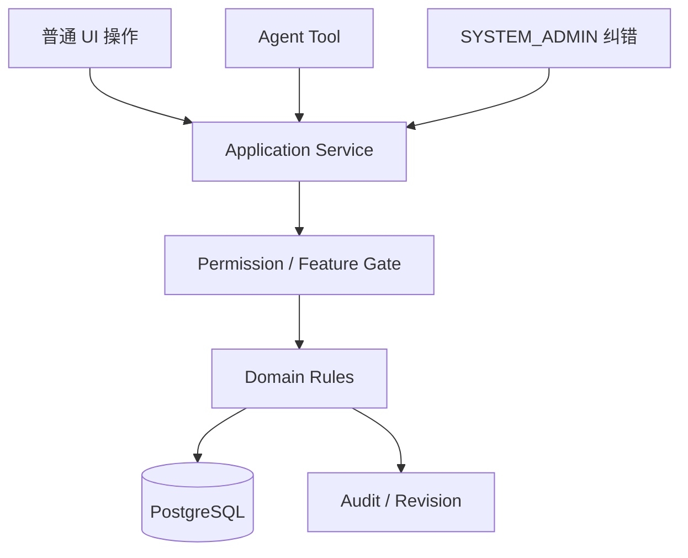

**图示说明（4. Backend 总体原则）：** 这是责任或数据流图，核心节点包括 普通 UI 操作、Agent Tool、SYSTEM_ADMIN 纠错。箭头表示调用、归属或数据流向；权限、Merchant 范围和状态判断必须在服务端完成，不能由客户端或单一 UI 分支替代。

例如卖货：Android / 小程序 / iOS / Web / Agent（"给老王卖10箱水"）全部进入同一个 Sales Application Service。

SYSTEM_ADMIN 纠正一笔销售，也不能直接 `UPDATE sale ...`，而必须经过业务 Service。

**这是记账系统，不是支付系统。**"实收 ¥800" 代表商户告诉系统"现实里已经收了 800"，不是 Backend 去调用微信支付收 800。

> 来源：对话第 26、28 轮

---

# 5. Merchant 数据范围

OWNER / STAFF 都只能访问自己唯一所属 Merchant。

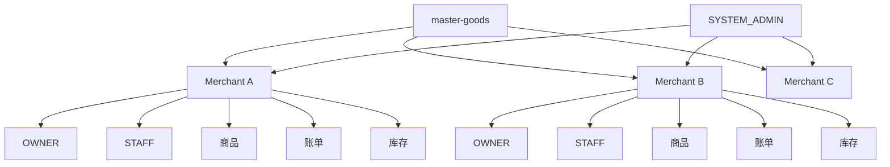

**图示说明（5. Merchant 数据范围）：** 这是责任或数据流图，核心节点包括 master-goods、SYSTEM_ADMIN。箭头表示调用、归属或数据流向；权限、Merchant 范围和状态判断必须在服务端完成，不能由客户端或单一 UI 分支替代。

OWNER / STAFF 请求不能自己随便传 `merchant_id = 其他人的商户` 然后访问别人的数据。必须：

```text
Token / Session
→ User
→ Merchant Membership
→ 服务端决定数据范围
```

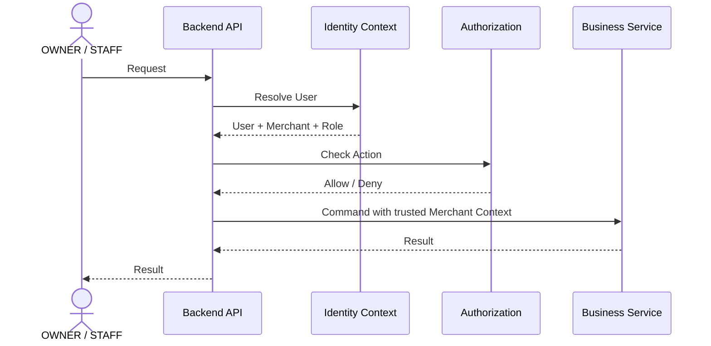

**图示说明（5. Merchant 数据范围）：** 这是服务调用时序图，参与者包括 OWNER / STAFF、Backend API、Identity Context、Authorization。箭头表示一次调用或返回，alt/else 分支表示 Decision 的不同结果；事务提交前只做校验和状态准备，短信、邮件等外部副作用应在提交后通过 Outbox 执行。

SYSTEM_ADMIN 跨 Merchant 时，Merchant 是管理目标，不是 Membership。

**SYSTEM_ADMIN 的完整管理路径**（后台核心信息架构）：

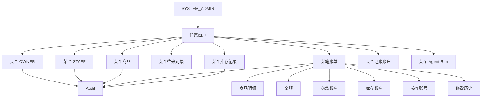

**图示说明（5. Merchant 数据范围）：** 这是责任或数据流图，核心节点包括 SYSTEM_ADMIN。箭头表示调用、归属或数据流向；权限、Merchant 范围和状态判断必须在服务端完成，不能由客户端或单一 UI 分支替代。

SYSTEM_ADMIN 纠错必须走专门流程，不能让超级管理员等于"数据库编辑器"。

> 来源：对话第 28 轮

---

# 6. 经营业务内部处理结构

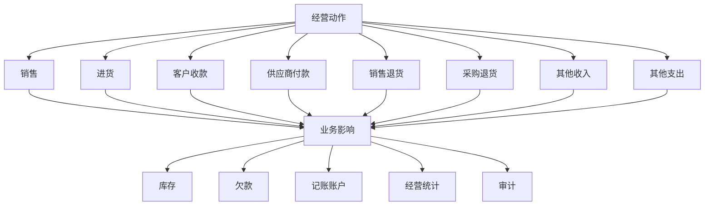

**图示说明（6. 经营业务内部处理结构）：** 这是责任或数据流图，核心节点包括 经营动作。箭头表示调用、归属或数据流向；权限、Merchant 范围和状态判断必须在服务端完成，不能由客户端或单一 UI 分支替代。

> 来源：对话第 28 轮

---

# 7. 系统详细设计模块目录

## 7.1 十二组关键流程（第 29 轮）

对话中把二级用例收敛为 12 组关键流程：

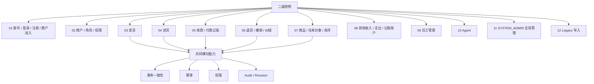

**图示说明（7.1 十二组关键流程（第 29 轮））：** 这是责任或数据流图，核心节点包括 二级用例。箭头表示调用、归属或数据流向；权限、Merchant 范围和状态判断必须在服务端完成，不能由客户端或单一 UI 分支替代。

## 7.2 十三个重点设计包（第 30 轮）

对话中系统详细设计正式拆成独立目录，调整为 13 个重点设计包：

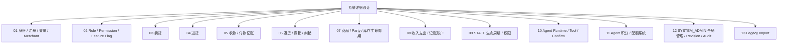

**图示说明（7.2 十三个重点设计包（第 30 轮））：** 这是责任或数据流图，核心节点包括 系统详细设计。箭头表示调用、归属或数据流向；权限、Merchant 范围和状态判断必须在服务端完成，不能由客户端或单一 UI 分支替代。

推荐推进顺序：

```mermaid
flowchart LR
    D01[身份 / Merchant] --> D02[权限 / Feature]
    D02 --> D03[卖货]
    D03 --> D04[进货]
    D04 --> D05[收付款]
    D05 --> D06[退货 / 纠错]
    D06 --> D07[商品 / Party / 库存]
    D07 --> D08[记账账户]
    D08 --> D09[STAFF]
    D09 --> D10[Agent]
    D10 --> D11[Agent 积分]
    D11 --> D12[Admin / Audit]
    D12 --> D13[Legacy]
```

**图示说明（7.2 十三个重点设计包（第 30 轮））：** 这是责任或数据流图，核心节点包括 身份 / Merchant。箭头表示调用、归属或数据流向；权限、Merchant 范围和状态判断必须在服务端完成，不能由客户端或单一 UI 分支替代。

## 7.3 讨论范围收敛（第 31 轮）

用户确定主线先收敛为 3 个详细设计专题，Agent 作为专题后置：

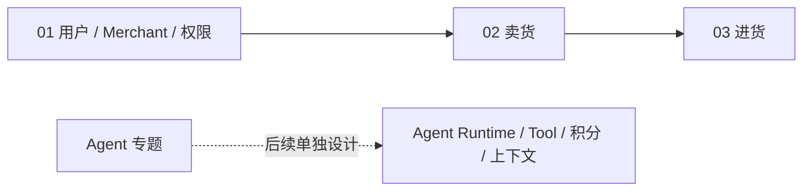

**图示说明（7.3 讨论范围收敛（第 31 轮））：** 这是责任或数据流图，核心节点包括 01 用户 / Merchant / 权限、Agent 专题。箭头表示调用、归属或数据流向；权限、Merchant 范围和状态判断必须在服务端完成，不能由客户端或单一 UI 分支替代。

其中前 6 个（身份 / 权限 / 卖货 / 进货 / 收付款 / 退货纠错）是必须在数据库设计之前基本讨论清楚的。

## 7.4 当前模块文档结构（第 35、36、38 轮）

系统详细设计最终采用"顶层模块 → 子模块详细设计"：

```text
docs/system-design/
├── 系统详细设计总览.md
├── 待确认事项.md              ← 待确认决策、配置参数和后续模块汇总
│
├── 01-账户与身份/
│   ├── 账户与身份模块.md          ← 顶层模块
│   ├── 01-注册与邀请码.md         ← 子模块详细设计
│   ├── 02-登录与会话.md
│   ├── 03-用户资料与账号管理.md
│   ├── 04-密码与账号恢复.md
│   ├── 05-验证方式与安全策略.md
│   ├── 06-账号状态与商户成员关系.md
│   ├── 07-Agent积分账户.md
│   └── 08-设计模式与判断算法.md
│
└── 10-Agent/
    ├── Agent模块.md               ← 顶层模块
    └── 01-模型提供商与模型配置.md
```

> 说明：仓库保留源详细设计的完整正文，并保留后续补充的验证方式、安全策略、设计模式与字段决策文档；编号以当前仓库实际路径为准。

---

# 8. 文档体系与原则

## 8.1 文档层次

```text
系统详细设计总览
    ↓
顶层模块文档
    ↓
子模块详细设计文档
```

**一个顶层业务模块 → 多个子模块详细设计。** 不再把登录、注册、密码恢复、验证、安全策略、积分账户全部塞进一个巨型 Markdown。

## 8.2 "对话等价"原则（第 40 轮冻结）

用户明确指出：

> 我才发现你 GitHub 上的文档写得十分简单，你对话中的完整的描述怎么样，文档就要怎么样。

ChatGPT 确认：

> 对话中完整描述成什么样，文档就应该保留到什么程度。

也就是说，文档不能把对话里的：完整主流程、分支流程、为什么这样设计、被否决的方案、边界条件、异常条件、角色权限、算法、设计模式、性能优化、并发问题、Audit、Mermaid、待确认项——压缩成"支持登录 / 支持找回密码 / 采用 Strategy Pattern"。

## 8.3 子模块详细设计模板（第 33、39 轮）

每一个判断都写：

```text
1. 业务问题
2. 输入
3. 输出
4. 参与角色
5. 使用的设计模式
6. Mermaid 时序图
7. 判定规则
8. 伪代码
9. 时间复杂度
10. 数据库索引
11. 并发条件
12. 幂等
13. 失败处理
14. Audit / Security Event
15. 边界条件
```

模式与算法逐项落成：

```text
输入
→ 判断条件
→ 输出
→ Mermaid 时序
→ 伪代码
→ 时间复杂度
→ 并发问题
→ 索引
→ 失败处理
→ Audit
```

## 8.4 冻结状态标注

关键规则使用：

```text
已冻结
讨论中
待确认
不在本阶段
```

> 来源：对话第 33、35、38、39、40 轮

---

# 9. Agent 与账户模块边界

对话第 35 轮明确：Agent 积分体系归入**账户与身份模块**。

```text
Provider / Model / Token USD 定价
→ Agent 模块

Merchant Agent 积分余额 / 流水 / 负数 / 充值抵扣
→ 账户模块
```

两者关系：

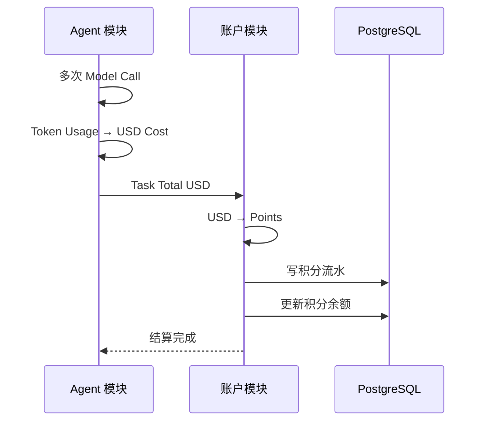

**图示说明（9. Agent 与账户模块边界）：** 这是服务调用时序图，参与者包括 Agent 模块、账户模块、PostgreSQL。箭头表示一次调用或返回，alt/else 分支表示 Decision 的不同结果；事务提交前只做校验和状态准备，短信、邮件等外部副作用应在提交后通过 Outbox 执行。

> **"模型花了多少钱"属于 Agent；"账户还有多少积分"属于账户系统。**

> 来源：对话第 35 轮

---

# 10. 当前状态与下一步

## 10.1 账户与身份模块完成度（第 41 轮）

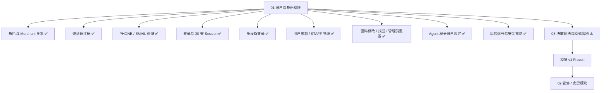

**图示说明（10.1 账户与身份模块完成度（第 41 轮））：** 这是责任或数据流图，核心节点包括 01 账户与身份模块。箭头表示调用、归属或数据流向；权限、Merchant 范围和状态判断必须在服务端完成，不能由客户端或单一 UI 分支替代。

## 10.2 收口标准（第 41 轮）

完成 08 六项收口（注册准入 Decision、登录 Decision Pipeline、Password Reset Strategy Resolver、Account / Session State Machine、Risk Decision Engine、幂等 / 并发 / Transaction）后，在顶层文档标记：

```text
01 账户与身份模块
Status: DESIGN FROZEN v1
```

含义：足以支撑领域模型、数据库 Schema、API 和编码，不再继续自由发散。

## 10.3 下一步

```text
现在不要换模块。把 08 做成最后一轮收口；完成后立即停止账户模块讨论，进入卖货。
```

销售模块将采用同样方法：

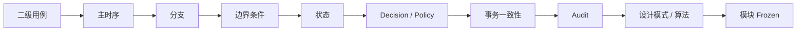

**图示说明（10.3 下一步）：** 这是责任或数据流图，核心节点包括 二级用例。箭头表示调用、归属或数据流向；权限、Merchant 范围和状态判断必须在服务端完成，不能由客户端或单一 UI 分支替代。

下一轮直接从 **08-01「注册准入 Decision」** 开始最合适。

> 来源：对话第 41 轮

---

# 11. 本文档集导航

| 文档 | 内容 |
|---|---|
| `系统详细设计总览.md` | 本文：系统用户、平台、Backend 原则、模块目录、文档原则 |
| `01-账户与身份/账户与身份模块.md` | 账户模块顶层设计：组件、规则、模式、算法原则 |
| `01-账户与身份/01-注册与邀请码.md` | 邀请码体系、OWNER / STAFF 注册、准入决策 |
| `01-账户与身份/02-登录与会话.md` | 登录三层校验、多设备 Session、30 天滑动登录、撤销 |
| `01-账户与身份/03-用户资料与账号管理.md` | 资料编辑边界、STAFF 管理、店长交接 |
| `01-账户与身份/04-密码与账号恢复.md` | 密码三条路径、临时密码、管理员重置、恢复体系 |
| `01-账户与身份/06-账号状态与商户成员关系.md` | User / Membership / Merchant 状态与状态机 |
| `01-账户与身份/07-Agent积分账户.md` | 积分归属、下发、扣费、负余额、定价版本化 |
| `待确认事项.md` | 当前仍未冻结的产品决策、可配置参数和后续模块清单 |

配套资料：完整对话记录属于仓库外部输入；本仓库只保留根据对话整理后的正式设计文档。
